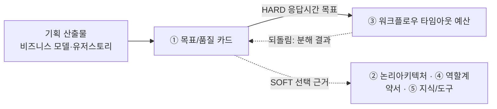

# 설계서 ① 목표/품질 카드: 작성 가이드

## 1. 이 설계서가 답하는 질문

**"이 시스템이 성공했다는 걸 무엇으로 판정할 것인가?"**

성공 기준 3개와 우선 품질속성 3개를 **숫자로 잴 수 있는 문장**으로 정의함.

**이걸 안 하면 나는 사고 3줄**

- 다 만들고도 됐는지 못 가림: 판정할 문장이 없어 "잘 된 것 같다"로 끝남
- 트레이드오프가 걸릴 때마다 같은 논쟁을 처음부터 다시 함. 무엇을 먼저 지킬지 정해 둔 게 없음
- 응답시간 목표가 없어 ③ 워크플로우가 나눌 예산 총량이 없음. 세 번째 문서가 시작을 못 함

**앞뒤 연결도**

`HARD`는 없으면 뒤 칸을 못 채움. `SOFT`는 시작은 되나 나중에 손봐야 함.  
**점선 되돌림이 실제로 필요함**: ① 목표/품질 카드는 앞이지만 ③ 워크플로우에서 값이 돌아옴.  
**우선 품질 3개와 목표값은 설계서 7종이 소비하지 않음**: **별도 품질 튜닝**이 씀.
⑥ 관측/가드레일은 품질 목표를 옮겨 적지 않음(값이 두 곳에 남으므로).

---

## 2. 시작 전 판정

### 2-1. 성공지표 책임 판정

유저스토리와 비즈니스모델에서 성공지표 후보를 도출한 후   
지표 하나마다 아래 4개를 묻고 3분류로 나눔.

| 질문 | 아니오면 |
|------|---------|
| T-1 이 값이 **시스템 실행 기록만으로** 계산되는가? | 책임 밖 |
| T-2 시스템이 **직접 바꿀 수 있는** 값인가? | 공동 책임 |
| T-3 목표 시점이 **이번 범위 안**인가? (Y3 목표는 제외) | 책임 밖 |
| T-4 사람의 습관·조직 변화가 **끼지 않아도** 달성되는가? | 공동 책임 |

**시스템 책임**만 성공 기준 3개 후보로 올림.   
**공동 책임**은 `제외 지표` 표에 `목표값 = 공동 책임(목표 미설정)`으로 적고 **거기서 끝냄**:
뒤 설계서로 넘기지 않음. 설계 단계에는 실데이터가 없어 목표값을 채울 근거가 없으므로,
값이 필요하면 기획에 되물음.  
**책임 밖**은 `제외 지표` 표에 탈락 테스트 번호와 함께 적음.  
  
**T-4 탈락이 절반을 넘으면** 소비자 앱임. 성공 기준을 사용자 행동 **직전**으로 옮겨 잡음.

### 2-2. 성격 선언: 고영향/고위험 인공지능 판정

**법정 판정(고영향 인공지능)**: 인공지능기본법 제2조제4호. 아래 가~카 중 하나라도 해당하면 고영향 인공지능임.

| 목 | 영역 | 근거 법령 | 해당 여부 |
|---|------|----------|----------|
| 가 | 에너지의 공급 | 에너지법 §2①1 | |
| 나 | 먹는물의 생산 공정 | 먹는물관리법 §3①1 | |
| 다 | 보건의료의 제공 및 이용체계 구축·운영 | 보건의료기본법 §3①1 | |
| 라 | 의료기기 및 디지털의료기기의 개발·이용 | 의료기기법 §2①, 디지털의료제품법 §2②2 | |
| 마 | 핵물질·원자력시설의 안전 관리·운영 | 원자력시설 등의 방호 및 방사능 방재 대책법 §2①1·2 | |
| 바 | 범죄 수사·체포 업무용 생체인식정보 분석·활용 | 이 조문 자체에 정의됨 | |
| 사 | 채용·대출심사 등 개인의 권리·의무 관계에 중대한 영향을 미치는 판단·평가 | — | |
| 아 | 교통수단·교통시설·교통체계의 주요 작동·운영 | 교통안전법 §2①~③ | |
| 자 | 공공서비스 자격확인·결정·비용징수 등 국민에게 영향을 미치는 국가·지자체·공공기관등의 의사결정 | 공공기관운영법 §4 | |
| 차 | 유아교육·초등교육·중등교육에서의 학생 평가 | 교육기본법 §9① | |
| 카 | 그 밖에 생명·신체안전·기본권 보호에 중대한 영향을 미치는 영역 | 대통령령으로 정함 | `[확인필요: 최신 시행령 대조]` |

**고위험 인공지능(자체 판단)**: 법정 영역이 아니어도 아래 중 하나면 고위험으로 자체 분류함.
**고영향이면 항상 고위험이지만, 고위험이라고 고영향인 것은 아님.**

| 기준 | 질문 |
|------|------|
| H1 | 되돌릴 수 없는 쓰기가 사람의 재산·건강·법적 지위에 영향을 주는가? |
| H2 | 민감정보를 근거로 개인에게 불리한 결정을 내리는가? |
| H3 | 사람의 권리·의무에 중대한 영향을 미치는 결정을 사람 개입 없이 자동으로 내리는가? |

고영향 또는 고위험으로 판정되면 인간 개입 관리체계를 둠: ③ 워크플로우의 사전 승인·진행 중 중단·사후 재정의 지점(2-3절)이 그 구현임.

---

## 3. 설계항목 작성법

**설계항목은 3개임**: `성공기준 3개` · `품질속성 3개` · `성격 선언`.  
**이 제목 구조가 곧 산출물의 목차임**: 여기 없는 절을 산출물에 만들지 않고, 여기 있는 절을 빼지도 않음.

### 성공기준 3개

각 성공 기준별로 측정 방법, 채점 수단, 목표값을 기술함

`채점 수단`은 **무엇으로 채점하는지까지만** 적음: 몇 문항으로 재는지와 그 문항 목록은
**별도 품질 튜닝 소관**임. 설계 단계에는 실제 데이터에 붙을 접속 정보가 없어 문항을 확정할 수 없음.

예시:  
| ID | 성공 기준 | 측정 방법 | 채점 수단 | 목표값 | 
|----|----------|----------|----------|-------|
| G-1 | 추천 3개가 이유 1줄·확신 스코어와 함께 응답 예산 안에 화면에 닿음 | `추천 응답 완료 이벤트 시각 − 추천 요청 접수 이벤트 시각`의 p95(95번째로 느린 값) | 부하시험 시나리오: 피크타임(12 ~ 13시) 동시 사용자 1,000명 | 3,000ms(p95) |
| G-2 | 전일 식사 기록·피드백이 다음 날 추천 입력에 반영됨 | `취향 벡터 갱신 성공 사용자 수 ÷ 전일 피드백 보유 사용자 수` | 집계 쿼리: 배치 종료 이벤트의 갱신 사용자 수 대비 대상자 수 | 50% |
| G-3 | 사용자가 등록한 알레르기·식이제한을 위반한 추천이 사용자에게 나가지 않음 | `식이제한 위반 추천 노출 건수 ÷ 전체 추천 응답 건수` | 식이제한 위반 케이스 채점(문항 구성은 **별도 품질 튜닝에서 정함**) | 위반 노출 0건(제거율 100%) | 

### 품질속성 3개

**우선 품질속성은 5개 중 3개**만 고름: **정확성 · 응답시간 · 설명가능성 · 안전성 · 비용효율성**   

예시: 
| ID | 우선 품질속성 | 왜 이것을 먼저 | 측정 방법 | 채점 수단 | 목표값 | 
|----|-------------|--------------|----------|----------|-----|
| Q-1 | 응답시간 | 킹핀 문제가 `탐색 13 ~ 18분`이므로 느린 추천은 문제를 재현함. 게다가 화면 예산과 API 예산이 둘 다 3초라 여유가 0초임 | 추천 경로 전체의 응답 시각차 p95 | 부하시험 시나리오: 동시 1,000명 · CPU 70% 오토스케일 발동 조건 포함 | 3,000ms(p95) | 
| Q-2 | 설명가능성 | 인터뷰 15명 **전원**이 "아는 사람 추천"을 신뢰 준거점으로 말했고, P2(추천 불신)의 핵심이 설명 부재임 | `이유 1줄 + 확신 스코어 + 컨텍스트 태그 3종이 모두 채워진 추천 응답 건수 ÷ 전체 추천 응답 건수` | 집계 쿼리: 추천 응답 로그의 3필드 동시 충족 건수 | 100%(3필드 누락 0건) | 
| Q-3 | 안전성 | 알레르기는 건강 민감정보이고, 위반 추천은 되돌릴 수 없음. 모델이 만든 문장이 화면·푸시로 그대로 나가는 지점이 6곳임 | `(식이제한 위반 추천 노출 건수 + 민감정보 원문 노출 건수) ÷ 전체 추천 응답 건수` | 위반 케이스 채점 + 집계 쿼리(마스킹 누락 검색). 문항 구성은 **별도 품질 튜닝에서 정함** | 노출 0건 | 

**고르지 않은 2개: 탈락 사유 1줄씩.** 

| 후보 | 탈락 사유 | 
|------|----------|
| 정확성 | **목표값 재정의 필요**: 지표 자체는 재어지나 원문 목표값이 사람의 5점 응답임 | 
| 비용효율성 | 측정 가능하나 **이번 우선순위 밖** | 

### 성격 선언

2-2절 판정 결과를 아래처럼 옮겨 적음. 이 값은 ③ 워크플로우가 그대로 인용함.

예시:
| 고영향 인공지능 | 해당 목 | 고위험 인공지능 | 근거(H1~H3) |
|----------------|--------|----------------|------------|
| 아니오 | 해당 없음 | 예 | H1: 예약 확정(되돌릴 수 없는 쓰기)이 있음 |

---

## 4. 제출 전 자가 점검표

- [ ] 성공 기준 표가 정확히 3행임
- [ ] 품질속성 표가 정확히 3행이고, 고르지 않은 2개에 탈락 사유가 1줄씩 있음
- [ ] 성격 선언에 고영향·고위험 여부가 각각 예/아니오로 있고, 예인 경우 근거(해당 목 또는 H1~H3)가 적혀 있음

