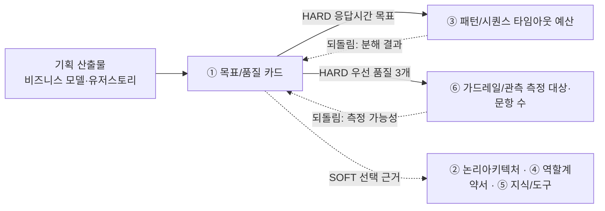

# 설계서 ① 목표/품질 카드 — 작성 가이드

## 1. 이 설계서가 답하는 질문

**"이 시스템이 성공했다는 걸 무엇으로 판정할 것인가?"**

성공 기준 3개와 우선 품질속성 3개를 **숫자로 잴 수 있는 문장**으로 정의함   

`HARD`는 없으면 뒤 칸을 못 채움. `SOFT`는 시작은 되나 나중에 손봐야 함.
**점선 되돌림 2개가 실제로 필요함** — ① 목표/품질 카드는 앞이지만 뒤에서 값이 돌아옴(5절).

---

## 2. 시작 전 판정

유저스토리와 비즈니스모델에서 성공지표 후보를 도출한 후   
지표 하나마다 아래 4개를 묻고 3분류로 나눔.

| 질문 | 아니오면 |
|------|---------|
| T-1 이 값이 **시스템 실행 기록만으로** 계산되는가? | 책임 밖 |
| T-2 시스템이 **직접 바꿀 수 있는** 값인가? | 공동 책임 |
| T-3 목표 시점이 **이번 범위 안**인가? (Y3 목표는 제외) | 책임 밖 |
| T-4 사람의 습관·조직 변화가 **끼지 않아도** 달성되는가? | 공동 책임 |

**시스템 책임**만 성공 기준 3개 후보로 올림.   
**공동 책임**은 `제외 지표` 표에  
`목표값 = 공동 책임(목표 미설정)`으로 적고 ⑥ 가드레일/관측 측정 대상으로 넘김.  
**책임 밖**은 `제외 지표` 표에 탈락 테스트 번호와 함께 적음.  
  
**T-4 탈락이 절반을 넘으면** 소비자 앱임. 성공 기준을 사용자 행동 **직전**으로 옮겨 잡음.
  
---

## 3. 설계항목 작성법

### 성공기준 3개

각 성공 기준별로 측정 방법, 채점 수단, 목표값을 기술함

예시:  
| ID | 성공 기준 | 측정 방법 | 채점 수단 | 목표값 | 
|----|----------|----------|----------|-------|
| G-1 | 추천 3개가 이유 1줄·확신 스코어와 함께 응답 예산 안에 화면에 닿음 | `추천 응답 완료 이벤트 시각 − 추천 요청 접수 이벤트 시각`의 p95(95번째로 느린 값) | 부하시험 시나리오 — 피크타임(12 ~ 13시) 동시 사용자 1,000명 | 3,000ms(p95) |
| G-2 | 전일 식사 기록·피드백이 다음 날 추천 입력에 반영됨 | `취향 벡터 갱신 성공 사용자 수 ÷ 전일 피드백 보유 사용자 수` | 집계 쿼리 — 배치 종료 이벤트의 갱신 사용자 수 대비 대상자 수 | 50% |
| G-3 | 사용자가 등록한 알레르기·식이제한을 위반한 추천이 사용자에게 나가지 않음 | `식이제한 위반 추천 노출 건수 ÷ 전체 추천 응답 건수` | ⑤ 지식/도구 골든셋의 식이제한 위반 케이스 문항(문항 ID는 ⑤ 완료 후 인용) | 위반 노출 0건(제거율 100%) | 

### 품질속성 3개

**우선 품질속성은 5개 중 3개**만 고름 — **정확성 · 응답시간 · 설명가능성 · 안전성 · 비용효율성**   

예시: 
| ID | 우선 품질속성 | 왜 이것을 먼저 | 측정 방법 | 채점 수단 | 목표값 | 
|----|-------------|--------------|----------|----------|-----|
| Q-1 | 응답시간 | 킹핀 문제가 `탐색 13 ~ 18분`이므로 느린 추천은 문제를 재현함. 게다가 화면 예산과 API 예산이 둘 다 3초라 여유가 0초임 | 추천 경로 전체의 응답 시각차 p95 | 부하시험 시나리오 — 동시 1,000명 · CPU 70% 오토스케일 발동 조건 포함 | 3,000ms(p95) | 
| Q-2 | 설명가능성 | 인터뷰 15명 **전원**이 "아는 사람 추천"을 신뢰 준거점으로 말했고, P2(추천 불신)의 핵심이 설명 부재임 | `이유 1줄 + 확신 스코어 + 컨텍스트 태그 3종이 모두 채워진 추천 응답 건수 ÷ 전체 추천 응답 건수` | 집계 쿼리 — 추천 응답 로그의 3필드 동시 충족 건수 | 100%(3필드 누락 0건) | 
| Q-3 | 안전성 | 알레르기는 건강 민감정보이고, 위반 추천은 되돌릴 수 없음. 모델이 만든 문장이 화면·푸시로 그대로 나가는 지점이 6곳임 | `(식이제한 위반 추천 노출 건수 + 민감정보 원문 노출 건수) ÷ 전체 추천 응답 건수` | ⑤ 지식/도구 골든셋의 위반 케이스 문항 + 집계 쿼리(마스킹 누락 검색) | 노출 0건 | 

**고르지 않은 2개 — 탈락 사유 1줄씩.** 

| 후보 | 탈락 사유 | 
|------|----------|
| 정확성 | **목표값 재정의 필요** — 지표 자체는 재어지나 원문 목표값이 사람의 5점 응답임 | 
| 비용효율성 | 측정 가능하나 **이번 우선순위 밖** | 

---

## 4. 제출 전 자가 점검표

- [ ] 성공 기준 표가 정확히 3행임
- [ ] 품질속성 표가 정확히 3행이고, 고르지 않은 2개에 탈락 사유가 1줄씩 있음

