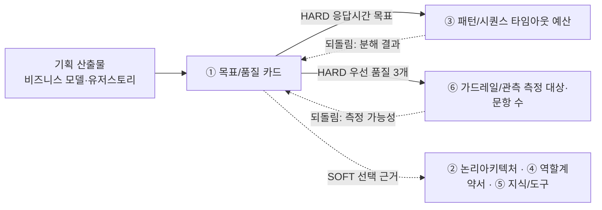

# 설계서 ① 목표/품질 카드 — 작성 가이드

## 1. 이 설계서가 답하는 질문

**"이 시스템이 성공했다는 걸 무엇으로 판정할 것인가?"**

성공 기준 3개와 우선 품질속성 3개를 **숫자로 잴 수 있는 문장**으로 못박는 카드임.
받을 입력이 없어 7종 중 가장 먼저 씀.

**이걸 대충 하면 나는 사고 3가지**

- ③ 패턴/시퀀스에서 단계별 타임아웃을 나눌 기준이 없어 예산 배분이 감이 됨
- ⑥ 가드레일/관측에서 무엇을 몇 문항으로 측정할지 정하지 못해 품질 측정이 통째로 빠짐
- 발표 때 "왜 이 구조인가"에 답할 근거가 없어 설계 전체가 취향 문제로 보임

`HARD`는 없으면 뒤 칸을 못 채움. `SOFT`는 시작은 되나 나중에 손봐야 함.
**점선 되돌림 2개가 실제로 필요함** — ① 목표/품질 카드는 앞이지만 뒤에서 값이 돌아옴(5절).

---

## 2. 시작 전 판정

**기획 자료가 없으면** 3줄을 먼저 하고 시작함 — ⓐ 아웃컴 3건을 문장으로 선언함("누가 무엇을 얼마나
빨리·정확히 하게 되는가") ⓑ 뽑은 수치에 전부 `추정` 태그를 붙임 ⓒ 되물을 대상·기한을 `미확정 항목`에 적음.

기획 산출물의 지표를 그대로 다 옮기면 안 됨. **시스템이 책임질 수 있는 것만** 골라야 함.
지표 하나마다 아래 4개를 묻고 3분류로 나눔.

| 질문 | 아니오면 |
|------|---------|
| T-1 이 값이 **시스템 실행 기록만으로** 계산되는가? | 책임 밖 |
| T-2 시스템이 **직접 바꿀 수 있는** 값인가? | 공동 책임 |
| T-3 목표 시점이 **이번 범위 안**인가? (Y3 목표는 제외) | 책임 밖 |
| T-4 사람의 습관·조직 변화가 **끼지 않아도** 달성되는가? | 공동 책임 |

**시스템 책임**만 성공 기준 3개 후보로 올림. **공동 책임**은 `제외 지표` 표에
`목표값 = 공동 책임 — 목표 미설정`으로 적고 ⑥ 가드레일/관측 측정 대상으로 넘김.
**책임 밖**은 `제외 지표` 표에 탈락 테스트 번호와 함께 적음.

**T-4 탈락이 절반을 넘으면** 소비자 앱임. 성공 기준을 사용자 행동 **직전**으로 옮겨 잡음.

**우선 품질속성은 5개 중 3개**만 고름 — 정확성 · 응답시간 · 설명가능성 · 안전성 · 비용효율성.
고르지 않은 2개에도 **탈락 사유를 1줄씩** 남김.

**탈락 사유는 다른 사람이 한 번 반박해 봄.** `측정 불가`·`값 없음`은 실제로 계산해 보고 적음.
두 가지를 가름 — **목표값 숫자만** 못 재면 사유는 `목표값 재정의 필요`이고 ⑥ 가드레일/관측은 측정을 계속함.
**지표 자체**를 못 재는 것만 진짜 탈락임. `만족도 4.0/5.0`은 5점 평균을 복원 못 하나 **만족률(%)은 계산됨.**

---

## 3. 설계항목 작성법

각 칸 첫 줄은 규격임 — **형태**(값의 모양) · **비면**(빈칸에 적을 값) ·  
**주인**(값을 가진 다른 산출물. 없으면 생략) · **대조**(다 채운 뒤 맞출 것).  
그 아래 대시 불렛이 채우는 요령임.  
설계항목은 `성공 기준 → 목표 → 기준선 → 공통` 계열 순으로 놓았음.

| 설계항목 | 무엇을 적나 | 어디서 가져오나 | 예시 |
|----|-----------|---------------|---------|
| 성공 기준 | **형태** 세어서 확인되는 일 1줄 · **대조** 표가 정확히 3행인지 - 시스템이 해내야 할 일을 **1줄**로 적음 - 정확히 **3개**만 씀 — 더 나오면 `제외 지표` 표로 내림 - 사람의 습관·조직 변화가 끼는 일은 여기 쓰지 않음(2절 판정에서 걸러짐) - 느낌이 아니라 **세어서 확인되는 일**로 적음 | BM 비즈니스가치 연계 지표 | 단계 간 핸드오프가 사람 손 없이 넘어감 |
| 측정 방법 | **형태** 계산식이 드러난 문장 · **비면** 공동 책임 — 목표 미설정 · **대조** 시스템 실행 기록만으로 계산되는지 - 무엇을 세어 어떻게 계산하는지 적음 - **시스템 실행 기록만으로** 계산되는 것으로 한정함 - 계산식이 드러나게 적음 — 예: `끝난 시각 − 시작한 시각`의 p95 - 설문·인터뷰는 쓰지 않음. 사람에게 물어야 하면 그 지표는 공동 책임임 | 시스템 실행 기록으로 한정 | 접수~배분 완료 이벤트 시각 차 집계 |
| **채점 수단** | **형태** 3종 중 1개 · **비면** `[확인필요: 채점 수단]` · **대조** 목표값이 있는 행 수와 같은지 - 이 목표값을 **무엇으로 채점하나**를 1개 적음 - 셋 중 하나를 고름 — 정답지 문항 번호 · 부하시험 시나리오 · 집계 쿼리 - 목표값이 있는 행마다 1개씩 있어야 함 - 채점 수단이 없으면 그 목표값은 검증되지 않은 채로 닫힘 | ⑤ 지식/도구 골든셋 문항 ID · 부하시험 시나리오 · 집계 쿼리 중 1개 | 골든셋 `GS-11 ~ GS-16` |
| 목표값 | **형태** 숫자 1개 + 단위 1개 · **비면** `[확인필요: 목표값]` · **주인** 기획 산출물(인용만) · **대조** 비율 목표면 필요 표본 수가 확보됐는지 - **숫자 1개 + 단위 1개**를 적음 - 기획 산출물 원문에 있는 값을 그대로 인용함 - 원문에 없으면 지어내지 않고 `[확인필요: 목표값]`으로 적음 - 원문에 값이 2개면 **어느 계층의 값인지** 먼저 가름(모델을 부르는 경로인지 아닌지) - 비율 목표는 필요한 표본 수(`1 ÷ (1 − 목표비율)`)를 함께 확인함 | 기획 산출물 원문 인용 | 15분 이내 |
| **단위 환산** | **형태** 금액 + 단위(요청 1건당) + 계산식 · **비면** `[확인필요: 건수 전제]` · **대조** 계산식의 분모가 기획 전제와 같은지 - 기간당 상한(월·연)을 **요청 1건당 값으로 나눠** 적음 - 계산식을 그대로 남김 — `기간 상한 ÷ (건수 전제 × 기간)` - 건수 전제가 없으면 `[확인필요]`로 적고 그냥 넘기지 않음 - 나누기를 뒤 산출물로 미루지 않음 — 미루면 아무도 하지 않음 | 기간 상한 ÷ (건수 전제 × 기간) | 월 300만 ÷ (일 1만 건 × 30일) = 10원/건 |
| 측정 시점 | **형태** 단계 이름 · **비면** `[확인필요: 측정 시점]` · **대조** 처음 재는 시점과 다시 재는 시점이 둘 다 있는지 - 언제 재는지를 **단계 이름**으로 적음 - 처음 재는 시점과 다시 재는 시점을 나눠 적음 - `수시`·`상시`처럼 시점이 정해지지 않는 말은 쓰지 않음 | 단계 라벨 | 구현 단계 기준선·배포 단계 재측정 |
| **분해 회신** | **형태** 값 4개(단계 수·합계·여유·못 지킨 조건) · **비면** `③ 완료 후 기입` · **주인** ③ 패턴/시퀀스(회신 받음) · **대조** ③의 타임아웃 표 합계와 같은지 - ③ 패턴/시퀀스가 총 예산을 쪼갠 뒤 **예산이 지켜지는지** 결과를 받아 적음 - 4개를 적음 — 단계 수 · 합계 · 남은 여유 · 못 지킨 조건 - 통과·초과를 함께 적고, 초과면 어디서 넘었는지 적음 - 이 칸이 없으면 ① 목표/품질 카드는 목표를 내려보내고 결과를 모른 채 닫힘 | ③ 패턴/시퀀스 타임아웃 표 합계 | p95 1,800ms 통과 · 최악값 3,420ms 초과 |
| 개선 전 기준선 | **형태** 숫자 + 단위 · **비면** `[확인필요: 기준선]` · **대조** 이 숫자가 목표값 칸에 들어가 있지 않은지 - **고치기 전** 수치를 적음 - 목표값과 **다른 표**에 적음 — 같은 칸에 섞지 않음 - 헷갈리면 "이 숫자가 자랑거리인가 부끄러운 것인가"를 물음. 부끄러운 쪽이 기준선임 - 원문에 없으면 `[확인필요]`로 남김 | BM Problem·US Pain Point | 2 ~ 4시간 |
| 근거 출처 | **형태** `{약칭}:{항목 ID}#{하위}` · **비면** `설계판단` · **대조** 약칭이 정해진 6개 안인지 - 이 값이 어느 문서 어디서 왔는지 적음 - 형식은 `{약칭}:{항목 ID}#{하위}`로 고정함 - 약칭은 정해진 6개만 씀 — 새로 만들지 않음 - 원문 근거 없이 팀이 정한 값이면 `설계판단`이라 적음 - 공란으로 두지 않음 | `BM:8-KeyMetrics#고객가치1` | BM:8-KeyMetrics#고객가치2 |
| 후행 소비처 | **형태** 산출물 번호 + 그 안의 칸 이름 · **비면** 쓰는 곳이 0건이면 성공 기준에서 내림 · **대조** 5절 `넘기는 값` 표와 같은지 - 뒤 산출물 중 **이 값을 쓰는 곳**을 적음 - 산출물 번호와 그 안의 칸 이름까지 적음 - 쓰는 곳이 하나도 없으면 이 지표를 성공 기준에 둘 이유를 다시 봄 | ③ 패턴/시퀀스 타임아웃 / ⑥ 가드레일/관측 측정 대상 | ③ 패턴/시퀀스 타임아웃 예산 |
| 성격 선언 | **형태** 문장 1개 · **비면** 사람이 최종 결정하면 공란 불가 · **대조** 문서에서 1건 이상 검색되는지 - 이 산출물이 **확정 실행이 아니라 제시**임을 밝히는 문장 1개를 적음 - 문서에서 1건 이상 검색되게 둠 - 사람이 최종 결정하는 산출물이면 반드시 적음 | 고정 문구 | 확정 실행이 아닌 제시임 |

**목표값 칸에 숫자와 단위가 없으면 그 행은 미완성임.** 원문에 수치가 없으면 지어내지 말고
`[확인필요: 목표값]`으로 두고 건수를 세어 적음.

**원문에 값이 2개 있으면** 지어내 고르지 않고 **어느 계층의 값인지** 먼저 가름
(예: `모든 API 200ms` vs `추천 조회 3초` → 앞은 모델을 안 부르는 API, 뒤는 부르는 경로).

**비율 목표는 `1 ÷ (1 − 목표비율)` 이상의 표본이 필요함** — `95%`면 20개, `99%`면 100개.
표본을 못 채우면 목표값을 `100%`로 올리거나 목표비율을 낮춤. 안 그러면 목표값이 채점에서 사라짐.

**기준선과 목표값을 섞지 않는 법**

프롬프트는 "섞지 말라"고만 함. 실제로는 `지금 이렇게 나쁘다`(BM `Problem`·US `Pain Point`)를
**개선 전 기준선** 표에, `이렇게 만들겠다`(BM `Key Metrics` To-Be 열)를 **목표값** 칸에 둠.
같은 지표라도 두 값이 다른 표로 갈림. 헷갈리면 **"이 숫자가 자랑거리인가 부끄러운 것인가"**를 물음.
부끄러운 쪽이 기준선임.

**품질속성 이름과 출처를 함부로 적지 않기**

원문 대조에서 아래 3개가 **사실과 다름을 확인함.** 쓰지 않음.
`ISO 25010을 따랐다`(AgentArcEval 논문은 한 번도 참조하지 않음) · `시나리오 6요소는 ATAM에서 왔다`
(ATAM 템플릿은 **5항목**이고 6요소 출처는 미확인 — [근거 계보 검증](_shared/근거-계보-검증.md) V-1) ·
`최소수집`·`비식별`의 금융위 근거(없음). 팀이 어휘를 고르고 출처를 적으면 됨.
쓸 수 있는 것 — 사례연구 카드 **9칸**(칸 늘리는 근거) · `보조수단성`(성격 선언 근거).

**대체 근거 탐색 순서** — `US NFR 컴플라이언스 → ES 규제 반영표 → 없으면 [확인필요]`.
ES 규제 반영표가 `최소 수집 원칙` 원문을 갖고 있던 사례가 있었음.

---

## 4. 제출 전 자가 점검표

- [ ] 성공 기준 표가 정확히 3행임
- [ ] 품질속성 표가 정확히 3행이고, 고르지 않은 2개에 탈락 사유가 1줄씩 있음
- [ ] 두 표의 `측정 방법`·`목표값`·`측정 시점`·`근거 출처`·`후행 소비처` 5열에 공란이 0개임
- [ ] 목표값 칸 전부가 (숫자 1개 이상 + 단위 1개 이상)이거나 `[확인필요: 목표값]`임
- [ ] **기간당 상한은 `요청당 값`으로 환산됨** · **목표값 행마다 `채점 수단` 1개씩 있음**
- [ ] **비율 목표마다 필요 표본 수(`1 ÷ (1 − 목표비율)`)가 확보됨** · **`측정 불가` 사유는 가른 결과임**
- [ ] `개선 전 기준선` 표가 따로 있고 `기준선 값` 칸에 공란이 0개임
- [ ] 기준선 표의 숫자가 목표값 칸에 들어가 있지 않음
- [ ] `확정 실행이 아닌 제시임` 문구가 문서에서 1건 이상 검색됨
- [ ] `제외 지표` 표에 공동 책임·책임 밖 지표가 탈락 이유와 함께 있음
- [ ] `[확인필요]` 태그 건수가 숫자로 적혀 있음
- [ ] 부속 표 3종(`제외 지표`·`미대응 Pain Point`·`기획 산출물 대조 기록`)이 0건이어도 `0건`으로 있음

---

## 5. 다음으로 넘기는 값과 근거 자료

**되돌려 받는 값 2종** — ① 목표/품질 카드는 앞이지만 **뒤에서 값이 돌아옴.** 없으면 ① 목표/품질 카드가 틀린 채로 닫힘.
`측정 가능성 부정`(⑤ 지식/도구·⑥ 가드레일/관측) · `분해 결과 회신`(③ 패턴/시퀀스 — **미충족 조건**을 받아 목표값 행에 병기).

| 넘기는 값 | 받는 곳 | 강도 |
|----------|--------|------|
| 응답시간 목표값 | ③ 패턴/시퀀스 타임아웃 예산 | HARD — 없으면 못 채움 |
| 우선 품질속성 3개 | ⑥ 가드레일/관측 측정 대상·문항 수 | HARD |
| 성공 기준·품질 우선순위 | ② 논리아키텍처 구성 배치 결정 사유 | SOFT |
| 성공 기준 분해 | ④ 역할계약서 담당자별 성공 기준 | SOFT |
| 설명가능성 채택 여부 | ⑤ 지식/도구 검색 경로 선택 근거 상세도 | SOFT |

| 아티클 | 어느 칸에 |
|--------|----------|
| [A05](../references/articles/A05_paper_agentarceval.md) | 카드 양식(사례연구 카드 9칸) · 품질속성 어휘 출처 판단 |
| [A10](../references/articles/A10_reg_fsc-ai-guideline.md) | 성격 선언 문장의 규제 근거(`보조수단성`) |
| [A01](../references/articles/A01_blog_anthropic-when-multi-agent.md) | 품질속성 우선순위가 ④ 역할계약서 단일·멀티 판정에 미치는 영향 |

규격 원문은 `prompts/design/01-목표품질속성카드.md`와 본 폴더 `README.md`의
「산출물 1건은 무엇으로 이뤄지나」·「근거 출처 표기법」 절임.
