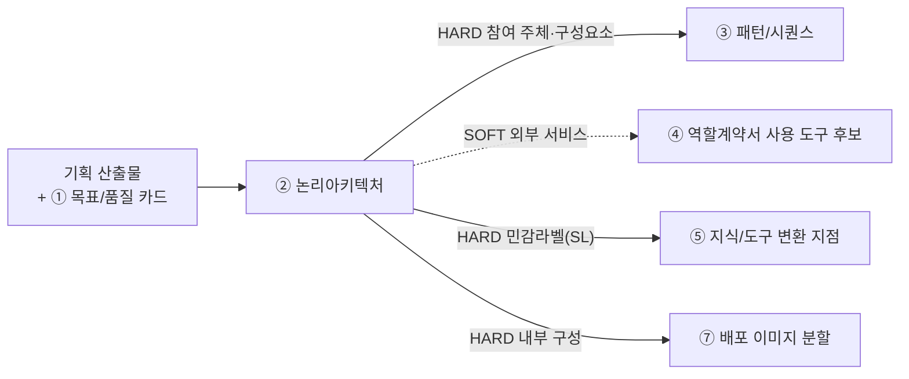

# 설계서 ② 논리아키텍처 — 작성 가이드

## 1. 이 설계서가 답하는 질문

**"무엇이 어디에 있고, 어디부터가 우리 통제 밖인가?"**

**이걸 대충 하면 나는 사고 3가지**

- 경계선이 없어 마스킹을 어디에 걸지 정하지 못함. ⑤ 지식/도구·⑥ 가드레일/관측이 막힘
- 내부 구성이 안 나뉘어 ⑦ 배포에서 이미지를 몇 개로 쪼갤지 논쟁만 함
- 외부 시스템 중 무엇이 진짜인지 몰라 구현 때 없는 API를 부름

② 논리아키텍처는 **HARD로 넘겨주는 게 가장 많음**(③④⑤⑦). 늦으면 네 개가 한꺼번에 멈춤.
`HARD`는 없으면 뒤 칸을 못 채움. `SOFT`는 나중에 손봐도 됨.
**바로 뒤는 ③ 패턴/시퀀스임** — ② 논리아키텍처의 구성요소가 ③ 패턴/시퀀스의 참여 주체가 되므로 ② 논리아키텍처가 늦으면 ③ 패턴/시퀀스가 못 시작함.

---

## 2. 시작 전 판정

**판정 1 — 두 도식을 어떻게 가르나**

가장 헷갈리는 지점임. 기준은 하나임. **우리가 만드는 것인가 아닌가.**

| | 1단계 전체 관계도 | 2단계 내부 구성도 |
|---|-----------------|-----------------|
| 무엇을 | 우리 시스템을 **상자 하나**로 두고 바깥과의 관계 | 그 상자 **안**을 열어 나눔 |
| 노드 | 사용자·외부 시스템·저장소 | 우리가 만드는 실행 단위 |
| 나누는 기준 | 소유 주체가 다른가 | 따로 배포·실행되는가 |
| 안 그리는 것 | 내부 모듈 | 외부 시스템 상세 |

**판정 2 — 신뢰 경계(TB)를 어디에 긋나**

경계는 조직도가 아니라 **제어권이 바뀌는 곳**에 그음. 구조적 잣대 둘만 씀 — 데이터 종류는 안 봄.

| 순서 | 질문 | 예면 |
|------|------|------|
| 1 | 이 선을 넘으면 **우리가 로그를 못 보는가**? | 경계임 |
| 2 | 이 선을 넘으면 **접근 권한 주체가 바뀌는가**? | 경계임 |
| 3 | 둘 다 아니오 | 경계 아님. 그냥 내부 연결임 |

경계마다 `TB-1`·`TB-2` 같은 번호를 붙임. `TB`는 **Trust Boundary(신뢰 경계)** 의 약자임.

**판정 2-1 — 민감정보 라벨(SL)을 어디에 붙이나**

**TB가 있는 간선에서만** 판정함   
- 내부시스템에서 외부시스템으로(또는 그 반대로) 실제로 통제권이
넘어가는 지점의 데이터가 대상임.   
- 그 간선을 지나는 데이터에 민감정보가 하나라도 있으면 `SL-1`·`SL-2`
같은 번호를 TB 번호와 함께 붙이고(예: `TB-2 · SL-1`) 오가는 항목명을 라벨로 적음.   

**판정 2-2 — 경계를 넘기지 않기로 한 항목이 있는가**
- **TB가 있는 경계에서** 넘기지 **않기로** 한 항목이 있으면 **넘는 것·넘지 않는 것을 항목명 단위 표로**
따로 적음.   
- **이 판정이 가장 중요해지는 경우가 있음.** TB·SL은 라벨을 붙이라까지만 함.
건강·인증 정보처럼 모델에 보낼 이유가 없는 값은 **지식/도구 설계서의 입력 규격에 명시하지 않음.**
⑤ 지식/도구·⑥ 가드레일/관측보다 앞선 방어선임.

**판정 3 — 실물인가 Mock인가**

기준은 **이번 범위에서 실제로 붙을 수 있는가**임.   
못 붙이면 Mock이고 사유를 `대체 사유`에 적음.  
"아마 될 것"으로 실물이라 적지 않음   

## 3. 설계항목 작성법

**성공지표와 품질목표에 따른 최적의 논리 아키텍처를 설계**함

### 전체 관계도
- '판정 1'의 결과에 따라 '우리 시스템을 상자 하나로 두고 본 바깥' 시스템/서비스를 표시함  
- Mermaid Scripit로 작성

### 내부 관계도
- '판정 1'의 결과에 따라 내부 시스템의 서비스와 저장소등을 표시함  
- Mermaid Scripit로 작성
  
### 신뢰경계표
신뢰경계ID, 신뢰경계명, 설명, Mock 구현여부를 표형태로 작성
| 신뢰경계ID | 신뢰경계명 | 설명 | Mock 구현 |
|------------|--------|-----------------------|-----|
| TB-2 | 모델 벤더 | LLM 제공 벤더 | No |
| TB-4 | 외부 인증 | 카카오 외부 인증 서비스 | Yes |

### 경계통과 민감정보
민감정보 ID(SL-{NN}), 항목 유형 이름, 대상 경계를 표형태로 작성

예시:
| SL | 항목 유형 이름 | 대상 경계 |
|----|--------------|---------------|
| SL-1 | 인증 정보(카카오 인증 토큰·액세스 토큰·카카오 ID·이메일) | TB-1 사용자 단말 TB-4 외부 인증 | 
| SL-2 | 건강·식이 정보(알레르겐 8종·식이 유형) | TB-1 사용자 단말 | 

### 경계 미통과 항목
신뢰 경계를 넘지

| 항목 이름 | 어느 경계를 안 넘나 | 안 넘기는 방법 |
|----------|------------------|--------------|
| 알레르겐 원문 라벨(`allergyItems`) | TB-2 모델 벤더 | LLM 입력 규격에 `allergyItems` 칸을 만들지 않음. `제외 식재료 코드` 배열만 둠 |

### 내부 저장소 목록
ID, 저장소명, 저장 데이터, 보존 기간을 표 형태로 작성 

예시:
| ID | 저장소명 | 담는 것 | 보존 기간 |
|----|---------|--------|----------|
| S-1 | 회원 저장소 | 회원ID·카카오 ID·이메일·닉네임·알림설정·동의 이력·알레르겐·식이 유형·구독 상태 | 회원탈퇴 시 영구삭제 | 
| S-2 | 위치 저장소 | 현재·과거 위치 좌표(위도·경도), 위치 동의 상태 | 6개월, 이후 자동 삭제 |
| S-3 | 이력 저장소 | 식사 기록·피드백·컨텍스트 스냅샷·추천 이력·수락·거절 이력 | 무료 30일 · 프리미엄 무제한(해지 후 30일 이전 열람 제한) | 

### 배치 결정 ADR(Architectural Decision Record) 
성공지표와 품질목표에 따른 설계 과정의 주요 아키텍처 의사결정 작성 (후보, 장단점, 의사결정 이유 등)

---

## 4. 제출 전 자가 점검표

- [ ] Mermaid `flowchart` 코드블록이 2개 이상 있음(전체 관계도·내부 구성도)
- [ ] `TB-` 간선 중 민감정보가 지나는 곳마다 `SL-` 번호가 있음(TB 없는 내부 간선은 SL 판정 대상 아님 — 내부 저장소 목록에 성격만 적음)
- [ ] TB·SL 간선 **전부**에 데이터 항목 라벨이 있음
- [ ] 배치 결정 ADR이 ① 목표/품질 카드의 품질속성 3개를 근거로 3줄 이내로 적혀 있음

---

