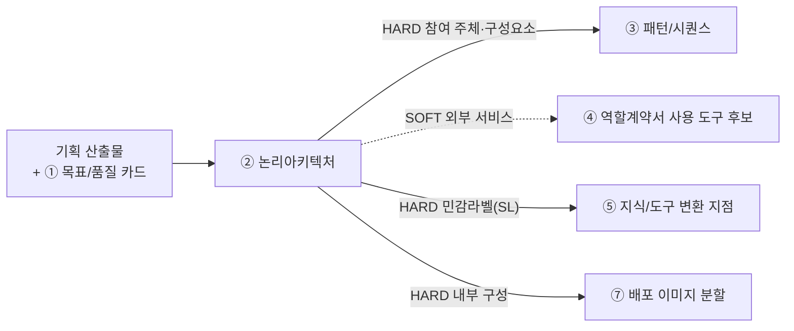

# 설계서 ② 논리아키텍처 — 작성 가이드

## 1. 이 설계서가 답하는 질문

**"무엇이 어디에 있고, 어디부터가 우리 통제 밖인가?"**

시스템과 외부 서비스의 관계를 그리고 **민감정보가 통제 밖으로 나가는 선**을 표시함.
도식 2장(전체 관계도·내부 구성도)과 표 4개로 이뤄짐.

**이걸 대충 하면 나는 사고 3가지**

- 경계선이 없어 마스킹을 어디에 걸지 정하지 못함. ⑤ 지식/도구·⑥ 가드레일/관측이 막힘
- 내부 구성이 안 나뉘어 ⑦ 배포에서 이미지를 몇 개로 쪼갤지 논쟁만 함
- 외부 시스템 중 무엇이 진짜인지 몰라 구현 때 없는 API를 부름

② 논리아키텍처는 **HARD로 넘겨주는 게 가장 많음**(③④⑤⑦). 늦으면 네 개가 한꺼번에 멈춤.
`HARD`는 없으면 뒤 칸을 못 채움. `SOFT`는 나중에 손봐도 됨.
**바로 뒤는 ③ 패턴/시퀀스임** — ② 논리아키텍처의 구성요소가 ③ 패턴/시퀀스의 참여 주체가 되므로 ② 논리아키텍처가 늦으면 ③ 패턴/시퀀스가 못 시작함.

---

## 2. 시작 전 판정

**판정 1 — 두 도식을 어떻게 가르나**

가장 헷갈리는 지점임. 기준은 하나임. **우리가 만드는 것인가 아닌가.**

| | 1단계 전체 관계도 | 2단계 내부 구성도 |
|---|-----------------|-----------------|
| 무엇을 | 우리 시스템을 **상자 하나**로 두고 바깥과의 관계 | 그 상자 **안**을 열어 나눔 |
| 노드 | 사용자·외부 시스템·저장소 | 우리가 만드는 실행 단위 |
| 나누는 기준 | 소유 주체가 다른가 | 따로 배포·실행되는가 |
| 안 그리는 것 | 내부 모듈 | 외부 시스템 상세 |

**판정 2 — 신뢰 경계(TB)를 어디에 긋나**

경계는 조직도가 아니라 **제어권이 바뀌는 곳**에 그음. 구조적 잣대 둘만 씀 — 데이터 종류는 안 봄.

| 순서 | 질문 | 예면 |
|------|------|------|
| 1 | 이 선을 넘으면 **우리가 로그를 못 보는가**? | 경계임 |
| 2 | 이 선을 넘으면 **접근 권한 주체가 바뀌는가**? | 경계임 |
| 3 | 둘 다 아니오 | 경계 아님. 그냥 내부 연결임 |

경계마다 `TB-1`·`TB-2` 같은 번호를 붙임. `TB`는 **Trust Boundary(신뢰 경계)** 의 약자임.

**판정 2-1 — 민감정보 라벨(SL)을 어디에 붙이나**

**TB가 있는 간선에서만** 판정함 — 내부시스템에서 외부시스템으로(또는 그 반대로) 실제로 통제권이
넘어가는 지점의 데이터가 대상임. 그 간선을 지나는 데이터에 민감정보가 하나라도 있으면 `SL-1`·`SL-2`
같은 번호를 TB 번호와 함께 붙이고(예: `TB-2 · SL-1`) 오가는 항목명을 라벨로 적음. TB가 없는 순수
내부-내부 연결은 **판정 2·2-1의 대상이 아님** — 로그·권한이 그대로인 내부 연결에서 민감정보가 섞여
흐르는 경우(예: 내부 저장소를 다른 내부 서비스가 읽는데 타 고객 정보가 섞여 있음)는
TB·SL 번호를 붙이지 않고, 대신 **내부 저장소 목록**의 `담는 것` 칸에 그 성격을 적어 ⑤ 지식/도구·
⑥ 가드레일/관측이 각자의 방식(민감 필드 분류·출력측 검사)으로 다루게 함. TB는 ⑥ 가드레일/관측의
접근제어·감사로그 판단에, SL은 ⑤ 지식/도구의 마스킹·변환 판단에 쓰임 — 둘이 겹칠 때가 많지만
같은 것은 아님.

**판정 2-2 — 경계를 넘기지 않기로 한 항목이 있는가**

**TB가 있는 경계에서** 넘기지 **않기로** 한 항목이 있으면 **넘는 것·넘지 않는 것을 항목명 단위 표로**
따로 적음. **이 판정이 가장 중요해지는 경우가 있음.** TB·SL은 라벨을 붙이라까지만 함.
건강·인증 정보처럼 모델에 보낼 이유가 없는 값은 **지식/도구 설계서의 입력 규격에 명시하지 않음.**
⑤ 지식/도구·⑥ 가드레일/관측보다 앞선 방어선임.

**판정 3 — 실물인가 Mock인가**

기준은 **이번 범위에서 실제로 붙을 수 있는가**임. 못 붙이면 Mock이고 사유를 `대체 사유`에 적음.
"아마 될 것"으로 실물이라 적지 않음. **실물이어도 `쓰려는 필드를 주는지` 따로 확인함** —
안 주면 실물이지만 그 경로는 Mock임. 소비자 앱은 Mock 근거가 **권한보다 인허가 일정**에서 나옴.

---

## 3. 설계항목 작성법

각 칸 첫 줄은 규격임 — **형태**(값의 모양) · **비면**(빈칸에 적을 값) ·  
**주인**(값을 가진 다른 산출물. 없으면 생략) · **대조**(다 채운 뒤 맞출 것).  
그 아래 대시 불렛이 채우는 요령임.  
설계항목은 `전체 관계도 → 내부 → 경계 → 외부 → 공통` 계열 순으로 놓았음.

| 설계항목 | 무엇을 적나 | 어디서 가져오나 | 예시 |
|----|-----------|---------------|---------|
| 전체 관계도 노드 | **형태** 노드 이름 하나씩 · **주인** 기획 산출물의 참여자·액터(그대로 옮김) · **대조** 새로 넣은 노드가 `구성요소 대조 표`의 신설 건수와 같은지 - 우리 시스템 **밖**에 있는 것만 적음 — 외부 액터·외부 시스템·저장소 - 이벤트스토밍의 `participant`·`actor`를 **그대로 옮김.** 새로 상상하지 않음 - 우리가 만드는 내부 모듈은 넣지 않음(그건 내부 구성도가 담당함) - 옮기다 빠진 것을 찾으면 `구성요소 대조 표`에 `신설` 행으로 남기고 근거를 적음 | ES `participant`·`actor` | (E) KOS 시스템 |
| 간선 라벨 | **형태** 오가는 데이터 항목 이름 · **비면** 경계 넘는 간선은 공란 불가 · **대조** 경계 넘는 화살표 수와 라벨 수가 같은지 - 화살표마다 **오가는 데이터 항목 이름**을 적음 - `데이터 전송`처럼 뭉뚱그리지 않음 — 항목 이름이 없으면 ⑤ 지식/도구가 가릴 지점을 못 정함 - 경계를 넘는 화살표는 **빠짐없이** 라벨을 붙임 | ES 이벤트명 | 준공 통보(회선번호) |
| 내부 구성도 노드 | **형태** 따로 배포되는 단위 이름 · **주인** 프로젝트 파라미터 `V-08` 구성요소 목록 · **대조** 여기서 센 개수가 ⑦ 배포의 덩어리 수 근거가 되는지 - **따로 배포·실행되는 단위**만 적음 - 나누는 기준은 딱 하나임 — "따로 배포되는가" - 코드 안의 함수·유틸은 넣지 않음 - 여기서 나온 개수가 ⑦ 배포의 덩어리 나누기 근거가 됨 | 코드베이스 구성요소 목록 | 검증 게이트 서비스 |
| **내부 저장소 목록** | **형태** 3열(이름·담는 것·보존 기간) · **비면** `[확인필요: 보존 기간]` · **대조** 도식에 그린 저장소 수와 표 행 수가 같은지 - 저장소마다 3개를 적음 — 이름 · 담는 것 · 보존 기간 - 도식 라벨만 두지 않고 **표로도** 적음 - 이 목록이 없으면 ④ 역할계약서가 도구 이름을 못 정하고 ⑦ 배포가 배치 위치를 못 잡음 | 내부 구성도 라벨 | 이력 저장소 / 근거 / 6개월 |
| 신뢰 경계 | **형태** `TB-n` 식별자 · **비면** 넘는 간선이 0건인 경계는 지움 · **대조** `subgraph` 개수와 `TB-` 번호 수가 같은지 - 경계를 `subgraph`로 감싸고 `TB-1`처럼 번호를 붙임(`TB`는 Trust Boundary, 신뢰 경계) - 판정 기준 3개 중 하나라도 예면 경계임 — 넘으면 기록을 못 보게 되나 · 접근 권한 주체가 바뀌나 · 개인정보가 나가나 - 조직·부서 경계로 긋지 않음. 데이터가 넘어가는 곳에만 그음 - 넘는 화살표가 하나도 없는 경계는 지움 | US NFR 보안 | TB-1 사내망 밖 |
| 경계 통과 데이터 | **형태** `SL-n` 식별자 + 항목 유형 이름 · **비면** TB 없는 내부 간선은 대상 아님 · **주인** 프로젝트 파라미터 `V-06` 민감정보 목록 · **대조** TB 간선 중 민감정보가 지나는 수와 같은지 - 경계를 넘는 화살표 중 민감정보가 지나는 곳에 `SL-1`처럼 번호를 붙임 - 넘어가는 항목의 **유형 이름**을 라벨로 적음 - 경계가 없는 내부 화살표는 대상이 아님 - 같은 데이터가 두 경계를 넘으면 그 사실을 ⑥ 가드레일/관측에 적음(가리기가 두 번 필요함) | 민감정보 목록 | SL-1 고객 회선정보 |
| **경계 미통과 항목** | **형태** 항목 이름 + 안 넘기는 방법 · **비면** `0건` · **대조** ⑤ 지식/도구의 커넥터 키에 그 이름이 0건인지 - 넘기지 **않기로** 한 항목 이름을 하나씩 적음 - 안 넘기는 방법도 함께 적음 — 가장 강한 방법은 **입력 규격에서 칸을 없애는 것**임 - 칸이 없으면 넣을 경로가 없어 규칙이 저절로 지켜짐 - 이 표가 ⑤ 지식/도구·⑥ 가드레일/관측의 가리기보다 앞선 방어선임 | 판정 2-2 | 건강 정보 — 입력 규격에 칸 없음 |
| 외부 서비스 `구분` | **형태** 2값 중 1개(`실물`·`Mock`) · **주인** 본 산출물이 소유(⑤는 펼쳐 적기만) · **대조** 2값 밖의 값이 적힌 칸이 0건인지 - `실물` 또는 `Mock` **2값 중 1개**만 적음 - `실물(예정)`처럼 섞어 적지 않음 — 계획은 `대체 사유`에 적음 - 실물이어도 **쓰려는 필드를 주는지** 확인함. 안 주면 그 경로는 Mock임 | 연계 가능 여부 · **쓰려는 필드를 주나** | Mock |
| 대체 사유 | **형태** 확인된 사실 1줄 · **비면** 실물 행은 공란 허용 · **대조** `Mock` 행마다 1줄이 있는지 - Mock으로 정한 이유를 1줄 적음 - 실물 행은 비워도 됨 - "아마 될 것"으로 적지 않고 **확인된 사실**을 적음 — 접속 권한 미확보 · 인허가 일정 같이 - 소비자 앱은 권한보다 **인허가·심사 일정**에서 Mock 근거가 나옴 | 연계 규칙 · 인허가 일정 | 레거시 접속 권한 미확보 |
| 근거 출처 | **형태** `{약칭}:{항목 ID}#{하위}` · **비면** `설계판단` · **대조** 약칭이 정해진 6개 안인지 - 이 값이 어느 문서 어디서 왔는지 적음 - 형식은 `{약칭}:{항목 ID}#{하위}`로 고정함 - 약칭은 정해진 6개만 씀 — 새로 만들지 않음 - 원문 근거 없이 팀이 정한 값이면 `설계판단`이라 적음 - 공란으로 두지 않음 | BM·US·PR 3종 | US:NFR-SEC-010#체크리스트1 |
| 배치 결정 사유 | **형태** 3줄 이내 문장 · **주인** ① 목표/품질 카드의 우선 품질 3개(인용) · **대조** 품질 3개가 모두 언급됐는지 - 왜 이렇게 나눠 놓았는지를 ① 목표/품질 카드의 **우선 품질 3개로** 설명함 - 3줄 이내로 적음 - 품질 이름만 적지 않음 — 그 품질 때문에 **무엇을 어떻게 배치했는지**를 적음 | ① 목표/품질 카드의 품질속성 표 | 응답시간 목표로 조회 경로를 분리함 |

**② 논리아키텍처가 쓰지 않는 것** — 시퀀스 단계(③ 패턴/시퀀스), 담당자별 책임(④ 역할계약서), 마스킹 방식(⑤ 지식/도구), 배포 단위(⑦ 배포).
② 논리아키텍처는 **위치와 경계만** 정함. 여기서 앞서가면 뒤 산출물과 값이 두 곳에 생겨 어긋남.

**경계선을 긋고 나서 반드시 해야 하는 확인**

프롬프트는 경계를 그리라고만 함. 그린 뒤 아래 3개를 확인해야 ⑤ 지식/도구·⑥ 가드레일/관측이 막히지 않음.
넘는 간선이 **하나도 없는** TB·SL은 지움(쓸모 없음) · **SL 간선에 라벨이 없으면** ⑤ 지식/도구가 변환 지점을
못 정함 · 같은 데이터가 **SL을 두 번 넘으면** 마스킹이 두 번 필요하므로 ⑥ 가드레일/관측에 그 사실을 적음.

**Mock 목록의 주인은 ② 논리아키텍처, 자리는 ⑤ 지식/도구**

규격 미결이던 항목을 팀 토론으로 확정함(G-10). **Mock·실물 구분 목록은 ⑤ 지식/도구에 두되 값의 주인은 ② 논리아키텍처임.**
⑤ 지식/도구는 커넥터 단위로 펼쳐 쓰기만 하고, 구분을 바꾸려면 ② 논리아키텍처를 고침.
타임아웃을 ③ 패턴/시퀀스가 소유하고 ⑥ 가드레일/관측이 참조만 하는 것과 같은 방식임.

**이벤트스토밍이 있으면 관계도를 새로 그리지 않음**

`participant`와 `database`가 곧 전체 관계도의 노드임. 새로 상상하지 말고 옮김.
**옮기면서 빠진 것을 찾으면 `구성요소 대조 표`에 `신설` 행으로 남기고 근거를 함께 적음.**
그냥 그려 넣으면 왜 있는 노드인지 아무도 모름.

**내부 저장소를 목록 표로도 적음** — 도식 라벨만 있으면 ④ 역할계약서가 `사용 도구`에 쓸 이름을 확정하지
못하고 ⑦ 배포가 배치 위치를 못 잡음. 저장소명·담는 것·보존 기간 3열이면 됨.

---

## 4. 제출 전 자가 점검표

- [ ] Mermaid `flowchart` 코드블록이 2개 이상 있음(전체 관계도·내부 구성도)
- [ ] **경계 미통과 항목**이 항목명 단위로 있음 · **내부 저장소가 목록 표로도 있음**
- [ ] **`구성요소 대조 표`의 신설 건수가 숫자이고 각 신설 행에 근거가 있음**
- [ ] **`실물` 행이 쓰려는 필드를 주는지 확인됨**(안 주면 조건 병기)
- [ ] 신뢰 경계가 `subgraph`로 표시되고 `TB-` 번호가 1개 이상 있음
- [ ] `TB-` 간선 중 민감정보가 지나는 곳마다 `SL-` 번호가 있음(TB 없는 내부 간선은 SL 판정 대상 아님 — 내부 저장소 목록에 성격만 적음)
- [ ] TB·SL 간선 **전부**에 데이터 항목 라벨이 있음
- [ ] `외부 서비스 목록` 표의 모든 행에 `구분`(실물/Mock)과 `근거 출처`가 채워짐
- [ ] `구분` 칸에 `실물`·`Mock` 외의 값이 0개임
- [ ] `구성요소 대조 표`가 있고 미대응 건수가 숫자로 적혀 있음
- [ ] `노드·간선 근거 대조표`와 `후행 소비처` 표가 각각 1개 이상 있음
- [ ] 배치 결정 사유가 ① 목표/품질 카드의 품질속성 3개를 근거로 3줄 이내로 적혀 있음
- [ ] 담당자 책임·시퀀스 단계·마스킹 방식·배포 단위가 **적혀 있지 않음**
- [ ] `기획 산출물 대조 기록` 표가 0건이어도 `0건`으로 있음

---

## 5. 다음으로 넘기는 값과 근거 자료

| 넘기는 값 | 받는 곳 | 강도 |
|----------|--------|------|
| 전체 관계도의 참여 주체·구성요소 | ③ 패턴/시퀀스의 참여 주체(바로 다음 산출물) | HARD |
| 신뢰 경계 `TB-n` | ⑥ 가드레일/관측 접근제어·감사로그 | HARD |
| 민감정보 라벨 `SL-n`과 경계 통과 데이터 | ⑤ 지식/도구 변환 지점(마스킹) | HARD |
| **경계 미통과 항목**(판정 2-2) | ⑤ 지식/도구 **커넥터 입출력 키에서 제외**(마스킹 아님 — 칸 자체를 안 만듦) | HARD |
| 내부 구성도의 실행 단위 · **내부 저장소 목록** | ⑦ 배포 이미지 분할·저장소 배치 · ④ 역할계약서 사용 도구 | HARD |
| 외부 서비스 목록 | ④ 역할계약서 사용 도구 후보 | SOFT |
| Mock·실물 구분(값의 주인은 ② 논리아키텍처) | ⑤ 지식/도구 목록 전개 | 소유 관계 |

**② 논리아키텍처가 소유하지 않는 것** — `기술 스택` 6행은 ② 논리아키텍처의 부속 표가 아니라 **프로젝트 파라미터**임
(`prompts/design/_shared/프로젝트정보.md` `V-07`). ⑦ 배포가 비밀값을 뽑을 때 그 파일을 봄.

| 아티클 | 어느 칸에 |
|--------|----------|
| [A05](../references/articles/A05_paper_agentarceval.md) | 참조 아키텍처 그림 — 가드레일이 세 층을 관통하는 기둥으로 그려짐 |
| [A06](../references/articles/A06_std_owasp-agentic-top10.md) | 경계 밖 연동에서 생기는 위협 유형(ASI04 공급망) |
| [A04](../references/articles/A04_spec_mcp-changelog-260728.md) | 외부 도구 접속 방식 표기 시 MCP 판본 |

규격 원문은 `prompts/design/02-논리아키텍처.md`와 본 폴더 `README.md`의
「산출물 1건은 무엇으로 이뤄지나」·「근거 출처 표기법」 절임.
