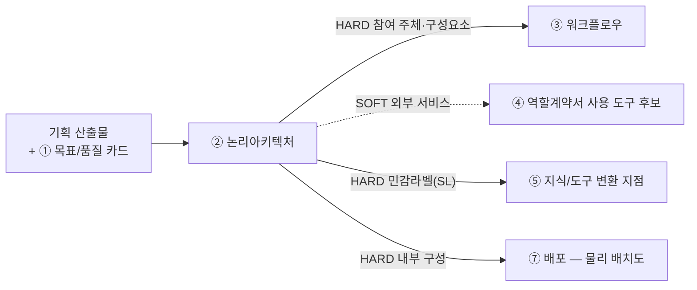

# 설계서 ② 논리아키텍처: 작성 가이드

## 1. 이 설계서가 답하는 질문

**"무엇이 어디에 있고, 어디부터가 우리 통제 밖인가?"**

**이걸 안 하면 나는 사고 3줄**

- 경계선이 없어 마스킹을 어디에 걸지 정하지 못함. ⑤ 지식/도구·⑥ 관측/가드레일이 막힘
- 내부 구성이 안 나뉘어 배포 때 무엇을 묶어 올릴지 다시 논쟁함(⑦은 이 구성을 그림으로 옮길 뿐 나누지 않음)
- 외부 시스템 중 무엇이 진짜인지 몰라 구현 때 없는 API를 부름

② 논리아키텍처는 **HARD로 넘겨주는 게 가장 많음**(③④⑤⑦). 늦으면 네 개가 한꺼번에 멈춤.
`HARD`는 없으면 뒤 칸을 못 채움. `SOFT`는 나중에 손봐도 됨.
**바로 뒤는 ③ 워크플로우임**: ② 논리아키텍처의 구성요소가 ③ 워크플로우의 참여 주체가 되므로 ② 논리아키텍처가 늦으면 ③ 워크플로우가 못 시작함.

**앞뒤 연결도**

---

## 2. 시작 전 판정

**판정 1: 두 도식을 어떻게 가르나**

가장 헷갈리는 지점임. 기준은 하나임. **우리가 만드는 것인가 아닌가.**

| | 1단계 전체 관계도 | 2단계 내부 구성도 |
|---|-----------------|-----------------|
| 무엇을 | 우리 시스템을 **상자 하나**로 두고 바깥과의 관계 | 그 상자 **안**을 열어 나눔 |
| 노드 | 사용자·외부 시스템·저장소 | 우리가 만드는 실행 단위 |
| 나누는 기준 | 소유 주체가 다른가 | 따로 배포·실행되는가(**판정 4**) |
| 안 그리는 것 | 내부 모듈 | 외부 시스템 상세 |

**판정 2: 신뢰 경계(TB)를 어디에 긋나**

경계는 조직도가 아니라 **제어권이 바뀌는 곳**에 그음. 구조적 잣대 둘만 씀: 데이터 종류는 안 봄.

| 순서 | 질문 | 예면 |
|------|------|------|
| 1 | 이 선을 넘으면 **우리가 로그를 못 보는가**? | 경계임 |
| 2 | 이 선을 넘으면 **접근 권한 주체가 바뀌는가**? | 경계임 |
| 3 | 둘 다 아니오 | 경계 아님. 그냥 내부 연결임 |

경계마다 `TB-1`·`TB-2` 같은 번호를 붙임. `TB`는 **Trust Boundary(신뢰 경계)** 의 약자임.

**판정 2-1: 민감정보 라벨(SL)을 어디에 붙이나**

**TB가 있는 간선에서만** 판정함   
- 내부시스템에서 외부시스템으로(또는 그 반대로) 실제로 통제권이
넘어가는 지점의 데이터가 대상임.   
- 그 간선을 지나는 데이터에 민감정보가 하나라도 있으면 `SL-1`·`SL-2`
같은 번호를 TB 번호와 함께 붙이고(예: `TB-2 · SL-1`) 오가는 항목명을 라벨로 적음.   

**판정 2-2: 경계를 넘기지 않기로 한 항목이 있는가**
- **TB가 있는 경계에서** 넘기지 **않기로** 한 항목이 있으면 **넘는 것·넘지 않는 것을 항목명 단위 표로**
따로 적음.   
- **이 판정이 가장 중요해지는 경우가 있음.** TB·SL은 라벨을 붙이라까지만 함.
건강·인증 정보처럼 모델에 보낼 이유가 없는 값은 **지식/도구 설계서의 입력 규격에 명시하지 않음.**
⑤ 지식/도구·⑥ 관측/가드레일보다 앞선 방어선임.

**판정 3: 실물인가 Mock인가**

기준은 **이번 범위에서 실제로 붙을 수 있는가**임.   
못 붙이면 Mock이고 사유를 `대체 사유`에 적음.  
"아마 될 것"으로 실물이라 적지 않음   

**판정 4: 모듈로 나눌까 프로세스로 나눌까**

**기본값은 프로세스 1개임.** 구성요소를 나눈 것과 프로세스를 나눈 것은 다른 판단이며,
나눌 이유를 못 대면 **모듈 경계로만 나누고 한 프로세스에 둠.**

**판정 대상은 업무 하나가 아니라 "무엇을 무엇과 쪼개는가"라는 후보 방안임.**
P1 ~ P4의 "한쪽"·"다른 쪽"은 비교 대상이 있어야 답할 수 있는 질문임. 업무명 하나만 놓고
물으면 비교 대상이 암묵적으로 "나머지 전체"가 되어 사소한 차이에도 "예"가 나오기 쉬움.
그래서 후보 방안은 `이력 업무를 추천과 쪼갬`처럼 **비교 대상 둘을 문장에 명시함.**

| 질문 | 예면 |
|------|------|
| P1 배포 주기가 다른가: 한쪽만 따로 배포하는 일이 실제로 생기는가 | 프로세스 분리 |
| P2 늘리는 축이 다른가: 부하가 몰리는 시점·양이 서로 달라 따로 늘려야 하는가 | 프로세스 분리 |
| P3 장애를 막아야 하는가: 한쪽이 죽어도 다른 쪽은 살아야 하는가 | 프로세스 분리 |
| P4 실행 방식이 다른가: 하나는 요청을 받고 하나는 주기로 도는가 | 프로세스 분리 |

전부 "아니오"면 프로세스를 나누지 않음(합침). 하나라도 "예"면 그 경계로 나누고 **어느 질문이
"예"인지 적음.** 후보 방안을 다 걸러낸 뒤, **인접한 후보끼리 다시 합쳐도 되는지** 같은 표로
한 번 더 검증함: 먼저 가른 경계는 최종 정답이 아니라 가설이므로, 전부 "아니오"면 도로 합침.

예시(형태만 봄: 값은 프로젝트에서 나온 것으로 교체함):

| 후보 방안 | 근거("예"인 질문) | 결론 |
|----------|-----------------|------|
| 회원 업무를 나머지 전체와 쪼갬 | P1 · P3 | 분리 |
| 결제 업무를 나머지와 쪼갬 | P1 · P3 | 분리 |
| 일일 취향학습을 요청 처리와 쪼갬 | P2 · P4 | 분리 |
| 이력 업무를 추천과 쪼갬 | 없음(전부 아니오) | 합침 |

**프로세스를 1개 더 만들면 아래가 프로세스마다 1벌씩 따라붙음**: 나누기 전에 이 비용을 같이 봄.

- 기동·설정 조립 · 인증 처리 · 오류 규격 · 상태 점검 경로 · 의존성 파일 · 컨테이너 이미지
- 다른 프로세스의 구성요소를 부르면 함수 호출이 아니라 **네트워크 호출**이 됨:
  그 규격·타임아웃·재시도·실패 처리가 ③ 워크플로우에 새로 생김

**프로세스를 나눠도 담당자(④ 역할계약서)는 프로세스를 가로지를 수 있음.**
담당자 배치는 여기서 정하지 않음: 프로세스 경계와 담당자 경계는 다른 축임.

## 3. 설계항목 작성법

**성공지표와 품질목표에 따른 최적의 논리 아키텍처를 설계**함

**설계항목은 3계열 8개임**  
`구조`: 전체 관계도 · 내부 관계도 · 프로세스 분리표  
`경계`: 신뢰경계표 · 경계통과 민감정보 · 경계 미통과 항목  
`저장`: 내부 저장소 목록 · 배치 결정 ADR

**이 제목 구조가 곧 산출물의 목차임**: 여기 없는 절을 산출물에 만들지 않고, 여기 있는 절을 빼지도 않음.

### 전체 관계도
- '판정 1'의 결과에 따라 '우리 시스템을 상자 하나로 두고 본 바깥' 시스템/서비스를 표시함  
- Mermaid Scripit로 작성

### 내부 관계도
- '판정 1'의 결과에 따라 내부 시스템의 서비스와 저장소등을 표시함  
- Mermaid Scripit로 작성
- **노드·간선이 많아 가독성이 떨어지면** 두 종류로 나눠 그림: ⓐ **프로세스 간 관계도**(저장소
  제외, 프로세스를 넘나드는 간선만) ⓑ **프로세스별 상세도**(그 프로세스의 서비스 + 접근하는
  저장소, 프로세스 안에서만 도는 간선). 나눠도 이 절 하나에 소제목으로 묶고 새 절을 만들지 않음
- 저장소를 **둘 이상의 프로세스가 같이 쓰면** 어느 프로세스들이 공유하는지 한 줄로 남김:
  프로세스가 나뉘어도 남는 결합 지점이라 상세도만 봐서는 안 보임

### 프로세스 분리표
'판정 4'의 결과를 표로 작성. 프로세스마다 1행이며, 분리한 프로세스는 `P1` ~ `P4` 중 어느 것이 "예"였는지 적음

예시:
| 프로세스 | 담는 구성요소 | 분리 근거 |
|---------|-------------|----------|
| `P-1` 요청 처리 | 추천·이력·회원·결제 | 기본값(나누지 않음) |
| `P-2` 야간 배치 | 취향 학습 | `P4` 실행 방식: 요청이 아니라 주기로 돎 |

### 신뢰경계표
**판정 2에서 모은 노드 전부**(사용자·내부업무·내부실행·외부시스템)를 한 표에 담음: 노드,
종류, 신뢰경계ID(있으면), 실물/Mock(외부시스템만)을 표형태로 작성. 내부 노드는 뒤 두 칸을
`—`로 둠. 판정 근거(왜 그 TB인지, 왜 Mock인지)는 여기 안 적음: **판정 기록 쪽에만 남기고
여기는 결과만 옮김.**

| 노드 | 종류 | 신뢰경계 | 실물/Mock |
|------|------|:-------:|:--------:|
| 회원업무 | 내부업무 | — | — |
| (E)외부 인증 | 외부시스템 | TB-4 | Yes(Mock) |

### 경계통과 민감정보
**TB가 있는 간선마다 방향별로 1행**: 소스, 대상, 오가는 정보, 민감정보ID(SL-{NN}, 없으면
`—`)를 표형태로 작성. 한 경계에 여러 SL이 겹치면 그 경계만 여러 행으로 늘어남: 압축하지 않음.

예시:
| 소스 | 대상 | 정보 | 민감정보ID |
|------|------|------|:---------:|
| 사용자 | TB-4 외부 인증 | 카카오 인증 토큰 | SL-1 |
| TB-4 외부 인증 | 시스템 | 카카오 ID·이메일 | SL-1 |

### 경계 미통과 항목

| 항목 이름 | 어느 경계를 안 넘나 | 안 넘기는 방법 |
|----------|------------------|--------------|
| 알레르겐 원문 라벨(`allergyItems`) | TB-2 모델 벤더 | LLM 입력 규격에 `allergyItems` 칸을 만들지 않음. `제외 식재료 코드` 배열만 둠 |

### 내부 저장소 목록
**저장소가 존재한다는 사실과 소속만** 적음: ID, 저장소명, 용도(한 줄), 소속 프로세스를
표 형태로 작성. **필드 전체 나열·보존 기간은 여기서 정하지 않음**: 조회 대상 표·열은 ⑤ 지식/도구가
(공통규격 「값의 주인」), 보존 기간·삭제 주기는 ⑤ 지식/도구가 원문에서 직접 인용해 정함
(⑤ 가이드 3-3 민감정보·보존 정책 설계). ⑦ 배포는 이 목록에서 이름만 인용해 배치도에 얹고,
안/밖 배치·접속정보는 설계 범위 밖(구현 단계에서 결정)임.

예시:
| ID | 저장소명 | 용도 | 소속 프로세스 |
|----|---------|------|-------------|
| S-1 | 회원 저장소 | 회원 인증·프로필·구독 상태 | P-1 |
| S-2 | 위치 저장소 | 현재·과거 위치 좌표 | P-2 |

### 배치 결정 ADR(Architectural Decision Record) 
성공지표와 품질목표에 따른 설계 과정의 주요 아키텍처 의사결정 작성 (후보, 장단점, 의사결정 이유 등)

---

## 4. 제출 전 자가 점검표

- [ ] Mermaid `flowchart` 코드블록이 2개 이상 있음(전체 관계도·내부 구성도)
- [ ] `TB-` 간선 중 민감정보가 지나는 곳마다 `SL-` 번호가 있음(TB 없는 내부 간선은 SL 판정 대상 아님: 내부 저장소 목록에 성격만 적음)
- [ ] TB·SL 간선 **전부**에 데이터 항목 라벨이 있음
- [ ] 배치 결정 ADR이 ① 목표/품질 카드의 품질속성 3개를 근거로 적혀 있음
- [ ] 프로세스가 2개 이상이면 프로세스마다 `P1` ~ `P4` 중 "예"인 것이 적혀 있음(근거 없는 분리 **0건**)

---

