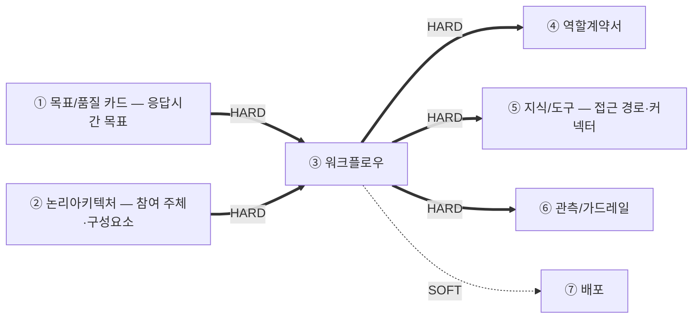
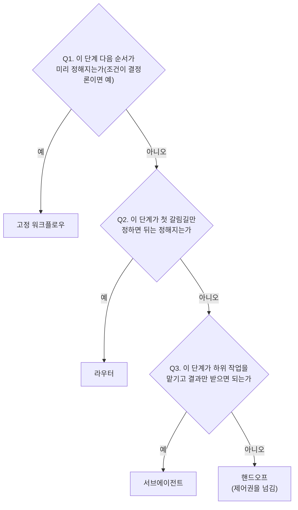

# 설계서 ③ 워크플로우: 작성 가이드

---

- [설계서 ③ 워크플로우: 작성 가이드](#설계서--워크플로우-작성-가이드)
  - [1. 이 설계서가 답하는 질문](#1-이-설계서가-답하는-질문)
  - [2. 시작 전 판정](#2-시작-전-판정)
    - [2-1. 트리거부터 가름](#2-1-트리거부터-가름)
    - [2-2. 패턴 선택: 결정 트리](#2-2-패턴-선택-결정-트리)
    - [2-3. 인간 개입 판정](#2-3-인간-개입-판정)
    - [2-4. 모델 호출 판정: 이 단계가 모델을 쓰는가](#2-4-모델-호출-판정-이-단계가-모델을-쓰는가)
    - [2-5. 체크포인트 보존 판정: 상태를 흐름 밖에 남기는가](#2-5-체크포인트-보존-판정-상태를-흐름-밖에-남기는가)
  - [3. 설계항목 작성법](#3-설계항목-작성법)
    - [워크플로우 표](#워크플로우-표)
    - [워크플로우별 설계](#워크플로우별-설계)
      - [오늘의 추천조회](#오늘의-추천조회)
    - [프로세스별 API 설계](#프로세스별-api-설계)
      - [`P-2` 추천·이력 프로세스](#p-2-추천이력-프로세스)
  - [4. 제출 전 자가 점검표](#4-제출-전-자가-점검표)

---

## 1. 이 설계서가 답하는 질문

**"누가 어떤 순서로 움직이고, 실패하면 무엇을 하는가"를 못 박는 문서입니다.**

`타임아웃 값의 단일 출처는 본 산출물임`: 머리말에 그대로 둡니다.

**이걸 안 하면 나는 사고 3줄**

- 재시도가 겹쳐 외부 시스템에 호출이 몇 배로 쏟아짐
- 상한 없는 재계획 루프로 요청이 안 끝나고 비용만 쌓임
- 동시에 도는 두 단계가 같은 값을 덮어써 결과가 사라짐

**앞뒤 연결도**



`HARD` 없으면 못 채움: ③ 워크플로우는 HARD 유입이 ①②의 2건뿐이라 ② 논리아키텍처가 끝나면 바로 시작합니다.
**흐름을 먼저 확정해야 그 단계를 누가 맡는지(④ 역할계약서)를 정할 수 있으므로 ③ 워크플로우가 ④ 역할계약서보다 앞입니다.**
사전 승인·진행 중 중단·사후 재정의 지점(2-3절)은 **④ 역할계약서가 담당자(사람)를 배정하는 자리**입니다.

**뒤 산출물과 순환하지 않습니다: 내보내기만 합니다.**
④⑤⑥은 여기서 정한 값을 인용하고, 어긋나는 것이 나오면 고치지 않고 **`변경요청` 1행**을 되돌려 보냅니다.
그래서 ③ 워크플로우는 ①② 두 건만 있으면 **끝까지 쓰고 닫을 수 있습니다.**

---

## 2. 시작 전 판정

**참여 주체는 ② 논리아키텍처에서 가져옵니다.** ③ 워크플로우를 쓸 때 ④ 역할계약서는 아직 없으므로 담당자 이름을 지어내지 않고
② 논리아키텍처의 구성요소·외부 서비스·저장소 이름을 그대로 씁니다.
**단계를 몇 명의 담당자로 묶고 각자 어디까지 손대는지는 ④ 역할계약서가 뒤에서 정합니다**:
다만 그 단계가 모델을 쓰는가(2-4)와 사람이 개입하는가(2-3)는 예산 계산에 필요하므로 이 문서가 정합니다.

### 2-1. 트리거부터 가름

시퀀스는 **시작 트리거별로 따로 그립니다.** 섞으면 예산이 엉킵니다.

| 트리거 | 무엇인가 | 단계 식별자 | 예산 기준 |
|--------|---------|------------|----------|
| 동기 요청 | 사람이 눌러 기다림 | `S-R1` ~ | ① 목표/품질 카드의 응답시간 목표 |
| 스케줄 배치 | 정해진 주기에 자동 실행 | `S-B1` ~ | ① 목표/품질 카드의 배치 완료 목표 |
| 이벤트 | 앞 단계 완료 신호로 시작 | `S-E1` ~ | 전달 지연 목표 |

스케줄 배치·이벤트도 표 형식과 계산법은 동기 요청과 같습니다. 단계 식별자 접두사만 `S-B`·`S-E`로 바꾸고
예산 기준은 위 표에서 그 트리거 줄을 그대로 씁니다.

### 2-2. 패턴 선택: 결정 트리

**워크플로우 전체가 아니라 단계마다 묻습니다**: 2-3·2-4와 같은 층위입니다. 한 워크플로우 안에
고정 구간과 갈림길·위임 구간이 섞여 있을 수 있으므로 패턴은 워크플로우의 라벨 1개가 아니라
**단계별 판정의 조합**으로 남습니다. **기본값은 고정 워크플로우입니다.** 모델이 다음 단계를
고르게 하는 것은 필요할 때만 합니다.



후보 4종: 고정 워크플로우·라우터·서브에이전트·핸드오프.
**패턴과 프레임워크를 섞지 않습니다.** 표에는 패턴만 올립니다.

**패턴마다 뒤 설계에 실제로 미치는 영향이 다릅니다**: 판정만 하고 끝나지 않습니다.

| 패턴 | 시퀀스·예산 설계에 미치는 영향 |
|------|------------------------------|
| 고정 워크플로우 | 직렬·병렬만 있음. 최악값은 그대로 합산(병렬은 최댓값만) |
| 라우터 | 이 단계 뒤가 **택일 분기**임: 시퀀스 도식에 `alt` 블록으로 그리고, 최악값은 병렬처럼 더하지 않고 **가장 비싼 분기 하나만** 총 시간예산과 대조함 |
| 서브에이전트 | 위임한 하위 작업의 내부 단계는 이 표에 안 담고 **별도 워크플로우**로 뗌(워크플로우 표에 행 1개 추가). 위임 단계의 최악값·모델 호출 횟수는 그 하위 워크플로우 값을 **롤업**해서 적음 |
| 핸드오프 | 제어권이 넘어간 뒤는 이 워크플로우 소관이 아님: **최악값 합계·총 시간예산 대조를 핸드오프 단계에서 끊음**. 그 뒤는 받는 쪽의 워크플로우가 따로 다룸 |

**정보 검색 워크플로우 패턴: 위 4종의 조합으로 정합니다**

정보를 찾아 답하는 흐름은 **정형 · 의미정보 · 관계정보 · 외부검색 네 유형 전부**에 걸립니다.
벡터 검색만의 이야기가 아닙니다.

**5번째 패턴 후보가 아니라 위 4종의 조합 결과입니다.** 아래 4문에 각각 예/아니오로 답하고
**`예`인 것들이 곧 조합**입니다. 하나를 골라 끝내는 판정이 아닙니다.

| # | 질문 | `예`면 붙는 판정 단계 | 이 문서의 표기 | 문헌 이름(참고) |
|---|------|------------------|--------------|--------------|
| Q1 | 검색 없이 답할 수 있는 질의가 섞여 있나 | 검색 여부 판정 | 라우터 | Self-RAG |
| Q2 | 질의에 따라 **정형·의미정보·관계정보·외부검색 중 갈 곳**이 달라지나 | 경로 선택 판정 | 라우터 | Adaptive RAG |
| Q3 | 결과가 부실할 때 되돌려 다시 찾아야 하나 | 결과 검증 판정 + 되돌기 | 라우터 + 반복 구간 | CRAG |
| Q4 | 한 번으로 안 끝나고 도구를 오가야 하나 | 도구 루프 | 서브에이전트 + 반복 구간 | Agentic RAG · ReAct |

- **네 문항이 다 `아니오`면 `단일 검색`입니다**: 검색 단계 1개를 고정 워크플로우로 두고 끝냅니다
- **Q4가 `예`면 대개 Q1 ~ Q3도 `예`가 됩니다**: 도구를 오가는 루프는 검색 여부·경로·품질을
  매 바퀴 다시 판단하기 때문입니다. 그래도 문항마다 따로 답해 **어느 판정 단계가 실제로 생기는지**를 남깁니다
- **문헌 이름은 결과에 붙는 참고 라벨로만 씁니다**: 표기는 라우터·서브에이전트·반복 구간으로
  통일합니다. 이름을 축으로 쓰면 같은 흐름을 두 이름으로 부르게 됩니다
- **Q2는 ② 논리아키텍처의 내부 저장소 목록으로 답합니다**: 저장소 종류가 여럿이면 갈라야 합니다.
  ⑤ 지식/도구를 기다리지 않습니다(그때는 ⑤가 아직 없음)
- **판정 단계도 2-4 `모델 호출` 판정을 받습니다**: 최악값·총 시간예산 대조에 들어가고,
  되돌아가는 흐름은 `반복 구간` 표에 행을 만들어 **최대 반복 횟수**를 적습니다(없으면 무한 루프)
- **⑤ 지식/도구는 이 판정을 하지 않습니다**: ⑤는 그 판정 단계가 쓸 **기준값**(임계값·보낼 경로)만
  채웁니다. ⑤가 패턴을 고르면 단계가 늘어 ④가 담당자 판정을 다시 돌리게 되고
  ③ → ④ → ⑤ 순서가 순환합니다
- **검색 품질을 몰라 Q3를 못 정하겠으면 `아니오`로 두고 넘어갑니다**: ⑤가 파 보고 필요하다고
  판단하면 `변경요청`으로 되돌아옵니다

### 2-3. 인간 개입 판정

**되돌릴 수 없는 쓰기 단계부터 봅니다.** 그 단계에 인간 개입 수단이 있는지 아래 3가지 시점으로 나눠 정합니다.

| 시점 | 무엇인가 | 기본값 |
|------|---------|--------|
| 사전(승인 전 정지) | 진행 전에 사람이 승인해야 다음 단계로 넘어감 | 되돌릴 수 없는 쓰기는 **필수** |
| 진행 중(강제 중단) | 실행 중인 단계를 외부 신호로 즉시 멈춤(Kill switch) | 고위험 AI로 판정되면 **필수** |
| 사후(결과 재정의) | 이미 나온 산출값을 사람이 무시·수정함(Override) | 고위험 AI로 판정되면 **필수** |

**고위험 AI 여부는 여기서 정하지 않습니다.** ① 목표/품질 카드의 성격 선언을 그대로 인용합니다.
`[확인필요]`면 사전(승인 전 정지)만 기본값으로 두고 나머지는 되묻습니다.

사전 승인은 흐름이 거기서 멈춰 사람을 기다리는 지점이고 진행 중 중단·사후 재정의는
**자율로 도는 단계에도 걸리는 별도 채널**입니다: 자율성이 높을수록 오히려 더 필요합니다.

### 2-4. 모델 호출 판정: 이 단계가 모델을 쓰는가

**단계마다 아래 3개를 던져 하나라도 "예"면 모델을 쓰는 단계, 전부 "아니오"면 결정론적 단계(`0회`)입니다.**

| 판단기준 | "예"로 판정하는 기준 | 예 |
|------|--------------------|-----|
| L1 규칙 완결성 | 입력 → 출력 매핑을 표·조건문으로 전부 못 닫고, 새 예외가 계속 생김 | "이 문의가 환불 대상인가"는 예외가 계속 늘어 규칙표로 못 닫음 |
| L2 비정형 해석 | 입력이 자유 텍스트·이미지·음성이고, 그 의미(의도·요약·분류)를 해석해야 결과가 나옴 | 고객 문의 원문에서 불만 사유를 뽑아냄 |
| L3 재구성·종합 | 여러 출처를 종합하거나 근거를 들어 설명·제안을 새로 만들어야 함(단순 조회·계산이 아님) | 검증 실패 사유를 근거와 함께 서술 |

- **판단과 실행이 한 단계에 붙어 있으면 먼저 쪼갭니다**: "예약해도 되는가"(판단)와 "예약 확정 호출"(실행)은
  다른 단계입니다. **단계를 쪼갤 수 있는 것은 이 문서뿐이므로 여기서 갈라 둡니다**: ④ 역할계약서는
  단계ID를 새로 만들지 못해 나중에는 못 고칩니다
- `쓰기(되돌림 불가)` 실행 그 자체는 L1 ~ L3 결과와 무관하게 **항상 `0회`** 입니다.
  되돌릴 수 없는 실행에 판단이 섞이면 사람이 승인한 값과 실제 실행한 값이 어긋납니다
- 단말·프론트엔드 구간처럼 우리가 손대지 않는 단계도 `0회`입니다
- **어떤 모델을 쓰는지는 정하지 않습니다**: 모델명·사고 켬/끔은 ④ 역할계약서 몫입니다.
  이 절은 `0회`인가 `N회`인가만 가릅니다

### 2-5. 체크포인트 보존 판정: 상태를 흐름 밖에 남기는가

**트리거로 가르지 않습니다.** 아래 4축 중 하나라도 걸리면 상태를 프로세스 밖에 남겨야 합니다.

| 축 | 조건 | 어디서 읽나 | 안 남기면 |
|----|------|-----------|----------|
| A 재개 | 끊긴 실행을 이어서 해야 함 | 2-1이 스케줄 배치·이벤트로 판정한 워크플로우 | 처음부터 다시 돎 |
| B 정지·재진입 | 사전 승인으로 멈췄다가 다시 들어옴 | 2-3의 `사전(승인 전 정지)` | **멈춤과 재진입 자체가 성립하지 않음** |
| C 사후 접근 | 응답을 낸 뒤 State를 읽거나 고침 | 2-3의 `진행 중(강제 중단)`·`사후(결과 재정의)` | 중단 시점의 부분 상태와 고칠 대상이 남지 않음 |
| D 멀티턴 | 같은 세션으로 이어 말함 | `V-02`가 대화형 응답을 요구하는 경우 | 턴마다 맥락이 초기화됨 |

**동기 요청도 B·C·D에 걸리면 상태를 남깁니다.** 재개(축 A)와 정지·재진입(축 B)은 다른 축입니다.
사전 승인은 흐름이 멈춰 사람을 기다리는 지점이고(2-3), 기다리는 동안 응답을 닫으려면
그 상태가 요청 하나의 수명보다 오래 살아야 합니다. **축 A만 보고 "동기 요청이니 안 남긴다"로
판정하면 2-3에서 필수로 정한 사전 승인을 구현할 수 없습니다.**

축이 하나도 안 걸리면 `보존 사유 = 없음`으로 적고 3절 「체크포인트 보존」 표의 나머지 칸을
`해당 없음`으로 채웁니다. **표를 지우지 않습니다**: 지우면 뒤 산출물이 "판정을 안 한 것"과
"판정해서 필요 없는 것"을 구분하지 못합니다.

**이 문서가 소유하는 것은 `무엇을 · 언제 · 어떤 키로` 남기는가까지입니다.**
어느 제품에 어떻게 두는가(백엔드·안/밖 배치·접속정보)는 설계 범위 밖(구현 단계에서 결정)이고,
얼마나 두는가(보관 기간·파기)는 ⑤ 지식/도구 3-3이 정합니다: 타임아웃은 여기가 갖고 금액은
⑥이 갖는 것과 같은 구조입니다.

---

## 3. 설계항목 작성법

**설계항목은 3개임**: `워크플로우 표`(전체 목록 1개) · `워크플로우별 설계`(워크플로우마다 1개) ·
`프로세스별 API 설계`(프로세스마다 1개).
**이 제목 구조가 곧 산출물의 목차임**: 여기 없는 절을 산출물에 만들지 않고 여기 있는 절을 빼지도 않음.

### 워크플로우 표
워크플로우ID, 워크플로우명, 트리거 유형, 설명을 표 형태로 작성

- **`워크플로우ID`는 이 표가 발급함**: 표기는 `W-1`·`W-2` 꼴로 위에서부터 차례로 붙임.
  단계ID의 `S-R`·`S-B`·`S-E`와 같은 층위의 규격 부호임
- **ID를 붙이는 이유는 뒤 설계서가 워크플로우를 이름 대신 부호로 가리키기 때문임**:
  ④ 역할계약서 표B의 `워크플로우 | 단계` 칸이 `` `{워크플로우ID}` {워크플로우명} `` 꼴이고,
  아래 「체크포인트 보존」의 `세션 격리 키 성분`과 「프로세스별 API 설계」의 호출 위치 칸도
  이 부호를 씀. 이름은 길고 다듬는 과정에서 바뀌므로 부호를 함께 둠
- **서브에이전트에 위임한 하위 작업도 이 표에 행이 1개 늘어나므로 ID를 하나 받음**
- **한 번 붙인 ID는 다시 매기지 않음**: 뒤 설계서가 이미 인용하고 있을 수 있음.
  워크플로우가 빠지면 그 번호를 비워 두고 다음 번호부터 이어 붙임

예시:

| 워크플로우ID | 워크플로우명 | 트리거 유형 | 설명 |
|-------------|-------------|-------------|-----------------------------------|
| `W-1` | 오늘의 추천조회 | 동기요청 | 사용자의 음식점 추천을 처리하는 워크플로우 |

### 워크플로우별 설계

**워크플로우마다 제목 1개를 두고 그 아래에 아래 6가지를 적음**
(`총 시간예산` · `Sequence` · `단계별 설계` · `State 구조` · `재개 방안` · `체크포인트 보존`).
**재개 방안만 스케줄 배치·이벤트 전용이고 나머지 5개는 트리거와 무관하게 전부 채움.**
제목은 위 워크플로우 표의 **ID와 이름을 함께** 씀(`` #### `W-1` 오늘의 추천조회 `` 꼴).
**ID를 빼고 이름만 쓰지 않음**: ④·⑥이 이 제목을 그대로 인용하므로 여기서 빠지면 뒤에서도 빠짐.

**제목이 워크플로우를 가리키므로 표 안에는 단계ID만 적음**: 행마다 워크플로우명을 반복하지 않음.
워크플로우가 1개인 앱도 제목을 둠. 나중에 늘어날 때 구조가 안 바뀜.

각 워크플로우별 작성
- 총 시간예산
- Sequence: Sequence Diagram을 Mermaid script로 작성.
  - 인간 개입이 있는 단계는 도식에도 `Note`로 그대로 표시함
    시점(사전·진행 중·사후)을 `Note` 문구 앞에 적음
    ```mermaid
    sequenceDiagram
      participant S as S-R5(예약 확정)
      participant H as 담당자(사람)
      S->>H: 승인 요청
      Note right of S: 사전 승인 필수, 대기 타임아웃 5분
      H-->>S: 승인
    ```
- 단계별 설계: Sequence Diagram 하위에 각 단계별 참여 주체, 행동, p95 타임아웃, 타임아웃(상한), 재시도 횟수, 최악값, 초과 시 처리, 인간 개입, 모델 호출을 표형태로 작성
  - p95 타입아웃: 는 100번 중 95번이 그 안에 드는 값
  - 최악값: 타임아웃(상한) × (1+재시도 횟수). **이 단계가 반복 구간에 속해도 이 칸에는
    반복 횟수를 곱하지 않음**: 이 칸은 항상 "그 구간이 1바퀴 돌 때" 이 단계 하나의 값임.
    반복 횟수를 곱하는 자리는 아래 `최악값 합계`뿐임(칸마다 곱하면 표가 감당 못 할 숫자가 됨.
    예: `max_iter` 10,000인 구간에서 매 칸에 곱하면 단계 하나가 수백만ms로 찍힘)
  - 반복 구간: **한 단계가 아니라 되돌아가는 화살표로 묶인 여러 단계 구간**마다 표 아래에
    1행씩 적음. 되돌아가는 화살표가 하나도 없으면 표를 만들지 않고 본문에 `반복 구간 — 0건`
    으로 적음

    | 반복구간ID | 되돌아가는 구간(단계 범위) | 최대 반복 횟수(`max_iter`) | 착지 노드 |
    |-----------|----------------------|------------------------|---------|
    | `R-1` | `S-R10` ~ `S-R11` | 2 | `S-R13` 안전 종료 |
  - 최악값 합계 대조: 직렬 단계는 최악값을 더하고 병렬로 묶인 단계는 그중 가장 큰 값만 더함.
    **반복 구간에 속한 단계들은 먼저 그 구간 안에서만(1바퀴 기준으로) 합산한 뒤, 그 합계를
    `(1+최대 반복 횟수)`로 한 번만 곱해서** 전체 합계에 더함: 구간 밖 단계처럼 낱개로
    더하지 않음. **재시도와 반복 횟수가 한 단계에 같이 있어도 이 두 단계(먼저 구간 합산,
    그다음 배수 곱)를 넘어서는 별도 계산은 없음.** 그렇게 만든 합계를 **총 시간예산**과
    대조함. p95 합계는 같은 방식으로 **응답시간 목표**와 따로 대조함
    (성공 경로만 더한 값으로 최악값 대조를 대신하지 않음)
  - 초과 시 처리 열: **위에서부터 물어 처음 `예`에서 멈춤.** `시간`·`반복` 두 상한에 **같은 순서**를 씀

    | # | 질문 | 예면 |
    |---|------|------|
    | 1 | 이미 얻은 것만으로 답이 되나 | `부분 결과로 계속`: 무엇이 빠졌는지 응답에 밝힘 |
    | 2 | 더 싼 대체 경로가 있나 | `대체 경로로 계속`: 그 경로에도 시간을 배정함 |
    | 3 | 둘 다 아니오 | `안전 종료`: 사용자에게 실패와 다음 행동을 알림 |

    - **아래 줄을 먼저 고르지 않음**: 답할 수 있는데 종료하면 쓸 수 있는 결과를 버림
    - `안전 종료`를 고른 단계는 **사용자에게 무엇을 보여줄지** 1줄 함께 적음
    - **비용 상한은 이 순서에 없음**: 금액은 ⑥ 관측/가드레일이 가지므로 초과 처리도 거기서 정함.
      비용은 단계 경계가 아니라 **누적 금액이 닿는 순간** 판정하므로 축이 다름
  - 인간 개입 열: 2-3에서 정한 3가지 중 그 단계에 해당하는 것만 적음(해당 없으면 `—`).
    적은 값은 시퀀스 도식에도 같은 문구로 `Note`를 붙여 표시함
    - 사전: `사전 승인, 대기 타임아웃 [값], 초과 시 에스컬레이션`
    - 진행 중: `중단 가능, 중단 시 재실행 부작용 [값]`(재개 방안의 재실행 부작용과 같은 방식으로 적음)
    - 사후: `재정의 가능, 재정의 값은 State {필드}의 쓰는 주체로 사람을 추가함`
  - 모델 호출 열: **2-4에서 모델을 쓴다고 판정한 단계만** 최악의 경우 몇 번 부르는지 적음.
    2-4에서 전부 "아니오"인 결정론적 단계는 `0회`. 모델을 부르는 단계가 하나도 없으면 이 열을 통째로 생략함
    - **이 열이 ④ 역할계약서의 담당자 종류를 정함**: `N회`면 LLM 담당자, `0회`면 결정론적 담당자로 갈림.
      ④ 역할계약서는 이 열을 읽기만 하고 다시 판정하지 않음
    - 칸의 값은 `(1+재시도 횟수)`까지만: `최악값` 열과 같은 이유로 반복 횟수는 여기서 안 곱함
    - **비용 합계는 병렬 구간도 전부 더함**(시간 합계는 병렬을 최댓값만 더하지만
      동시에 돌아도 토큰은 각각 씀). `부분 결과로 계속`인 단계도 이미 쓴 토큰은 셈.
      반복 구간에 속한 단계는 최악값 합계와 같은 방식으로 **구간 안에서 먼저 더한 뒤
      `(1+최대 반복 횟수)`를 한 번만 곱함**
    - 이 문서는 **횟수까지만** 소유함. 어느 단계가 어떤 모델을 쓰는지는 ④ 역할계약서가,
      단가를 곱한 금액과 비용 상한은 ⑥ 관측/가드레일이 정함: 타임아웃과 같은 구조임(값은 여기가 갖고 ⑥은 인용만)
  - 패턴 열: 2-2에서 그 단계에 판정한 패턴을 적음(기본값 `고정 워크플로우`이면 생략 가능).
    **모든 단계가 고정 워크플로우면 이 열을 통째로 생략**하고 본문에 한 줄로 밝힘(모델 호출 열과
    같은 생략 규칙). 라우터·서브에이전트·핸드오프가 하나라도 있으면 열을 만들어 **그 단계에만**
    표시하고 나머지는 `고정 워크플로우`로 채움
    - 라우터 단계는 Sequence 도식에 `alt` 블록을 두고 최악값 대조에서 갈라진 분기 중
      **가장 비싼 분기 하나만** 합계에 넣음(나머지 분기는 실행되지 않으므로 더하지 않음)
    - 서브에이전트 단계는 위임받는 하위 작업을 **워크플로우 표에 별도 행으로** 추가하고
      이 단계의 최악값·모델 호출 횟수는 그 하위 워크플로우 값을 롤업해 적음
    - 핸드오프 단계는 **그 단계에서 최악값 합계·총 시간예산 대조를 끊음**: 제어권을 받은 쪽의
      워크플로우가 그 뒤를 따로 다룸

- State구조: 노드 간 공유할 State 구조 정의. 필드마다 값을 쓰는 단계를 1개만 정함.
  두 단계가 동시에 도는 구간에서 같은 필드를 쓰면 덮어쓰지 않고 누적(예: 리스트에 추가)하는
  방식으로 적음. 사후 재정의(위 인간 개입 표시)가 있는 필드는 사람도 쓰는 주체로 함께 적음
  - **State 필드 이름의 단일 출처는 본 산출물임**: ④ 역할계약서·⑤ 지식/도구는 이 이름을
    그대로 베껴 씀. 이름이 없으면 `필드당 갱신 주체 1개`를 쓸 수 없으므로 여기서 붙임
  - State는 **워크플로우가 끝날 때까지 남는 값**임. 프로세스 경계를 넘는 값은 아래
    `프로세스별 API 설계`에 적고 같은 프로세스 안에서 한 단계가 바로 다음 단계에만 건네고
    마는 값(State에도 안 남고 경계도 안 넘는 값)은 별도로 적지 않음: 그 단계의 구현이 가짐

- 재개 방안: **축 A(재개)만 다룸.** 동기요청은 재개하지 않음. 스케쥴배치와 이벤트 워크플로우에 한해 기술
  - 재개단위: 재처리의 단위
  - 경계 단계: 이 단계 이후에 재실행
  - 재실행 부작용: 재실행 부작용
  - 중복 방지 키: 중복 방지를 위한 키
  - **이 표가 없다고 상태를 안 남기는 것이 아님**: 축 B·C·D는 아래 「체크포인트 보존」이 받음.
    두 표는 축이 다름: 재개 방안은 **재실행의 의미**(같은 일을 두 번 해도 되나)를,
    체크포인트 보존은 **상태 적재와 삭제**(무엇이 디스크에 남고 언제 지우나)를 정함

- 체크포인트 보존: **워크플로우마다 1개씩 두고 트리거와 무관하게 전부 채움**(재개 방안과 달리
  동기 요청도 씀). 2-5 판정 결과를 표로 옮김. 열은 아래 7개임
  - `보존 사유`: 2-5의 축 A ~ D 중 해당하는 것을 **전부** 적음(`A 재개`·`B 정지·재진입` 꼴).
    하나도 없으면 `없음: 체크포인터 미사용`이라 적고 나머지 6칸을 `해당 없음`으로 채움
  - `스레드 식별 단위`: **무엇 1건이 스레드 1개인가.** 축 A가 있으면 「재개 방안」의 `재개 단위`와
    같은 값을 씀(다르게 적으면 재개가 다른 스레드에 붙음). 축 A가 없으면 `요청 1건`
  - `세션 격리 키 성분`: 그 단위를 가리키는 **값의 목록**(문자열 조립 문법은 개발이 정함).
    `워크플로우ID + 단위 참조값 + 집합 식별자` 꼴로 적음
    - **실행 시각을 성분에 넣지 않음**: 재실행 때 키가 달라져 새 스레드가 생기고 재개가 성립하지 않음
    - 축 A가 있으면 「재개 방안」의 `중복 방지 키` 성분을 그대로 씀: 두 키의 성분이 어긋나면
      멱등은 막히는데 스레드는 2개가 생겨 상태가 갈림
    - **식별자 원문 대신 참조값을 씀**: 이 키는 로그·오류 메시지·인덱스에 그대로 남으므로
      ② 논리아키텍처의 「경계통과 민감정보」에 걸린 식별자를 넣지 않음
  - `체크포인트를 남기는 단계`: 단계ID. 축 A는 「재개 방안」의 경계 단계, 축 B는 사전 승인 단계,
    축 C는 중단·재정의가 걸린 단계를 적음
  - `스레드 최소 생존 시간`: 사전 승인 대기 타임아웃(2-3)과 사후 재정의 허용 창 중 **최댓값**.
    **이 값이 보관 기간의 하한임**: ⑤ 지식/도구 3-3이 이 값을 받아 법정 상한과 대조해 보관 기간을
    확정함. 여기서 보관 기간 자체를 정하지 않음(⑤가 아직 없어 법정 상한을 모름)
  - `적재되는 민감 State 필드`: 위 「State 구조」의 필드 중 ② 논리아키텍처의 **민감정보 라벨이
    붙은 것**을 적음. 없으면 `없음`
    - **체크포인트는 State 전체 스냅샷이라 필드를 골라 남기지 못함**: 라벨이 붙은 필드가
      1건이라도 있으면 그 원문이 디스크에 앉음
    - ⑤ 지식/도구가 이 목록을 받아 `F-n`으로 적재 금지·저장 암호화를 판정함.
      **여기서 마스킹 방법을 정하지 않음**(⑥ 소유)
  - `삭제 트리거`: `만료 배치` · `스레드 완료 즉시` · `회원 탈퇴` 중 해당하는 것.
    **재개를 기다리는 미완 흐름이 만료 대상에 섞이지 않게** 하는 조건을 함께 1줄로 적음

<예시>
#### 오늘의 추천조회
총 시간예산: 5000ms
1. Sequence
{Sequence Diagram 표시}

2. 단계별 설계

  | 단계 | 참여 주체 | 행동 1개 | p95 배정 | 타임아웃(상한) | 재시도 | 최악값 | 초과 시 처리 | 인간 개입 | 모델 호출 |
  |------|----------|---------|---------|--------------|-------|-------|------------|----------|----------|
  | `S-R1` | 사용자 → 프론트엔드 | 추천 요청 발생 | TB-1 단말 구간 · API 예산 밖 | 클라이언트 타임아웃 `[확인필요]` | 0회 | 예산 밖 | 안전 종료(재시도 안내) | — | 0회 |
  | `S-R2` | 프론트엔드 → 추천·이력 서비스 | 추천 요청 접수 · 마감 시각 산정 | 20ms | 50ms | 0회 | 50ms | 안전 종료 | — | 0회 |
  | `S-R3` | 추천·이력 서비스 → 회원 서비스 · S-1 | 동의·사전 조건 확인 | 60ms | 200ms | 1회 | 400ms | **안전 종료**: 위치 미확인 안내 + 수동 입력 경로 | — | 0회 |
  | `S-R4` | 추천·이력 서비스 → S-3 | 최근 7일 식사 이력 조회(병렬) | 300ms | 500ms | 1회 | 1,000ms | 부분 결과로 계속: 이력 없이 계산 | — | 0회 |
  | `S-R5` | 추천·이력 서비스 → 추천 생성 | 추천 3개 · 이유 1줄 생성 | 800ms | 1,500ms | 1회 | 3,000ms | 안전 종료: 규칙 기반 대체 추천 | — | 2회 |

  이 워크플로우엔 되돌릴 수 없는 쓰기가 없어 인간 개입 열이 전부 `—`임.
  (참고: `S-R6` 예약 확정처럼 되돌릴 수 없는 쓰기가 있다면 그 행에
  `사전 승인, 대기 타임아웃 5분, 초과 시 담당자 에스컬레이션`으로 적음)

  최악값 합계 = 50(S-R2) + 400(S-R3) + 1,000(S-R4, 병렬 구간 최댓값) + 3,000(S-R5) = 4,450ms
  ≤ 총 시간예산 5,000ms → **통과**
  p95 합계 = 20(S-R2) + 60(S-R3) + 300(S-R4) + 800(S-R5) = 1,180ms ≤ 응답시간 목표(① 목표/품질 카드 인용) → **통과**
  (S-R1은 단말 구간이라 이 서버측 합계에서 제외함: API 예산 밖으로 별도 관리)
  최악 모델 호출 = 2회(S-R5) = **요청당 2회**: 병렬 구간이 있으면 최댓값이 아니라 전부 더함.
  단가를 곱한 금액은 ⑥ 관측/가드레일이 계산함

3. State 구조
{노드간 공유 State 구조}

4. 재개 방안

  | 재개 단위 | 경계 단계 | 재실행 부작용 | 중복 방지 키(집합 식별자) |
  |----------|----------|-------------|----------------------|
  | 회원 1명 | `S-B7` 취향 벡터 커밋 후 | **있음**: `S-4` 벡터 쓰기 | `회원 + 대상 날짜` 조합 키 |

5. 체크포인트 보존

  | 보존 사유 | 스레드 식별 단위 | 세션 격리 키 성분 | 체크포인트를 남기는 단계 | 스레드 최소 생존 시간 | 적재되는 민감 State 필드 | 삭제 트리거 |
  |----------|----------------|-----------------|----------------------|-------------------|----------------------|-----------|
  | `B 정지·재진입`: `S-R6` 사전 승인 · `C 사후 접근`: 예약 결과 재정의 | 예약 요청 1건 | 워크플로우ID + 회원 참조값 + 요청ID(실행 시각 안 씀) | `S-R6` 승인 대기 진입 시 · `S-R7` 확정 호출 직후 | 300,000ms(`S-R6` 대기 타임아웃 5분)와 재정의 허용 창 중 최댓값 | 없음(알레르기 원문은 State에 안 올리고 제외 코드만 둠) | 스레드 완료 즉시 · 미완 승인 대기는 대기 타임아웃 초과 후 |

  이 워크플로우는 동기 요청이라 「재개 방안」은 없지만, 사전 승인이 있어 **축 B로 상태를 남김**.
  (참고: 축이 하나도 없으면 `보존 사유 = 없음: 체크포인터 미사용` 1행만 두고 나머지 칸을
  `해당 없음`으로 채움. 표 자체를 지우지 않음)

</예시>

### 프로세스별 API 설계

**프로세스 경계를 넘는 계약을 여기서 한 번만 정의함**: 별도 API 설계서가 없어 이 문서가 겸함.
② 논리아키텍처의 프로세스 분리표(`P-1` ~ `P-n`)를 그대로 받아 프로세스마다 소제목 1개를 둠.
위 `워크플로우별 설계`에서 프로세스 경계를 넘은 자리를 훑어 여기 한 번만 정리함: 필드를
워크플로우마다 다시 적지 않음.

- **그 프로세스가 다른 프로세스에(단일 프로세스면 프론트엔드에) 노출하는 엔드포인트만** 적음:
  같은 프로세스 안에서 끝나는 호출은 여기 안 옴(함수 시그니처로 충분해 설계 문서 대상이 아님)
- 엔드포인트마다 이름 · 요청 키(이름·타입·필수/선택) · 응답 키(이름·타입·필수/선택) ·
  호출하는 워크플로우·단계(위 `워크플로우별 설계`의 단계ID를 인용)를 표 형태로 적음
- **여러 워크플로우가 같은 엔드포인트를 부르면 한 번만 정의**하고 `호출하는 워크플로우·단계`
  칸에 전부 나열함: 워크플로우마다 새로 정의하지 않음(같은 엔드포인트의 중복 정의 금지)
- **엔드포인트 이름·요청/응답 키 이름의 단일 출처는 본 산출물임**: 프로세스 경계를 넘는 호출은
  여기서 규격이 끝남. **⑤ 지식/도구는 이것을 커넥터로 다시 정의하지 않음**(같은 값이 두 곳에 남음).
  ⑤ 3-2 커넥터는 **바깥 시스템에 붙는 것**만 다룸

예시:

#### `P-2` 추천·이력 프로세스

| 엔드포인트 | 요청 키(이름·타입·필수/선택) | 응답 키(이름·타입·필수/선택) | 호출하는 워크플로우·단계 |
|-----------|--------------------------|--------------------------|---------------------|
| `취향벡터조회` | `member_id` string 필수 | `preference_vector_ref` string 필수 | `W-1`의 `S-R9` |

---

## 4. 제출 전 자가 점검표

- [ ] **워크플로우 표의 모든 행에 `워크플로우ID`가 있고 `W-n` 꼴임**: ID 없이 이름만 있는 행 **0건**
- [ ] **`워크플로우별 설계`의 제목이 `` `W-n` {워크플로우명} `` 꼴임**: ID를 뺀 제목 **0건**
- [ ] `타임아웃 값의 단일 출처는 본 산출물임`이 **1건 이상** 있음
- [ ] 패턴이 워크플로우 전체가 아니라 **단계마다** 판정돼 있음: 전부 고정 워크플로우면 본문에
      한 줄로 밝히고 열을 생략했고, 라우터·서브에이전트·핸드오프가 있으면 그 단계에 표시됨
- [ ] 라우터 단계마다 최악값 대조에 **가장 비싼 분기 하나만** 들어갔음(분기 합산 0건)
- [ ] 서브에이전트로 위임한 하위 작업마다 워크플로우 표에 별도 행이 있고, 위임 단계의 최악값·모델
      호출 횟수가 그 값을 롤업했음
- [ ] 핸드오프 단계가 있으면 그 단계에서 최악값 합계·총 시간예산 대조가 끊겨 있음(그 뒤를 이
      문서가 계속 계산한 행 0건)
- [ ] 병렬 구간에서 같은 State 필드를 두 단계가 동시에 갱신하는 행이 **0건**임
- [ ] 되돌아가는 화살표가 있으면 `반복 구간` 표에 행이 있고, 행마다 단계 범위·최대 반복
      횟수·착지 노드가 채워져 있음(없으면 본문에 `반복 구간 — 0건`)
- [ ] 최악값 합계(직렬은 더하고 병렬은 최댓값)를 계산식으로 남기고 총 시간예산과 대조했음
- [ ] 반복 구간에 속한 단계는 `최악값`·`모델 호출` **칸 자체엔** 반복 횟수를 안 곱혔고,
      **합계 계산**에서 그 구간 몫을 먼저 더한 뒤 `(1+최대 반복 횟수)`를 한 번만 곱했음
- [ ] 되돌릴 수 없는 쓰기 단계마다 인간 개입 열에 사전·진행 중·사후 중 최소 1개가 적혀 있음
  (고위험 AI로 판정됐으면 `—` 0건, 아니면 사전 승인만 있어도 됨)
- [ ] 사전 승인(사람 응답 대기) 단계에도 타임아웃(상한)과 초과 시 처리(에스컬레이션)가 채워져 있음
- [ ] **워크플로우마다 「체크포인트 보존」 표가 1개씩 있음**(트리거 무관·공란 0건).
      축이 하나도 없는 워크플로우도 `보존 사유 = 없음`으로 채운 표가 있음(표를 지운 곳 0건)
- [ ] `인간 개입` 열이 `—`가 아닌 단계를 가진 워크플로우의 `보존 사유`가 `없음`인 행 **0건**임
      (사전 승인·중단·재정의가 있는데 상태를 안 남기면 그 기능을 구현할 수 없음)
- [ ] `세션 격리 키 성분`에 **실행 시각이 들어간 행 0건**이고, 축 A가 있는 워크플로우는
      그 성분이 「재개 방안」의 `중복 방지 키` 성분과 어긋나지 않음
- [ ] `스레드 식별 단위`가 「재개 방안」의 `재개 단위`와 어긋난 행 **0건**임(축 A가 있는 경우)
- [ ] `적재되는 민감 State 필드`가 ② 논리아키텍처의 민감정보 라벨과 대조돼 있고,
      1건 이상이면 그 사실이 ⑤ 지식/도구로 넘어갈 값으로 표시돼 있음
- [ ] 인간 개입 열의 값과 시퀀스 도식의 `Note`가 단계마다 서로 어긋난 행 **0건**임
- [ ] 모델을 부르는 단계가 1개 이상이면 최악 모델 호출 합계가 **요청당 횟수**로 적혀 있음
- [ ] 모델 호출 열이 단계마다 채워져 있음(공란 0건): ④ 역할계약서가 담당자 종류를 이 열로만 가름
- [ ] 판단과 실행이 한 단계에 붙어 있는 행이 **0건**임(2-4에서 쪼갰음)
- [ ] `쓰기(되돌림 불가)` 단계의 모델 호출이 전부 `0회`임
- [ ] `프로세스별 API 설계`에 ②의 프로세스 분리표(`P-1` ~ `P-n`) 전부가 소제목으로 있음
      (프로세스가 하나뿐이면 그 프로세스가 프론트엔드에 내는 엔드포인트만 있어도 됨)
- [ ] 같은 엔드포인트를 워크플로우마다 다시 정의한 곳 **0건**임: 여러 워크플로우가 쓰면
      `호출하는 워크플로우·단계` 칸에 전부 나열만 함
- [ ] 엔드포인트마다 요청·응답 키에 **타입과 필수/선택**이 적혀 있음(공란 0건)

---
