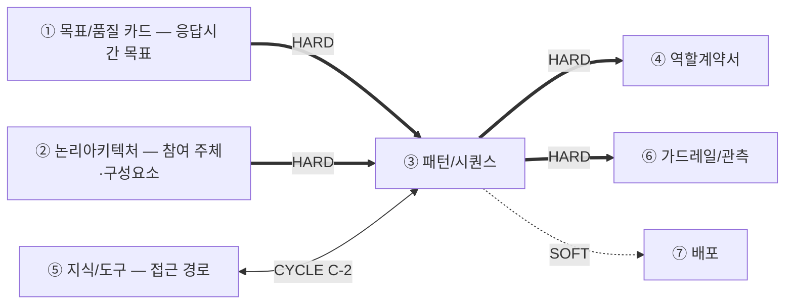
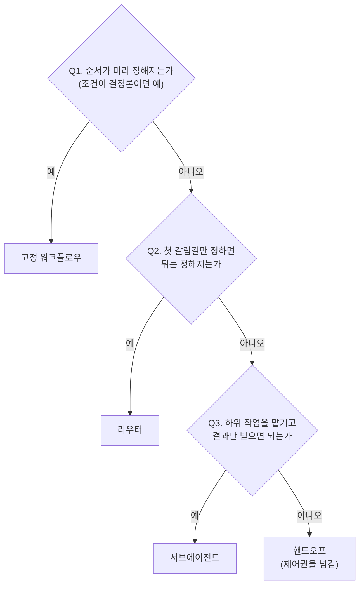

# 설계서 ③ 패턴/시퀀스 — 작성 가이드

## 1. 이 설계서가 답하는 질문

**"누가 어떤 순서로 움직이고, 실패하면 무엇을 하는가"를 못 박는 문서입니다.**

`타임아웃 값의 단일 출처는 본 산출물임` — 머리말에 그대로 둡니다.

**이걸 안 하면 나는 사고 3줄**

- 재시도가 겹쳐 외부 시스템에 호출이 몇 배로 쏟아짐
- 상한 없는 재계획 루프로 요청이 안 끝나고 비용만 쌓임
- 동시에 도는 두 단계가 같은 값을 덮어써 결과가 사라짐

**앞뒤 연결도**

`HARD` 없으면 못 채움 — ③ 패턴/시퀀스는 HARD 유입이 ①②의 2건뿐이라 ② 논리아키텍처가 끝나면 바로 시작합니다.  
**흐름을 먼저 확정해야 그 단계를 누가 맡는지(④ 역할계약서)를 정할 수 있으므로 ③ 패턴/시퀀스가 ④ 역할계약서보다 앞입니다.**  
`CYCLE C-2` ⑤ 지식/도구와 서로 보고 한 번 되돌립니다.

---

## 2. 시작 전 판정

**참여 주체는 ② 논리아키텍처에서 가져옵니다.** ③ 패턴/시퀀스를 쓸 때 ④ 역할계약서는 아직 없으므로 담당자 이름을 지어내지 않고  
② 논리아키텍처의 구성요소·외부 서비스·저장소 이름을 그대로 씁니다. 그 단계를 누가 맡을지는 ④ 역할계약서가 뒤에서 정합니다.

### 2-1. 트리거부터 가름

시퀀스는 **시작 계기별로 따로 그립니다.** 섞으면 예산이 엉킵니다.

| 트리거 | 무엇인가 | 단계 식별자 | 예산 기준 |
|--------|---------|------------|----------|
| 동기 요청 | 사람이 눌러 기다림 | `S-R1` ~ | ① 목표/품질 카드의 응답시간 목표 |
| 스케줄 배치 | 정해진 주기에 자동 실행 | `S-B1` ~ | ① 목표/품질 카드의 배치 완료 목표 |
| 이벤트 | 앞 단계 완료 신호로 시작 | `S-E1` ~ | 전달 지연 목표 |

### 2-2. 패턴 선택 — 결정 트리

**기본값은 고정 순서입니다.** 모델이 순서를 고르게 하는 것은 필요할 때만 합니다.

후보 5종은 A02에서 가져옵니다 — 고정 워크플로우·라우터·서브에이전트·핸드오프·스킬.  
**패턴과 프레임워크를 섞지 않습니다.** 표에는 패턴만 올립니다.

---

## 3. 설계항목 작성법

각 칸 첫 줄은 규격임 — **형태**(값의 모양) · **비면**(빈칸에 적을 값) ·  
**주인**(값을 가진 다른 산출물. 없으면 생략) · **대조**(다 채운 뒤 맞출 것).  
그 아래 대시 불렛이 채우는 요령임.

| 설계항목 | 무엇을 적나 | 어디서 가져오나 | 예시 |
|----|------------|----------------|---------|
| 패턴 비교 표 | **형태** 후보 3개 이상 + 최종 선택 1개 · **대조** 2-2 결정 트리 결론과 같은지(패턴만, 프레임워크 제외) - 후보를 3개 이상 씀 - 후보마다 장단점을 적음 - 최종 선택 1개를 정함 | A02 5종 · ① 목표/품질 카드의 품질속성 | 라우터 — 실패 유형 4종이라 분기 필요 |
| 시퀀스 단계 | **형태** 트리거별 `S-` 식별자 + 행동 1개 · **주인** 참여 주체는 ② 논리아키텍처(인용만) · **대조** 도식 단계 수와 같은지 - 단계 1개 = 행동 1개로 씀 - 참여자에 ② 논리아키텍처의 저장소도 넣음 - 비동기 경로는 담당자를 직접 부르지 않고 저장소를 거침 | **② 논리아키텍처의 구성요소·저장소**(참여 주체) · PR To-Be · US 시나리오 | `S-R4` 3계층 검증 → 종료 `통과/실패계층` |
| 단계 간 데이터 형식 | **형태** `보내는 S- → 받는 S-` + 키 집합 식별자 · **주인** 키 이름은 ④ 역할계약서(G-12) · **대조** 시퀀스 단계 식별자와 짝 - 보내는 곳과 받는 곳을 적음 - 전달하는 키 묶음의 이름(식별자)만 적음 - 실제 키 이름은 ④ 역할계약서가 나중에 채움 | US `[처리 결과] 성공 시` · `[입력 요구사항]`(④ 역할계약서는 아직 없음) | `S-R4 → S-R5 · 검증결과 집합` |
| 상태 스키마 | **형태** `필드 이름: 타입` + 갱신 주체 1개 · **대조** 병렬 필드가 누적인지 · 3출처(A03) 중 `State`인지 - 필드 이름과 타입을 적음 - 필드마다 갱신 주체를 1개만 정함 | 단계 간에 흐르는 입력 키(④ 역할계약서의 `공유` 표시는 뒤에 붙음) | `error_history: list` / 주체 1개 / 누적 |
| 출력 스키마 | **형태** `키 이름: 타입` + 필수 여부 · **대조** US `[처리 결과] 성공 시` 항목과 하나씩 - 최종 결과 값을 적음 - 근거가 되는 필드를 함께 적음 | US `[처리 결과] 성공 시` | `items[].evidence: list` 필수 |
| 타임아웃·재시도 | **형태** 3열 모두 `숫자+초`, 마감선 1개는 출처와 함께 · **비면** `[확인필요]` · **대조** 아래 `대조 2줄` 행이 검증 - 열 3개를 씀 — `p95 배정값`·`타임아웃(상한)`·`초과 시 처리` - **표 머리에 트리거의 `응답 마감선`(하드 상한) 1줄을 먼저 적음** — 단계별 열이 아니라 시퀀스당 1개임 - 이 행이 만드는 상한은 `시간`임 - 최악값 계산법 — `타임아웃 × (1 + 재시도 횟수)`. 여러 단계를 더할 때는 직렬은 더하고, 병렬은 가장 큰 값 1개만 씀 - `초과 시 처리`는 기본값 1줄만 먼저 정하고, 다른 값이 필요한 단계에만 따로 적음 | ① 목표/품질 카드의 목표값 · US NFR **성능+확장성** · **모델 문서**(사고 기본값·요금 — 확인일 기재) · 처리 3종은 아래 `상한 초과 처리` 행 · `응답 마감선`은 아래 「응답 마감선」 문단의 트리거별 출처 | 마감선 30초(API 게이트웨이 설정) · p95 4초 / 상한 10초 · 재시도 2회 · 최악값 30초 · 초과 시 처리 **`부분 결과로 계속`**(텍스트 목록 폴백 · UFR-FAC-010) |
| **반복 상한 `max_iter`** | **형태** `max_iter` 숫자 + 출처 ID · **비면** `[확인필요]`(비용 상한 표시 붙임) · **대조** 루프 수와 표 수가 같은지 - 루프마다 표 하나에 3열을 씀 — `max_iter`·`반복 1회의 비용 증분`·`초과 시 처리` - 이 행이 만드는 상한은 2개 — `반복`(횟수)과 `비용`(증분이 0이 아닐 때) - 비용 계산법 — `요청당 호출 수 = 1 + (max_iter × 증분)` - 증분이 0이 아닌데 값이 없으면 `[확인필요]`로 적고 비용 상한 표시를 붙임 | 루프마다 상한을 US에서 인용 · 처리 3종은 아래 `상한 초과 처리` 행 | `max_iter = 3`(US:UFR-RCV-020) · 증분 모델 호출 1건 → 요청당 최대 4건 · 초과 시 처리 **`사람 확인`**(US:UFR-RCV-030) |
| **상한 초과 처리**(3종 공통 판정) | **형태** 3값 중 1개(부분 결과로 계속·사람 확인·안전 종료) · **비면** `안전 종료`(①②가 둘 다 아닐 때) · **대조** 상한 3유형마다 1개씩 - 위 두 행의 `초과 시 처리` 칸에 넣을 값을 여기서 정함 — 상한을 넘으면 갈 곳(착지 노드)을 3개 중 1개로 고름 - ① 부분 결과로 계속 — 품질을 낮춘 답을 줌(별칭 `폴백`). 낮춘 이유를 적는 필드가 있어야 함 - ② 사람 확인 — 사람에게 넘김 · ③ 안전 종료 — 멈추고 안내함 - `폴백`은 ①만 가리키는 말이라 3종 전체를 부르는 이름으로 쓰지 않음 - 판정 순서와 성립 조건 2가지는 아래 문단을 따름 | **상한을 만드는 행은 위 `타임아웃·재시도`(`시간`)와 `반복 상한 max_iter`(`반복`·`비용`) 2개뿐임** · US `[처리 결과] 실패 시` | `시간` 초과 → ① 캐시된 이전 추천을 표시(무거운 3단계가 빠져 예산 안으로 들어옴) · `반복` 소진 → ② 사람 확인 |
| **대조 2줄**(목표치·최악값) | **형태** `합계 ≤ 기준` 2줄 + 통과/위반 · **주인** `총 예산`은 ① 목표/품질 카드(인용만) · **대조** 위 두 행 값만 씀 - 두 줄이 **각각 다른 기준**을 씀 — 목표치는 `총 예산`(우리가 한 약속), 최악값은 `응답 마감선`(넘으면 연결이 끊기는 한계) - 목표치 방식 — `p95 합계 ≤ 총 예산`(큐잉 포함, 재시도 제외) · **반드시 통과** - 최악값 방식 — `최악값 합계 ≤ 응답 마감선 − 착지 경로 시간` · **반드시 통과**(`총 예산`은 넘어도 되며, 그때 `시간` 상한의 `초과 시 처리`가 반드시 있어야 함) - `응답 마감선`은 지어내지 않고 트리거별 출처에서 가져옴(아래 「응답 마감선」 문단) - 이 행은 새 상한을 만들지 않고 위 두 행의 값을 검증만 함 | 위 `타임아웃·재시도` 행의 3열과 표 머리의 `응답 마감선` · ① 목표/품질 카드의 예산 | p95 합계 1.7초 ≤ 총 예산 2초 통과(큐잉 0.4초 포함) / 최악값 34초 > 마감선 30초 − 착지 0.3초 = 29.7초 **위반** → 재시도 2회를 1회로 낮춰 24초로 통과 |
| **부하 조건**(5번째) | **형태** 3열 숫자 + 판정 1줄 · **주인** 동시 수는 ① 목표/품질 카드(인용만) · **대조** 곱을 자원 상한과 비교 - 열 3개를 씀 — `동시 사용자 수`·`요청당 점유 시간`·`자원 상한`(커넥션 풀) - 판정식 — `동시 수 × 점유 비율 ≤ 상한` - 넘으면 `통과`라고 적지 않음 | ① 목표/품질 카드의 `(피크 포함)` · US NFR 확장성 | 3열을 채우고 곱을 풀 상한과 대조해 판정 1줄 |
| **재개 경계**(6번째) | **형태** 4열 — 단위 이름·`S-` 식별자·있음/없음·키 이름 · **비면** 동기는 `재개 안 함` · **대조** 트리거 수와 같은지 - 실행이 끊긴 뒤 다시 들어갈 자리를 정함 - 열 4개를 씀 — `재개 단위`·`경계 단계`(`S-` 식별자)·`재실행 부작용`(있음/없음)·`중복 방지 키` - 재개 단위 — 다시 실행할 때 기준으로 삼을 1건을 정함(예: 회원 1명, 실행 1회) - 경계 단계 — 여기까지는 끝난 것으로 인정하는 단계를 정함 - 부작용이 있는데 중복 방지 키가 비어 있으면 `통과`라고 적지 않음 | 위 `상한 초과 처리` 행 · ② 논리아키텍처의 저장소 목록 · US `[처리 결과] 실패 시` | 재개 단위 `회원 1명` · 경계 `S-B4` 적재 후 · 부작용 있음 · 키 `회원+날짜` |

**상한 초과 처리 3종 판정 — 위에서부터 묻고 처음 `예`에서 멈춥니다.** `시간`·`반복`·`비용` 3유형에 **같은 순서**를 씁니다.  
유형만 늘리면 아무거나 골라 담기 때문에 순서를 고정합니다.

① **품질을 낮춘 답이 그래도 쓸모가 있고, 낮췄음을 표시할 수 있나** → `부분 결과로 계속`.  
낮춘 사유 필드(예: `fallback_reason`)와 **그 경로의 시간·비용 배정**이 함께 있어야 합니다 — 없으면 폴백 최악값이 0으로 잡힙니다.  
② **사람이 판단해야 하고 기다릴 수 있나**(되돌릴 수 없는 작업·승인 필요·배치·이벤트) → `사람 확인`.  
동기 요청이면 사람을 기다리게 두지 않고 **확인 대기 상태만 남기고 응답을 닫습니다**(위 「재개 단위」와 같은 판정).  
③ 둘 다 아니면 `안전 종료`. **틀린 답이 답 없음보다 나쁜 자리**가 여기입니다 — 후보가 0건인데 추천을 지어내는 경우.

**착지 노드가 성립하려면 2가지가 더 필요합니다.** ⓐ 착지는 상한을 **넘긴 뒤**가 아니라 **닿기 전 마지막 여유**에서  
들어가는 분기입니다 — 넘겨서 실행이 끊기면 착지 노드를 적어 두어도 못 들어갑니다. ⓑ **착지 경로가 상한을 다시 쓰면  
착지가 아닙니다** — 폴백이 또 타임아웃을 소진하거나(`시간`) 모델을 다시 부르는(`비용`) 경우입니다.  
착지의 시간·비용이 예산 안이라는 것을 1줄로 적습니다.

**응답 마감선 — 지어내지 않고 가져옵니다.** `총 예산`은 약속이라 넘기면 느린 서비스가 되지만, 마감선을 넘기면  
**바깥에서 연결을 먼저 끊어 착지 노드가 실행조차 안 됩니다** — 위 ⓐ를 실제로 검증하는 값이 이것입니다.  
트리거별 출처 — 동기 요청은 API 게이트웨이·로드밸런서·클라이언트 타임아웃 중 **가장 짧은 값**,  
배치는 실행 창(예: 새벽 2 ~ 4시 = 120분), 이벤트는 메시지 가시성 타임아웃·리스 기간(넘으면 다른 소비자가 같은 건을 또 집어감).  
확인 못 했으면 `[확인필요]`로 남기고 되묻습니다. **`반복`·`비용`은 이미 하드 상한을 가짐** — `max_iter`와  
`요청당 호출 수 상한`이 그 역할이라 마감선이 비어 있던 것은 `시간` 유형뿐입니다.  
마감선은 "잘리지 않는 한계"일 뿐 좋은 경험선이 아니므로, 실제 착지 진입은 사용자가 떠나기 시작하는 지점(예: 8초)으로  
당겨 잡는 것이 보통입니다.

**단계별 합산 대신 마감 시각 1개**(권장). 단계를 늘릴 때마다 최악값을 다시 더하는 대신, 진입 노드가  
`deadline_at`(마감 시각) 1개를 상태에 넣고 각 단계가 시작 전에 남은 시간을 봅니다 —  
`남은 시간 < (이 단계 최소 소요 + 착지 경로 시간)`이면 즉시 착지로 갑니다.  
단계가 몇 개든 마감선을 구조적으로 못 넘고 ⓐ가 자동으로 성립합니다. 이 필드의 갱신 주체는 **진입 노드 1개**이며 이후 불변입니다.

**재개 단위 — 트리거마다 다릅니다.** 동기 요청은 사람이 기다리므로 **재개하지 않고 재시도로 끝냅니다**(그 판정도 1줄 적습니다).  
배치·이벤트는 재개 단위를 1개 고릅니다 — `실행 1회` 또는 `대상 1건`. 잘게 잡으면 다시 도는 양이 줄고 저장 횟수가 늘어납니다.  
**중간 저장은 단계 경계에서만 일어납니다.** 시작했다가 못 끝낸 단계는 재개 때 **다시 실행되므로**, 그 단계가 밖을 바꾸면(적재·발송·결제)  
중복 방지 키가 필수입니다. 이 항목은 **"어떤 값이 어디 있나"**(상태 스키마·상태 3출처, 공간 축)와 다른  
**"어디까지 진행됐고 끊기면 어디부터 다시 하나"**(시간 축)를 다룹니다 — 겹치지 않습니다.

**상태 필드 소유권** — 위 `상태 스키마` 행에 함께 적습니다.  
갱신 기본이 덮어쓰기라 병렬 두 단계가 같은 필드를 쓰면 하나가 사라집니다.  
대책 — 필드마다 주체 **1개**, 병렬 구간은 **누적만** 씁니다.

**재시도 중첩 — 실제 사례.** KT 자료에 두 계층이 있습니다. DLQ(처리 못 한 건을 모아 두는 대기열)  
적재 **전** 소비자 재처리 5회(US:NFR-SYS-060), 적재 **후** 자동 재시도 3회(ES:08).  
충돌이 아니라 계층이 다르며 합치면 한 건이 **최대 15회** 처리됩니다.  
대책 — 계층마다 이름을 나눠 적습니다(`소비자 재처리`·`DLQ 재시도`). ③ 패턴/시퀀스는 예산·상한만 다룹니다.

**곱하나 더하나.** 같은 호출을 다시 하면 **곱합니다**(×(1+재시도)). 다른 경로로 가면  
앞 단계 타임아웃을 소진한 뒤 그 경로 시간을 **더합니다**(+).  
**대체 경로에도 시간을 배정합니다** — 없으면 폴백 최악값이 0으로 잡힙니다.

**상태 3출처**(A03) — 요청마다 바뀌면 `Runtime Context`, 단계 간은 `State`, 세션 넘기면 `Store`.  
**단계 간에 흐르는 입력 키가 `State` 1순위 후보**입니다. ④ 역할계약서의 `공유` 표시는 뒤에 붙으므로 기다리지 않습니다.

**키 이름 소유자 — ③ 패턴/시퀀스는 `키 집합 식별자`만, ④ 역할계약서가 `키 이름`을 가짐.** ③ 패턴/시퀀스가 ④ 역할계약서보다 먼저 쓰므로 이름을 가질 수  
없고 흐름의 단위만 확정하며, 이름은 담당자 계약의 일부라 ④ 역할계약서 소유임(G-12 유지). 어긋나면 ③ 패턴/시퀀스에 `변경요청` 1행.

**G-4 경로** — 타임아웃은 ③ 패턴/시퀀스 소유. ⑥ 가드레일/관측에서 안 맞아도 ③ 패턴/시퀀스의 `변경요청` 표에 1행을 남깁니다.  
**⑥ 가드레일/관측이 가드레일을 걸 단계가 ③ 패턴/시퀀스에 없으면 트리거 추가 요청**도 이 경로입니다.

**G-5 경계** — 재시도·폴백·타임아웃 통합 확인의 주인은 ③ 패턴/시퀀스입니다.  
④ 역할계약서는 "무엇을 보면 멈추나"까지만, ⑥ 가드레일/관측은 결과를 관측 항목으로 검증만 합니다.

**G-6 경계** — ③ 패턴/시퀀스는 재개 경계·중복 방지까지만 정합니다.  
저장 방식·체크포인트 API·백엔드(DB/파일 등) 선택은 구현 단계(⑦ 배포와 함께) 소관이며 ③는 지정하지 않습니다.

---

## 4. 제출 전 자가 점검표

- [ ] `타임아웃 값의 단일 출처는 본 산출물임`이 **1건 이상** 있음
- [ ] `sequenceDiagram` 블록이 트리거 종류 수만큼 있음
- [ ] 시퀀스 단계 표 행 수와 도식 단계 수가 **같음**
- [ ] 사전 조건 확인 단계가 **1행 이상**이고 실패 분기가 표기됨
- [ ] 단계 행마다 타임아웃 값이 있거나 `[확인필요]`로 되물어짐(빈 칸 0건)
- [ ] 트리거마다 **`응답 마감선`이 출처와 함께 1건** 있음(게이트웨이·클라이언트 타임아웃·실행 창·가시성 타임아웃 중 1개) — 지어낸 값 0건
- [ ] **`p95 합계`는 `총 예산`과, `최악값 합계`는 `응답 마감선 − 착지 경로 시간`과 대조**돼 있고, `총 예산` 초과 시 `시간` 상한의 `초과 시 처리`가 채워짐
- [ ] **상한마다 `초과 시 처리` 공란 0건**(`시간`·`반복`·`비용`)이고 3종 중 1개이며, `max_iter`는 값 또는 `[확인필요]`
- [ ] `부분 결과로 계속`에 **낮춘 사유 필드**가 있고, 그 처리 경로의 시간·비용이 예산 안임이 1줄로 적혀 있음
- [ ] **부하 조건** 판정(`동시 수 × 점유 비율 ≤ 상한`)이 있음
- [ ] 트리거마다 **재개 단위·경계 단계**가 1건 이상이고, 부작용 있는 단계에 **중복 방지 키** 공란 0건임
- [ ] 상태 필드마다 갱신 주체 **1개**이고 병렬 필드는 누적임
- [ ] 단계 간 데이터 형식에 보내는 곳·받는 곳·**키 집합 식별자**가 있고 키 이름을 지어낸 칸 **0건**임
- [ ] 근거 출처 필수 3개 표의 공란 **0건**임

---

## 5. 다음으로 넘기는 값과 근거 자료

**후행 소비처**

| 넘기는 값 | 받는 곳 | 강도 | 안 넘기면 |
|----------|--------|------|----------|
| 시퀀스 단계 목록 · 단계 간 키 집합 식별자 | ④ 역할계약서의 책임 묶기·입출력 형식 | HARD | ④ 역할계약서가 단계를 묶을 바탕이 없음 |
| 시퀀스 단계 이름·개수 | ⑥ 가드레일/관측의 오버레이 | HARD | ⑥ 가드레일/관측이 그릴 바탕 없음 |
| 타임아웃·재시도 값 | ⑥ 가드레일/관측의 단계별 상한 | HARD(소유 ③ 패턴/시퀀스) | 두 문서 값이 갈라짐 |
| 최종 출력 형식 | ⑦ 배포의 프론트·API 분리 | SOFT | 분리 판단 지연 |
| 커넥터 규격·기대 호출 순서 | ⑤ 지식/도구의 커넥터 목록 | CYCLE C-2 | 검색과 어긋남 |

**근거 자료**

| 아티클 | 거는 칸 |
|--------|--------|
| [A02](../references/articles/A02_doc_langchain-multi-agent.md) | 2절 패턴 후보 5종 · 3절 비교 표 |
| [A03](../references/articles/A03_doc_langchain-context-eng.md) | 3절 상태 3출처 판정 |
