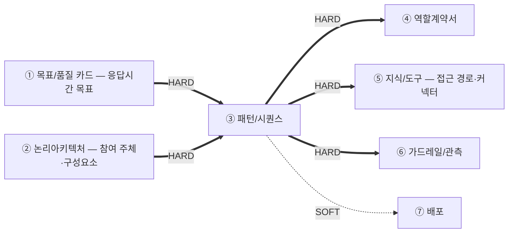
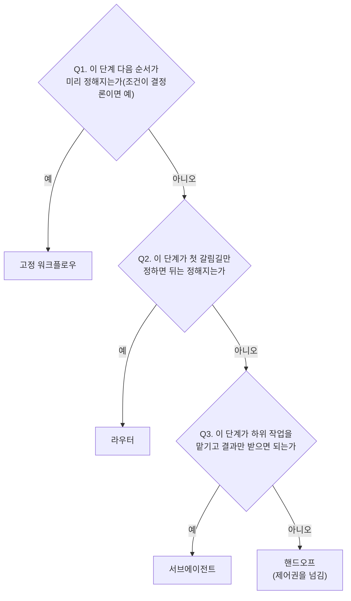

# 설계서 ③ 패턴/시퀀스 — 작성 가이드

## 1. 이 설계서가 답하는 질문

**"누가 어떤 순서로 움직이고, 실패하면 무엇을 하는가"를 못 박는 문서입니다.**

`타임아웃 값의 단일 출처는 본 산출물임` — 머리말에 그대로 둡니다.

**이걸 안 하면 나는 사고 3줄**

- 재시도가 겹쳐 외부 시스템에 호출이 몇 배로 쏟아짐
- 상한 없는 재계획 루프로 요청이 안 끝나고 비용만 쌓임
- 동시에 도는 두 단계가 같은 값을 덮어써 결과가 사라짐

**앞뒤 연결도**



`HARD` 없으면 못 채움 — ③ 패턴/시퀀스는 HARD 유입이 ①②의 2건뿐이라 ② 논리아키텍처가 끝나면 바로 시작합니다.  
**흐름을 먼저 확정해야 그 단계를 누가 맡는지(④ 역할계약서)를 정할 수 있으므로 ③ 패턴/시퀀스가 ④ 역할계약서보다 앞입니다.**  
사전 승인·진행 중 중단·사후 재정의 지점(2-3절)은 **④ 역할계약서가 담당자(사람)를 배정하는 자리**입니다.

**뒤 산출물과 순환하지 않습니다 — 내보내기만 합니다.**  
④⑤⑥은 여기서 정한 값을 인용하고, 어긋나는 것이 나오면 고치지 않고 **`변경요청` 1행**을 되돌려 보냅니다.
그래서 ③ 패턴/시퀀스는 ①② 두 건만 있으면 **끝까지 쓰고 닫을 수 있습니다.**

---

## 2. 시작 전 판정

**참여 주체는 ② 논리아키텍처에서 가져옵니다.** ③ 패턴/시퀀스를 쓸 때 ④ 역할계약서는 아직 없으므로 담당자 이름을 지어내지 않고  
② 논리아키텍처의 구성요소·외부 서비스·저장소 이름을 그대로 씁니다.
**단계를 몇 명의 담당자로 묶고 각자 어디까지 손대는지는 ④ 역할계약서가 뒤에서 정합니다** —
다만 그 단계가 모델을 쓰는가(2-4)와 사람이 개입하는가(2-3)는 예산 계산에 필요하므로 이 문서가 정합니다.

### 2-1. 트리거부터 가름

시퀀스는 **시작 트리거별로 따로 그립니다.** 섞으면 예산이 엉킵니다.

| 트리거 | 무엇인가 | 단계 식별자 | 예산 기준 |
|--------|---------|------------|----------|
| 동기 요청 | 사람이 눌러 기다림 | `S-R1` ~ | ① 목표/품질 카드의 응답시간 목표 |
| 스케줄 배치 | 정해진 주기에 자동 실행 | `S-B1` ~ | ① 목표/품질 카드의 배치 완료 목표 |
| 이벤트 | 앞 단계 완료 신호로 시작 | `S-E1` ~ | 전달 지연 목표 |

스케줄 배치·이벤트도 표 형식과 계산법은 동기 요청과 같습니다. 단계 식별자 접두사만 `S-B`·`S-E`로 바꾸고,
예산 기준은 위 표에서 그 트리거 줄을 그대로 씁니다.

### 2-2. 패턴 선택 — 결정 트리

**워크플로우 전체가 아니라 단계마다 묻습니다** — 2-3·2-4와 같은 층위입니다. 한 워크플로우 안에
고정 구간과 갈림길·위임 구간이 섞여 있을 수 있으므로, 패턴은 워크플로우의 라벨 1개가 아니라
**단계별 판정의 조합**으로 남습니다. **기본값은 고정 워크플로우입니다.** 모델이 다음 단계를
고르게 하는 것은 필요할 때만 합니다.



후보 4종: 고정 워크플로우·라우터·서브에이전트·핸드오프.
**패턴과 프레임워크를 섞지 않습니다.** 표에는 패턴만 올립니다.

**패턴마다 뒤 설계에 실제로 미치는 영향이 다릅니다** — 판정만 하고 끝나지 않습니다.

| 패턴 | 시퀀스·예산 설계에 미치는 영향 |
|------|------------------------------|
| 고정 워크플로우 | 직렬·병렬만 있음. 최악값은 그대로 합산(병렬은 최댓값만) |
| 라우터 | 이 단계 뒤가 **택일 분기**임 — 시퀀스 도식에 `alt` 블록으로 그리고, 최악값은 병렬처럼 더하지 않고 **가장 비싼 분기 하나만** 총 시간예산과 대조함 |
| 서브에이전트 | 위임한 하위 작업의 내부 단계는 이 표에 안 담고 **별도 워크플로우**로 뗌(워크플로우 표에 행 1개 추가). 위임 단계의 최악값·모델 호출 횟수는 그 하위 워크플로우 값을 **롤업**해서 적음 |
| 핸드오프 | 제어권이 넘어간 뒤는 이 워크플로우 소관이 아님 — **최악값 합계·총 시간예산 대조를 핸드오프 단계에서 끊음**. 그 뒤는 받는 쪽의 워크플로우가 따로 다룸 |

### 2-3. 인간 개입 판정

**되돌릴 수 없는 쓰기 단계부터 봅니다.** 그 단계에 인간 개입 수단이 있는지 아래 3가지 시점으로 나눠 정합니다.

| 시점 | 무엇인가 | 기본값 |
|------|---------|--------|
| 사전(승인 전 정지) | 진행 전에 사람이 승인해야 다음 단계로 넘어감 | 되돌릴 수 없는 쓰기는 **필수** |
| 진행 중(강제 중단) | 실행 중인 단계를 외부 신호로 즉시 멈춤(Kill switch) | 고위험 AI로 판정되면 **필수** |
| 사후(결과 재정의) | 이미 나온 산출값을 사람이 무시·수정함(Override) | 고위험 AI로 판정되면 **필수** |

**고위험 AI 여부는 여기서 정하지 않습니다.** ① 목표/품질 카드의 성격 선언을 그대로 인용합니다.
`[확인필요]`면 사전(승인 전 정지)만 기본값으로 두고 나머지는 되묻습니다.

사전 승인은 흐름이 그 지점에서 멈춰 사람을 기다리는 지점이고, 진행 중 중단·사후 재정의는
**자율로 도는 단계에도 걸리는 별도 채널**입니다 — 자율성이 높을수록 오히려 더 필요합니다.

### 2-4. 모델 호출 판정 — 이 단계가 모델을 쓰는가

**단계마다 아래 3개를 던져 하나라도 "예"면 모델을 쓰는 단계, 전부 "아니오"면 결정론적 단계(`0회`)입니다.**

| 판단기준 | "예"로 판정하는 기준 | 예 |
|------|--------------------|-----|
| L1 규칙 완결성 | 입력 → 출력 매핑을 표·조건문으로 전부 못 닫고, 새 예외가 계속 생김 | "이 문의가 환불 대상인가"는 예외가 계속 늘어 규칙표로 못 닫음 |
| L2 비정형 해석 | 입력이 자유 텍스트·이미지·음성이고, 그 의미(의도·요약·분류)를 해석해야 결과가 나옴 | 고객 문의 원문에서 불만 사유를 뽑아냄 |
| L3 재구성·종합 | 여러 출처를 종합하거나 근거를 들어 설명·제안을 새로 만들어야 함(단순 조회·계산이 아님) | 검증 실패 사유를 근거와 함께 서술 |

- **판단과 실행이 한 단계에 붙어 있으면 먼저 쪼갭니다** — "예약해도 되는가"(판단)와 "예약 확정 호출"(실행)은
  다른 단계입니다. **단계를 쪼갤 수 있는 것은 이 문서뿐이므로 여기서 갈라 둡니다** — ④ 역할계약서는
  단계ID를 새로 만들지 못해 나중에는 못 고칩니다
- `쓰기(되돌림 불가)` 실행 그 자체는 L1 ~ L3 결과와 무관하게 **항상 `0회`** 입니다.
  되돌릴 수 없는 실행에 판단이 섞이면 사람이 승인한 값과 실제 실행한 값이 어긋납니다
- 단말·프론트엔드 구간처럼 우리가 손대지 않는 단계도 `0회`입니다
- **어떤 모델을 쓰는지는 정하지 않습니다** — 모델명·사고 켬/끔은 ④ 역할계약서 몫입니다.
  이 절은 `0회`인가 `N회`인가만 가릅니다

---

## 3. 설계항목 작성법

**설계항목은 2개임** — `워크플로우 표`(전체 목록 1개) · `워크플로우별 설계`(워크플로우마다 1개).  
**이 제목 구조가 곧 산출물의 목차임** — 여기 없는 절을 산출물에 만들지 않고, 여기 있는 절을 빼지도 않음.

### 워크플로우 표
워크플로우명, 트리거 유형, 설명을 표 형태로 작성   

예시:

| 워크폴로우명 | 트리거 유형 | 설명 |
|-------------|-------------|-----------------------------------|
| 오늘의 추천조회 | 동기요청 | 사용자의 음식점 추천을 처리하는 워크폴로우 | 

### 워크플로우별 설계

**워크플로우마다 제목 1개를 두고 그 아래에 아래 4가지를 적음.**  
제목은 위 워크플로우 표에 적은 이름을 그대로 씀(`#### 오늘의 추천조회` 꼴).

**제목이 워크플로우를 가리키므로 표 안에는 단계ID만 적음** — 행마다 워크플로우명을 반복하지 않음.
워크플로우가 1개인 앱도 제목을 둠. 나중에 늘어날 때 구조가 안 바뀜.

각 워크플로우별 작성
- 총 시간예산
- Sequence: Sequence Diagram을 Mermaid script로 작성.  
  - 인간 개입이 있는 단계는 도식에도 `Note`로 그대로 표시함   
    시점(사전·진행 중·사후)을 `Note` 문구 앞에 적음  
    ```mermaid
    sequenceDiagram
      participant S as S-R5(예약 확정)
      participant H as 담당자(사람)
      S->>H: 승인 요청
      Note right of S: 사전 승인 필수, 대기 타임아웃 5분
      H-->>S: 승인
    ```
- 단계별 설계: Sequence Diagram 하위에 각 단계별 참여 주체, 행동, p95 타임아웃, 타임아웃(상한), 재시도 횟수, 최악값, 초과 시 처리, 인간 개입, 모델 호출을 표형태로 작성  
  - p95 타입아웃: 는 100번 중 95번이 그 안에 드는 값
  - 최악값: 타임아웃(상한) × (1+재시도 횟수)
  - 재시도가 두 층 이상 겹치면(예: 단계 자체 재시도 × 상위 재계획 노드의 재시도) 층마다
    시도 횟수(1+재시도 횟수)를 구해 곱함. 예: 단계 재시도 2회(시도 3회) × 상위 재계획 재시도 1회
    (시도 2회) = 최대 6회 호출
  - 되돌아가는 화살표가 있는 단계(루프)는 반복 상한(`max_iter`)과, 상한 소진 시 갈 곳(착지 노드)을
    표 아래 1줄로 적음. 루프가 없는 워크플로우는 생략함
  - 최악값 합계 대조: 직렬 단계는 최악값을 더하고, 병렬로 묶인 단계는 그중 가장 큰 값만 더해서
    **총 시간예산**과 대조함. p95 합계는 같은 방식으로 **응답시간 목표**와 따로 대조함
    (성공 경로만 더한 값으로 최악값 대조를 대신하지 않음)
  - 초과 시 처리 열: **위에서부터 물어 처음 `예`에서 멈춤.** `시간`·`반복` 두 상한에 **같은 순서**를 씀

    | # | 질문 | 예면 |
    |---|------|------|
    | 1 | 이미 얻은 것만으로 답이 되나 | `부분 결과로 계속` — 무엇이 빠졌는지 응답에 밝힘 |
    | 2 | 더 싼 대체 경로가 있나 | `대체 경로로 계속` — 그 경로에도 시간을 배정함 |
    | 3 | 둘 다 아니오 | `안전 종료` — 사용자에게 실패와 다음 행동을 알림 |

    - **아래 줄을 먼저 고르지 않음** — 답할 수 있는데 종료하면 쓸 수 있는 결과를 버림
    - `안전 종료`를 고른 단계는 **사용자에게 무엇을 보여줄지** 1줄 함께 적음
    - **비용 상한은 이 순서에 없음** — 금액은 ⑥ 가드레일/관측이 가지므로 초과 처리도 거기서 정함.
      비용은 단계 경계가 아니라 **누적 금액이 닿는 순간** 판정하므로 축이 다름
  - 인간 개입 열: 2-3에서 정한 3가지 중 그 단계에 해당하는 것만 적음(해당 없으면 `—`).
    적은 값은 시퀀스 도식에도 같은 문구로 `Note`를 붙여 표시함
    - 사전 — `사전 승인, 대기 타임아웃 [값], 초과 시 에스컬레이션`
    - 진행 중 — `중단 가능, 중단 시 재실행 부작용 [값]`(재개 방안의 재실행 부작용과 같은 방식으로 적음)
    - 사후 — `재정의 가능, 재정의 값은 State {필드}의 쓰는 주체로 사람을 추가함`
  - 모델 호출 열: **2-4에서 모델을 쓴다고 판정한 단계만** 최악의 경우 몇 번 부르는지 적음.
    2-4에서 전부 "아니오"인 결정론적 단계는 `0회`. 모델을 부르는 단계가 하나도 없으면 이 열을 통째로 생략함
    - **이 열이 ④ 역할계약서의 담당자 종류를 정함** — `N회`면 LLM 담당자, `0회`면 결정론적 담당자로 갈림.
      ④ 역할계약서는 이 열을 읽기만 하고 다시 판정하지 않음
    - 최악 호출 = (1+재시도 횟수) × (1+`max_iter`) — 루프 안이면 반복 상한까지 곱함
    - **비용 합계는 병렬 구간도 전부 더함**(시간 합계는 병렬을 최댓값만 더하지만,
      동시에 돌아도 토큰은 각각 씀). `부분 결과로 계속`인 단계도 이미 쓴 토큰은 셈
    - 이 문서는 **횟수까지만** 소유함. 어느 단계가 어떤 모델을 쓰는지는 ④ 역할계약서가,
      단가를 곱한 금액과 비용 상한은 ⑥ 가드레일/관측이 정함 — 타임아웃과 같은 구조임(값은 여기가 갖고 ⑥은 인용만)
  - 패턴 열: 2-2에서 그 단계에 판정한 패턴을 적음(기본값 `고정 워크플로우`이면 생략 가능).
    **모든 단계가 고정 워크플로우면 이 열을 통째로 생략**하고 본문에 한 줄로 밝힘(모델 호출 열과
    같은 생략 규칙). 라우터·서브에이전트·핸드오프가 하나라도 있으면 열을 만들어 **그 단계에만**
    표시하고 나머지는 `고정 워크플로우`로 채움
    - 라우터 단계는 Sequence 도식에 `alt` 블록을 두고, 최악값 대조에서 갈라진 분기 중
      **가장 비싼 분기 하나만** 합계에 넣음(나머지 분기는 실행되지 않으므로 더하지 않음)
    - 서브에이전트 단계는 위임받는 하위 작업을 **워크플로우 표에 별도 행으로** 추가하고,
      이 단계의 최악값·모델 호출 횟수는 그 하위 워크플로우 값을 롤업해 적음
    - 핸드오프 단계는 **그 단계에서 최악값 합계·총 시간예산 대조를 끊음** — 제어권을 받은 쪽의
      워크플로우가 그 뒤를 따로 다룸
  
- State구조: 노드 간 공유할 State 구조 정의. 필드마다 값을 쓰는 단계를 1개만 정함.
  두 단계가 동시에 도는 구간에서 같은 필드를 쓰면 덮어쓰지 않고 누적(예: 리스트에 추가)하는
  방식으로 적음. 사후 재정의(위 인간 개입 표시)가 있는 필드는 사람도 쓰는 주체로 함께 적음
  - **State 필드 이름의 단일 출처는 본 산출물임** — ④ 역할계약서·⑤ 지식/도구는 이 이름을
    그대로 베껴 씀. 이름이 없으면 `필드당 갱신 주체 1개`를 쓸 수 없으므로 여기서 붙임
  - State는 **워크플로우가 끝날 때까지 남는 값**임. 두 단계 사이에서만 건네고 마는 값은
    아래 `단계 간 전달 집합`에 적음

- 단계 간 전달 집합: 앞 단계가 뒤 단계로 건네는 값 묶음을 `K-1` ~ 로 번호 붙여 정의  
  - 묶음마다 `보내는 단계 → 받는 단계`와 이름을 적음. **담당자가 아니라 단계로 가름** —
    담당자 묶음이 바뀌어도 이 값은 안 변하지만 흐름이 바뀌면 반드시 변하기 때문임
  - 묶음 안의 **키마다 `이름 · 타입 · 필수/선택`** 3값을 적음. `선택`은 없어도 진행되는 키임
  - **키 이름의 단일 출처는 본 산출물임** — ④ 역할계약서는 어느 묶음을 받고 내놓는지
    인용만 하고, 여기서 안 정한 키를 새로 만들지 않음
  - State 필드에 담기는 묶음이면 **어느 필드에 담기는지** 함께 적음.
    State에 안 담기고 두 단계 사이에서만 쓰이면 `상태 필드 아님`이라고 적음
  - **밖으로 나가는 묶음도 우리 이름으로 적음.** 외부 시스템에 그대로 실려 나가면
    `외부로 나감` 표시만 붙임 — 외부 규격 이름으로 맞춰 주는 매핑은 ⑤ 지식/도구가 만듦.
    여기서 외부 이름을 알아보려고 ⑤를 기다리지 않음

  예시:

  | 집합 | 보내는 단계 → 받는 단계 | 키(이름 · 타입 · 필수/선택) | 담기는 State 필드 |
  |------|----------------------|--------------------------|-----------------|
  | `K-6` | `S-R10` → `S-R11` | `context_tags` list 필수 · `weather_temp_c` float 선택 · `excluded_ingredient_codes` list 필수 | `context_bundle` |
  | `K-12` | `S-B6` → `S-B7` | `quality_passed` bool 필수 | 상태 필드 아님 |
- 재개 방안: 동기요청은 재개하지 않음. 스케쥴배치와 이벤트 워크플로우에 한해 기술
  - 재개단위: 재처리의 단위
  - 경계 단계: 이 단계 이후에 재실행
  - 재실행 부작용: 재실행 부작용
  - 중복 방지 키: 중복 방지를 위한 키 

<예시>  
#### 오늘의 추천조회
총 시간예산: 5000ms
1. Sequence  
{Sequence Diagram 표시}

2. 단계별 설계

  | 단계 | 참여 주체 | 행동 1개 | p95 배정 | 타임아웃(상한) | 재시도 | 최악값 | 초과 시 처리 | 인간 개입 | 모델 호출 |
  |------|----------|---------|---------|--------------|-------|-------|------------|----------|----------|
  | `S-R1` | 사용자 → 프론트엔드 | 추천 요청 발생 | TB-1 단말 구간 · API 예산 밖 | 클라이언트 타임아웃 `[확인필요]` | 0회 | 예산 밖 | 안전 종료(재시도 안내) | — | 0회 |
  | `S-R2` | 프론트엔드 → 추천·이력 서비스 | 추천 요청 접수 · 마감 시각 산정 | 20ms | 50ms | 0회 | 50ms | 안전 종료 | — | 0회 |
  | `S-R3` | 추천·이력 서비스 → 회원 서비스 · S-1 | 동의·사전 조건 확인 | 60ms | 200ms | 1회 | 400ms | **안전 종료** — 위치 미확인 안내 + 수동 입력 경로 | — | 0회 |
  | `S-R4` | 추천·이력 서비스 → S-3 | 최근 7일 식사 이력 조회(병렬) | 300ms | 500ms | 1회 | 1,000ms | 부분 결과로 계속 — 이력 없이 계산 | — | 0회 |
  | `S-R5` | 추천·이력 서비스 → 추천 생성 | 추천 3개 · 이유 1줄 생성 | 800ms | 1,500ms | 1회 | 3,000ms | 안전 종료 — 규칙 기반 대체 추천 | — | 2회 |

  이 워크플로우엔 되돌릴 수 없는 쓰기가 없어 인간 개입 열이 전부 `—`임.
  (참고: `S-R6` 예약 확정처럼 되돌릴 수 없는 쓰기가 있다면 그 행에
  `사전 승인, 대기 타임아웃 5분, 초과 시 담당자 에스컬레이션`으로 적음)

  최악값 합계 = 50(S-R2) + 400(S-R3) + 1,000(S-R4, 병렬 구간 최댓값) + 3,000(S-R5) = 4,450ms  
  ≤ 총 시간예산 5,000ms → **통과**  
  p95 합계 = 20(S-R2) + 60(S-R3) + 300(S-R4) + 800(S-R5) = 1,180ms ≤ 응답시간 목표(① 목표/품질 카드 인용) → **통과**  
  (S-R1은 단말 구간이라 이 서버측 합계에서 제외함 — API 예산 밖으로 별도 관리)  
  최악 모델 호출 = 2회(S-R5) = **요청당 2회** — 병렬 구간이 있으면 최댓값이 아니라 전부 더함.
  단가를 곱한 금액은 ⑥ 가드레일/관측이 계산함

3. State 구조  
{노드간 공유 State 구조}

4. 재개 방안

  | 재개 단위 | 경계 단계 | 재실행 부작용 | 중복 방지 키(집합 식별자) |
  |----------|----------|-------------|----------------------|
  | 회원 1명 | `S-B7` 취향 벡터 커밋 후 | **있음** — `S-4` 벡터 쓰기 | `회원 + 대상 날짜` 조합 키 |

</예시>

---

## 4. 제출 전 자가 점검표

- [ ] `타임아웃 값의 단일 출처는 본 산출물임`이 **1건 이상** 있음
- [ ] 패턴이 워크플로우 전체가 아니라 **단계마다** 판정돼 있음 — 전부 고정 워크플로우면 본문에
      한 줄로 밝히고 열을 생략했고, 라우터·서브에이전트·핸드오프가 있으면 그 단계에 표시됨
- [ ] 라우터 단계마다 최악값 대조에 **가장 비싼 분기 하나만** 들어갔음(분기 합산 0건)
- [ ] 서브에이전트로 위임한 하위 작업마다 워크플로우 표에 별도 행이 있고, 위임 단계의 최악값·모델
      호출 횟수가 그 값을 롤업했음
- [ ] 핸드오프 단계가 있으면 그 단계에서 최악값 합계·총 시간예산 대조가 끊겨 있음(그 뒤를 이
      문서가 계속 계산한 행 0건)
- [ ] 병렬 구간에서 같은 State 필드를 두 단계가 동시에 갱신하는 행이 **0건**임
- [ ] 되돌아가는 화살표(루프)가 있는 단계마다 반복 상한(`max_iter`)과 착지 노드가 적혀 있음
- [ ] 최악값 합계(직렬은 더하고 병렬은 최댓값)를 계산식으로 남기고 총 시간예산과 대조했음
- [ ] 재시도가 두 층 이상 겹치면 층마다 곱해서 합산한 값이 적혀 있음(겹치지 않으면 표기 생략 가능)
- [ ] 되돌릴 수 없는 쓰기 단계마다 인간 개입 열에 사전·진행 중·사후 중 최소 1개가 적혀 있음
  (고위험 AI로 판정됐으면 `—` 0건, 아니면 사전 승인만 있어도 됨)
- [ ] 사전 승인(사람 응답 대기) 단계에도 타임아웃(상한)과 초과 시 처리(에스컬레이션)가 채워져 있음
- [ ] 인간 개입 열의 값과 시퀀스 도식의 `Note`가 단계마다 서로 어긋난 행 **0건**임
- [ ] 모델을 부르는 단계가 1개 이상이면 최악 모델 호출 합계가 **요청당 횟수**로 적혀 있음
- [ ] 모델 호출 열이 단계마다 채워져 있음(공란 0건) — ④ 역할계약서가 담당자 종류를 이 열로만 가름
- [ ] 판단과 실행이 한 단계에 붙어 있는 행이 **0건**임(2-4에서 쪼갰음)
- [ ] `쓰기(되돌림 불가)` 단계의 모델 호출이 전부 `0회`임
- [ ] 단계 간 전달 집합마다 `보내는 단계 → 받는 단계`가 있고, 키마다 **타입과 필수/선택**이 적혀 있음(공란 0건)
- [ ] 전달 집합이 담기는 State 필드가 적혔거나 `상태 필드 아님`으로 표시됨(공란 0건)
  (병렬 구간을 최댓값으로 줄이지 않고 전부 더했음)

---
