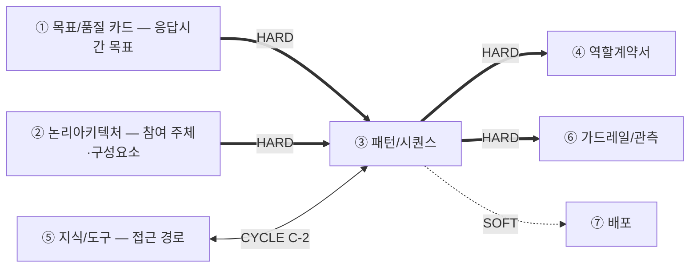
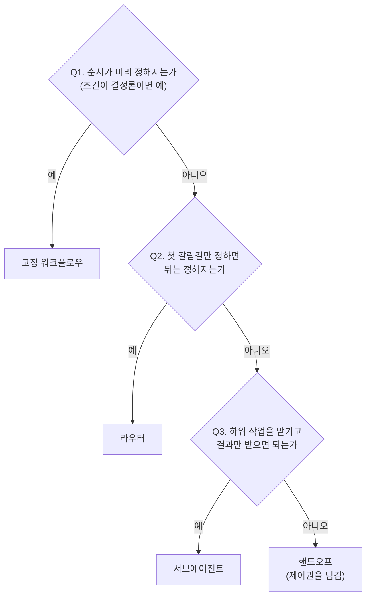

# 설계서 ③ 패턴/시퀀스 — 작성 가이드

## 1. 이 설계서가 답하는 질문

**"누가 어떤 순서로 움직이고, 실패하면 무엇을 하는가"를 못 박는 문서입니다.**

`타임아웃 값의 단일 출처는 본 산출물임` — 머리말에 그대로 둡니다.

**이걸 안 하면 나는 사고 3줄**

- 재시도가 겹쳐 외부 시스템에 호출이 몇 배로 쏟아짐
- 상한 없는 재계획 루프로 요청이 안 끝나고 비용만 쌓임
- 동시에 도는 두 단계가 같은 값을 덮어써 결과가 사라짐

**앞뒤 연결도**

`HARD` 없으면 못 채움 — ③ 패턴/시퀀스는 HARD 유입이 ①②의 2건뿐이라 ② 논리아키텍처가 끝나면 바로 시작합니다.  
**흐름을 먼저 확정해야 그 단계를 누가 맡는지(④ 역할계약서)를 정할 수 있으므로 ③ 패턴/시퀀스가 ④ 역할계약서보다 앞입니다.**  
`CYCLE C-2` ⑤ 지식/도구와 서로 보고 한 번 되돌립니다.

---

## 2. 시작 전 판정

**참여 주체는 ② 논리아키텍처에서 가져옵니다.** ③ 패턴/시퀀스를 쓸 때 ④ 역할계약서는 아직 없으므로 담당자 이름을 지어내지 않고  
② 논리아키텍처의 구성요소·외부 서비스·저장소 이름을 그대로 씁니다. 그 단계를 누가 맡을지는 ④ 역할계약서가 뒤에서 정합니다.

### 2-1. 트리거부터 가름

시퀀스는 **시작 트리거별로 따로 그립니다.** 섞으면 예산이 엉킵니다.

| 트리거 | 무엇인가 | 단계 식별자 | 예산 기준 |
|--------|---------|------------|----------|
| 동기 요청 | 사람이 눌러 기다림 | `S-R1` ~ | ① 목표/품질 카드의 응답시간 목표 |
| 스케줄 배치 | 정해진 주기에 자동 실행 | `S-B1` ~ | ① 목표/품질 카드의 배치 완료 목표 |
| 이벤트 | 앞 단계 완료 신호로 시작 | `S-E1` ~ | 전달 지연 목표 |

### 2-2. 패턴 선택 — 결정 트리

**기본값은 고정 워크플로우입니다.** 모델이 순서를 고르게 하는 것은 필요할 때만 합니다.

후보 5종: 고정 워크플로우·라우터·서브에이전트·핸드오프·스킬.  
**패턴과 프레임워크를 섞지 않습니다.** 표에는 패턴만 올립니다.

---

## 3. 설계항목 작성법

### 워크플로우 표
워크플로우명, 트리거 유형, 설명을 표 형태로 작성   

예시:

| 워크폴로우명 | 트리거 유형 | 설명 |
|-------------|-------------|-----------------------------------|
| 오늘의 추천조회 | 동기요청 | 사용자의 음식점 추천을 처리하는 워크폴로우 | 

### 워크플로우 
각 워크플로우별 작성
- Sequence: Sequence Diagram을 Mermaid script로 작성.   
- 단계별 설계: Sequence Diagram 하위에 각 단계별 참여 주체, 행동, p95 타임아웃, 타임아웃(상한), 재시도 횟수, 최악값, 초과 시 처리를 표형태로 작성  
  - 최악값
- State구조: 노드 간 공유할 State 구조 정의 
- 재개 방안: 동기요청은 재개하지 않음. 스케쥴배치와 이벤트 워크플로우에 한해 기술
  - 재개단위: 재처리의 단위
  - 경계 단계: 이 단계 이후에 재실행
  - 재실행 부작용: 재실행 부작용
  - 중복 방지 키: 중복 방지를 위한 키 

<예시>  
#### 오늘의 추천조회
1. Sequence
{Sequence Diagram 표시}

2. 단계별 설계

| 단계 | 참여 주체 | 행동 1개 | p95 배정 | 타임아웃(상한) | 재시도 | 최악값 | 초과 시 처리 | 
|------|----------|---------|---------|--------------|-------|-------|------------|
| `S-R1` | 사용자 → 프론트엔드 | 추천 요청 발생 | TB-1 단말 구간 · API 예산 밖 | 클라이언트 타임아웃 `[확인필요]` | 0회 | 예산 밖 | 안전 종료(재시도 안내) | 
| `S-R2` | 프론트엔드 → 추천·이력 서비스 | 추천 요청 접수 · 마감 시각 산정 | 20ms | 50ms | 0회 | 50ms | 안전 종료 | 
| `S-R3` | 추천·이력 서비스 → 회원 서비스 · S-1 | 동의·사전 조건 확인 | 60ms | 200ms | 1회 | 400ms | **안전 종료** — 위치 미확인 안내 + 수동 입력 경로 | 
| `S-R4` | 추천·이력 서비스 → S-3 | 최근 7일 식사 이력 조회(병렬) | 300ms | 500ms | 1회 | 1,000ms | 부분 결과로 계속 — 이력 없이 계산 |

3. State 구조  
{노드간 공유 State 구조}

4. 재개 방안

| 재개 단위 | 경계 단계 | 재실행 부작용 | 중복 방지 키(집합 식별자) |
|----------|----------|-------------|----------------------|
| 회원 1명 | `S-B7` 취향 벡터 커밋 후 | **있음** — `S-4` 벡터 쓰기 | `회원 + 대상 날짜` 조합 키 |

</예시>

---

## 4. 제출 전 자가 점검표

- [ ] `타임아웃 값의 단일 출처는 본 산출물임`이 **1건 이상** 있음
- [ ] `sequenceDiagram` 블록이 트리거 종류 수만큼 있음
- [ ] 시퀀스 단계 표 행 수와 도식 단계 수가 **같음**
- [ ] 사전 조건 확인 단계가 **1행 이상**이고 실패 분기가 표기됨
- [ ] 단계 행마다 타임아웃 값이 있거나 `[확인필요]`로 되물어짐(빈 칸 0건)
- [ ] 트리거마다 **`응답 마감선`이 출처와 함께 1건** 있음(게이트웨이·클라이언트 타임아웃·실행 창·가시성 타임아웃 중 1개) — 지어낸 값 0건
- [ ] **`p95 합계`는 `총 예산`과, `최악값 합계`는 `응답 마감선 − 착지 경로 시간`과 대조**돼 있고, `총 예산` 초과 시 `시간` 상한의 `초과 시 처리`가 채워짐
- [ ] **상한마다 `초과 시 처리` 공란 0건**(`시간`·`반복`·`비용`)이고 3종 중 1개이며, `max_iter`는 값 또는 `[확인필요]`
- [ ] `부분 결과로 계속`에 **낮춘 사유 필드**가 있고, 그 처리 경로의 시간·비용이 예산 안임이 1줄로 적혀 있음
- [ ] **부하 조건** 판정(`동시 수 × 점유 비율 ≤ 상한`)이 있음
- [ ] 트리거마다 **재개 단위·경계 단계**가 1건 이상이고, 부작용 있는 단계에 **중복 방지 키** 공란 0건임
- [ ] 상태 필드마다 갱신 주체 **1개**이고 병렬 필드는 누적임
- [ ] 단계 간 데이터 형식에 보내는 곳·받는 곳·**키 집합 식별자**가 있고 키 이름을 지어낸 칸 **0건**임
- [ ] 근거 출처 필수 3개 표의 공란 **0건**임

---

## 5. 다음으로 넘기는 값과 근거 자료

**후행 소비처**

| 넘기는 값 | 받는 곳 | 강도 | 안 넘기면 |
|----------|--------|------|----------|
| 시퀀스 단계 목록 · 단계 간 키 집합 식별자 | ④ 역할계약서의 책임 묶기·입출력 형식 | HARD | ④ 역할계약서가 단계를 묶을 바탕이 없음 |
| 시퀀스 단계 이름·개수 | ⑥ 가드레일/관측의 오버레이 | HARD | ⑥ 가드레일/관측이 그릴 바탕 없음 |
| 타임아웃·재시도 값 | ⑥ 가드레일/관측의 단계별 상한 | HARD(소유 ③ 패턴/시퀀스) | 두 문서 값이 갈라짐 |
| 최종 출력 형식 | ⑦ 배포의 프론트·API 분리 | SOFT | 분리 판단 지연 |
| 커넥터 규격·기대 호출 순서 | ⑤ 지식/도구의 커넥터 목록 | CYCLE C-2 | 검색과 어긋남 |

**근거 자료**

| 아티클 | 거는 칸 |
|--------|--------|
| [A02](../references/articles/A02_doc_langchain-multi-agent.md) | 2절 패턴 후보 5종 · 3절 비교 표 |
| [A03](../references/articles/A03_doc_langchain-context-eng.md) | 3절 상태 3출처 판정 |
