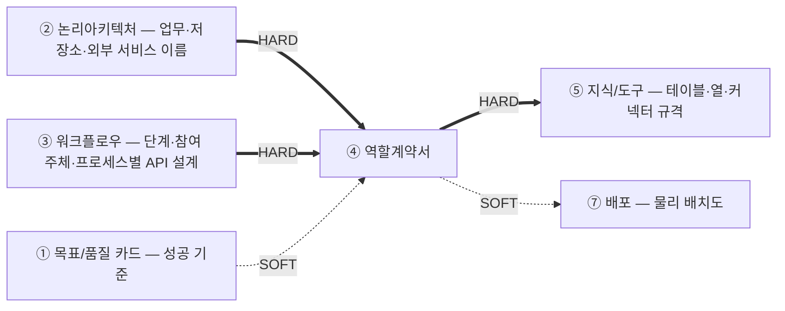
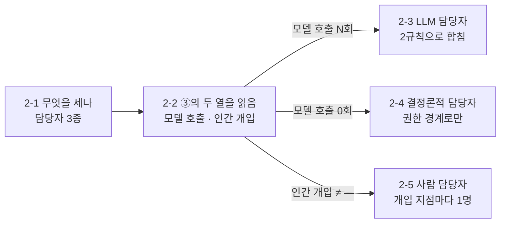

# 설계서 ④ 역할계약서: 작성 가이드

## 1. 이 설계서가 답하는 질문

**"③ 워크플로우에서 그린 단계를 몇 명이 나눠 맡고, 그 한 명이 어디까지 손댈 수 있는가"를 못 박는 문서임.**

사람으로 치면 근로계약서입니다. 담당 업무·출입 가능한 방·성과 기준·일을 멈출 조건을 미리 적습니다.

**이걸 안 하면 나는 사고 3줄**

- ③ 워크플로우가 정한 단계 중 아무도 안 맡은 단계와 둘이 맡은 단계가 생겨 결과가 비거나 두 번 나감
- 권한 경계가 없어 계약에 없는 저장소·외부 서비스까지 손이 닿음
- 되돌릴 수 없는 쓰기에 승인자가 없어 아무 담당자나 그 도구를 부름

**담당자 종류(모델/코드/사람)는 이 문서가 판정하지 않습니다.** ③ 워크플로우가 예산을 계산하려고
`모델 호출` 열과 `인간 개입` 열에 이미 정해 뒀습니다. 이 문서는 그 두 열을 읽어 오고
**몇 명으로 묶을지와 각자의 권한**을 정합니다.

**앞뒤 연결도**



`HARD` 없으면 못 채움 · `SOFT` 나중에 고침.
**④ 역할계약서는 ③ 워크플로우의 단계 목록이 있어야 시작됨.** ③ 워크플로우의 단계를 묶어 역할을 나누기 때문입니다.

**⑤ 지식/도구와 순환하지 않습니다. 한 방향으로만 흐릅니다.**
이 문서는 ②③에 이미 있는 **논리 이름만** 씁니다(저장소 `S-1`·회원 서비스 같은 것).
테이블·열·커넥터 규격처럼 **구체화는 전부 ⑤ 지식/도구가** 합니다.
그래서 ⑤가 아직 없어도 이 문서를 끝까지 쓸 수 있고 나중에 갱신하러 되돌아올 일도 없습니다.

**권한은 두 층으로 나뉩니다.** ④가 **어느 문을 열 수 있나**를 정하고 ⑤가 **그 문 안에서 어디까지**를 정합니다.
민감 필드가 무엇이고 어디서 가리는지도 전부 ⑤ 몫입니다.

**키 이름은 세 문서가 층을 나눠 소유합니다**: 각자 **자기가 실제로 정할 수 있는 것**만 가집니다.

| 무엇 | 주인 | 왜 그쪽인가 |
|------|------|------------|
| **State 필드 이름**: 워크플로우가 끝날 때까지 남는 값 | ③ 워크플로우 | 이름 없이는 `필드당 갱신 주체 1개`를 못 씀 |
| **프로세스별 API 설계의 엔드포인트·요청/응답 키 이름**: 프로세스 경계를 넘는 값 | ③ 워크플로우 | **담당자 묶음이 바뀌어도 안 변하고 흐름이 바뀌면 변함**: 흐름의 주인이 가짐 |
| **커넥터 입출력 키**: 외부 시스템 규격 | ⑤ 지식/도구 | 외부가 이미 정한 이름이라 우리가 개명할 수 없음 |

**이 문서는 키 이름을 정하지 않습니다.** 어느 엔드포인트를 받고 내놓는지 **인용만** 합니다.

**③ 워크플로우는 워크플로우별로 나눠 적지만 이 문서는 담당자별로 적습니다.**
담당자는 `한 묶음의 컨텍스트 + 한 묶음의 권한`이라 워크플로우와 직교하며 **한 담당자가 여러 워크플로우에 나올 수 있습니다.**
워크플로우마다 계약서를 복제하지 않습니다. 같은 담당자의 계약서가 2장이 되면 권한과 키 이름이 두 곳으로 갈립니다.
③ 워크플로우의 인간 개입 지점(사전 승인·진행 중 중단·사후 재정의)에 **사람 담당자**를 배정하는 것도 이 문서입니다.

---

## 2. 시작 전 판정

**판정 순서**: 2-1에서 무엇을 세는지 정합니다. 2-2에서 ③ 워크플로우의 두 열을 읽어 단계를 3종으로 가른 뒤
종류마다 다른 방법으로 담당자 수를 셉니다(2-3 · 2-4 · 2-5).



### 2-1. 무엇을 세는가: 담당자 3종

이 설계서가 계약서를 쓰는 대상은 **담당자**임. `한 묶음의 컨텍스트 + 한 묶음의 권한`이 담당자 1명임.

- **노드 수가 아님**: 담당자 1명이 노드 여러 개를 순서대로 돌 수 있음(노드 수는 ③ 워크플로우 소유)
- **워크플로우 수도 아님**: 담당자 1명이 워크플로우 여러 개에 걸칠 수 있음(2-3 참조)

| 종류 | 종류 표기 | `R-n` 접두사 | 무엇 | 수를 세는 법 | 계약서 |
|------|----------|-------------|------|------------|--------|
| **LLM 담당자** | `LLM` | `R-L` | 모델을 씀 | 업무·결과물이 같으면 합치고, 달라도 도구 집합이 같으면 합침(**2-3**) | 1장 |
| **결정론적 담당자** | `Deterministic` | `R-D` | 모델을 안 씀 | 그 판정 없이 **권한 경계로만**(**2-4**) | 1장 |
| **사람 담당자** | `Human` | `R-H` | ③의 인간 개입 지점을 맡음 | 개입 지점마다 1명(**2-5**) | 1장 |

**셋 다 계약서를 1장씩 씁니다.** 모델을 안 쓴다고 빼면 되돌릴 수 없는 쓰기가 계약 없이 남습니다.

**`R-n` ID는 종류별로 접두사를 나눠 붙입니다**: `R-L1`·`R-L2`(LLM 담당자), `R-D1`·`R-D2`·...(결정론적
담당자), `R-H1`·`R-H2`·...(사람 담당자). **번호는 종류 안에서만 1부터 순서대로** 매기고 전체
담당자 수와는 무관합니다(LLM 담당자가 2명이면 `R-L1`·`R-L2`뿐이고 `R-D`·`R-H` 번호와 섞어 세지 않음).
ID만 보고도 종류를 알 수 있어야 하므로 접두사 없는 `R-n`을 이 문서 어디에도 남기지 않습니다.

### 2-2. 단계를 3종으로 가름: ③ 워크플로우의 두 열을 읽음

**여기서 판정하지 않습니다.** ③ 워크플로우의 단계별 설계 표에서 두 열을 그대로 읽습니다.

| ③ 워크플로우의 열 | 값 | 그 단계의 담당자 |
|------|-----|----------------|
| `모델 호출` | `N회`(1회 이상) | **LLM 담당자 후보** → 2-3 |
| `모델 호출` | `0회` | **결정론적 담당자** → 2-4 |
| `인간 개입` | `—`가 아님 | 위 담당자에 더해 **사람 담당자**도 배정 → 2-5 |

**단계 식별자**(③ 워크플로우가 단계마다 붙인 번호)는 그대로 인용합니다. 트리거에 따라 접두사가 다릅니다.
`S-R1 ~`(동기 요청) · `S-B1 ~`(스케줄 배치) · `S-E1 ~`(이벤트). **워크플로우 안에서만 유일한 번호**입니다.

- **모델을 쓰는가는 ③ 워크플로우가 이미 정했습니다**: 그 열이 없으면 ③ 워크플로우가 최악값·비용 합계를
  못 닫으므로 `0회`/`N회`는 ③ 워크플로우의 2-4 판정(L1 ~ L3)에서 이미 갈려 있습니다.
  같은 판정을 여기서 다시 하면 두 문서의 답이 갈립니다
- 단말·프론트엔드 구간처럼 우리가 담당자를 두지 않는 단계는 `담당자 없음`으로 적고 뺍니다
- **읽어 온 값이 틀려 보이면 여기서 고치지 않습니다.** 판단과 실행이 한 단계에 붙어 있거나
  `쓰기(되돌림 불가)` 단계가 `N회`로 적혀 있으면 ③ 워크플로우에 `변경요청` 1행을 남깁니다.
  단계를 쪼개면 없던 단계ID가 생기고 단계ID는 ③ 워크플로우만 만들 수 있습니다

### 2-3. LLM 담당자 수: 아래 2규칙으로 합침

③의 `모델 호출`이 `N회`인 단계를 전 워크플로우에서 모아 위에서부터 적용함. 나눌 이유를 못 대면 안 나눔.

| # | 규칙 | 값을 어디서 읽나 |
|---|------|----------------|
| **⑴** | **업무가 같고 내놓는 결과물이 같으면 합침** | 업무: ② 프로세스 분리표 `담는 구성요소` · 결과물: ③ 그 단계의 `행동 1개` |
| **⑵** | ⑴이 달라도 **부르는 도구 집합이 같으면 합침.** 단 두 업무가 같은 낱말을 다른 뜻으로 쓰면 안 합침 | ③ 그 단계의 `참여 주체`. 이름이 같아야 하고 비슷한 것은 다른 것임 |

- 워크플로우가 달라도, 읽는 자료가 달라도 안 나눔: 계약서는 1장이고 표 B에 행만 늘어남
- ⑴·⑵ 어디에도 안 걸리는데 합치려면 사유 1줄을 남김(하드캡 아님)
- ⑴·⑵에 걸려 합칠 수 있어도 나누는 게 더 나으면 나누고 사유 1줄을 남김

### 2-4. 결정론적 담당자 수: 권한 경계로만

**2-3의 2규칙을 쓰지 않습니다.** 시스템 프롬프트·모델 등급은 모델을 쓸 때의 문제이므로
여기서는 **권한만** 봅니다.

| 도구 등급 | 묶는 법 |
|----------|--------|
| `읽기` | 여러 단계를 **한 명으로 묶음** |
| `쓰기(되돌림 가능)` | 위 `읽기`와 **함께 둘 수 있음** |
| `쓰기(되돌림 불가)` | **반드시 따로 1명으로 뗌** |

- 되돌릴 수 없는 쓰기가 **두 종류면 둘로 뗍니다**: 예: 결제 등록과 결제 중지.
  한 권한으로 걸고 끊을 수 있으면 권한 경계가 없는 것과 같습니다

### 2-5. 사람 담당자 배정

③ 워크플로우의 **인간 개입 열이 `—`가 아닌 단계마다** 그 일을 맡을 사람 담당자를 1명 정합니다.
③ 워크플로우는 "어느 단계에서 사람이 개입하는가"까지만 정했고 **누가 하는가는 이 문서가 정합니다.**

| ③의 인간 개입 | 사람 담당자가 하는 일 | 계약서에 반드시 적을 것 |
|--------------|---------------------|----------------------|
| 사전(승인 전 정지) | 진행 여부를 승인·반려함 | 승인 판단에 **필요한 정보 항목**(못 보면 승인이 근거 없이 남) |
| 진행 중(강제 중단) | 이상 신호를 보고 중단시킴 | 무엇을 보면 중단하는지(중단 조건 칸) |
| 사후(결과 재정의) | 산출값을 무시·수정함 | 재정의할 수 있는 **State 필드 이름**과 사유 기록 |

- **한 사람 담당자가 여러 개입 지점을 맡아도 됩니다.** 권한 등급이 같으면 합칩니다
- `쓰기(되돌림 불가)`를 승인하는 사람과 그 결과를 사후 감사하는 사람은 **나눕니다**: 자기 승인을 자기가 감사하면 통제가 아닙니다
- ③ 워크플로우에 인간 개입이 0건이면 이 절은 `해당 없음`으로 적고 넘어갑니다

### 2-6. 시작 조건 확인

| 확인 | 없으면 |
|------|--------|
| **③ 워크플로우의 워크플로우 목록과 워크플로우별 단계·State 구조** | 묶을 단계가 없어 시작이 안 됩니다. ③ 워크플로우를 먼저 끝냅니다 |
| **③ 워크플로우의 `모델 호출` 열** | 담당자 종류를 가를 근거가 없습니다. 여기서 지어내지 말고 ③ 워크플로우에 `변경요청` 1행을 남깁니다 |
| ③ 워크플로우의 인간 개입 열 | 사람 담당자를 배정할 자리를 모릅니다. ③ 워크플로우에 `변경요청` 1행을 남깁니다 |
| **② 논리아키텍처의 프로세스 분리표·내부 저장소 목록·외부 서비스 목록** | 2-3 ⑴의 업무 이름과 `사용 정보`·`사용 도구`에 적을 이름이 없습니다. ② 논리아키텍처를 먼저 끝냅니다 |
| US `[처리 결과] 실패 시` | 중단 조건을 지어내지 말고 기획에 되묻습니다 |

---

## 3. 설계항목 작성법

**산출물은 아래 4개로 끝냅니다.** 판정 과정·대조 기록·후행 소비처는 문서에 남기지 않고 응답으로만 보고합니다.
**이 4개가 곧 산출물의 목차임**: 여기 없는 절을 산출물에 만들지 않고 여기 있는 절을 빼지도 않습니다.

| # | 섹션 | 무엇 |
|---|------|------|
| 1 | 담당자 명부 | 표 1개: `R-n`(종류별 접두사 `R-L`·`R-D`·`R-H`) · 이름 · 종류(`LLM`/`Deterministic`/`Human`) · 판정 근거 1줄 |
| 2 | **담당자별 계약** | 담당자마다 소제목 1개 + 종류 1줄 + 아래 표 2개(표 A 공통 5열·1행 · 표 B 단계별 5열·N행) |
| 3 | 변경요청 | ③ 워크플로우·⑤ 지식/도구로 되돌릴 값. 0건이어도 표를 만듦 |
| 4 | 미확정 항목 | `[확인필요]` 목록 |

**축을 바꿔 같은 내용을 다시 적지 않습니다**: 민감 필드 행렬 · 키 이름 목록 · 최소권한 표는
따로 만들지 않고 계약 표 안에서 끝냅니다. 축만 바꾼 표는 한쪽만 고쳐질 때 어느 쪽이 진짜인지 모르게 됩니다.

**계약은 표 2개로 씁니다.** 표를 가르는 기준은 **"개발될 때 어느 경계에서 값이 정해지는가"**입니다.
담당자(LLM 담당자·결정론적 담당자)는 각각 모듈 1개(function/class 묶음)로 개발되고 ③ 워크플로우의
단계는 그 모듈을 부르는 그래프 노드 1개가 됩니다. 모듈 전체에 한 번 주입되는 값과 노드마다
따로 호출·검증되는 값은 서로 다른 표에 둡니다.

- **표 A: 공통(5열, 담당자당 1행)**: 책임 · 사용정보·정형 · 사용정보·의미정보 · 사용정보·관계정보 · 사용모델:
  모듈 전체에 한 번 주입되는 값. 2-3이 이 값들을 하나로 정할 수 있는 단계만 한 담당자로 묶으므로
  여기에 값을 두 개 적어야 하면 2-3으로 되돌아감(모델만은 3절 `사용모델` 규칙에 따라 상위 등급 1개로 통일함)
- **표 B: 단계별(5열, 담당자당 N행: 1행 = 1단계)**: `워크플로우 \| 단계` · 사용도구·내부 · 사용도구·외부 ·
  성공기준 · 중단조건: 그 단계(=노드) 하나가 실제로 부르는 도구와, 그 노드 하나의 통과·중단 조건

**표 B는 불렛으로 몰아넣지 않고 단계 1개당 행 1개로 씁니다.** 전에는 담당자당 1행에 모든 단계를
불렛으로 몰아넣었습니다. 그러면 사용도구·성공기준·중단조건이 뭉쳐서 "이 담당자가 맡은 단계 중
정확히 어느 단계에 무엇이 적용되는가"가 안 보이고 일부 단계는 성공기준·중단조건이 실제로는
없는데도 빈 칸이 조용히 묻혔습니다. **행으로 쪼개면 빈 칸이 그대로 드러나므로** 값이 없으면
`해당없음`을 반드시 적어야 하고 지워서 숨길 수 없습니다.

`워크플로우 \| 단계` 칸의 모양은 `` `{워크플로우ID}`. {워크플로우명} \| `{단계ID}`. {단계명} ``:
표 안에서 `|`는 열 구분자로 읽히므로 **반드시 `\|`로 escape**합니다.

```markdown
### `R-D16`. 이력 보관 기간 적용 처리기

**종류**: `Deterministic`

**표 A**

| 책임 | 사용정보·정형 | 사용정보·의미정보 | 사용정보·관계정보 | 사용모델 |
|------|-------------|-----------------|-----------------|---------|
| 회원 1명에 대한 이력 보관 기간 적용 1건 | `S-3` 이력 저장소 | 0건 | 0건 | 모델 미사용(결정론적 실행) |

**표 B**

| 워크플로우 \| 단계 | 사용도구·내부 | 사용도구·외부 | 성공기준 | 중단조건 |
|------------------|-------------|-------------|---------|---------|
| `W-a`. 구독 상태 반영 \| `S-N6`. 보관 기간 갱신 | 이력 서비스 보관정책 적용 `쓰기(되돌림 가능)` | 0건 | 프리미엄 방향 보관 기간이 무제한으로 1건 적용됨 | `retention_policy`가 2값 밖인 신호(진입 직전) |
| `W-a`. 구독 상태 반영 \| `S-N7`. 보관 정책 적용 | 이력 서비스 보관정책 적용 `쓰기(되돌림 가능)`. **기록 삭제 도구 0건**(열람 제한과 삭제는 다른 일임) | 0건 | 기록 삭제 0건 | 무료 방향인데 `view_cutoff_on`이 빈 신호(진입 직전) |
| `W-b`. 해지 만료 전환 \| `S-X6`. 보관 정책 재설정 | 이력 서비스 보관정책 적용 `쓰기(되돌림 가능)` | 0건 | 해당없음 | 해당없음 |
```

**표 A·표 B의 열 순서와 이름은 바꾸지 않습니다.** 담당자가 여럿일 때 같은 자리에서 같은 항목을
찾을 수 있어야 합니다. 빈 칸도 지우지 않고 `해당 없음`·`0건`으로 남깁니다.
**`0건`과 `해당없음`은 다른 뜻입니다**: `0건`은 표 A(담당자 전체)에서 "이 담당자가 그 종류를
아예 안 씀"이고 `해당없음`은 표 B(단계별)에서 "이 담당자는 다른 단계에서 쓰지만 이 단계는 안 씀"임.
섞어 쓰면 담당자 전체 얘기인지 이 단계만의 얘기인지 구별이 안 됨.

**종류** (표 A 앞, 소제목 바로 아래 1줄)
- `` `LLM`|`Deterministic`|`Human` `` 중 1개만 적음: 2-1의 종류 표기를 그대로 씀
- 소제목의 `R-n` 접두사와 **반드시 같아야 함**(`R-L*`는 `LLM`, `R-D*`는 `Deterministic`, `R-H*`는 `Human`).
  둘이 어긋나면 ID를 다시 매김. 이 줄을 종류에 맞춰 고치지 않음

**표 A 작성법**

**책임**
- 이 담당자가 만들어 내는 결과물을 **1개**만 적음: US 스토리 헤더 `~하기 위해` 목적절에서 가져옴
- 결과물은 눈에 보이는 산출물로 씀(판정 1건·리포트 1건 같이)
- 하는 일을 여러 개 늘어놓지 않음. 문장에 `그리고`·`및`이 들어가면 담당자를 나눌지
  2-3(LLM) 또는 2-4(결정론적)로 다시 봄
- **2-3 ⑵(도구 집합이 같아 합침)로 합친 담당자만 예외임**: 대표 산출물 1개를 적고 나머지 결과물은
  표 B `성공기준`에서 읽음. 이 경우 합친 사유를 담당자 명부의 `판정 근거` 칸에 1줄로 남김
- 업무 분야 이름(`설비 업무 전반`)이 아니라 산출물 이름으로 씀

**사용정보·정형 / 사용정보·의미정보 / 사용정보·관계정보**

**이 담당자가 열 수 있는 저장소 목록임.** 여기 없는 저장소는 접근 자체가 거부됨. 해당 없으면 `0건`.
표 A는 담당자 전체 값이므로 그 담당자가 맡은 단계 중 **하나라도** 그 저장소를 필요로 하면 여기 올림.
모든 단계가 다 쓸 필요는 없음. 모듈이 열 수 있는 문의 총합임.

- **정형**: 테이블로 된 저장소(`S-1` 회원 저장소 같이)
- **의미정보(RAG)**: 뜻이 가까운 글을 찾아오는 벡터DB. **벡터DB명만**
- **관계정보(GraphRAG)**: 개체를 선으로 이어 따라가는 그래프DB. **이름만**
- **저장소 이름만 적고 테이블·열은 적지 않음.** 이름은 ② 논리아키텍처·③ 워크플로우에 있는 것을
  그대로 씀. **어느 테이블의 어느 열까지인지는 ⑤ 지식/도구가 정함**
- **접근 등급은 여기에 적지 않음**: 등급의 주인은 표 B `사용도구`임. 담당자 단위 등급은 표 B
  값의 롤업이라 두 곳에 적으면 한쪽만 고쳐질 때 어느 쪽이 진짜인지 모르게 됨.
  2-4 판정도, ⑥ 관측/가드레일이 승인 지점을 뽑는 곳도 전부 **도구 등급**(표 B)임
- 넘겨받은 값만 쓰고 아무 저장소도 안 보면 그 칸은 `0건`
- 청킹·임베딩 모델·top-k·홉 수 같은 **구성값은 여기서 정하지 않음**(⑤ 소유)
- `설비 데이터 전체`처럼 뭉쳐 쓰지 않음: 금지어 4종에 걸림

**사용모델**
- `모델명 · 사고(reasoning) 켬/끔 · 확인일` **3값을 한 칸에만** 적음. 고른 이유가 원문에 없으면
  `설계판단`으로 남김(별도 근거 칸을 두지 않음)
- **사고(reasoning)** 는 모델이 답하기 전에 속으로 더 생각하는 기능임. **켬·끔을 반드시 적음.**
  안 적으면 저절로 켜지는 모델이 있고 사고 토큰도 출력 단가로 과금됨
- 확인일은 **모델 문서를 열어 확인한 날**임. 기억에 의존해 적지 않음
- 모델을 안 쓰면 빈칸으로 두지 않고 `모델 미사용(결정론적 실행)`,
  사람 담당자는 `모델 미사용(사람 판단)`으로 적음
- **모델을 쓰는지 안 쓰는지는 2-2에서 읽어 온 값을 따름**: 맡는 단계가 ③ 워크플로우에서
  전부 `0회`면 `모델 미사용`, `1회` 이상이면 모델명을 적음. 여기서 뒤집지 않음
- **한 담당자의 사용모델은 1개임**: 모델이 다르다고 담당자를 나누지 않고 단계마다 필요한 등급이
  달라도 **상위 등급 하나**를 적음. 등급을 올린 사유는 같은 칸에 1줄로 남기고 단계별로 나눠 적지 않음
- 출력 토큰 상한·온도 같은 **조절값은 여기서 정하지 않음**: 개발이 설정으로 빼고
  비용 상한은 ⑥ 관측/가드레일이 가짐

**표 B 작성법**

**워크플로우 \| 단계** (행을 가르는 키)
- 표 B는 **단계 1개 = 행 1개**임. 범위(`~`)·나열(`·`)로 여러 단계를 한 행에 묶지 않음.
  단계마다 사용도구·성공기준·중단조건이 달라 압축하면 그 값들이 어느 단계 것인지 안 갈림
- 워크플로우ID·이름은 ③ 「워크플로우 표」에서, 단계ID는 ③ 워크플로우가 붙인 것을 그대로 씀.
  **단계명은 그 단계의 ③ 「단계별 설계」 `행동 1개` 열 값을 그대로 인용함.** 줄여 쓰거나
  다른 말로 바꾸지 않음. 여기서 새로 만들지 않음
- **다른 설계서와 대조**: ③ 워크플로우의 단계가 **담당자 1명에게만** 배정됨. 아무도 안 맡은
  단계나 둘이 맡은 단계가 있으면 2절 판정으로 되돌아감(`담당자 없음`으로 표시한 단말 구간은 제외)

**사용도구·내부 / 사용도구·외부**

**이 단계(노드)가 실제로 부르는 바깥 상대임.** 개발은 그 노드에 이 칸에 적힌 것만 주입하므로
**안 적은 것을 그 노드가 부르는 코드는 쓸 수 없음.**

- 이름은 ③ 워크플로우의 이 단계 `참여 주체` 열, 또는 ⑤ 지식/도구의 `사용 주체` 표에 있는 것을
  **그대로 인용**함. 새 이름을 짓거나 커넥터 규격(번호·입출력 키)을 다시 적지 않음(⑤ 소유)
- **표 B가 이 칸에서 새로 붙이는 값은 등급뿐이고, 계약서에서 등급을 적는 곳은 표 B뿐임**: 도구마다
  `읽기`·`쓰기(되돌림 가능)`·`쓰기(되돌림 불가)` 중 1개를 반드시 적음(공란 0건).
  이름·스펙이 ③/⑤와 어긋나면 04를 고치지 않고 ③/⑤를 정본으로 따름
- **등급을 가르는 축은 `바깥에 남기는 변화가 되돌아오나`임**: 값을 받아 오기만 하고 바깥에
  남기는 변화가 없으면 `읽기`임(모델·AI 서비스 호출이 여기 해당). **쓴 돈과 경계 통과는
  등급이 아니라 ⑥ 관측/가드레일·② 논리아키텍처가 다룸**
- **결과를 자동으로 내보내는 도구는 내보내는 쪽에 등급이 붙음**: 문장을 만드는 것과 그것을
  게시·발송하는 것은 다른 도구임(③ 2-4가 판단과 실행을 쪼개는 것과 같은 축)
- 이 단계가 아무 도구도 안 부르면(순수 계산·상태 전달만 함) `해당없음`으로 적음.
  **`0건`이 아니라 `해당없음`을 씀**: `0건`은 표 A에서 "담당자 전체가 그 종류를 안 씀"이라는
  뜻이라 혼동됨
- `쓰기(되돌림 불가)`는 같은 행 안에 ③ 워크플로우의 **인간 개입이 `사전 승인`인 단계**와
  승인자(2-5의 사람 담당자 이름)를 함께 적음. 이제 단계 1개 = 행 1개라 다른 행과 짝지을
  필요가 없음. 짝지을 단계가 ③에 없으면 ③에 `변경요청` 1행을 남김

**성공기준**
- **이 단계 1개**가 성공했다고 보는 조건을 참/거짓이 딱 갈리는 문장으로 적음. 개발이 이 문장을
  그 노드의 단정문 1개로 옮김
- 숫자가 있으면 US `[검증 요구사항]`의 숫자를 그대로 인용함
- 판정이 안 갈리게 읽히는 말(`정확하게 수행됨`)은 쓰지 않음
- **이 단계에 원문이 정한 성공 조건이 없으면 지어내지 않고 `해당없음`으로 적음**: 채우려고
  다른 단계·다른 워크플로우의 기준을 끌어오지 않음

**중단조건**
- 이 단계에서 어떤 신호를 보면 멈추는지 적고 **괄호에 판정 시점을 붙임**: `진입 직전`이면 이
  단계 첫머리에서, `종료 직후`면 이 단계 뒤 분기에서 판정함
- 시점은 ③ 워크플로우의 이 단계 경계에서 골라 씀. 새 시점을 만들지 않음
- **판정 주체는 적지 않음.** 흐름을 도는 주체가 곧 판정 주체임
- **재시도 횟수·타임아웃 값은 이 칸에 정하지 않음**: ③ 워크플로우 소유라 인용만 함
- `오류 발생 시 중단`처럼 뭉뚱그리지 않음. 어떤 오류인지 써야 판정이 됨
- 신호는 US `[처리 결과] 실패 시`에서 가져옴
- 이 단계에 멈출 신호가 여러 개면 `-` 불렛으로 나눠 적고 시점도 불렛마다 따로 붙임
- **이 단계에 원문이 정한 중단 신호가 없으면 지어내지 않고 `해당없음`으로 적음**

**성공기준·중단조건이 모두 `해당없음`인 행이 있으면** 응답에 그 단계를 목록으로 적어 사용자에게
"이 단계는 정말 통과·중단 기준이 없는 단순 전달 단계인지" 확인받음: 조용히 넘기지 않음.

**금지어 4종**: `전체`·`필요시`·`관련 데이터`·`적절한`. 보이면 그 칸은 미설계임.


---

## 4. 제출 전 자가 점검표

**산출물 구성**

- [ ] 산출물이 3절 4개 섹션으로만 이뤄짐: **축만 바꾼 표(키 이름 목록·최소권한 표 등) 0건**
- [ ] 담당자 ID가 전부 `R-L`·`R-D`·`R-H` 중 하나로 시작함(접두사 없는 `R-n` 0건). 번호는 종류 안에서만
      1부터 순서대로 매겨짐(예: `R-D` 번호에 빈 번호나 다른 종류 번호가 끼어든 곳 0건)
- [ ] 담당자마다 소제목 바로 아래 **종류** 1줄이 있고 값이 접두사와 일치함(`R-L*`↔`LLM`,
      `R-D*`↔`Deterministic`, `R-H*`↔`Human`. 어긋난 행 0건)
- [ ] 담당자마다 표 A(5열·1행)·표 B(5열·N행)가 **같은 열 순서로 있음**. 표 A는 담당자당 1행,
      표 B는 그 담당자가 맡는 단계 수만큼 행이 있음(행 수 ≠ 단계 수인 담당자 0명)
- [ ] 표 A·표 B 공란 0개(빈 칸은 표 A에서 `0건`, 표 B에서 `해당없음`으로만 남음: 두 표기를 섞어 쓴 칸 0건)
- [ ] 금지어 4종(`전체`·`필요시`·`관련 데이터`·`적절한`) 검색 결과 **0건**임
- [ ] 표 B `워크플로우 \| 단계` 칸이 전부 `` `{워크플로우ID}`. {워크플로우명} \| `{단계ID}`. {단계명} ``
      모양임(`\|` escape가 빠져 열이 깨진 행 0건, 여러 단계를 한 행에 묶은 행 0건)

**③ 워크플로우와 맞추기**

- [ ] **③의 전 워크플로우 단계가 담당자 1명씩에게 배정됨**: 아무도 안 맡은 단계 0건, 둘이 맡은 단계 0건
  (`담당자 없음`으로 표시한 단말 구간은 제외)
- [ ] 표 B의 모든 행에 **워크플로우ID·이름과 단계ID·단계명이 함께** 적혀 있음(둘 중 하나라도 빠진 행 0건)
- [ ] 단계명이 그 단계의 ③ 「단계별 설계」 `행동 1개` 열 값과 다른 행 **0건**(줄이거나 바꿔 쓴 곳 없음)
- [ ] LLM 담당자마다 2-3 판정 표(업무 · 결과물 · 도구 집합)가 응답에 있고 빈 칸인 단계 **0건**임
- [ ] **업무·결과물이 같은데 워크플로우가 달라 계약서가 2장으로 갈린 담당자 0명**임(워크플로우는 담당자를 가르는 축이 아님)
- [ ] 2-3 ⑴·⑵ 어디에도 안 걸리는데 사유 1줄 없이 합친 담당자 **0명**임
- [ ] 2-3 ⑴·⑵에 걸리는데 사유 1줄 없이 나눈 담당자 **0명**임
- [ ] LLM 담당자의 표 A `사용모델`이 **1개**임(단계별로 나눠 적은 담당자 0명). 등급을 올렸으면 사유 1줄이 있음
- [ ] 계약에 키 이름을 펼쳐 적은 곳이 **0건**임(키·타입·필수 여부는 ③의 `프로세스별 API 설계` 소유)
- [ ] **③ 워크플로우의 `모델 호출` 열과 표A `사용 모델`이 어긋난 행 0건**: 전부 `0회`인데 모델명이 있거나 `1회` 이상인데 `모델 미사용`인 경우
- [ ] 담당자 종류를 이 문서에서 다시 판정한 곳이 **0건**임(L1 ~ L3 표를 옮겨 적은 곳 0건: ③ 워크플로우 소유)
- [ ] 표 B의 중단조건마다 시점이 `진입 직전`·`종료 직후` 중 하나로 적혔고 그 단계가 ③에 있음(`해당없음` 행은 제외)
- [ ] 중단 조건에 재시도 횟수가 적힌 행이 **0건**임(③ 소유)

**단계별 커버리지(신설: 표 B를 행으로 쪼갠 이유)**

- [ ] 표 B에서 **성공기준·중단조건이 둘 다 `해당없음`인 행**을 숫자로 세어 응답에 목록으로 적고
      정말 통과·중단 기준이 없는 단순 전달 단계인지 사용자에게 확인받음(0건이 이상적이나 하드캡 아님)
- [ ] 표 B의 사용도구(내부·외부) 칸마다 `읽기`/`쓰기(되돌림 가능)`/`쓰기(되돌림 불가)` 또는
      `해당없음` 중 하나가 있음(공란 0건)
- [ ] `LLM` 담당자의 표 B에 쓰기 등급이 적힌 행마다 **그 단계가 판단과 실행을 함께 하는지 확인**했음:
      맞으면 여기서 나누지 않고 ③에 `변경요청` 1행을 남김(2-2)
- [ ] 표 B의 사용도구 이름이 전부 ③ 워크플로우의 그 단계 `참여 주체` 또는 ⑤ 지식/도구의
      `사용 주체`에 있는 이름임(새로 만든 이름 0건). ⑤가 아직 없으면 ③만 대조함

**권한 경계**

- [ ] `쓰기(되돌림 불가)`마다 같은 행 안에 ③의 `사전 승인` 단계와 승인자가 함께 적혀 있음(공란 0건)
- [ ] `쓰기(되돌림 불가)`를 승인하는 사람과 그 결과를 사후 재정의·감사하는 사람이 **다른 담당자임**
- [ ] ③의 인간 개입이 `—`가 아닌 단계마다 **사람 담당자가 1명 배정됨**(공란 0건)
- [ ] 표 A `사용정보`는 **논리 이름만**, 표 B `사용도구`는 **논리 이름과 등급까지만** 있음:
  테이블·열·커넥터 ID·청킹·top-k 같은 **구체값이 적힌 행 0건**(전부 ⑤ 지식/도구 소유)
- [ ] 표 A `사용정보` 칸에 접근 등급이 적힌 곳 **0건**임: 등급의 주인은 표 B `사용도구`임
- [ ] **⑤ 지식/도구를 안 보고도 전 항목이 채워짐**: `[확인필요: ⑤ 미생성]`이 0건

---
