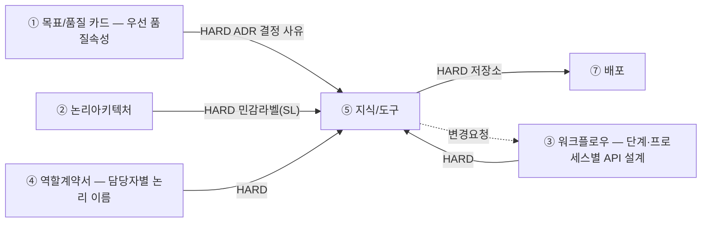

# 설계서 ⑤ 지식/도구 — 작성 가이드

---

- [설계서 ⑤ 지식/도구 — 작성 가이드](#설계서--지식도구--작성-가이드)
  - [1. 이 설계서가 답하는 질문](#1-이-설계서가-답하는-질문)
  - [2. 시작 전 판정](#2-시작-전-판정)
  - [3. 설계항목 작성법](#3-설계항목-작성법)
    - [3-1. 정보](#3-1-정보)
      - [정형정보](#정형정보)
      - [비정형정보](#비정형정보)
        - [의미정보(RAG)](#의미정보rag)
        - [관계정보(GraphRAG)](#관계정보graphrag)
        - [외부검색(웹·영상)](#외부검색웹영상)
      - [용어사전](#용어사전)
      - [질의 전처리(Pre): 덧붙는 층](#질의-전처리pre-덧붙는-층)
      - [결과 후처리(Post): 덧붙는 층](#결과-후처리post-덧붙는-층)
      - [검색 패턴별 판정 기준값](#검색-패턴별-판정-기준값)
    - [3-2. 커넥터](#3-2-커넥터)
    - [3-3. 민감정보·보존 정책 설계](#3-3-민감정보보존-정책-설계)
    - [3-4. 스펙 결정 ADR(Architectural Decision Record)](#3-4-스펙-결정-adrarchitectural-decision-record)
  - [4. 제출 전 자가 점검표](#4-제출-전-자가-점검표)

---

## 1. 이 설계서가 답하는 질문

**"이 담당자는 무엇을 근거로 답하는가."**  
질문마다 답을 어디서 가져올지, 민감한 값을 어디서 가릴지 못 박는 문서임.

**이걸 안 하면 나는 사고 3줄**

- 집계 질문을 문서 검색에 던져 숫자가 매번 달라짐. 시연에서 무너짐
- 고객 이름·전화가 가려지지 않은 채 외부 모델로 나감. 되돌릴 수 없음
- ⑦ 배포 물리 배치도에 이름을 얹을 저장소가 없어 그림이 안 그려짐

**앞뒤 연결도**



용어 — `HARD`는 앞이 없으면 못 채움.  
②③④는 ⑤ 지식/도구보다 **먼저** 쓰므로 ⑤ 지식/도구는 앞 산출물의 값을 받아 **구체화하는 쪽**임 — 새 이름을 지어내지 않음.

**앞 산출물과 순환하지 않음 — 받기만 하고, 문제가 나오면 `변경요청` 1행만 되돌림.**

| 앞 산출물이 정한 것(논리) | 본 산출물이 정하는 것(구체) |
|------------------------|--------------------------|
| ④ 담당자가 열 수 있는 **저장소 이름** | 그 안에서 **어느 테이블의 어느 열까지**(담당자별 허용 열) |
| ④ `사용 정보`의 **세 가지 사용 지식 유형**(정형·의미 정보·관계 정보) | 사용 지식 유형마다 **실제 스펙** — 청킹·임베딩 모델·top-k·그래프 스키마 |
| ② 논리아키텍처의 **민감정보 라벨 목록** | 민감 필드 번호(`F-n`)와 **가릴 자리**(`SL-n`)·가리는 방법 |
| ④ 부를 수 있는 **서비스·외부 시스템 이름** | **커넥터 ID·엔드포인트·요청/응답 키·검증 기준** |
| ③ `모델 호출` 열의 `0회`·`N회` | 정형 경로의 **고정 쿼리 / NL2SQL** 표기 |
| ③ 프로세스별 API 설계·State 구조의 **우리 이름**(있으면) | 외부 규격 이름으로 **맞춰 주는 매핑** |
| ① 목표/품질 카드의 **우선 품질속성 3개** | 스펙 값을 그렇게 잡은 **결정 사유**(3-4 스펙 결정 ADR) |

민감 필드 판정과 마스킹 지점도 여기 몫이라 ④ 역할계약서에 되물을 일이 없음.  
파 보니 테이블이 없거나 외부 API가 없는 필드를 요구하는 등 **나중에 드러난 사실**은 `변경요청` 1행으로 되돌림.

---

## 2. 시작 전 판정

**경로를 새로 판정하지 않음.** ③ 워크플로우와 ④ 역할계약서가 이미 갈라 놓은 것을 **읽어서 펼침.**  
표본 질문을 새로 만들어 판정하지 않음 — 없던 입력을 지어내면 앞 산출물과 답이 갈림.
  
**사용 지식 유형 자체가 틀렸다고 판단되면 여기서 고치지 않고 ④ 역할계약서에 `변경요청` 1행을 남김.**

**이 절은 사용 지식만 다룸 — 커넥터는 시작 전 판정이 없음.**
- 사용 도구에 대해선 ④ 역할계약서 표B에서 각 단계별로 정의함 
  어느 단계가 어느 서비스를 어떤 등급으로 쓰는지까지 정해져 있음
- 이 문서가 도구에 더할 것은 커넥터 ID(`C-A1`·`C-M1`·`C-C1` 꼴)·호출 규격(엔드포인트·요청/응답 키)·검증 기준뿐이라
  판정 없이 3-2 「커넥터」에서 바로 구체화함
- **다만 웹·영상 검색 도구는 근거를 만들어 오므로 지식 쪽에도 자리가 있음**: 호출 규격은 3-2가,
  근거로서의 품질(대상·기간·정렬·본문 추출·출처 표기)은 3-1 「외부검색」이 정함. 판정은 여기서 하지 않음
- 사용 지식에만 판정이 남는 이유: 고정 쿼리/NL2SQL(2단계), 용어사전·온톨로지의 자리(3단계),
  확률적 경로 배제(4단계)처럼 **④가 정하지 않은 갈림길**이 지식 쪽에는 있기 때문임
  
**1단계 — ④ 역할계약서의 `사용 정보`를 담당자별로 펼침.**

④ 역할계약서가 담당자마다 저장소를 세 가지 사용 지식 유형으로 나눠 적어 뒀음. 그것이 곧 경로 목록임.

| ④ 역할계약서 `사용 정보`의 사용 지식 유형 | 이 문서가 구체화할 것 | 3절 설계항목 |
|------|------|------|
| ⑴ **정형** — 테이블로 된 저장소 이름 | 테이블·행 수 상한·담당자별 허용 열·금지 컬럼 | 정형 접근 경로 · 담당자별 허용 열 |
| ⑵ **의미 정보(RAG)** — 벡터DB명 | 청킹·임베딩 모델·검색 기법·top-k | 비정형 경로 선택·정의 |
| ⑶ **관계 정보(GraphRAG)** — 그래프DB 이름 | 그래프 스키마(노드·관계 타입)·홉 수·결과 상한 | 비정형 경로 선택·정의 |

- **④ 역할계약서에 없는 저장소를 여기서 더하지 않음** — 필요하면 `변경요청` 1행을 남기고 진행함
- 그 담당자가 `0건`으로 적은 사용 지식 유형은 행을 만들지 않음
- ④ 역할계약서에 세 사용 지식 유형이 전부 `0건`인 담당자는 이 문서에 안 나옴(넘겨받은 값만 쓰는 담당자임)

**2단계 — 정형 사용 지식 유형에서 NL2SQL이 가능한 단계인지를 ③ 워크플로우의 `모델 호출` 열로 가름.**

NL2SQL은 모델이 SQL을 짓는 방식이므로 **모델 호출이 있는 단계(`N회`)에서만 쓸 수 있음.**

| 그 단계의 ③ `모델 호출` | 정형 접근 방식 | 왜 |
|------|------|------|
| `0회` | **고정 쿼리** — 사람이 SQL을 미리 박고 파라미터만 바뀜 | 모델이 없으니 SQL을 지을 주체가 없음 |
| `N회` | **NL2SQL** 가능 — 모델이 SQL 문장을 생성함 | 질문마다 조건이 달라져 쿼리를 미리 고정 못 함 |

- **어떤 방식을 쓸지는 답의 모양이 아니라 `쿼리를 미리 고정할 수 있나`임** 
   예를 들어 "지난달 3회 이상 방문한 회원 목록"에서 기간, 횟수, 회원 유형의 조건이 달라진다면 NL2SQL 사용하고,   
   조건이 달라지지 않는다면 '고정 쿼리'방식을 사용함  

- 워크플로우 설계는 모델의 유무까지 정의함: `0회` 단계에 NL2SQL을 넣으면 없던 모델 호출이 생겨
  설계가 깨지므로 여기서 뒤집지 않음. `N회`에서 실제 사용 여부는 이 문서가 정함
  (이 축은 ③ 워크플로우의 `L1 규칙 완결성(상황별 예외 없이 규칙만으로 적용 가능)` 판정과 같은 축임)
- `N회`인데 NL2SQL을 안 쓰기로 했으면 5단계 버린 대안에 1줄로 적음

> 용어 NL2SQL은 말을 SQL로 바꿔 테이블을 조회함. 벡터 RAG는 뜻이 가까운 문단을 찾아옴.  
> GraphRAG는 개체를 선으로 이어 그 선을 따라감.

**3단계 — 용어사전은 경로가 아니라 덧붙는 층임.**

**용어사전:**       
- 용어사전은 특정 경로에 종속되지 않는 **횡단 계층(cross-cutting layer)**임
- 사내 코드·용어를 표준 표현과 1:1로 대응시켜야 하면 어느 경로에든 **전처리 층으로 결합**함  
  정형 경로에서는 **코드 정규화**에 의미 정보 경로에서는 **질의 확장(query expansion)**에 같은 사전을 씀
- 따라서 용어사전은 정형정보, 의미정보, 관계정보와 동등한 **네 번째 경로**로 추가하지 않음
- 채택 여부와 스펙은 3절 「비정형 경로 선택·정의」에 1행으로 적음

**온톨로지**
- **온톨로지는 층이 여러 개임**: 아래 표처럼 이 문서가 그 층을 세 자리에 나눠 적음
- 따라서 온톨로지는 ⑶ 관계 정보(GraphRAG) 안에서 다루고, **별도 경로로 추가하지 않음**

| 온톨로지 층 | 이 문서에서 적는 자리 |
|-----------|------------------|
| 용어 목록 · 동의어 | **용어사전**(횡단 계층) |
| **개념과 관계 정의** | **⑴ 노드 타입 · 관계 타입** — 그래프 도구들은 이 층을 `그래프 스키마`라고 부름 |
| 계층 | **⑶ 개념 계층**(안 쓰면 `해당 없음`) |

- **`온톨로지`라는 이름만 붙이고 위 층을 비워 두지 않음**: 노드·관계 타입만 그려 놓고 설계가
  끝났다고 하지 않고, 계층·추론이 필요한지 ⑶에서 판단해 적음
- 산출물에서 용어사전과 ⑶을 **한 묶음으로 적지 않음**: 용어사전은 어느 경로에든 얹는 횡단 계층이고
  ⑶은 관계정보의 스펙 항목임

**4단계 — 되돌릴 수 없는 판정에 쓰이는 필드를 확률적 경로에서 뺌.**

**틀리면 되돌릴 수 없는 판정에 쓰이는 필드는 확률에 맡기지 않음**(예: 알레르기 여부·투약 용량·본인 확인 판정).  
여기서 할 일과 ③ 워크플로우에 넘길 일이 나뉨.

| 무엇 | 누가 | 어떻게 |
|------|------|--------|
| 불가역 필드를 **고정 쿼리 경로로만** 가져옴 | **여기서 정함** | NL2SQL·벡터 RAG·GraphRAG 경로에 그 필드를 넣지 않음 |
| 불가역 필드를 **LLM 입력에서 지움** | **여기서 정함** | 담당자별 허용 열에서 빼고 커넥터 요청·응답 키를 만들지 않음 |
| 판정 전에 **결정론 검증 단계를 따로 둠** | **③ 워크플로우** | 단계가 늘어나므로 여기서 만들지 않고 `변경요청` 1행을 남김 |

- **단계를 늘리는 것은 이 문서가 못 함** — 단계ID를 만들 수 있는 것은 ③ 워크플로우뿐임.
  경로를 고정하고 입력에서 지우는 것까지가 이 문서의 손이 닿는 범위임
- ③ 워크플로우는 되돌릴 수 없는 쓰기를 이미 막아 뒀음.
  여기서 더 필요한 것만 `변경요청`으로 보냄

**5단계 — 버린 대안 1줄.** "GraphRAG는 비용 때문에 뺌"처럼 남겨야 다시 판단 가능함.    
- ④ 역할계약서가 사용 지식 유형을 정해 줬어도 **그 안에서 어떤 방식을 안 골랐는지는 이 문서가 정하는 값임.**
- **(참고) 설계 결과는 최종 확정이 아님**   
  - 스펙의 검증(측정)은 개발 단계가 함: 원천 오류율은 `02-dataset`, 골든셋·통과율은 `09-eval`이 잼
  - 측정 결과로 스펙(청킹·top-k·리랭킹 같은 것)을 고치는 튜닝은 **개발자의 몫**임:
    위 버린 대안 1줄이 그때 재판단의 근거가 됨
  - **품질 검증·튜닝 모두 이 문서의 일이 아님**: 여기서는 참고로만 알아 둠  

---

## 3. 설계항목 작성법

**설계항목은 3계열로 나뉨** — `3-1 정보` · `3-2 커넥터` · `3-3 민감정보·보존 정책 설계`.
그 뒤에 **`3-4 스펙 결정 ADR`** 1절을 둠: 스펙 값을 왜 그렇게 잡았는지를 여기 한 곳에 모음.  
**이 제목 구조가 곧 산출물의 목차임** — 여기 없는 절을 산출물에 만들지 않고, 여기 있는 절을 빼지도 않음.

- 산출물이 표인 항목은 그 자리에 표 모양을 함께 보임
- **작성법은 문단으로, 산출물은 표로 씀**: 작성법을 표에 밀어 넣으면 칸 안에서 `<br>`로
  줄을 나누게 되고 불렛을 못 씀

**칸의 값은 세 종류임: `초기값`은 그렇게 표시함**

설계 단계에는 접속 정보도 실데이터도 없음(2절 5단계). 그래서 아래 3절의 칸 중 일부는
**지금 확정할 수 없는 값**임. 확정할 수 없는데 숫자를 적어 두면 개발이 실측 후 바꾸고,
그때부터 설계서와 코드가 갈려 **어느 쪽이 진짜인지 모르게 됨**(이 체계가 가장 경계하는 상태임).

| 종류 | 무엇 | 표기 | 예 |
|------|------|-----|-----|
| **확정값** | 지금 근거가 있는 것 | 값만 적음 | 저장소명 · 제품 · 모델 ID · 차원 수 · 노드·관계 타입 · **노드 고유키** · 허용 열 · 금지 컬럼 |
| **초기값** | 실측 전 출발점 | **값 앞에 `초기값`을 붙임** | 청크 크기 · 중첩 · top-k · 후보 수 · 융합 파라미터 · 색인 파라미터 · **그래프 색인** · 유사도 임계값 |
| **판정 기준** | 값이 아니라 **무엇을 보고 고칠지** | 문장으로 적음 | "재현율 목표 미달이면 하이브리드로" |

- **`초기값` 표시가 있으면 개발의 튜닝이 설계 위반이 아니라 예정된 절차가 됨**:
  표시가 없으면 같은 변경이 "설계서와 다르게 만든 것"으로 읽힘
- **`초기값`인 칸도 비워 두지 않음**: 출발점이 없으면 개발이 처음 돌릴 값을 지어냄
- **`3-4 스펙 결정 ADR`은 확정값의 사유를 받는 자리임**: `초기값`은 사유가 아니라
  **무엇을 보고 고칠지**를 함께 적음(위 `판정 기준`)
- 어느 종류인지 헷갈리면 이렇게 가름: **접속해 재 보지 않아도 답이 정해지면 확정값**,
  재 봐야 알면 `초기값`임

---

### 3-1. 정보

2절 1단계에서 ④ 역할계약서의 `사용 정보`로 펼친 사용 지식 유형을 여기서 구체화함.

**세 층으로 나뉨**

| 층 | 무엇 | 적용 범위 |
|----|------|---------|
| **경로별 스펙** | 정형정보 · 비정형정보(의미정보 · 관계정보 · **외부검색**) | 그 경로만 |
| **횡단 계층 3종** | 용어사전 · **질의 전처리(Pre)** · **결과 후처리(Post)** | 여러 경로에 얹힘. 경로로 세지 않음 |
| **검색 패턴별 판정 기준값** | ③이 만든 판정 단계가 **무엇을 보고 어느 기준으로 가르는지**. ③ 2-2의 4문마다 표 1개 | **패턴·착지 단계·반복 상한은 ③ 2-2 소유**. 여기서 정하지 않음 |

- **외부검색은 ④ `사용 정보`가 아니라 표B `사용도구·외부`에서 옴**: 우리가 색인해 둔 저장소가
  아니라 남의 API라 도구로 승인됨. 그래서 여기서는 **근거로서의 품질만** 정하고 호출 규격은 3-2가 정함
- **횡단 계층은 `사용 경로`를 반드시 적음**: 이 칸이 비면 층이 아니라 경로로 오해됨.
  **단 용어사전은 예외임** — 세 소비처(코드 정규화 · 질의 확장 · 동일 개체 판별)가 같은 사전을
  쓰므로 사전 쪽에 경로를 적으면 소비처와 어긋남

#### 정형정보

**이 설계서는 정형 테이블이 이미 있고 값이 적재돼 있다고 전제함**: 테이블 스키마
(컬럼·타입·키·제약) · 컬럼 단위 저장 특성(`컬럼을 만들지 않음` · `저장 시 암호화`) ·
내부 저장소에 **무엇을 쓰는지**는 이 스킬이 설계하지 않음(별도 데이터 설계 소관).
여기서 정하는 것은 **있는 테이블을 읽는 경로**임. 아래 「정형 접근 경로」가
읽기 전용인 것이 그 귀결임.

**정형 접근 경로**

- 조회할 테이블 이름을 하나씩 적음: US `[입력 요구사항]`에서 가져옴
- **경로마다 `고정 쿼리`·`NL2SQL` 중 1개를 적음**: 2절 2단계에서 ③ 워크플로우의 `모델 호출` 열로
  이미 갈렸음. 여기서 다시 판정하지 않음
- 그 테이블에서 무엇을 얻으려는지 목적을 1줄로 적음
- 조건으로 거르는 값(반경·기간·상태 같은 것)이 있으면 함께 적음
- 읽기 전용 계정만 씀: 생성, 수정, 삭제는 이 경로에 넣지 않음
- 한 번에 가져올 행 수 상한을 숫자로 적음. 못 정했으면 `[확인필요]`로 적음
- **다른 설계서와 대조**: 경로 수가 ③ 워크플로우의 검색 단계 수와 같고, 적은 방식이
  `모델 호출` 열과 어긋나지 않음

**예시** `code_map` · `고정 쿼리` · 상한 200행: 3방향 코드 조회

**담당자별 허용 열**

- ④ 역할계약서가 `사용 정보`에 **저장소 이름까지만** 정했으므로,
  **그 안에서 어느 열까지인지는 여기서 정함**(접근 등급은 표A에 없고 표B `사용도구`에 있음)
- **허용한 열만 적음**(금지 열은 이 표에 섞지 않고 아래 「정형 접근 금지 컬럼」에 적음):
  적힌 것이 곧 허용 목록이고 나머지는 조회가 거부됨
- ④ 역할계약서에 없는 저장소를 여기서 더하지 않음: 필요하면 ④ 역할계약서에 `변경요청` 1행을 남김
- 민감 필드(`F-n`)가 허용 열에 들어가면 3-3 「변환 지점(`SL-n`)」에 그 필드를 가리는 행이
  있는지 **확인만** 함: 가릴 자리와 방법을 정하는 곳은 여기가 아니라 `3-3 민감정보·보존 정책 설계`임
- 이 표는 **정형 저장소만** 다룸: 비정형 저장소는 여기서 정의하지 않음
  (비정형의 접근 제한은 각 스펙 항목과 3-3 「접근 제한 3종의 경계」가 다룸)
- **다른 설계서와 대조**: ④ 역할계약서의 `사용 정보`에 적힌 **정형** 저장소가 전건 들어 있음

**산출물 표 모양**

| 담당자 | 테이블 | 허용 열 | 민감 필드 |
|--------|----|--------|----------|
| `R-D2` | `diet_restriction` | `member_id` · `allergen_labels` · `diet_type` | `F-3`(`SL-2`에서 가림) |

**정형 접근 금지 컬럼**

- **정형 접근 경로(테이블)에만 적용됨**: 비정형 문서·커넥터 값의 제한은 이 항목이 아님
- 담당자가 못 보게 막을 테이블과 열(컬럼)을 하나씩 적음
- 막는 이유를 짧게 붙임(개인정보·계약금액 같은 것)
- 막을 것이 없어도 빈칸으로 두지 않고 `없음(전 항목 허용)`이라고 적음
- **기획 산출물과 대조**: US 보안 체크리스트의 금지 항목이 전건 들어 있음
- **US 금지 항목 중 저장 층 요구는 이 표에 적지 않음**: `원문 저장 금지`·`저장 시 암호화`처럼
  **컬럼을 만들지 말라거나 저장 방식을 바꾸라는 항목**은 조회 층이 아님. 본문에 적지 않고
  **`[범위 밖: 데이터 설계]`로 대조 기록에만 건수와 함께 남김**(설계 범위 밖 항목을
  다루는 방식과 같음). 안 남기면 그 US 요구가 어느 산출물에도 없이 사라짐

**산출물 표 모양**

| 테이블 | 열 | 막는 이유 |
|--------|----|----------|
| `cust` | `phone` | 개인정보 |

---

#### 비정형정보

**경로 채택·미채택**

- 검토한 후보를 **채택·미채택 모두 적음**: 행 수가 검토한 후보 수와 같아야 함
- **`후보 유형`은 4개가 전부임**: `의미정보` · `관계정보` · `외부검색(웹·영상)` · `용어사전`.
  **유형마다 최소 1행을 둠**: 미채택이라도 행을 만들어 버린 이유를 남김. 행이 없으면
  그 유형을 검토했는지 안 했는지 아무도 알 수 없음
- **질의 전처리(Pre)·결과 후처리(Post)는 이 표에 넣지 않음**: 각자 자기 항목에서
  `해당 없음`으로 표현됨
- **의미정보·관계정보는 저장소 1개 = 1행**: 벡터DB·그래프DB가 여럿이면 행도 여럿임.
  그 아래 스펙은 의미정보는 표 1개에 행을 늘리고 관계정보는 **그래프DB마다 표를 따로 둠**
- 미채택 방식마다 버린 이유를 1줄로 적음: "구축 비용이 MVP 기간을 넘김" 꼴.
  "요즘 많이 씀" 같은 유행은 근거로 쓰지 않음
- 채택한 방식의 스펙은 아래 의미정보·관계정보 절에서 채움
- **④ 역할계약서가 사용 지식 유형을 줬어도 그 안에서 무엇을 안 골랐는지는 이 문서가 정하는 값임**

**산출물 표 모양**

| 후보 유형 | 후보 | 채택여부 | 이유 |
|----------|------|---------|------|
| 의미정보 | `취향벡터_vdb` | 채택 | 표현이 달라 낱말 일치로 누락됨 |
| 의미정보 | 문서 코퍼스 검색 | 미채택 | 색인할 비정형 원천이 0건임 |
| 관계정보 | `취향관계_gdb` | 미채택 | 구축 비용이 MVP 기간을 넘김 |
| 외부검색(웹·영상) | Tavily 웹 검색 | 채택 | 최신 정보가 사내 문서에 없음 |
| 용어사전 | 사내 코드 사전 | 채택 | 사내 코드가 두 뜻으로 쓰임 |

##### 의미정보(RAG)

뜻이 가까운 문단을 찾아옴. **④ 역할계약서가 벡터DB명까지만 정했으므로 나머지는 전부 여기서 정함.**

**스펙을 두 표로 나눠 적음**: 넣을 때 정해지는 값(**구축 스펙 13열**)과 찾을 때 정해지는 값
(**검색 스펙 7열**)임. 두 표는 `벡터DB명`으로 이어지고, 채택 안 했으면 `해당 없음`,
못 정한 칸은 `[확인필요]`로 둠.

**구축 스펙 13열**

**색인 파이프라인 순서대로 열이 놓임**: 원천(`소스문서`·`건수`·`기준일`) → `추출` → `정제` →
분할(`청크 크기`·`중첩 크기`·`구분자`) → 임베딩(`임베딩 모델`·`차원 수`) → 색인(`제품·계열`·`색인 파라미터`).

| 열 | 적을 값 |
|----|--------|
| 벡터DB명 | ④ 역할계약서에 적힌 이름을 그대로 씀 |
| 제품·계열 | 제품과 색인 계열을 함께 적음(`Qdrant(HNSW)`·`FAISS(IVF)`). 미정이면 `[확인필요: 벡터DB 제품]` |
| 색인 파라미터 | 근사 색인(HNSW·IVF 계열)을 쓸 때의 값. **이름은 제품이 부르는 대로 적음**: 같은 값을 제품마다 다른 이름으로 부르므로 남의 표기를 옮겨 적으면 개발이 헤맴. **청크가 1만 개 미만으로 추정되면 근사 색인을 안 쓰고 `완전탐색`으로 적고 이 칸은 `해당 없음`**(아래 설명) |
| 소스문서 | 무엇을 넣었는지 종류로 적음(`설비 매뉴얼 PDF`) |
| 건수 | 그 종류의 문서 수를 숫자로 적음(`42건`). 재색인 때 늘거나 줄었는지 대조하는 값임 |
| 기준일 | 그 문서를 **언제 기준으로** 넣었는지. 비면 재색인 때 무엇이 달라졌는지 못 가림 |
| 추출 | **원문에서 텍스트를 꺼내는 방법**: 파서(레이아웃 파서 · 단순 텍스트 추출) · **OCR 여부** · **표·이미지를 꺼낼 때의 처리**(표는 마크다운으로 · 이미지는 캡션으로 또는 버림). **꺼낸 모양이 `구분자`의 뜻을 정함** |
| 정제 | **꺼낸 텍스트에서 걷어낼 것**: **반복 요소**(머리말·꼬리말·페이지 번호) · **색인 전 지울 값**(민감 필드 `F-n`. 없으면 `해당 없음`) |
| 청크 크기 | 한 덩어리의 길이를 단위까지 적음(`800자`·`512토큰`) |
| 중첩 크기 | 덩어리 사이 겹치는 길이(오버랩). 안 겹치면 `0` |
| 구분자 | 어디서 자르는지를 값으로 적음(`\n\n` 문단 · `\n` 줄 · 마크다운 헤더). 길이로만 자르면 `없음(고정 길이)` |
| 임베딩 모델 | **모델 ID를 그대로 적음**. 대개 판이 모델 ID에 들어 있어(`text-embedding-3-large` 꼴) **`v1` 같은 버전 접미사를 만들어 붙이지 않음**: 붙이면 실제로 없는 ID가 됨 |
| 차원 수 | 그 모델이 내는 벡터 길이를 숫자로. **모델 ID가 같아도 이 값이 다르면 기존 벡터와 비교가 아예 안 됨**(차원이 달라 거리 계산이 성립하지 않음). 축소를 지원하는 모델은 축소값을 적고, 기본값을 쓰면 그 숫자를 적음 |

- **제품은 이 문서가 정함**: 임베딩 모델을 여기서 정하는데 저장소 제품만 뒤로 미루면 짝이 안 맞고,
  **접속정보·비밀값은 설계 범위 밖(구현 단계에서 결정)**. 색인 파라미터도 정확도↔속도 트레이드오프라
  ① 우선 품질속성과 직결되므로 3-4 ADR에 근거를 남김
- **`추출`을 비우면 `구분자`가 뜻을 잃음**: 텍스트를 어떻게 뽑았는지에 따라 `\n\n`이 문단 경계가
  아닐 수 있음. 관계정보 그래프 스펙의 `추출 방법`·`검수 방법`과 같은 자리임
- **`추출`과 `정제`를 한 칸에 뭉치지 않음**: 원문에서 **꺼내는 일**과 꺼낸 것에서 **걷어내는 일**은
  단계가 다름. 뭉치면 파서를 바꿨을 때 무엇이 함께 달라지는지 못 가림
- **색인된 벡터는 되돌려 지우기 어려움**: 민감 필드(`F-n`)가 소스문서에 있으면 **색인 전에** 지울지를
  `정제` 칸에서 정함(3-3 「변환 지점」과 짝을 이룸)

**작은 규모에서는 근사 색인을 쓰지 않음**
근사 색인은 **다 뒤지지 않고 가까운 것만 빨리 찾는** 방식임. 그 대가로 정확도를 조금 내주는데,
청크가 적으면 **내줄 이유가 없음**: 다 뒤져도 빠르고 정확도는 100%임.

| 규모 | 무엇을 쓰나 | 색인 파라미터 칸 |
|------|-----------|---------------|
| 청크 1만 개 미만 | **완전탐색**(다 뒤짐) | `해당 없음` |
| 그 이상 | 근사 색인(HNSW·IVF 계열) | 제품 표기로 값을 적음 |

- **1만이 경계인 이유는 조정 효과가 아니라 성립 여부임**: IVF 계열은 색인을 만들기 전에
  **묶음을 학습**시켜야 하는데, 널리 쓰는 지침은 묶음 수를 `4√N` ~ `16√N`으로 잡고
  묶음 하나당 학습 벡터를 **최소 30개** 요구함. 1만 개면 가장 작은 묶음 수로 잡아도
  학습 벡터가 모자라 **인덱스를 만들 수 없음**
- **`기본값 사용`이라고 적지 않음**: 그렇게 적으면 개발이 근사 색인을 만들어 놓고
  정확도를 잃은 채 이유를 모름. **안 쓴다고 적어야 그 판단이 남음**
- 규모를 모르면 `[확인필요: 청크 수 추정]`으로 두고 정해지면 위 표로 가름

**산출물 표 모양** (구축 스펙)

| 벡터DB명 | 제품·계열 | 색인 파라미터 | 소스문서 | 건수 | 기준일 | 추출 | 정제 | 청크 크기 | 중첩 크기 | 구분자 | 임베딩 모델 | 차원 수 |
|---------|---------|------------|---------|-----|-------|-----|-----|---------|---------|-------|-----------|-------|
| `설비매뉴얼_vdb` | `Qdrant(HNSW)` | 제품 표기로 `m` 16 · `ef_construct` 128 · `hnsw_ef` 64 | 설비 매뉴얼 PDF | 42건 | 2026-07-31 | 레이아웃 파서(OCR 안 씀) · 표는 마크다운 · 이미지 버림 | 머리말·페이지번호 제거 · 색인 전 지울 값 `해당 없음` | `초기값` 800자 | `초기값` 100자 | `\n\n`(문단) | `text-embedding-3-large` | 3072(기본값) |

**검색 스펙 7열**

| 열 | 적을 값 |
|----|--------|
| 벡터DB명 | 구축 스펙의 이름을 그대로 씀(두 표를 잇는 키) |
| 검색 기법 | `유사도`·`BM25`·`하이브리드` 중 1개 |
| 융합 방식 | **`하이브리드`만**: `순위 융합(RRF)`·`가중합` 중 1개. **기본은 순위 융합임**: 점수 체계가 다른 두 결과를 순위로만 합쳐 **조율할 값이 없음**. 가중합은 **평가셋이 있을 때만** 고름(설계 단계에는 없음) |
| 융합 파라미터 | **`하이브리드`만**: 순위 융합이면 상수 1개(제품 기본값이 있으면 `기본값`), 가중합이면 가중치를 숫자로(`BM25 0.3 : 유사도 0.7`). **제품이 부르는 이름을 그대로 적음** |
| 다양성 전략 | `없음`·`mmr` 중 1개. `mmr`은 비슷한 것만 몰리지 않게 다양성을 섞어 뽑음. `mmr`이면 **어느 층에서 하는지**(`엔진 네이티브`·`프레임워크`)와 **다양성 계수를 값과 방향까지** 함께 적음 |
| top-k | 최종으로 담당자에게 넘길 덩어리 수 |
| 후보 수 | **`mmr`일 때만 적음**: 다양성을 계산할 후보 수(top-k보다 큼). **제품·프레임워크가 부르는 이름을 괄호로 병기함**. `없음`이면 `해당 없음` |

- **`BM25`·`하이브리드`를 고르면 키워드 색인도 함께 만들어야 함**: 벡터만 색인해 두고
  하이브리드를 적으면 개발에서 걸릴 곳이 없음. 제품이 키워드 색인을 지원하는지 함께 확인함
- **한국어 고유명사·사내 코드는 벡터만으로 잘 안 잡힘**: 그런 질의가 있으면 `유사도` 단독을
  고른 이유를 3-4 ADR에 남김
- **리랭킹은 여기가 아니라 「결과 후처리(Post)」가 가짐**: 뽑아온 뒤에 하는 일이라 경로별 스펙이
  아니고 의미정보·관계정보 공통임
- **`mmr`의 다양성 계수는 제품마다 방향이 반대임**: 어떤 곳은 `0`이 최대 다양성이고 어떤 곳은
  `1`이 최대 다양성임. **숫자만 적으면 구현 층이 바뀔 때 조용히 뒤집히므로** 값 옆에
  `0이 최대 다양성` 꼴로 방향을 함께 적음
- **`후보 수`의 이름도 층마다 다름**: 프레임워크 리트리버의 이름과 엔진이 부르는 이름이 달라
  그대로 쓰면 구현이 헤맴. **쓰는 제품 문서에서 확인해 괄호로 병기함**

**산출물 표 모양** (검색 스펙)

| 벡터DB명 | 검색 기법 | 융합 방식 | 융합 파라미터 | 다양성 전략 | top-k | 후보 수 |
|---------|---------|---------|------------|-----------|-------|-------|
| `설비매뉴얼_vdb` | 하이브리드(`BM25` + `유사도`) | 순위 융합(RRF) | 기본값(평가셋이 없어 가중합을 안 고름) | `mmr` · 프레임워크 층 · 다양성 계수 0.5(`0`이 최대 다양성인 표기) | `초기값` 5 | `초기값` 20(`fetch_k`) |

---

##### 관계정보(GraphRAG)

노드를 관계로 이어 그 선을 따라감. **온톨로지를 별도 경로로 설계하지 않고 여기서 작성함.**

**층을 갈라 적음**

- 노드 타입 + 관계 타입은 **온톨로지의 기본 층**(개념과 관계의 정의)이고,
  그래프 도구들은 이 층을 **`그래프 스키마`**라고 부름. 그 이름으로 ⑴에 적음
- 그 위 층이 **개념 계층**(상위·하위)이고 ⑶에서 따로 적음. 여러 단계를 잇거나 방향을 무시하는
  것은 관계 타입의 성질이라 ⑴ `관계 타입`이 표기로 담음
- **⑶온톨로지가 필요한지는 아래 두 질문으로 가름**: 둘 다 `예`면 채우고, 하나라도 `아니오`면 `해당 없음`

| 질문 | `예`인 경우 |
|------|-----------|
| 질문에 쓰는 말이 원천에 적힌 말보다 **추상 수준이 높은가** | `유제품`으로 묻는데 문서에는 `우유`·`치즈`로만 적혀 있음 |
| 그 차이를 **용어사전으로 못 메우는가** | 같은 것의 다른 이름이 아니라 **포함 관계**라서 동의어로는 안 걸림 |

- **비정형이 많으면 첫 질문이 `예`가 되기 쉬움**: 정형은 코드값 대 코드값이라 있거나 없거나로
  끝나는데, 문서는 구체적인 말로만 적혀 있어 큰 말로 물으면 안 걸림.
  **모델 추출로 만든 그래프는 타입이 잘게 쪼개져**(`우유`·`저지방우유`·`가공유`) 더 그러함

**스펙을 네 파트로 나눠 적음.** 채택 안 했으면 `해당 없음`, 못 정한 칸은 `[확인필요]`로 둠.

| 파트 | 무엇을 정함 | 행 단위 |
|------|-----------|--------|
| ⑴ 그래프 스펙 | **무엇을 정의하고** 어디까지 따라가나 | **그래프DB 1개 = 표 1개**(항목을 행으로 놓음) |
| ⑵ 노드·관계 접근 필터 | 담당자가 따라갈 수 있는 범위 | 담당자 1명 = 1행 |
| ⑶ 개념 계층 | 큰 말로 물었을 때 작은 말까지 걸리게 하나 | 계층 1건 = 1행 |
| ⑷ 노드·관계 적재 스펙 | **어디서 어떻게 뽑아 넣고 누가 검수하나** | 원천 1개 = 1행(공통 표) + `모델 추출`인 원천만 1행(모델 추출 표) |

---

**⑴ 그래프 스펙 8항목**

**그래프DB마다 표를 따로 만들고 `그래프DB명`을 표 위 제목으로 뺌.** 노드·관계 타입 목록이
길어지면 한 행에 담기 어려우므로 **항목을 열이 아니라 행으로 놓음**(그래프DB가 1개인 앱도
제목을 둠. 나중에 늘어날 때 구조가 안 바뀜).
**표는 `항목 · 값 · 근거 출처` 3열임** — 세로로 놓아도 근거 출처 열을 빼지 않음.

**노드·관계 타입은 임의로 만들지 않고 원천에서 뽑음** 

| 원천 | 뽑는 방법 | 모델 |
|------|---------|:---:|
| **기존 정형 테이블**(3-1 「정형 접근 경로」) | **변환 규칙을 기계적으로 적용함**(아래 「정형 테이블 → 그래프 변환 규칙」 표) | 안 씀 |
| **소스 문서** | **표본을 스키마 추출기에 넣어 후보 목록을 받음**: 문서 N건을 넣으면 노드·관계 타입과 연결 패턴을 뽑아 줌 | 씀 |

**정형 테이블 → 그래프 변환 규칙**

| 원천 테이블의 모양 | 그래프로 |
|-----------------|--------|
| 보통 테이블 — **그 표 자체가 조회 대상인 엔티티**(FK 수는 기준이 아님) | **노드 타입** 1개. 열은 그 **노드 타입**의 속성 |
| 외래키(FK) | 가리키는 쪽으로 가는 **관계 타입** |
| 연결 테이블 — FK 2개이고 **업무 의미를 가진 열이 없음** | **관계 타입 1개로 흡수됨**: 그 테이블에 대응하는 **노드 타입은 정의하지 않음** |
| 연결 테이블 — FK 2개 + **업무 속성 있음**(수량·단가·상태·유효기간 같은 것) | **관계 타입**으로 두고 그 속성을 **관계 타입의 속성**으로 붙임. 그 속성을 조회·집계 대상으로 삼으면 **노드 타입으로 정의함** |
| **FK 3개 이상** | **노드 타입으로 정의함** — **관계 타입은 양 끝이 둘뿐**이라 삼항 관계를 담을 자리가 없음 |

- **먼저 그 표가 조회 대상인지 묻고 나서 FK를 셈**: 조회 대상이면 보통 테이블(노드 타입)이고,
  아니면 FK 수와 업무 속성으로 연결 테이블인지 가름. 순서를 바꾸면 **FK 2개인 독립 엔티티를
  관계 타입으로 흡수해 버림**(예: 이체 기록)
- **테이블 수와 노드 타입 수는 1:1이 아님**: `회원`·`재료`·`회원재료제외(회원FK, 재료FK)`
  세 테이블은 **노드 타입 2종 + 관계 타입 1종**이 됨(`회원재료제외`에 대응하는 노드 타입은 없음)
- **연결 테이블을 노드 타입으로 정의하면 관계 타입이 하나 더 생김**:
  `(:회원)-[:제외신청]->(:회원재료제외)-[:대상]->(:재료)`가 되어 두 노드 타입을 잇는 관계 타입이
  **1개에서 2개로** 늘어나고, 실제 탐색에서 **홉이 하나 더 들어** `최대 홉 수` 계산이 어긋남
- **"연결 테이블은 FK 2개"는 흔한 경우일 뿐 규칙이 아님**: `수강신청(학생·과목·학기)`처럼 FK가
  셋이면 **관계 타입으로 못 바꾸고 노드 타입으로** 정의해야 함. FK 수를 먼저 세고 위 표에서
  골라야 어긋나지 않음
- **FK 2개인데 독립 엔티티인 표도 있음**: 두 쪽을 참조하지만 그 자체가 조회 대상이면
  연결 테이블이 아니라 보통 테이블로 봄(예: 두 계정을 참조하는 이체 기록)

**뽑은 뒤 아래 3단계로 확정함**

**여기서 빼는 것은 "안 만든다"는 뜻임**: 그래프에 아예 없게 되어 누구도 못 봄.
있는 것을 담당자별로 가리는 것은 ⑵ 「접근 필터」가 함.

1. 두 목록을 **합침**. 같은 것을 다르게 부른 것은 하나로 합치고 이름을 정함
2. **관계 타입은 사용하는 워크플로우의 단계가 없으면 제외함** (다음 회차 후보로 1줄만 남김)
3. **노드 타입마다 "어느 원천에서 만들어지나"에 답할 수 있어야 함.** 답이 없는 타입은 아무
   원천도 적재하지 않아 **빈 노드로 남으므로** 정의하지 않음. 그 답은 ⑷ 「적재 스펙」 각 행의
   `노드 타입` 칸에 적히므로, **⑷를 채운 뒤 ⑴로 돌아와 노드 타입 전건이 ⑷ 어느 행에든
   `노드 타입`으로 올라 있는지 대조함**

이 두 규칙이 **과다 설계와 누락을 함께 잡음**: 개수 상한을 숫자로 박지 않고 ③ 단계ID(관계 타입)와
⑷ `노드 타입` 열에 1:1로 대조하므로 셀 수 있음. 어긋나는 방향도 함께 드러남 —
⑷에 있는데 ⑴에 없으면 허용 목록 밖 타입을 적재하려는 것임.

- **스키마 추출기의 결과는 확정이 아니라 후보임**: 도구들도 자동 추출 스키마가 불완전하면
  직접 스키마를 주라고 안내함. **표본에 없던 타입은 안 나오므로** 표본 수를 `타입 도출 방법` 칸에
  함께 적어 무엇을 근거로 뽑았는지 남김(`문서 표본 15건` 꼴)
- **도구의 기본 타입 목록을 그대로 쓰지 않음**: 대표적인 GraphRAG 구현의 기본값은
  `조직`·`지역`·`인물`등이라 도메인이 하나도 안 담김. 도메인 타입은 반드시 위 방법으로 뽑음
- **정형에서 나온 타입은 모델 추출이 필요 없음**: 변환 규칙으로 옮기면 되므로 ⑷ 「적재 스펙」에서
  `테이블 데이터 이관`으로 잡히고 추출 비용이 안 붐. 그래서 정형을 먼저 훑는 것이 이득임
- **이벤트스토밍이 있으면 후보 힌트로만 씀**: 사람이 그린 것이라 원천이 아님. 위 두 원천에서
  확인되지 않으면 버림. 특히 이벤트(과거형)를 노드로 정의하면 **시간축이 노드로 불어나 홉 수가 늘어남**

**아래 칸은 `Neo4j` 계열을 기준으로 씀**: 인덱스를 사용자가 만들고 고유성을 DB가 강제하는 제품임.
관리형 그래프 서비스 중에는 **인덱스를 사용자가 못 만들고 고유성도 DB가 강제하지 않는** 것이 있음.
그런 제품을 고르면 아래 ⑴-1 「노드 고유키」·⑴-3 「색인」 표를 그 제품의 방식으로 다시 씀.

| 항목 | 적을 값 |
|------|--------|
| 제품 | `Neo4j`처럼 제품 이름만. 미정이면 `[확인필요: 그래프DB 제품]`. **제품 선정은 이 문서가 하고 접속정보는 설계 범위 밖**(의미정보 `제품`과 같은 자리) |
| 버전 | `5.26`처럼 **버전을 정확히** 적음. 버전이 바뀌면 쓸 수 있는 질의 문법뿐 아니라 **플래너가 인덱스를 쓸 수 있는 범위**도 달라짐 |
| 타입 도출 방법 | 노드 타입·관계 타입을 **어떻게 뽑았나**: `테이블`(어느 테이블에서) · `문서 표본 N건` · `수동 정의` 중 해당하는 것을 다 적음. **표본 수를 빼면 무엇을 근거로 뽑았는지 되짚을 수 없음** |
| 노드 타입 | 정의할 노드 타입을 `, `로 나열. **이 이름이 그대로 라벨이 되므로 스페이스를 넣지 않음**(`알레르기유발물질`). **추출해 보고 적는 결과가 아니라 추출기에 주는 허용 목록임**(⑷가 이 목록 안에서만 뽑음). 여기부터 다음 항목까지가 **그래프 스키마**임 |
| 관계 타입 | **Cypher 꼴 그대로** `(:출발 노드 타입)-[:관계 타입]->(:도착 노드 타입)`으로 나열해 **방향이 표기에 드러나게** 적음. 따라가는 방식이 다르면 아래 「관계 타입 표기」의 꼴을 씀 |
| 상충 관계 쌍 | **정반대 뜻이라 같은 출발·도착 짝에 동시에 붙을 수 없는 `관계 타입` 둘**을 `관계 타입 ↔ 관계 타입` 꼴로 적음(예: `선택함 ↔ 제외함`). **노드 타입은 적지 않음** — 위 `관계 타입` 항목에 이미 있어 중복임. 없으면 `없음`. 여기서 하는 것은 **타입 층 선언**이고, 실제로 둘이 함께 붙었는지는 ⑷ 「적재 스펙」의 `합격선`이 **적재된 데이터에서** 잡음 |
| 최대 홉 수 | 몇 단계까지 따라갈지 숫자로 |
| 결과 상한 | 한 번에 가져올 양의 상한을 **숫자 1개와 그 단위로** 적음: `경로 200개` 또는 `노드 500개` 꼴. **노드 수와 관계 수를 각각 적지 않음** — 경로 1개가 이미 노드와 관계를 함께 담으므로(2홉이면 노드 3 + 관계 2) 하나만 막으면 둘 다 막힘. 단위를 안 적으면 개발이 무엇을 세야 하는지 모름 |

**관계 타입 표기**

**저장은 전부 한 방향 선 1개임.** 아래 표기는 **조회 방식**을 말함.

| 무엇 | 표기 | 예 |
|------|------|-----|
| 한 단계만 따라감 | `(:A)-[:R]->(:B)` | `(:회원)-[:제외함]->(:재료)` |
| 여러 단계를 이어 따라감 | `(:A)-[:R*1..3]->(:B)` | `(:재료)-[:상위*1..3]->(:재료)` |
| 방향이 뜻이 없음(대칭) | `(:A)-[:R]-(:B)` | `(:재료)-[:함께등장]-(:재료)` |
| 반대편에서 따라감 | `(:B)<-[:R]-(:A)` | `(:재료)<-[:제외함]-(:회원)` |

- **`*`에는 상한을 붙임**: 무제한 `*`는 `최대 홉 수`를 그냥 넘어감. `*1..3`처럼 적고
  `결과 상한`을 함께 다시 봄
- **반대 이름의 관계 타입을 새로 만들지 않음**: `제외함`이 있으면 `제외됨`을 따로 정의하지 않고
  **화살표를 뒤집어 따라감.** 둘 다 넣으면 같은 사실이 선 두 개로 남아 ⑷ 검수에서 중복으로 잡힘
- **화살표 없이 적었으면 어느 방향으로 저장할지 정해야 함**: 저장은 한 방향뿐이므로
  ⑷ 「적재 스펙」의 그 행에 **출발·도착을 못 박음.** 안 정하면 원천마다 방향이 갈림

**⑴-1 노드 고유키 — 노드 타입 1개 = 행 1개**

노드 타입도 **개수가 가변**이라 별도 표로 둠. 위 `노드 타입` 항목에 있는 타입을 **전부** 행으로 둠.

**표 위에 `확정값`을 적음**: 어기는 데이터가 이미 들어 있으면 **제약을 만드는 것 자체가 실패해**
나중에 못 붙임. 아래 ⑴-3 색인이 실측 뒤 바꾸는 값인 것과 다름.

**열마다 아래 4가지를 채움**

| 열 | 무엇을 묻나 | 적을 값 |
|----|-----------|--------|
| 노드 타입 | **어느 타입인가** | ⑴ `노드 타입`의 이름을 그대로 |
| 고유키 | **무엇으로 같은 노드를 알아보나** | 속성 이름. 복합 키는 `(속성1, 속성2)`로 **순서까지** 적음(순서가 바뀌면 다른 제약임). 자연 키가 없으면 `없음` |
| 제약 종류 | **무엇을 막나** | `IS UNIQUE` · `IS NODE KEY` · `없음` 중 1개 |
| 이유 | **왜 그 종류인가** | 1줄. 원천이 무엇이라 값이 반드시 있는지, 빠질 수 있는지를 적음 |

**둘 중 무엇을 고르나: 값이 빠진 노드를 받을지로 갈림**

| | `IS UNIQUE` | `IS NODE KEY` |
|---|---|---|
| 키 값이 **없는** 노드 | **받음** | **안 받음**: 적재가 그 자리에서 실패함 |
| 키 값이 **겹치는** 노드 | 안 받음 | 안 받음 |
| 고르는 자리 | 키 없는 노드도 일단 받아 둬야 할 때 | 값이 빠질 수 있고, **그런 노드가 조용히 쌓이는 게 더 나쁠 때** |
| 예 | `메뉴` = `name`: 문서에 이름만 있고 코드가 없어 존재를 강제하면 적재가 통째로 막힘 | `회원` = `member_id`: 정형 테이블 PK라 값이 반드시 있음 |

**값이 빠질 수 있으면 `IS NODE KEY`가 기본임**: `IS UNIQUE`로 두면 키 없는 노드가 쌓이는데
그 노드는 나중에 같은 대상과 안 합쳐져 **홉으로 닿지 않음.** 적재에서 터뜨리는 편이 나음.

- **자연 키가 없어도 행을 지우지 않음**: `키`·`제약 종류`를 `없음`으로 적음.
  그 노드를 한 덩어리로 모으는 일은 ⑷ 「적재 스펙」의 `동일 개체 판별`이 맡음

**⑴-2 관계 사용 단계 — 관계 타입 × 단계 = 행 1개**

한 관계 타입을 여러 단계가 따라가고 한 단계가 여러 관계 타입을 따라가므로 **짝마다 행 1개**임.

**열마다 아래 3가지를 채움**

| 열 | 무엇을 묻나 | 적을 값 |
|----|-----------|--------|
| 관계 타입 | **어느 선인가** | ⑴ `관계 타입`에 적은 것을 **그대로 인용**함. 거기 없는 타입을 여기서 만들지 않음 |
| 워크플로우 | **어느 흐름에서 따라가나** | `ID. 이름` 꼴(`W-1. 오늘의 추천조회`). ③ 「워크플로우 표」에서 인용 |
| 단계 | **그 흐름의 어느 단계인가** | `ID. 이름` 꼴(`S-R5. 추천 3개 · 이유 1줄 생성`). 이름은 ③ 「단계별 설계」의 `행동 1개` 값을 **그대로** 씀 |

- **`워크플로우`·`단계` 칸은 ID와 이름을 둘 다 적음**: ID만 적으면 검토자가 ③을 열어야 하고,
  이름만 적으면 ③이 이름을 다듬을 때 짝을 잃음
- **⑴ `관계 타입`의 전건이 이 표에 1행 이상 있어야 함**: 행이 없는 관계 타입은
  **아무도 안 따라가는 선**이므로 ⑴에서 그 타입을 지움. 적재 비용만 들고 쓰이지 않음
- **③에 없는 단계를 적지 않음**: 걸 단계가 없으면 ③에 `변경요청` 1행을 남김

**⑴-3 색인 — 인덱스 1개 = 행 1개**

**표 위에 `초기값`을 적음**: 인덱스는 살아 있는 그래프DB에서 **만들고 지울 수 있고**, 이미 들어 있는
데이터는 뒤에서 채워짐. 실측한 뒤 바꾸는 값임.

**열마다 아래 5가지를 채움**

| 열 | 무엇을 묻나 | 적을 값 |
|----|-----------|--------|
| 대상 | **무엇에 거나** | 노드는 `:라벨(속성)` · 관계는 `[:관계타입](속성)`. 제품 문법을 그대로 씀 |
| 종류 | **어떤 인덱스인가** | 5종 중 1개(아래 「종류 고르는 법」) |
| 사용 워크플로우 | **어느 흐름이 쓰나** | `ID. 이름` 꼴(`W-1. 오늘의 추천조회`). ③ 「워크플로우 표」에서 인용 |
| 사용 단계 | **어느 질의가 이걸 타나** | `ID. 이름` 꼴(`S-R5. 추천 3개 · 이유 1줄 생성`). 그 인덱스를 **출발점으로 쓰는** 단계임 |
| 의미 | **이 인덱스가 무슨 일을 하나** | 도메인 말로 1줄. `필요시 사용` 같은 말은 쓰지 않음 |

- **고유키로 적은 속성에는 인덱스를 또 만들지 않음**: 고유 제약이 인덱스를 이미 만듦.
  이 표에도 행을 두지 않음(두 곳에 적으면 키를 바꿀 때 한쪽만 고쳐짐)
- **`사용 단계`를 못 적으면 그 인덱스는 필요 없는 것이라 행을 지움**: 인덱스는 질의의
  **출발점에서만** 값을 함. 홉으로 딸려 온 노드를 거르는 자리에 걸면 비용만 들고 안 탐
- **`LOOKUP`은 적지 않음**: 기본으로 상주하고 사람이 고르는 값이 아님
- 인덱스를 따로 안 걸면 표를 **`해당 없음` 1행**으로 둠. 표 자체를 지우지 않음

- **`사용 단계`를 채우기 전에: 인덱스는 홉이 아니라 값 조건에 걸림**

  질의 1개에는 성격이 다른 두 가지 일이 섞여 있음.
  ```
  MATCH (m:회원 {member_id: 'M-1'})-[:제외함]->(a:알레르기유발물질)
  ```

  | 부분 | 무슨 일인가 | 인덱스를 쓰나 |
  |------|-----------|-------------|
  | `{member_id: 'M-1'}` | **값 조건에 맞는 회원을 찾아냄** | **예** |
  | `-[:제외함]->` | 찾아낸 그 회원에 **붙어 있는 선을 따라감** | **아니오** |

  **느려지는 자리는 홉이 아니라 출발 노드를 못 찾을 때**임: 인덱스가 없으면 `회원` 라벨이 붙은
  노드를 전부 꺼내 하나씩 `member_id`를 비교함.

- **`종류` 고르는 법**

  | 종류 | 무엇을 빠르게 하나 | 언제 고르나 | 질의를 따로 써야 하나 |
  |------|------------------|-----------|---------------------|
  | `RANGE` | **기본값.** 같다·크다·작다·범위·앞글자 일치 등 대부분의 조건 | **고민되면 이것.** 코드·ID·날짜·숫자 | 아니오 |
  | `TEXT` | 문자열에 특화 | 값이 **긴 문자열**이고 부분 일치로 찾을 때 | 아니오 |
  | `POINT` | 좌표 | **위치**를 다룰 때(반경 안·사각 범위) | 아니오 |
  | `FULLTEXT` | 자연어 검색(단어 단위·점수) | 문서 본문처럼 **사람 말**에서 검색어를 찾을 때 | **예** |
  | `VECTOR` | 임베딩 유사도 | 노드에 **임베딩을 얹어** 비슷한 것을 찾을 때 | **예** |

  ```
  CALL db.index.fulltext.queryNodes("설비명검색", "냉각 펌프") YIELD node, score   ← 탐
  MATCH (n:설비) WHERE n.name CONTAINS '냉각 펌프' RETURN n                        ← 안 탐
  ```

  **`FULLTEXT`·`VECTOR`는 `사용 단계`가 그 절차 호출을 하는 단계임**: 다른 종류는 조건절이
  알아서 타지만 이 둘은 질의를 그렇게 써야만 탐.


**산출물 표 모양** (그래프 스펙: 그래프DB마다 이 꼴로 1개)

**`취향관계_gdb`**

| 항목 | 값 | 근거 출처 |
|------|----|---------|
| 제품 | `Neo4j` | 설계판단 |
| 버전 | `5.26` | 설계판단 |
| 타입 도출 방법 | `테이블`(재료 마스터 · 회원알레르기 조인 표) + `문서 표본 15건` | US:UFR-REC-030#알레르기제외 |
| 노드 타입 | `회원` · `식당` · `알레르기유발물질` | US:UFR-REC-030#알레르기제외 |
| 관계 타입 | `(:회원)-[:제외함]->(:알레르기유발물질)` · `(:식당)-[:사용함]->(:알레르기유발물질)` | US:UFR-REC-030#알레르기제외 |
| 상충 관계 쌍 | `제외함 ↔ 선택함` | 설계판단 |
| 최대 홉 수 | 2홉 | 설계판단 |
| 결과 상한 | 경로 200개 | 설계판단 |

**`취향관계_gdb` 관계 사용 단계** (관계 타입 × 단계 = 행 1개)

| 관계 타입 | 워크플로우 | 단계 |
|----------|-----------|------|
| `(:회원)-[:제외함]->(:알레르기유발물질)` | `W-1`. 오늘의 추천조회 | `S-R5`. 추천 3개 · 이유 1줄 생성 |
| `(:식당)-[:사용함]->(:알레르기유발물질)` | `W-1`. 오늘의 추천조회 | `S-R5`. 추천 3개 · 이유 1줄 생성 |

**`취향관계_gdb` 노드 고유키** (`확정값` · 노드 타입 1개 = 행 1개)

| 노드 타입 | 키 | 제약 종류 | 이유 |
|----------|----|---------|------|
| `회원` | `member_id` | `IS NODE KEY` | 정형 테이블 PK라 값이 반드시 있음 |
| `알레르기유발물질` | `code` | `IS NODE KEY` | 표준 코드 없는 물질은 아예 안 받는 것이 맞음 |
| `식당` | `(브랜드, 지점코드)` | `IS NODE KEY` | 지점코드만으로는 브랜드가 다르면 겹침 |

**행 수가 카드의 `노드 타입` 개수와 같음**: 3개를 적었으면 3행임.

**`취향관계_gdb` 색인** (`초기값` · 인덱스 1개 = 행 1개)

| 대상 | 종류 | 사용 워크플로우 | 사용 단계 | 의미 |
|------|------|---------------|----------|------|
| `:식당(지역코드)` | `RANGE` | `W-1`. 오늘의 추천조회 | `S-R4`. 지역 후보 식당 조회 | 사용자 위치 지역의 식당만 후보로 좁힘 |
| `:식당(소개문)` | `FULLTEXT` | `W-1`. 오늘의 추천조회 | `S-R3`. 검색어로 식당 찾기 | 사용자가 친 검색어로 식당을 찾음 |

`회원`·`알레르기유발물질`·`식당`의 **고유키 속성은 행이 없음**: 고유 제약이 인덱스를 이미 만듦.
`:회원(열람등급)`처럼 **홉으로 딸려 온 노드를 거르는 속성은 행이 없음**: 출발점이 아니라 안 탐.

---

**⑵ 노드·관계 접근 필터 6열**

관계정보에서 **권한 경계를 세우는 자리임.** 이게 없으면 홉을 따라가다 못 볼 노드에 닿음.

**막는 층이 둘임**: 담당자마다 고정인 것은 **DB 권한**이 막고, 요청자마다 달라지는 것은
**질의 조건**이 막음. 아래 표는 두 층을 한 행에 나란히 적음.

| 열 | 적을 값 |
|----|--------|
| 담당자 | ④ 역할계약서의 담당자를 `ID. 이름` 꼴로 적음(`` `R-L3`. 추천 생성기 ``) |
| 역할명 | 그 담당자에 대응하는 **그래프DB role 이름**. **담당자 1명 = role 1개.** role을 만드는 방법과 앱이 그 role로 접속하는 방법은 설계 범위 밖(구현 단계에서 결정) |
| 허용 노드 타입 | 그 role이 **따라갈 수 있는** 노드 타입을 나열. **적힌 것만 허용**됨 |
| 허용 관계 타입 | 따라갈 수 있는 관계 타입을 나열. 적히지 않은 선은 못 따라감 |
| 권한 조건 | **role을 만들 때 고정되는 권한이며 질의와 무관하게 늘 적용됨.** `(:노드 타입).속성 비교 값` 꼴로 **어느 노드의 무슨 조건인지까지** 적음(`(:알레르기유발물질).공개범위 <= 2`). 없으면 `없음` |
| 질의 조건 | **그래프DB 검색 시 유동적으로 변하는 조건이며 앱이 질의에 추가하여 요청함.** `(:노드 타입).속성 비교 ③ State 필드` 꼴로 적음(`(:회원).member_id = ③ State 요청자ID`). 없으면 `없음` |

- **되도록 `권한 조건`으로 옮김**: 앱이 실수해도 DB가 막아 줌. 요청자마다 달라지는 값만 `질의 조건`에 남김
- **`권한 조건`은 규칙이 안 맞으면 열릴 수 있음**: 그 속성이 **비어 있는 노드**가 조건을 통과하는
  제품이 있음. 값이 빠질 수 있으면 그 사실을 표 아래 1줄로 밝힘
- **두 칸 다 노드 타입을 앞에 붙임**: 안 붙이면 같은 이름의 속성이 여러 노드에 있을 때
  어디에 거는 조건인지 모름. 붙인 노드 타입은 **`허용 노드 타입`에 있는 것만** 씀
- **`③ State 필드`가 ③에 실제로 있어야 함**: 없으면 값을 실어 줄 곳이 없어 조건이 조용히 풀림.
  ③에 그 필드가 없으면 **`변경요청` 1행**을 남김. 프로세스 경계를 넘어 왔으면
  ③ 「프로세스별 API 설계」의 키 이름을 씀
- **한 담당자가 여러 워크플로우에 걸치면 State 필드 이름이 같은지 확인함**: 다르면 행을 나눠 적음
- **`질의 조건`으로만 막으면 경유 노드가 샘**: DB 권한으로 막으면 경유 노드도 함께 막히지만,
  질의에 조건을 싣는 방식은 **출발·도착만 검사하기 쉬움**
  - **예시** `(:회원)-[:제외함]->(:알레르기유발물질)<-[:사용함]-(:식당)`에서 담당자가 `회원`·`식당`은
    보고 `알레르기유발물질`은 못 본다고 하면, "이 회원이 피해야 할 식당" 질의는 끝점이 둘 다
    허용이라 통과함. 그런데 나온 식당 목록을 거꾸로 짚으면 **그 회원의 알레르기 항목이 좁혀짐**
  - 그래서 **민감 노드가 그래프에 있으면 그 노드 타입을 `허용 노드 타입`에서 빼** DB 권한으로 막음
- **관계의 존재 자체도 정보임**(위와 같은 누출의 다른 면): 위가 **경유 노드를 읽어서** 새는
  것이라면, 이것은 **노드 값을 다 가려도 선이 있다는 사실이 남아서** 새는 것임
  - **예시** `(:회원)-[:제외함]->(:알레르기유발물질)`에서 유발물질 이름을 전부 가려도,
    그 회원에게 `제외함` 선이 **있다는 것만으로** "이 회원은 알레르기가 있다"가 드러남.
    선 개수까지 보이면 **몇 가지인지**까지 드러남
  - 그런 관계가 있으면 대개 그 **관계 타입을 `허용 관계 타입`에서 빼** 아예 못 따라가게 함.
    빼면 답이 성립하지 않는 경우만 남겨 두고 **그 사실을 이 표 아래 1줄로 밝힘**
  - **가리는 방법 자체는 여기서 정하지 않음**: 3-3 「변환 지점」이 정함

**산출물 표 모양** (노드·관계 접근 필터)

| 담당자 | 역할명 | 허용 노드 타입 | 허용 관계 타입 | 권한 조건 | 질의 조건 |
|--------|--------|-------------|-------------|----------|----------|
| `R-L3`. 추천 생성기 | `nutritionist_agent` | `회원` · `알레르기유발물질` | `(:회원)-[:제외함]->(:알레르기유발물질)` | `(:알레르기유발물질).공개범위 <= 2` | `(:회원).member_id = ③ State 요청자ID` |

---

**⑶ 개념 계층 4열**

**온톨로지의 윗 층임**(⑴이 기본 층). **안 쓰면 표를 만들지 않고 `해당 없음`으로 적고 넘어감.**

쓰는 경우는 **큰 말로 물었는데 작은 말로 적힌 것까지 나와야 할 때**임(채택 여부는 위 두 질문으로
가름). 사용자는 `유제품`을 빼 달라고 하는데 문서에는 `우유`·`치즈`·`버터`로만 적혀 있으면,
`유제품`이 그 셋의 상위개념이라는 것을 어딘가에 적어 둬야 걸림.
**비정형 원천이 많은 프로젝트에서는 이 상황이 예외가 아니라 기본값에 가까움.**

| 열 | 적을 값 |
|----|--------|
| 상위개념 | 큰 말 1개 |
| 하위개념 | 그 아래 딸린 말을 `·`로 나열. **용어사전의 대표어로 적음** — 원천에 여러 가지로 적혀 있으면 먼저 대표어로 정규화해야 계층이 걸림 |
| 적용 시점 | `적재 시`(그래프에 관계로 넣어 둠) · `검색 시`(찾기 전에 낱말을 넓혀 찾음) · `검색 후`(찾고 나서 관계를 따라가 더 끌어옴) 중 1개 |
| 관계 타입 | `적용 시점`이 `적재 시`일 때 **그래프에 넣을 관계 타입**을 `(:출발 노드 타입)-[:관계 타입]->(:도착 노드 타입)` 꼴로 적음. **⑴ `관계 타입`에 있는 것만 씀.** `검색 시`·`검색 후`면 `해당 없음` |

- **`적재 시`를 고르면 세 곳이 함께 있어야 함**: ⑴ `관계 타입`에 그 관계 · ⑷ 「적재 스펙」에
  그것을 만드는 행 · 이 표의 `관계 타입` 칸. **하나라도 빠지면 표만 그려 놓고 그래프에는
  아무것도 안 들어감**(⑷는 ⑴ 목록 안에서만 적재함)
- **`검색 시`·`검색 후`는 그래프에 아무것도 안 넣음**: 앱이 질의어를 넓히거나 결과를 더 끌어옴.
  그래서 이 둘은 `관계 타입`이 `해당 없음`임
- **전이·역관계는 여기 적지 않음**: 관계 타입 하나에 붙는 성질이라 ⑴ `관계 타입`이 표기로 담음
  (`*` · 화살표 없는 표기). 관계 층의 상충도 ⑴ `상충 관계 쌍`이 담음
- **상위·하위개념에 적는 것은 노드 타입이 아니라 노드임**: `유제품`·`우유`는 ⑴ `노드 타입`이 아니라
  **그 타입에 속하는 노드**임. 노드 타입을 여기서 새로 만들지 않음
- **`적용 시점`을 안 적으면 관계만 그려 놓고 검색은 그대로임**: 표에는
  `유제품 = 우유·치즈·버터`가 있는데 `유제품`으로 찾으면 아무것도 안 나옴
- **용어사전이 먼저 돌고 개념 계층이 나중임**: 문서에 `milk`·`우유(전지)`로 적혀 있으면
  용어사전이 `우유`로 정규화해 준 뒤에야 `유제품`의 하위개념으로 걸림. 순서가 뒤집히면 같은 것을
  다른 하위개념으로 세어 계층이 새어 나감
- **용어사전과 개념 계층은 층이 다르므로 한 표에 섞지 않음**

| 층 | 무엇을 잇나 | 예 |
|----|-----------|-----|
| 용어사전 | 같은 것의 **다른 이름**(N:1) | `한전` · `㈜한전` → `한국전력공사` |
| 개념 계층 | **다른 것인데 포함 관계**(1:N) | `유제품` ⊃ `우유` · `치즈` |

  `우유`를 `유제품`으로 **바꿔** 버리면 원래 뜻이 사라짐: 용어사전은 **바꾸는** 것이고
  개념 계층은 **넓히는** 것이라 방향이 다름

**산출물 표 모양** (개념 계층)

| 상위개념 | 하위개념 | 적용 시점 | 관계 타입 |
|---------|---------|----------|----------|
| `유제품` | `우유` · `치즈` · `버터` | 검색 시 | 해당 없음 |
| `식품` | `유제품` · `견과류` | 적재 시 | `(:재료)-[:상위*]->(:재료)` |

---

**⑷ 노드·관계 적재 스펙 — 적재 7열 + 모델 추출 7열 + 검수 6열**

⑴이 **무엇을 정의할지**를 정했으면 여기서 **그것을 어디서 어떻게 뽑아 넣을지**를 정함.
**원천 1개 = 1행**임: 원천이 2종 이상이면 방식·비용·검수가 갈리므로 한 행에 뭉치지 않음.

**표를 셋으로 나눔**: 원천마다 반드시 채우는 **적재 7열**, `추출 방식`이 `모델 추출`인 행만
채우는 **모델 추출 7열**, 그리고 **검수 6열**임. 셋 다 `원천`으로 이어짐.
**모델 추출이 하나도 없으면 ⑷-2를 만들지 않음**(`해당 없음`으로 칸을 채울 일이 없어짐).

**⑷-1 적재 7열** — 원천 1개 = 1행

| 열 | 적을 값 |
|----|--------|
| 원천 | `V-04` 원천명 · 테이블 이름 · 문서 종류. **둘째 표와 잇는 키임** |
| 노드 타입 | 이 행이 만드는 **노드 타입**(⑴에 있는 것만). **여러 개면 `<br>`로 줄을 나눠 적음**. 만드는 것이 없으면 `해당 없음` |
| 관계 타입 | 이 행이 만드는 **관계 타입**(⑴에 있는 것만). `(:출발 노드 타입)-[:관계 타입]->(:도착 노드 타입)` 꼴로 적음. **여러 개면 `<br>`로 줄을 나눠 적음**. 없으면 `해당 없음` |
| 추출 방식 | `테이블 데이터 이관`(정형 테이블에서 옮김. **값을 변환해 넣는 경우도 여기**) · `모델 추출` · `수동 정의` 중 1개. **모델을 쓰는 것은 `모델 추출`뿐이고 그것만 ⑷-2에 행을 둠** |
| 추출 패키지 | 무엇으로 뽑아 넣나. `추출 방식`에 따라 후보가 갈림(아래 「추출 패키지 고르는 법」). **`수동 정의`면 `Cypher 직접`** |
| 쓰기 방식 | `MERGE`(고유키로 찾아 없으면 만듦) · `CREATE`(무조건 새로 만듦) 중 1개. **`MERGE`의 키는 ⑴-1 「노드 고유키」임.** 고유키가 `없음`인 노드 타입은 `MERGE`를 못 하므로 ⑷-2 `동일 개체 판별`이 그 일을 맡음 |
| 적재 방식·주기 | `전체 재적재` · `증분` + 주기. `전체 재적재`면 **옛 데이터를 어떻게 지우는지**를 함께 적음: 관계가 붙은 노드는 그냥 안 지워지므로 **관계까지 함께 지우는 방식**으로 적음 |

**⑷-2 모델 추출 7열** — `추출 방식`이 `모델 추출`인 원천만 1행

| 열 | 적을 값 |
|----|--------|
| 원천 | 공통 표의 `원천`을 그대로 씀(두 표를 잇는 키) |
| 추출 단위 | `문서 1건` · `청크`(의미정보와 같은 경계) · `테이블 행` |
| 추출 모델 | 모델 ID를 그대로 적음. **모델 ID 자체가 판을 가리키므로 `v1` 같은 접미사를 붙이지 않음**(붙이면 실제로 없는 ID가 됨). 모델이 바뀌면 이전 그래프와 대조가 안 됨 |
| 스키마 강제 | ⑴에 적은 노드·관계 타입만 받도록 **그래프DB의 제한 기능을 켜나**: `켬` · `끔` 중 1개(아래 설명). 목록 밖 타입 처리는 `버림` · `격리` 중 1개 |
| 되묻기 횟수(gleaning) | 한 청크에서 **다 뽑았는지 되물어 더 뽑는 최대 횟수**(모든 청크에 각각 적용됨). 값은 최댓값이고 "더 없다"가 나오면 조기 종료됨. 도구 기본값이 있으면 그 값을 적음. **재현율을 올리는 대신 청크당 호출이 그만큼 늘어남** |
| 동일 개체 판별 | 같은 대상을 한 노드로 모으는 규칙(별칭 사전 경유 · 유사도 임계값 · **실패 시 신규 생성 금지**) |
| 실패 처리 | `버림` · `1회 재시도` · `보류큐` |

**`스키마 강제`를 `켬`으로 두려면 세 조건이 맞아야 함**

⑴에 `(:회원)-[:제외함]->(:재료)`라고 적어도 **그래프DB는 기본적으로 엉뚱한 라벨 사이의 그
관계를 그냥 받음.** 목록대로만 받게 하는 기능이 따로 있고, 켤 수 있는지가 갈림.

| 확인할 것 | 왜 |
|----------|-----|
| **버전** | 최근 버전에만 있음 |
| **에디션** | **유료 에디션 전용**임 |
| **성숙도** | **preview 표기**임(운영 지원 대상이 아니고 문법이 바뀔 수 있음) |

- **셋 중 하나라도 안 맞으면 `끔`임**: 그때는 **⑷-3 `구조 검사`가 정의역·치역을 셈**
- **`켬`이면 ⑷-3 `구조 검사`에서 정의역·치역 항목을 뺄 수 있음**: DB가 애초에 안 받으므로
  셀 것이 없음. 대신 **위반이 적재 실패로 나타나므로** ⑷-3 `불합격 시 처리`가 그 경우를 덮음
- **`켬`을 골랐으면 판·에디션·preview 표기를 3-4 ADR에 남김**: 판이 안 맞는 환경으로 옮기면
  강제가 통째로 사라지는데 **오류가 안 나서 안 드러남**

**⑷-3 검수 6열** — `원천 × 검사 층` = 행 1개

**검사를 세 층으로 나눔.** 한 겹으로 두면 사람이 수만 건을 읽어야 하는 설계가 나옴.

| 열 | 적을 값 |
|----|--------|
| 원천 | ⑷-1의 `원천`을 그대로 씀(세 표를 잇는 키) |
| 검사 층 | `구조 검사`(질의로 셈) · `근거 검사`(모델이 원문과 대조) · `사람 판정` 중 1개 |
| 무엇을 보나 | 그 층이 세는 것을 1줄로. `일부`·`표본` 같은 말은 쓰지 않음 |
| 범위 | `전건` 또는 표본 크기. **`구조 검사`는 언제나 `전건`임**(세는 질의라 값쌈) |
| 합격선 | **`구조 검사`는 `0건`**, 나머지는 비율. 숫자와 방향으로 적음 |
| 불합격 시 처리 | 미달일 때 무엇을 하나: `해당 원천 미적재` · `수동 정의로 전환` · `임계값 조정 후 재추출` |

- **`구조 검사`는 사람이 볼 것이 아님**: 정의역·치역 위반 · 상충 쌍 동시 존속 · 고아 노드처럼
  **질의로 세면 끝나는 것**임. 표본이 아니라 전건이고 합격선은 `0건`임
- **일부는 아예 앞당길 수 있음**: 키 없는 노드는 ⑴-1에서 `IS NODE KEY`를 걸면 **적재가 실패**해
  검사할 일이 안 생김. 검사로 미룰지 제약으로 막을지 먼저 봄
- **`사람 판정`의 `범위`는 비율이 아니라 건수로 적음**: `10%`는 원천이 커지면 사람이 못 함.
  `관계 50건`처럼 적으면 규모와 무관하게 할 수 있음
- **`근거 검사`를 두면 관계 출처가 있어야 함**: 모델에게 원문을 줘야 판정함(아래 「출처」 참고)
- **⑴ `상충 관계 쌍`이 `없음`이 아니면 `구조 검사` 행이 반드시 있음**: 그 쌍이 같은 출발·도착
  짝에 동시에 붙는지를 세고 합격선은 `0건`임

**추출 패키지 고르는 법**

| `추출 방식` | 후보 | 고르는 기준 |
|------------|------|-----------|
| 테이블 데이터 이관 | `LOAD CSV + Cypher` 또는 `apoc.import.csv` | 운영 중인 DB에 넣을 때. 소~중 규모 |
| 테이블 데이터 이관 | `neo4j-admin import` | **대량.** 단 **비어 있는 DB에만** 됨 — 운영 중에는 못 씀 |
| 모델 추출 | `langchain-neo4j` + `LLMGraphTransformer` | 흐름 조립 프레임워크가 LangChain 계열일 때 |
| 수동 정의 | `Cypher 직접` | — |

- **추출기는 실험 단계 표기인 것이 많음**: 어느 패키지를 골라도 추출 쪽은 버전이 바뀔 수 있으므로
  **갈아 끼울 수 있게 한 겹 감쌈.** 그 사실과 고른 이유를 3-4 ADR에 남김
- **적재는 패키지에 맡기지 않고 `쓰기 방식`대로 직접 씀**: 도구마다 `MERGE`·`CREATE` 기본값이
  다르고, 그것이 고유키와 안 맞으면 노드가 불어남

**노드 출처는 도구가 남기고 관계 출처는 갈림**

`모델 추출` 패키지는 대개 **원천 문서를 노드로 만들어 이어 주는 스위치**를 갖고 있음
(`langchain-neo4j`는 `include_source` 옵션. 문서 `id`가 있으면 그것으로, 없으면 본문 해시로
같은 문서를 하나로 모음). 그래서 **노드의 출처는 설계서가 정할 것이 없음.**

- **관계의 출처는 도구에 따라 갈림**: 커뮤니티 요약을 만드는 구현은 **관계마다 원문 링크를
  배열로** 남기고(요약할 때 관계의 원문을 다시 읽어야 해서임), 로컬 탐색만 하는 구현은
  **노드까지만** 이음. **쓸 패키지가 어느 쪽인지 확인해 `추출 패키지` 칸에 함께 적음**
- **⑷-3에 `근거 검사` 층이 있거나 전체 훑는 질의를 쓰면 관계 출처가 필요함**:
  양 끝 노드의 출처만으로는 그 관계 하나를 짚지 못함. 안 남기는 패키지를 골랐으면
  **후처리로 담거나, 검수를 노드 기준으로 바꿈.** 둘 중 하나는 정해야 함
- **후처리로 담을 때는 관계 속성에 문서ID·청크ID를 넣음**: `스키마 강제`와 같이
  **우리가 만드는 층**임. `쓰기 방식`이 `MERGE`면 **출처를 매칭 조건에 넣지 않음**
  (넣으면 문서마다 관계가 새로 생김)

- **적재에 드는 호출 수·금액은 이 문서가 정하지 않음**: 설계 단계에는 청크 수도 출력 토큰도
  추정뿐이고, **금액의 주인은 ⑥ 관측/가드레일**임(공통규격 「값의 주인」). 실측은 개발 단계가 함.
  다만 `되묻기 횟수`·`추출 단위`처럼 **호출 수를 좌우하는 설계값은 여기서 정함**
- **검수 기준이 갈리면 ⑷-3에 행을 더함**: 노드 정확도와 관계 정확도의 합격선이 다르면
  같은 원천에 행을 두 개 둠. ⑷-1은 원천 1개 = 1행 그대로임
- **`테이블 데이터 이관`·`수동 정의`인 원천은 둘째 표에 행이 없음**: 정형 테이블에 이미 있는
  관계에 모델 추출을 붙이지 않기 위해 추출 방식을 먼저 가름
- **`동일 개체 판별`이 없으면 홉이 끊김**: 같은 대상이 `한국전력공사`·`㈜한전`·`한전` 세 노드로
  갈라지면 2홉 질의가 빈 결과를 냄. ⑴-1 「노드 고유키」는 원천 ID가 있는 노드만 덮으므로
  비정형에서 나온 노드는 이 열이 필요함
- **적재 배치의 모델 호출은 ④ 표B에 배치 워크플로우 단계가 있으면 그 단계와 짝을 맞춤**:
  없으면 여기서 값을 가질 근거가 없으므로 ③에 `변경요청` 1행을 남김

**산출물 표 모양** (⑷-1 적재)

| 원천 | 노드 타입 | 관계 타입 | 추출 방식 | 추출 패키지 | 쓰기 방식 | 적재 방식·주기 |
|------|---------|---------|---------|---------|---------|-------------|
| 재료 마스터 테이블 | `알레르기유발물질`<br>`식당` | `(:식당)-[:사용함]->(:알레르기유발물질)` | 테이블 데이터 이관 | `LOAD CSV + Cypher` | `MERGE`(⑴-1 고유키) | 전체 재적재 · 주 1회 · 옛 데이터는 관계까지 함께 지움 |
| 회원 문의 이력 문서 | `해당 없음` | `(:회원)-[:제외함]->(:알레르기유발물질)` | 모델 추출 | `langchain-neo4j` + `LLMGraphTransformer`(관계 출처 안 남겨 **후처리로 관계 속성에 담음**) | `MERGE`(고유키 `없음`이라 `동일 개체 판별`이 키를 만듦) | 증분 · 일 1회 |

**산출물 표 모양** (⑷-2 모델 추출)

| 원천 | 추출 단위 | 추출 모델 | 스키마 강제 | 되묻기 횟수 | 동일 개체 판별 | 실패 처리 |
|------|---------|---------|-----------|:-------------:|-------------|---------|
| 회원 문의 이력 문서 | 청크(800자) | `claude-sonnet-5` | `끔`(preview·유료 에디션이라 안 켬) · 목록 밖은 격리 | 1 | 별칭 사전 경유 · 유사도 0.9 미만이면 보류(신규 생성 금지) | 1회 재시도 후 보류큐 |

**산출물 표 모양** (⑷-3 검수)

| 원천 | 검사 층 | 무엇을 보나 | 범위 | 합격선 | 불합격 시 처리 |
|------|--------|-----------|------|--------|--------------|
| 회원 문의 이력 문서 | 구조 검사 | 정의역·치역 위반 · 상충 쌍 동시 존속 · 고아 노드 | 전건 | **0건** | 해당 원천 미적재 |
| 회원 문의 이력 문서 | 근거 검사 | 뽑은 관계를 원문 청크가 뒷받침하나 | 전건 | 90% 미만이면 불합격 | 임계값 조정 후 재추출 |
| 회원 문의 이력 문서 | 사람 판정 | 도메인 상 말이 되는 관계인가 | **관계 50건** | 90% 미만이면 불합격 | 수동 정의로 전환 |

**`사람 판정`의 범위가 건수임**: 비율로 적으면 원천이 커질 때 사람이 못 함.

---

##### 외부검색(웹·영상)

밖에서 실시간으로 근거를 가져옴. **우리가 색인해 둔 것이 아니라 매번 남의 것을 불러오는 경로임.**

**3-2 커넥터와 축이 다름 — 같은 커넥터가 두 곳에 나오지만 겹치는 값은 없음**

| 어디 | 무엇을 정함 | 안 적으면 |
|------|-----------|----------|
| **여기(3-1)** | 근거로서의 품질: 대상·기간·정렬·결과 수·본문 추출·캐시·출처 표기 | 개발이 도구를 임의로 고르고 인용 없이 답을 만듦 |
| **3-2 커넥터** | 호출 규격: 커넥터 ID(`C-A1` 꼴)·엔드포인트·요청/응답 키·검증 기준·Mock/실물·사용 주체 | 구현이 키·접속 정보를 못 정함 |

- **두 절을 잇는 것은 `커넥터` 열임**: 여기 행마다 3-2의 커넥터 ID를 적어 짝을 만듦.
  ④ 역할계약서 표B `사용도구·외부`에 그 도구가 등급과 함께 있어야 하고,
  **없으면 여기서 더하지 않고 ④에 `변경요청` 1행을 남김**(접근 승인은 ④ 몫임)
- **질의가 밖으로 나가는 경로임**: 사용자 질의에 민감 필드(`F-n`)가 실려 있으면 그대로 외부
  API로 나감. **3-3 「변환 지점」에 나가기 전에 지우는 `SL-n`을 잡음**(색인 전 지울 값과 같은 방식)
- 도구 선택 자체(무료·유료 · AI 요약 필요 여부 · 특정 엔진 전용 · 자막 대 영상)는 **3-4 ADR 행**으로 남김

**경로마다 아래 열을 채움**

| 열 | 적을 값 |
|----|--------|
| 검색 대상 | `웹`·`영상` 중 1개 |
| 도구 | ④ 표B `사용도구·외부`에 적힌 이름을 그대로 씀(`Tavily`·`DuckDuckGo`·`Google Serper`·`SerpAPI`·`YouTube Data API`·`youtube-transcript-api` 꼴) |
| 커넥터 | 3-2에서 붙인 커넥터 ID(`C-A1` 꼴). 짝이 없으면 3-2에 행을 만듦 |
| 기간 지정 | 기간을 좁힐 수 있는지와 쓸 값 |
| 정렬 지정 | 웹 검색은 관련도순으로 지정. 영상 검색은 관련도, 날짜, 조회수 중 선택. 제품에 따라 미지원하기도 하므로 확인 후 정의 |
| 결과 수 상한 | 한 번에 받을 결과 수 |
| 본문 추출 도구 | 웹은 원문에서 내용을 추출할 제품명을 입력. WebBaseLoader, Trafilatura, BeautifulSoup이 대표 도구 |
| 출처 표기 | 답에 무엇을 붙일지: 출처 URL · 제목 · **조회 시각**. 실시간 결과는 시각이 없으면 나중에 검증이 안 됨 |
| 캐시 저장소 | 메모리 또는 Redis 중 선택. 운영환경은 반드시 Redis 선택 |
| 캐시 유효기간 | 캐시 데이터의 TTL(Time To Live)시간을 분단위로 작성 |

- 외부 정보 제품별 옵션 참조: https://github.com/cna-bootcamp/aistudy/blob/main/agentic-ai/textbook/12.%EC%9B%B9%EA%B2%80%EC%83%89%2BYouTube.md#3-%EA%B0%81-%EB%8F%84%EA%B5%AC-%EC%82%AC%EC%9A%A9%EB%B2%95 
- 캐싱키는 유사키가 검색되도록 임베딩 유사도 캐시을 함
- Resilience 패턴 기반의 안정화 방안은 도구 설계에서 수행

**산출물 표 모양**

| 검색 대상 | 도구 | 커넥터 | 기간 지정 | 정렬 지정 | 결과 수 상한 | 본문 추출 도구 | 출처 표기 | 캐시 저장소 | 캐시 유효기간 |
|---------|------|-------|---------|---------|-----------|-------------|---------|-----------|------------|
| 웹 | `Tavily` | `C-A2` | 최근 1년(`time_range=year`) | 관련도순(정렬 파라미터 미지원) | 5건 | 해당 없음(`include_raw_content=markdown`으로 본문까지 받음) | 출처 URL · 제목 · 조회 시각 | Redis | 1440분(24시간) |
| 웹 | `Google Serper` | `C-A3` | 최근 1개월(`tbs=qdr:m`) | 관련도순 | 10건 | `Trafilatura`(제목·링크·요약만 오므로 별도 확보) | 출처 URL · 제목 · 조회 시각 | Redis | 60분 |
| 영상 | `YouTube Data API` | `C-A4` | 최근 1년(`publishedAfter`) | 조회수순(`order=viewCount`) | 5건 | `youtube-transcript-api`(자막 텍스트) | 영상 URL · 제목 · 조회 시각 | Redis | 10080분(7일) |

#### 용어사전

- **경로가 아니라 어느 경로에든 얹는 횡단 계층임**(2절 3단계와 같음)
- 사내 코드·용어를 표준 표현과 1:1로 대응시켜야 할 때 씀: 정형의 코드 정규화에도,
  의미정보의 질의 확장에도 같은 사전을 씀
- ⑴ 정형 ~ ⑶ 관계 정보와 나란한 네 번째 경로로 세지 않음
- **이 사전을 받아 쓰는 곳이 세 군데임**: 정형의 **코드 정규화** · 의미정보의 **질의 확장** ·
  관계정보의 **⑷ `동일 개체 판별`**(별칭을 한 노드로 모음)과 **⑶ 개념 계층의 하위개념 정규화**
- **언제 적용할지·화면에 무엇으로 보일지는 여기서 정하지 않음**: 같은 사전을 세 군데가 각자
  다른 시점에 쓰므로(정규화는 적재 시, 질의 확장은 검색 시) 사전 쪽에 시점을 1개로 못 박으면
  셋 중 둘이 어긋남. 표기 통일 여부도 화면 소관임. **소비하는 자리가 정함**

**스펙을 두 표로 나눠 적음**: 사전 전체에 걸리는 값(**운영 스펙 6열**)과 낱말별 값
(**대표어별 동의어 2열**)임. 채택 안 했으면 `해당 없음`, 못 정한 칸은 `[확인필요]`로 둠.

**⑴ 사전 운영 스펙 — 사전 1개 = 1행**

| 열 | 적을 값 |
|----|--------|
| 사전 이름 | 사전을 가리키는 이름 1개(`사내코드` 꼴). **파일명·Redis 키가 이 값에서 나오므로 공백과 조사를 넣지 않음**. ⑵ 표의 제목도 이 이름임 |
| 저장 위치 | `파일`·`Redis` 중 1개. **운영 환경은 Redis**(파일은 배포된 뒤 고칠 수 없음) |
| 형식 | `파일`이면 `CSV`·`JSON`·`YAML` 중 1개. `Redis`면 `Hash`. **이름도 구분자도 적지 않음** — 파일명·키는 `사전 이름`에서 나오고 구분자는 **파이프 문자**로 고정임(아래 설명) |
| 1:N 충돌 처리 | 같은 동의어가 두 대표어에 걸릴 때 무엇을 하나. 아래 4지 중 1개. **없으면 코드가 두 뜻일 때 오류 없이 조용히 틀림** |
| 미등록어 처리 | 어느 대표어의 동의어도 아닌 말이 들어왔을 때 무엇을 하나. 아래 4지 중 1개. 없으면 신규 코드 미반영을 검색 품질 문제로 오진함 |
| 갱신 주기 | `수시(PR 즉시)`·`주 1회`·`월 1회` 꼴. **`미등록어 처리`가 `보류큐 적재`면 그 큐를 비우는 주기와 같음** |

**`Hash`는 값을 해싱하는 것이 아니라 Redis 자료형 이름임**

키 1개 안에 **필드-값 쌍을 여러 개** 담는 형임. **동의어가 필드가 되고, 키 이름은 `사전 이름`에서 나옴.**

| 무엇 | 꼴 | `사전 이름`이 `사내코드`면 |
|------|----|------------------------|
| 동의어 → 대표어 | `glossary:{사전 이름}:norm` | `glossary:사내코드:norm` |
| 대표어 → 동의어 | `glossary:{사전 이름}:syn` | `glossary:사내코드:syn` |
| 미등록어 보류큐 | `glossary:{사전 이름}:unknown` | `glossary:사내코드:unknown` |

```
HSET glossary:사내코드:norm  한전 한국전력공사  ㈜한전 한국전력공사  KEPCO 한국전력공사
HGET glossary:사내코드:norm  ㈜한전                 → 한국전력공사
```

- **`String`을 고르지 않음**(동의어마다 키를 따로 두는 모양임: `SET glossary:사내코드:한전 한국전력공사`):
  낱말 1개를 읽는 데는 차이가 없지만 **사전을 통째로 다루는 일이 안 됨**. 전건을 훑으려면
  `SCAN`으로 키를 긁어 모아야 하고, 무엇보다 **세대를 원자적으로 못 바꿈** — 키가 수천 개라
  갈아 끼우는 중간에 **어떤 낱말은 새 사전, 어떤 낱말은 옛 사전**을 가리킴.
  코드 정규화는 결정적 조회여야 하므로 그 상태를 허용하지 않음
- **키를 설계서에 적지 않음**: 위 꼴이 고정이라 `사전 이름`만 있으면 나옴.
  키를 따로 적으면 같은 값이 두 칸에 남아 한쪽만 고쳐짐
- **`:norm`에는 대표어 자신도 필드로 넣음**(`한국전력공사` → `한국전력공사`): 이미 정규화된 값이
  들어왔을 때 **사전에 없다고 나와 `미등록어 처리`로 새면** 같은 값이 두 갈래로 갈림
- **키가 두 개 나옴**: ⑵ 표는 대표어가 1행이지만 **코드 정규화·동일 개체 판별은 동의어로 물어
  대표어를 받고**(`:norm`), **질의 확장은 대표어로 물어 동의어를 받음**(`:syn`).
  방향이 반대라 한 키로 못 답함. **사람이 두 벌을 관리하는 것이 아니라 ⑵ 표에서 둘 다 만들어 냄**
- **`1:N 충돌 처리`가 `문맥 판정`·`둘 다 확장`이면 필드 1개에 대표어가 둘 들어감**:
  값은 1개뿐이므로 **파이프로 이어 붙임**(`보험료정산|개인저장소`). **구분자는 파이프로 고정이라
  설계서에 적지 않음** — 사전마다 다른 문자를 쓰면 읽는 쪽이 사전별로 갈라짐.
  대표어에 파이프가 들어가는 일은 없음(코드·용어라 공백조차 드묾).
  `우선순위 지정`은 이긴 쪽만 넣으므로 값에 구분자가 안 나타남

**`1:N 충돌 처리` 선택지** — `PS`가 `보험료 정산`이자 `개인 저장소`인 경우임

| 값 | 무엇을 하나 | 언제 고름 |
|----|-----------|---------|
| `우선순위 지정` | 대표어에 순위를 주고 높은 1개로 고정 | 한쪽 뜻이 압도적으로 흔함 |
| `문맥 판정` | 질의에 함께 나온 낱말로 가름 | 두 뜻이 비슷하게 흔함. **모델을 부르면 ③ 워크플로우의 `모델 호출` 예산과 대조함** |
| `둘 다 확장` | 두 대표어를 모두 넣어 찾고 뒤에서 걸러냄 | **질의 확장에만 씀.** 코드 정규화·동일 개체 판별은 값이 1개여야 하므로 못 씀 |
| `보류·경고` | 정규화하지 않고 원문을 두고 보류큐에 넣음 | 되돌릴 수 없는 판정에 쓰이는 필드(2절 4단계) |

**`미등록어 처리` 선택지**

| 값 | 무엇을 하나 | 언제 고름 |
|----|-----------|---------|
| `원문 유지` | 그대로 통과시킴 | 기본값 |
| `유사도 후보 제시` | 대표어와 임베딩 유사도를 재어 임계값 이상이면 **후보로만** 씀. 임계값을 함께 적음 | 같은 것을 조금씩 다르게 적거나 오탈자가 잦음. **자동 확정은 금지**하고 사람·보류큐로 넘김 |
| `보류큐 적재` | 처리하지 않고 쌓아 두고 사람이 사전에 넣음 | 신규 코드가 계속 생김. `갱신 주기`와 짝 |
| `오류 반환` | 사전 밖 말을 거절함 | 코드가 닫힌 집합임 |

- **사전 자체를 벡터DB에 넣어 유사도로 찾게 하지 않음**: 코드 정규화는 결정적 조회여야 함.
  `우유`·`두유`, `CD-01`·`CD-02`처럼 한 글자 차이로 뜻이 반대인 쌍이 벡터 거리로는 거의 붙고,
  사내 코드는 임베딩 모델이 본 적 없는 토큰이라 벡터가 무의미함.
  **유사도는 정확 일치가 실패한 뒤의 폴백(`유사도 후보 제시`)으로만 씀** — ⑷ 「모델 추출」의
  `동일 개체 판별`이 쓰는 방식(별칭 사전 경유 후 유사도, 미만이면 보류)과 같은 규칙임

**⑵ 대표어별 동의어 — 사전마다 표 1개(제목이 `사전 이름`) · 대표어 1개 = 1행**

| 열 | 적을 값 |
|----|--------|
| 대표어 | 표준 표현 1개. **⑶ 개념 계층의 `하위개념`과 ⑷ `동일 개체 판별`이 이 값을 씀** |
| 동의어 | 이 대표어로 모을 말을 `·`로 나열. **다른 행의 동의어와 겹치면 1:N 충돌이므로 ⑴의 규칙이 걸림** |

**산출물 표 모양** (⑴ 사전 운영 스펙)

| 사전 이름 | 저장 위치 | 형식 | 1:N 충돌 처리 | 미등록어 처리 | 갱신 주기 |
|---------|---------|------|-------------|-------------|---------|
| `사내코드` | Redis | `Hash` | 우선순위 지정(`PS` 1순위 = `보험료 정산`) | 보류큐 적재 | 주 1회 |

**산출물 표 모양** (⑵ 대표어별 동의어 — `사내코드`)

| 대표어 | 동의어 |
|-------|-------|
| `한국전력공사` | `한전` · `㈜한전` · `KEPCO` |
| `우유` | `milk` · `우유(전지)` · `전지우유` |
| `보험료 정산` | `PS` · `보험료정산` · `정산` |
| `개인 저장소` | `PS` · `개인저장소` |

- 예시의 `PS`가 두 행에 걸려 있음: 이것이 1:N 충돌이고, ⑴이 `우선순위 지정`으로 `보험료 정산`을
  1순위로 못 박아 뒀음. **두 표를 따로 두면 이 겹침이 표에서 바로 보임**

---

#### 질의 전처리(Pre): 덧붙는 층

찾기 전에 **질의를 바꾸는** 기법임. 용어사전과 같은 횡단 계층이라 경로로 세지 않음.

- **의미정보·관계정보뿐 아니라 정형(NL2SQL)에도 얹힘**: 질의를 바꾸는 일이라 경로에 종속되지 않음.
  그래서 기법마다 `사용 경로`를 반드시 적음
- **모델 호출이 늘어남**: 네 기법 모두 모델을 한 번 이상 더 부름. **③ 워크플로우의 `모델 호출`
  횟수·최악값 예산과 대조하고, 늘어난 몫이 예산을 넘으면 여기서 줄이지 않고 ③에 `변경요청` 1행을 남김**
- 안 쓰면 `사용여부`에 `미사용`, `사용/미사용 이유`에 버린 이유 1줄을 적음.
  행을 지우지 않음(검토했다는 사실이 남아야 함)

| 기법 | 무엇을 하나 | 언제 값을 함 |
|------|-----------|------------|
| Rewriting | 질의를 검색에 맞게 다시 씀(군말·지시어 제거) | 대화 맥락의 `그거`·`아까 그것`이 그대로 오는 경우 |
| Multi-Query | 한 질의를 여러 갈래로 늘려 각각 찾고 합침 | 같은 뜻을 여러 낱말로 쓰는 문서 뭉치 |
| HyDE | 가짜 답을 먼저 지어 그 답으로 찾음 | 질의가 짧아 벡터가 흐릴 때 |
| Step-Back | 더 큰 물음으로 한 칸 올려 찾음 | 좁은 질의라 배경 문단이 안 걸릴 때 |

**기법마다 아래 6열을 채움**

| 열 | 적을 값 |
|----|--------|
| 기법 | `Rewriting`·`Multi-Query`·`HyDE`·`Step-Back`. **4행 고정**이고 행을 지우지 않음 |
| 사용여부 | `사용`·`미사용` 중 1개 |
| 사용 경로 | `정형(NL2SQL)`·`의미정보`·`관계정보` 중 얹는 것을 `·`로 나열. `미사용`이면 `—` |
| 사용/미사용 이유 | `사용`이면 **이 프로젝트에서 무엇을 고치려고 쓰는지** 1줄. `미사용`이면 **버린 이유** 1줄. "요즘 많이 씀" 같은 유행은 근거로 쓰지 않음 |
| 적용 방법 | **그 기법을 어떻게 돌리는지**: 무엇을 얼마나 쓰는지를 적음(`직전 3턴을 붙여 다시 씀` · `3갈래로 늘림` 꼴). **얹는 자리는 여기 적지 않음** — 그 자리는 `사용 경로`임. `미사용`이면 `해당 없음`이고 **버린 이유도 적지 않음**(`사용/미사용 이유` 몫) |
| 모델 호출 | **질의당 늘어나는 호출 수**(`질의당 1회`·`0회`). ③ 예산을 넘으면 여기서 줄이지 않고 ③에 `변경요청` 1행을 남김 |

**산출물 표 모양**

| 기법 | 사용여부 | 사용 경로 | 사용/미사용 이유 | 적용 방법 | 모델 호출 |
|------|--------|---------|---------|-------|---------|
| Rewriting | 사용 | 의미정보 · 관계정보 | 대화 맥락의 `그거`가 그대로 와 검색어가 안 됨 | 직전 3턴을 붙여 다시 씀 | 질의당 1회 |
| Multi-Query | 사용 | 의미정보 | 같은 뜻을 문서마다 다른 낱말로 적어 한 갈래로는 누락됨 | 3갈래로 늘림 · 합칠 때 중복 제거 | 질의당 1회 |
| HyDE | 미사용 | — | 지연 예산을 넘김 | 해당 없음 | 0회 |
| Step-Back | 미사용 | — | MVP 질의가 이미 넓어 올릴 것이 없음 | 해당 없음 | 0회 |

---

#### 결과 후처리(Post): 덧붙는 층

뽑아온 뒤에 **후보를 다루는** 기법임. 의미정보·관계정보·외부검색에 공통으로 얹힘.

- **`Filtering`은 가져온 뒤에 거는 층임**: 검색으로 뽑아 온 후보를 점수·조건으로 더 걷어내는 것임.
  저장소가 **찾을 때** 거는 조건과 층이 달라 한 칸에 합쳐 적지 않음
- **`리랭킹`의 자리는 여기임**: 경로별 스펙이 아니라 공통이라 벡터DB 검색 스펙에서 뺐음
- **`Compression`은 근거를 줄이는 일이라 답의 근거가 사라질 수 있음**: 무엇을 버리는지와
  남길 상한을 함께 적음
- **`Fusion`은 여러 결과를 합침**: Multi-Query를 쓰면 합칠 대상이 생기므로 짝을 맞춰 봄.
  합치는 방식(`순위 융합(RRF)`·`가중합`)을 적음
- **`Fusion`이 합치는 것은 한 경로 안에서 갈라진 결과임**: 의미정보·관계정보·외부검색 **셋을
  묶는 자리가 아님**. 점수 체계가 달라 한 줄로 못 세우고, 근거마다 인용 방식도 다름.
  **경로를 고르거나 갈아타는 것은 「검색 패턴별 판정 기준값」의 `보낼 경로`가 정함**

| 기법 | 무엇을 하나 | 안 적으면 |
|------|-----------|----------|
| 리랭킹 | 후보를 다시 줄 세움 | top-k 안에 엉뚱한 것이 남음 |
| Filtering | 점수·조건으로 가져온 것을 더 걷어냄 | 점수가 낮은 근거까지 답에 들어감 |
| Compression | 검색된 문서 내용을 압축 및 요약 | 프롬프트가 상한을 넘어 잘림 |
| Fusion | **한 경로 안에서** 갈라진 여러 결과를 하나로 합침(Multi-Query 갈래) | 갈래마다 다른 답이 나와 어느 것을 쓸지 안 갈림 |

**기법마다 아래 6열을 채움**

| 열 | 적을 값 |
|----|--------|
| 기법 | `리랭킹`·`Filtering`·`Compression`·`Fusion`. **4행 고정**이고 행을 지우지 않음 |
| 사용여부 | `사용`·`미사용` 중 1개 |
| 사용 경로 | `의미정보`·`관계정보`·`외부검색` 중 얹는 것을 `·`로 나열. `미사용`이면 `—` |
| 사용/미사용 이유 | Pre와 같은 규칙. **`Compression`은 무엇을 버리는지와 남길 상한을 함께 적음** — 근거를 줄이는 일이라 답의 근거가 사라질 수 있음 |
| 적용 방법 | **기법마다 적을 것이 다름 — 아래 표대로 적음.** `미사용`이면 `해당 없음` |
| 모델 호출 | **질의당 호출 수**. 리랭킹·Compression은 모델을 부르므로 `0회`가 아님. Pre와 합쳐 ③ 예산과 대조함 |

**기법마다 `적용 방법`에 적을 것이 다름**

| 기법 | 무엇을 적나 | 보기 |
|------|-----------|------|
| 리랭킹 | **모델 ID**와 **후보 수 → 남길 수** | `bge-reranker-v2-m3` · 후보 20 → 5 |
| Filtering | **무엇을 기준으로 얼마에서 자르는지** | 점수 0.5 미만 버림 |
| Compression | **무엇을 버리고 무엇을 남기는지**와 **남길 상한**(글자·토큰). 모델을 쓰면 모델 ID도 | 청크당 300자로 요약 · 표는 그대로 둠 |
| Fusion | **합치는 방식**(`순위 융합(RRF)`·`가중합` 중 1개)과 **합칠 대상**. 가중합이면 가중치까지 | `순위 융합(RRF)` · Multi-Query 3갈래를 합침 |

- **모델 ID는 그대로 적음**: `v1` 같은 버전 접미사를 만들어 붙이지 않음(의미정보 `임베딩 모델`과 같은 규칙)
- **`Fusion`은 합칠 대상을 빼면 칸이 뜻을 잃음**: 방식만 적으면 무엇을 합치는지 몰라
  개발이 갈래 수를 지어냄
- **하이브리드(`BM25` + 유사도)의 융합은 여기가 아님**: 의미정보 검색 스펙의 `융합 방식`·
  `융합 파라미터`가 가짐. **같은 값을 두 곳에 적으면 한쪽만 고쳐짐.**
  하이브리드만 쓰고 Multi-Query가 없으면 이 행은 `미사용`이고, 이유에 그 자리를 적음
- **기본은 순위 융합임**: 가중합은 **평가셋이 있어야** 가중치를 고를 수 있는데 설계 단계에는
  없음(검색 스펙 `융합 방식`과 같은 규칙)
- **`Compression`의 상한은 숫자와 단위로 적음**: `짧게`라고 적으면 개발이 어디서 자를지 못 정함
- **`리랭킹`의 후보 수는 검색 스펙의 `후보 수`와 같은 값임**: 두 곳이 어긋나면 리랭커에 들어가는
  양이 달라짐

**산출물 표 모양**

| 기법 | 사용여부 | 사용 경로 | 사용/미사용 이유 | 적용 방법 | 모델 호출 |
|------|--------|---------|---------|-------|---------|
| 리랭킹 | 사용 | 의미정보 | top-k 안에 엉뚱한 것이 남아 근거가 흐려짐 | `bge-reranker-v2-m3` · 후보 20 → 5 | 질의당 1회 |
| Filtering | 사용 | 의미정보 · 외부검색 | 점수가 낮은 근거까지 답에 들어감 | 점수 0.5 미만 버림 | 0회 |
| Compression | 미사용 | — | 근거가 짧아 프롬프트 상한에 안 걸림 | 해당 없음 | 0회 |
| Fusion | 사용 | 의미정보 | Multi-Query 3갈래가 각각 다른 답을 내 어느 것을 쓸지 안 갈림 | `순위 융합(RRF)` · Multi-Query 3갈래를 합침 | 0회 |

---

#### 검색 패턴별 판정 기준값

**정보 검색 워크플로우 패턴은 ③ 워크플로우가 정함.** ③ 2-2가 4문(Q1 ~ Q4)에 각각 답해
라우터·서브에이전트·반복 구간으로 표기해 뒀고, 여기서는 그 판정 단계가 **무엇을 보고 어느 기준으로
가르는지**만 채움.

- **여기서 패턴을 고르지 않음**: 패턴을 고르면 판정 단계가 늘고, 단계가 늘면 ④ 역할계약서가
  담당자 병합 판정을 다시 돌려야 하며, ④가 바뀌면 이 문서의 1단계도 다시 바뀜.
  **③ → ④ → ⑤ 순서가 순환하므로** 필요하다고 판단되면 ③에 `변경요청` 1행만 남김
- **③에 판정 단계가 없으면 이 절은 `해당 없음`임**: 없는 단계에 쓸 기준값을 만들지 않음
- **기준값이 없으면 개발이 임계값을 지어냄**: `결과 맞나`를 판정하려면 무엇이 몇 점 미만일 때
  틀린 것인지가 있어야 함
- **착지 단계·분기 목적지·최대 반복 횟수는 ③ 소유임**: 이 절의 표에 **적지 않음.** 어디로 가는지는
  ③의 시퀀스 도식(`alt` 블록)과 「반복 구간」 표가 이미 갖고 있고, 두 곳에 적으면 어긋났을 때
  어느 쪽이 참인지 알 수 없음. 필요한데 ③에 없으면 여기서 만들지 않고 ③에 `변경요청` 1행을 남김
- **`보낼 경로`는 여기서 정함**: ③은 이 문서보다 먼저 만들어져 경로가 무엇인지 모름.
  단 **3-1에 실재하는 경로만** 지목함 — 외부검색으로 보내려면 「외부검색」에 행이 있어야 함
- **Q3를 채웠으면 ③ 「반복 구간」에 그 되돌기 구간이 있는지 확인함**: 없으면 미달 판정만 있고
  되돌 곳이 없음. 여기서 구간을 만들지 않고 ③에 `변경요청` 1행을 남김
- **③ 「반복 구간」에 상한 초과 시 착지가 없으면 `변경요청` 1행**: 상한까지 돌고도 갈 곳이 없으면
  억지로 채운 근거가 그대로 답이 됨

**패턴마다 표를 따로 둠**: 네 판정의 성격이 달라 한 표에 넣으면 `임계값` 한 칸이 등급 목록 ·
점수 문턱 · 멈춤 조건을 다 받아내게 되고, 그러면 무엇을 적어야 하는지가 정의되지 않음.

| ③ 2-2 문항 | ③ 판정 | 이 절의 표 |
|-----------|-------|----------|
| Q1 검색 여부(참고: Self-RAG) | `예`·`아니오` | ⑴ |
| Q2 경로 선택(참고: Adaptive RAG) | `예`·`아니오` | ⑵ |
| Q3 결과 검증(참고: CRAG) | `예`·`아니오` | ⑶ |
| Q4 도구 루프(참고: Agentic RAG · ReAct) | `예`·`아니오` | ⑷ |

- **`아니오`인 문항은 표를 만들지 않고 `해당 없음` 1줄**: 4문 전부 `아니오`면 절 전체가 `해당 없음`임
- **네 표의 앞 2열은 공통임**: `워크플로우`·`판정 단계`를 `ID. 이름` 꼴로 씀
  (`W-1. 오늘의 추천조회` · `S-R2. 검색 필요 판정`). ③에 있는 것을 **그대로 인용**하고
  여기서 단계를 만들지 않음

**⑴ Q1 검색 여부 판정 — 4열**

| 열 | 적을 값 |
|----|--------|
| 워크플로우 | `ID. 이름` 꼴(`W-1. 오늘의 추천조회`). ③ 「워크플로우 표」에서 인용 |
| 판정 단계 | `ID. 이름` 꼴(`S-R2. 검색 필요 판정`). 이름은 ③ 「단계별 설계」의 `행동 1개` 값을 **그대로** 씀 |
| 판정 대상 | 판정에 쓰는 값 1개(`질의 의도 분류 결과` 꼴). 보는 값이 여럿이면 행을 나눔 |
| 검색 생략 조건 | 검색 없이 답할 조건을 **잴 수 있는 꼴로** 적음(`의도가 인사·잡담 중 하나`). `적절히`처럼 못 재는 말은 쓰지 않음 |

**산출물 표 모양**

| 워크플로우 | 판정 단계 | 판정 대상 | 검색 생략 조건 |
|----------|---------|-----------|-------------|
| `W-1. 오늘의 추천조회` | `S-R2. 검색 필요 판정` | 질의 의도 분류 결과 | 의도가 `인사`·`잡담` 중 하나 |

**⑵ Q2 경로 선택 판정 — 6열. 분기 1개 = 1행**

| 열 | 적을 값 |
|----|--------|
| 워크플로우 · 판정 단계 | ⑴과 같음 |
| 판정 대상 | 갈 곳을 가르는 값(`질의 복잡도 등급` · `질의에 든 개체 수` 꼴) |
| 분기 조건 | 이 행으로 갈리는 조건. **마지막 행은 `그 외 전부`임** — 없으면 어느 조건에도 안 걸린 질의가 갈 곳이 없어 멈춤 |
| 보낼 경로 | **3-1에 실재하는 경로만** 지목함: `정형 고정 쿼리` · `정형 NL2SQL` · `의미정보` · `관계정보` · `외부검색 C-A2` 꼴. 둘 이상이면 `·`로 나열 |
| 우선순위 | 두 분기 조건이 동시에 참일 때 이길 순번(`1`·`2`). 안 적으면 조용히 아무 쪽으로 감 |

**산출물 표 모양**

| 워크플로우 | 판정 단계 | 판정 대상 | 분기 조건 | 보낼 경로 | 우선순위 |
|----------|---------|-----------|---------|---------|--------|
| `W-1. 오늘의 추천조회` | `S-R3. 질의 복잡도 판정` | 질의 복잡도 등급 | 등급이 `단순` | `정형 고정 쿼리` | 1 |
| `W-1. 오늘의 추천조회` | `S-R3. 질의 복잡도 판정` | 질의 복잡도 등급 | 등급이 `복합` | `의미정보` · `관계정보` | 2 |
| `W-1. 오늘의 추천조회` | `S-R3. 질의 복잡도 판정` | 질의 복잡도 등급 | 그 외 전부 | `의미정보` | 3 |

**⑶ Q3 결과 검증 판정 — 5열**

| 열 | 적을 값 |
|----|--------|
| 워크플로우 · 판정 단계 | ⑴과 같음 |
| 판정 대상 | 품질을 재는 값(`리랭킹 최고 점수` · `후보 건수` · `근거 인용 가능 건수`) |
| 합격선 | 숫자와 방향을 함께(`0.4 미만이면 미달`). **Post 「리랭킹」을 `미사용`으로 적었으면 리랭킹 점수를 여기서 쓸 수 없음** |
| 미달 시 보낼 경로 | 미달일 때 **어느 경로로** 다시 가는지: `같은 경로 재검색` · `외부검색 C-A2` · `모른다고 답함`. **되돌 착지 단계는 적지 않음**(③ 소유) |

**산출물 표 모양**

| 워크플로우 | 판정 단계 | 판정 대상 | 합격선 | 미달 시 보낼 경로 |
|----------|---------|-----------|-------|----------------|
| `W-1. 오늘의 추천조회` | `S-R7. 검색 결과 품질 판정` | 리랭킹 최고 점수 | 0.4 미만이면 미달 | `외부검색 C-A2` |

**⑷ Q4 도구 루프 판정 — 6열**

| 열 | 적을 값 |
|----|--------|
| 워크플로우 · 판정 단계 | ⑴과 같음 |
| 판정 대상 | 한 바퀴 끝에 재는 값(`채운 슬롯 수` · `확보한 근거 건수`) |
| 멈춤 조건 | **계속 조건이 아니라 멈춤 조건을 적음** — 멈춤이 명시적이어야 루프가 끝남(`근거 3건 확보` · `슬롯 전건 채움`). 상한 도달은 ③ 소유라 여기 안 적음 |
| 검색 경로 | 한 바퀴에 태울 **3-1의 경로**: `정형 고정 쿼리` · `의미정보` · `관계정보` · `외부검색` 중. 안 태우는 바퀴면 `해당 없음` |
| 사용 커넥터 | 한 바퀴에 부를 **3-2의 커넥터 ID**. ④ 표B `사용도구·외부`에 없는 도구를 여기서 더하지 않음(없으면 ④에 `변경요청` 1행). **되돌릴 수 없는 쓰기 도구를 루프 안에 두지 않음** — 반복되면 같은 쓰기가 여러 번 나감. 넣어야 하면 ③에 `변경요청` 1행 |

**산출물 표 모양**

| 워크플로우 | 판정 단계 | 판정 대상 | 멈춤 조건 | 검색 경로 | 사용 커넥터 |
|----------|---------|-----------|---------|---------|---------|
| `W-2. 문의 조사` | `S-R4. 근거 충분 판정` | 확보한 근거 건수 | 근거 3건 확보 | `의미정보` · `외부검색` | `C-A2` |

- **멈춤 조건이 안 걸리면 한 바퀴 더 돌고, 그 바퀴에 무엇을 부를지는 모델이 고름**: 그래서
  `검색 경로`·`사용 커넥터`는 **고를 수 있는 후보 목록**이고 **부르는 순서가 아님.**
  순서로 읽히면 1바퀴는 의미정보 · 2바퀴는 외부검색으로 박혀 루프가 아니라 고정 워크플로우가 됨
- **순서를 못 박아야 하면 Q4가 아님**: 규칙으로 갈 곳을 정하는 것은 Q2 「경로 선택」이거나
  고정 워크플로우임. Q3 「결과 검증」도 규칙이 정함(`미달 시 보낼 경로`).
  **Q4만 모델이 바퀴마다 고름** — 이 축을 섞으면 같은 흐름을 두 표에 적게 됨

---

### 3-2. 커넥터

**용어 세 층이 다름**: ④가 담당자에게 승인한 것이 **도구**(이름 + 권한 등급), 그 도구를 부르는
호출 규격 1행이 **커넥터**, `MCP 서버` 커넥터 1개 안에 담긴 개별 기능이 다시 **도구**임
(`허용 도구 목록`). 이 절은 **커넥터**를 정하고, ④의 도구 이름과 MCP의 도구 이름은 인용만 함.

- ④ 역할계약서 표B가 단계마다 붙여 둔 `사용도구·외부`에서 받은 시스템에 커넥터 ID를 붙이고
  규격을 정함
- **어느 시스템인지·등급이 무엇인지는 ④가 이미 정했고, 여기서는 연동 방식과 규격만 더함**

**우리 프로세스끼리 부르는 것은 여기 안 옴**

`사용도구·내부` 중 **프로세스 경계를 넘는 호출은 ③ 워크플로우의 「프로세스별 API 설계」가
이미 엔드포인트·요청 키·응답 키·부르는 단계까지 갖고 있음.** 여기에 커넥터로 다시 만들면
**같은 값이 두 곳에 남음.**

| 무엇 | 어디가 정의하나 | 커넥터 행 |
|------|---------------|:--------:|
| 우리 프로세스끼리 부름(`P-1` → `P-2`) | ③ 「프로세스별 API 설계」 | 안 만듦 |
| 같은 프로세스 안에서 함수로 부름 | 어느 문서도 안 적음(설계 대상이 아님) | 안 만듦 |
| 바깥 시스템을 부름 | **여기** | 만듦 |

- **우리가 만든 MCP 서버·스크립트는 프로세스 간 호출이 아니라 커넥터이므로 여기 옴**:
  `제공자 구분`을 `내부`로 적고 커넥터 행을 만듦. 우리 것인지 남의 것인지와
  "③이 이미 정의했나"는 다른 축임
- **웹·영상 검색 커넥터는 3-1 「외부검색」에도 행이 있음**: 여기는 호출 규격만 정하고 근거로서의
  품질은 그쪽이 정함. 두 절은 커넥터 ID로 짝을 이루므로 **한쪽에만 있는 커넥터가 없어야 함**

**커넥터 목록: 모든 커넥터가 채움**

**커넥터 1개 = 1행**임. 붙는 방법이 셋이라 **어느 방법인지 먼저 적음** — 방법이 갈리면 뒤에 채울 칸도 갈림.

| 열 | 적을 값 |
|----|--------|
| 커넥터 ID | **`연동 방식`에 따라 접두어가 다름**: `REST`는 `C-A1`·`C-A2`, `MCP 서버`는 `C-M1`, `CLI·스크립트`는 `C-C1` 꼴. **번호는 접두어마다 따로 1부터 셈.** ID의 주인은 이 문서임(뒤 절과 3-1 「외부검색」이 이 ID로 이 행을 가리킴) |
| 커넥터명 | ④ 역할계약서 표B `사용도구`에 적힌 **도구 이름을 그대로 씀**. 여기서 새 이름을 짓지 않음 |
| 연동 방식 | `REST`(HTTP API 호출) · `MCP 서버`(도구 목록을 서버가 제공) · `CLI·스크립트`(우리 쪽에서 프로세스를 띄워 부름) 중 1개 |
| 제공자 구분 | `내부`(우리가 만들거나 운영함) · `외부`. **`외부`면 그 커넥터가 부르는 시스템이 하는 일을 우리가 못 바꿈** |

**산출물 표 모양** (커넥터 목록)

| 커넥터 ID | 커넥터명 | 연동 방식 | 제공자 구분 |
|-----------|-------|---------|-----------|
| `C-A1` | GIS 좌표 조회 | `REST` | 외부 |
| `C-M1` | 사내 설비 조회 MCP | `MCP 서버` | 내부 |
| `C-A2` | Tavily 웹 검색 | `REST` | 외부 |

**방식마다 더 채우는 칸이 다름**

| 연동 방식 | 더 채우는 칸 |
|----------|------------|
| `REST` | 엔드포인트 · 요청 키 · 응답 키 |
| `MCP 서버` | 전송 방식 · 실행 방식 · 허용 도구 목록 · MRTR 사용 |
| `CLI·스크립트` | 실행 명령 · 인자 |

- **`검증 기준` · `Mock·실물 구분` · `사용 주체`는 방식과 무관하게 전부 채움**
- 안 해당하는 칸은 `해당 없음`으로 적음: 방식이 다르다는 이유로 칸을 지우지 않음
- **뒤 절의 표는 전부 `커넥터 ID`로 이 목록과 이어짐**: REST 규격·MCP 3칸·검증 기준 표에
  커넥터 ID가 없으면 어느 커넥터의 값인지 안 갈림

**REST API**

**바깥 시스템이 정한 규격만 적음**: 우리가 부르는 쪽이므로 엔드포인트도 키 이름도 전부 저쪽 것임.
**우리 State 필드와 짝짓는 일은 여기서 하지 않음** — 개발(`04-connector.md`)이 이 표와
③ 「단계 간 전달 집합」·「State 구조」를 짝지어 매핑을 만듦.

**커넥터 1개 = 1행**임(`연동 방식`이 `REST`인 커넥터만). 열은 아래 6개임.

| 열 | 적을 값 |
|----|--------|
| 커넥터 ID | 「커넥터 목록」의 `C-A*`를 그대로 씀. 없으면 어느 커넥터의 규격인지 안 갈림 |
| 커넥터명 | 「커넥터 목록」의 이름을 그대로 씀. **여기서 개명하지 않음** |
| 베이스 URL | `https://호스트[:포트]` 꼴로 **기준 환경 값 1개**를 적음(`https://gis.example.com`). 환경마다 다르면 그 사실을 함께 밝힘. **개발은 이 값을 환경변수 1개로 빼고 코드에 박지 않으며, 환경별 실제 값은 구현·운영 단계에서 채움**(설계 범위 밖) |
| 엔드포인트 | `베이스 URL` 뒤에 붙는 **메서드와 경로**(`GET /v1/facilities/{facility_id}`). 경로 변수는 `{}`로 드러냄. **호스트를 이 칸에 섞어 적지 않음** — 환경변수로 뺄 단위가 `베이스 URL`이라 칸이 갈려 있어야 함 |
| 요청 키 | `이름`(타입 · 설명 · `필수`·`선택` 중 1개) 꼴로 `·`로 나열. 저쪽이 이미 정한 이름이라 **우리가 개명할 수 없음**. `객체`·`배열`이면 우리가 실제로 쓰는 하위 키만 `상위.하위` 꼴로 적음(전체 구조를 옮겨 적지 않음). 보낼 것이 없으면 `해당 없음` |
| 응답 키 | `이름`(타입 · 설명) 꼴로 `·`로 나열. **우리가 실제로 쓰는 키만** 적음 — 저쪽이 돌려주는 전부를 옮기지 않음 |

- **타입은 저쪽 명세가 적은 것을 씀**: `string` · `integer` · `number` · `boolean` · `객체` · `배열`
- **이 규격의 주인은 본 산출물임**: 외부 문서·API 명세에서 옮기고 그 출처를 3-4 ADR에 남김.
  **④ 역할계약서에는 키가 아예 없음**(시스템 이름과 등급까지만 정함)
- **저쪽 이름과 우리 State 이름이 달라도 정상임**: 억지로 같게 맞추지 않음.
  다른 이름을 잇는 매핑은 개발이 만듦
- ② 논리아키텍처에서 경계를 못 통과한 항목은 **키 자체를 만들지 않음**: 가리는(마스킹) 것이 아니라
  아예 빼는 것임. 키로 넣어 두고 "안 씀"이라고만 적으면 안 됨

**산출물 표 모양**

| 커넥터 ID | 커넥터명 | 베이스 URL | 엔드포인트 | 요청 키 | 응답 키 |
|-----------|-------|----------|----------|--------|--------|
| `C-A1` | GIS 좌표 조회 | `https://gis.example.com` | `GET /v1/facilities/{facility_id}` | `facility_id`(string · 설비 고유번호 · 필수) · `as_of`(string · 조회 기준일 · 선택) | `status_code`(string · 설비 상태 코드) · `coord.lat`(number · 위도) · `coord.lng`(number · 경도) |
| `C-A2` | Tavily 웹 검색 | `https://api.tavily.com` | `POST /search` | `query`(string · 검색어 · 필수) · `max_results`(integer · 결과 수 상한 · 선택) | `results.title`(string · 문서 제목) · `results.url`(string · 출처 URL) · `results.raw_content`(string · 본문) |

**MCP 서버 6열**(`연동 방식`이 `MCP 서버`인 커넥터만)

`MCP 서버`는 **도구 여러 개를 묶어 제공하는 서버**임. 그래서 서버 1개를 1행으로 적고,
그 서버의 도구 중 **우리가 부르기로 한 것만** 골라 적음.

| 열 | 적을 값 |
|----|--------|
| 커넥터 ID | 「커넥터 목록」의 `C-M*`를 그대로 씀 |
| 커넥터명 | 「커넥터 목록」의 이름을 그대로 씀. **여기서 개명하지 않음** |
| 전송 방식 | `STDIO`(우리가 서버 프로세스를 띄워 표준입출력으로 주고받음) · `HTTP`(주소로 붙음) 중 1개 |
| 실행 방식 | `전송 방식`이 정한 꼴로 적음: `STDIO`면 `{PATH}/{MCP서버}` · `HTTP`면 `{URL}`. **구현 단계에서 이 값으로 자격을 어떻게 넣을지 정하므로 비우지 않음** |
| 허용 도구 목록 | 우리가 부를 도구 이름을 하나씩 적음. **적힌 것만 부름** |
| MRTR 사용 | 도구가 **한 번에 안 끝나고 값을 더 달라며 되물어 오는지**: `안 씀` · `씀`(무엇을 되묻는지 1줄) |

- **서버가 도구를 나중에 늘릴 수 있음**: 그래서 `허용 도구 목록`이 필요함. 목록에 없는 도구는
  부르지 않음(④가 승인한 것만 쓰는 것과 같은 축임)
- **등급은 ④가 정한 값이 정본임**: 서버가 도구마다 "읽기 전용"·"파괴적" 같은 표시를 함께 주지만
  **그 표시로 등급을 덮지 않음**. 표시가 ④ 등급보다 위험하게 읽히면 ④에 `변경요청` 1행을 남김
- **`MRTR 사용`이 `씀`이면 ③ 워크플로우에 `변경요청` 1행을 남김**: 되물어 오는 횟수에 상한이
  필요한데 **반복 상한의 주인은 ③**임. 상한이 없으면 서버가 계속 되물어도 끝나지 않음
- 서버가 하는 일이 웹·영상 검색이면 **3-1 「외부검색」에도 행이 있어야 함**(`REST`와 같은 규칙)

**산출물 표 모양** (MCP 서버)

| 커넥터 ID | 커넥터명 | 전송 방식 | 실행 방식 | 허용 도구 목록 | MRTR 사용 |
|---------|--------|:--------:|---------|--------------|----------|
| `C-M2` | 사내 일정 | STDIO | `./mcp/schedule-server.js` | `일정 조회` · `빈 시간 찾기` | 안 씀 |
| `C-M3` | 사내 위키 | HTTP | `https://wiki-mcp.example.com/mcp` | `문서 검색` | 안 씀 |

**CLI·스크립트 4열**(`연동 방식`이 `CLI·스크립트`인 커넥터만)

우리 쪽에서 **프로세스를 띄워 부르는** 커넥터임(셸 스크립트·`node` 스크립트·명령줄 도구).

| 열 | 적을 값 |
|----|--------|
| 커넥터 ID | 「커넥터 목록」의 `C-C*`를 그대로 씀 |
| 커넥터명 | 「커넥터 목록」의 이름을 그대로 씀. **여기서 개명하지 않음** |
| 실행 명령 | 실행할 스크립트 경로나 명령 이름. **⑦ 배포가 이것을 물리 배치도에 표시해야 하므로** 비우지 않음 |
| 인자 | 넘길 인자를 **순서대로** 적음. 값이 들어갈 자리는 `{}`로 드러냄(`-i {입력경로}` · `-vf scale={너비}:-1`). 옵션 이름은 **그 명령이 정한 것을 그대로** 씀. 넘길 것이 없으면 `해당 없음` |

- **`{}` 자리에 무엇이 들어가는지는 여기서 적지 않음**: 값을 채우는 매핑은 개발이 만듦(REST 요청 키와 같은 규칙)
- 성공·실패 판정은 새 칸을 만들지 않고 **아래 `검증 기준`에 종료 코드로 적음**

**산출물 표 모양** (CLI·스크립트)

| 커넥터 ID | 커넥터명 | 실행 명령 | 인자 |
|---------|--------|---------|------|
| `C-C1` | 이미지 변환 | `ffmpeg` | `-i {입력경로}` · `-vf scale={너비}:-1` · `{출력경로}` |

---

### 3-3. 민감정보·보존 정책 설계

정형·비정형·커넥터 **셋 다에 걸치는 항목임.** 그래서 사용 지식 유형마다 따로 적지 않고 여기 한 곳에 모음.

**민감 필드와 변환 지점**

**민감 필드 1개 = 1행**임. `F-n`과 `SL-n`이 행마다 1:1이라 두 표로 나누지 않음.

| 열 | 적을 값 |
|----|--------|
| `F-n` | `F-1`·`F-2`처럼 붙인 번호. **번호의 주인은 이 문서임** |
| 필드 | 그 민감 필드 이름. **어떤 필드가 민감한지는 ② 논리아키텍처의 민감정보 라벨 목록에서 옴** — 여기서 판정하지 않음 |
| 변환 지점 | 가리는 자리를 ② 논리아키텍처의 경계 식별자(`SL-n`)로 **콕 집어** 적음. `서비스에서 적절히`처럼 자리를 안 가리키는 말은 안 됨 |
| 가리는 방법 | `마스킹` · `해싱` · `제외` · `모호화` 중 1개. **아래 표에서 골라 적고 무엇을 남기는지 함께 씀** |
| 근거 출처 | ② 민감정보 라벨의 항목 ID(파 보다 새로 찾은 것은 `설계판단`) |

**`가리는 방법` 4지** — 값만 적지 않고 **괄호에 무엇을 남기는지** 함께 적음

| 값 | 무엇을 하나 | 예 |
|----|-----------|-----|
| `마스킹` | 일부만 남기고 나머지를 다른 문자로 덮음. **남길 자리를 함께 적음** | 전화번호 → `010-****-1234`(뒤 4자리만) |
| `해싱` | 되돌릴 수 없는 값으로 바꿈. 같은 원값이 같은 결과가 되므로 **동일 인물 판별에는 쓸 수 있고 원값 복원은 안 됨** | 회원 ID → `sha256(ID + 솔트)` |
| `제외` | 값을 아예 싣지 않음. 키·컬럼·State 필드를 **만들지 않음**. **1차 방어라 먼저 고름** | 외부 인증 호출에 전화번호 키를 만들지 않음 |
| `모호화` | 값을 **더 거친 단위로 바꿔** 개인을 특정하지 못하게 함. 원값은 버리고 **거칠기(단위)를 함께 적음** | 좌표 → 반경 1km 격자 · 생년월일 → `30대` · 정확 급여 → `4천만~5천만` |

- **`모호화`와 `마스킹`은 다름**: `마스킹`은 자릿수를 남기고 문자를 덮는 것이고, `모호화`는
  **값을 더 큰 묶음으로 갈아 치우는 것**임. `010-****-1234`는 마스킹이고 `서울 강남구`는 모호화임
- **`모호화`는 거칠기를 숫자나 단위로 적음**: `대충 뭉갬`·`적당히 넓힘`은 안 됨.
  거칠기가 없으면 개발이 반경을 지어내고, 너무 좁으면 원래 지점이 되살아남
- **`해싱`은 솔트를 함께 정함**: 솔트 없이 해싱하면 흔한 값(전화번호·주민번호)은
  다 넣어 보는 것으로 되돌려짐. 솔트 값 자체는 비밀값이므로 설계 범위 밖(구현 단계에서 다룸)

- **`F-n` 하나마다 변환 지점 1개**: 빠진 `F-n`이 있으면 못 가린 필드가 그대로 나감
- ② 논리아키텍처의 민감정보 목록보다 **적을 수 없음**: 파 보고 더 찾으면 늘어남
- 파 보다 ② 논리아키텍처에 없던 필드를 찾으면 **기존 번호는 그대로 두고 뒤에 새 번호를 더함**.
  번호를 다시 매기지 않음: ⑥ 관측/가드레일이 이미 인용하고 있을 수 있음
- **④ 역할계약서에는 민감 필드가 없음**: ④는 저장소 이름과 도구 이름·등급까지만 정하고
  민감 필드 판정은 하지 않음. `F-n`을 받아 쓰는 곳은 **⑥ 관측/가드레일의 마스킹**임
- 키 이름 3분할과는 **별개 층임**: `F-n`은 키 이름이 아니라 필드 분류 번호임
- **나가는 값에도 변환 지점이 필요함**: 지금까지는 들어온 값을 가리는 자리였지만,
  3-1 「외부검색」을 채택했으면 **질의가 외부 API로 나가는 지점**도 경계임. 사용자 질의에
  민감 필드가 실릴 수 있으면 나가기 전에 지우는 `SL-n`을 잡음(색인 전 지울 값과 같은 방식)

**산출물 표 모양**

| `F-n` | 필드 | 변환 지점 | 가리는 방법 | 근거 출처 |
|-------|------|----------|------------|---------|
| `F-1` | 회원 전화번호 | `SL-1` 외부 인증 호출 직전 | `제외`(요청 키를 만들지 않음) | ②:SL-1#카카오인증 |
| `F-2` | 좌표 | `SL-2` 모델 직전 | `모호화`(반경 1km 격자) | ②:SL-2#위치전달 |
| `F-3` | 알레르기 항목 | `SL-3` 외부검색 질의 직전 | `제외`(질의에 싣지 않음) | 설계판단(3-1 외부검색 채택) |

**보존·삭제**

**대상 1개 = 1행**으로 적음. 열은 아래 6개임.

| 열 | 적을 값 |
|----|--------|
| 유형 | `정형 테이블` · `벡터DB` · `그래프DB` · `체크포인트` 중 1개 |
| 대상 | **`이름(식별자)` 꼴**로 적음(`회원테이블(cust)` · `설비매뉴얼 벡터(설비매뉴얼_vdb)`). 괄호 안 식별자는 3-1에 적은 **테이블명·벡터DB명·그래프DB명을 그대로** 씀 — 이름만 적으면 개발이 어느 저장소인지 못 찾음. `체크포인트`는 `체크포인트(흐름 상태)` 1행으로 고정 |
| 보존 기간 | 얼마나 오래 두는지 **숫자와 단위로**. 못 정했으면 `[확인필요]` |
| 지우는 방식 | **`행 단위 파기`가 전 유형 공통**임. `벡터DB`만 `색인 재생성(세대 교체)`을 더 고를 수 있음. **무엇을 지우는지를 괄호에 적음.** 방식과 주기를 한 칸에 뭉치지 않음 |
| 삭제 주기 | 언제 도나(`월 1회` · `일 1회` · `기간 경과 즉시`) |
| 근거 출처 | `US:항목ID` 꼴로 인용함. 컴플라이언스에 없으면 `설계판단(이유 1줄)`로 적음. **빈 칸은 안 됨** — 기간을 누가 왜 정했는지가 남아야 나중에 못 바꿈 |

- **`지우는 방식`은 `행 단위 파기` 하나로 통일함**: 어느 유형이든 한 저장소에 여러 대상과
  서로 다른 수명이 섞여 있어 **통째로 지울 수 있는 경우가 없음.** 통째로 지워야 한다면 그것은
  보존 정책이 아니라 저장소 폐기라 이 표의 일이 아님
- **`색인 재생성(세대 교체)`은 `벡터DB`에만 씀**: 제품에 따라 삭제가 색인 재구축에 가까움.
  **3-1 구축 스펙의 제품과 맞춰 봄** — 삭제를 못 지원하는 제품에 `행 단위 파기`를 적으면
  표에는 지운다고 적혀 있는데 실제로는 안 지워짐
- **`그래프DB`는 노드를 지우면 붙은 관계도 함께 지워짐**: 어느 노드·관계를 지우는지 괄호에 적음
- **유형마다 행이 빠지지 않았는지로 완결성을 셈**: 3-1에서 채택한 저장소 전건 + `체크포인트` 1행

- **3-1의 저장소 외에 `체크포인트(흐름 상태)` 행을 반드시 둠**: 3-1에 없는 저장소지만 보존 기간의
  주인은 이 절임. ③ 워크플로우의 「체크포인트 보존」 표가 `보존 사유 = 없음`으로 전부 채워져
  있으면 `해당 없음`으로 적고 **행은 지우지 않음**

**산출물 표 모양**

| 유형 | 대상 | 보존 기간 | 지우는 방식 | 삭제 주기 | 근거 출처 |
|------|------|---------|-----------|---------|---------|
| `정형 테이블` | 회원테이블(`cust`) | 개통 완료 후 3년 | 행 단위 파기(회원 행) | 월 1회 | US:NFR-SEC-040#보존기간 |
| `벡터DB` | 설비매뉴얼 벡터(`설비매뉴얼_vdb`) | 문서 폐기 시 즉시 | 색인 재생성(세대 교체) | 문서 폐기 통보 시 | US:NFR-SEC-041#문서폐기 |
| `그래프DB` | 취향관계 그래프(`취향관계_gdb`) | 회원 탈퇴 후 30일 | 행 단위 파기(회원 노드·붙은 관계) | 일 1회 | US:NFR-SEC-042#탈퇴처리 |
| `체크포인트` | 체크포인트(흐름 상태) | `min(승인 대기 5분, 위치정보 6개월)` → 스레드 완료 즉시 파기 | 행 단위 파기 | 기간 경과 즉시(미완 승인 대기는 대기 타임아웃 초과 후) | 설계판단(③ 스레드 최소 생존 시간과 위치정보 상한의 최솟값) |

**체크포인트(흐름 상태)의 보존·삭제**

③ 워크플로우가 `무엇을 · 언제 · 어떤 키로` 남기는지까지 정했고, **얼마나 두는가는 이 절이 정함.**
체크포인트는 State 전체 스냅샷이라 민감 필드가 원문으로 앉으므로 `F-n`과 같은 층에서 다룸.

- **기간 계산 규칙**: `체크포인트 보존 기간 = min(③의 스레드 최소 생존 시간, 개인정보 보존 상한)`.
  ③의 하한이 개인정보 상한보다 **길면 그 자체가 규정 충돌임**: 기간을 늘리지 않고
  **State에서 그 민감 필드를 빼는 쪽으로 감**(색인 전 제거와 같은 방식)
- ③의 「체크포인트 보존」 표에서 `적재되는 민감 State 필드`를 받아 필드마다 아래 셋 중 하나로 판정함
  - `아예 제외`: State 필드로 두지 않거나 저장 대상에서 뺌. **1차 방어이며 이걸 먼저 고름**
  - `저장 시 암호화`: 남겨야 하면 저장 암호화를 요건으로 적음. **`F-n`이 별도 암호화 키를
    요구하는 필드면 체크포인터 단일 키로는 요건 미달임**: 그때는 `아예 제외`로 되돌림
  - `그대로 저장`: 민감 라벨이 없는 필드만 해당
- **삭제 방식은 `행 단위 파기`임**(전 유형 공통)
- **회원 단위 삭제 요청 범위에 체크포인트를 포함함**: 세션 격리 키에 단위 참조값이 있어 골라 지울 수 있음.
  범위에서 빠지면 원본을 지워도 사본이 남음
- 삭제를 실행한 사실을 감사 기록에 남기고 **삭제 대상 값 자체는 기록에 남기지 않음**

이 판정 결과는 위 「보존·삭제」 표의 **`체크포인트(흐름 상태)` 행**에 적음(별도 표를 만들지 않음).

**접근 제한 3종의 경계**

- 이름이 비슷해 헷갈리기 쉬움. **막는 층이 달라 하나로 합쳐 적지 않음**

| 무엇 | 어디 | 막는 층 |
|------|------|--------|
| `정형 접근 금지 컬럼` | 3-1 정형정보 | `테이블.열`을 **아예 조회 안 함** |
| `노드·관계 접근 필터` | 3-1 관계정보 | role에 열어 준 **노드·관계만 따라감** + 질의 조건 |
| `변환 지점(SL-n)` | 3-3 여기 | **조회는 되나 값을 가림** |

**정형·관계정보를 채택했으면 그 유형의 필터 칸이 비어 있을 수 없음**: 비면 그 유형만 권한 경계가 없는 상태가 됨.

---

### 3-4. 스펙 결정 ADR(Architectural Decision Record)

**② 논리아키텍처의 「배치 결정 ADR」과 같은 꼴임.** ②는 무엇을 어디에 둘지를 남기고,
여기는 **스펙 값을 왜 그렇게 잡았는지**를 남김.

- **① 목표/품질 카드의 우선 품질속성 3개를 근거로 적음**: 응답시간·정확성·비용 같은 목표가
  스펙 값 결정 근거가 되었음을 기술. "요즘 많이 씀" 같은 유행은 근거로 쓰지 않음
- 결정마다 **후보 · 장단점 · 결정 사유** 3가지를 적음(②와 같은 3요소)
- **관행값을 그대로 쓴 칸은 적지 않음**: 관행에서 벗어난 칸만 남겨야 튜닝할 때 볼 곳이 드러남
- 3-1 정보의 스펙 값(제품·색인 파라미터·그래프 색인·**추출 패키지**·청킹·검색 기법·top-k·홉 수·
  Pre/Post 채택·패턴 기준값)과
  3-2 검증 기준이 대상임.
- **개발자가 튜닝할 때 되돌아보는 자리임**: 2절 5단계의 버린 대안 1줄과 짝을 이룸

**산출물 표 모양**

| 결정 | 후보 | 장단점 | 결정 사유(① 품질속성) |
|------|------|-------|---------------------|
| top-k를 5로 둠 | 5 · 10 · 20 | 크면 근거가 늘지만 프롬프트가 길어져 응답이 느려짐 | 응답시간 목표 3초를 지켜야 해 하단으로 잡음 |
| 검색 기법을 하이브리드로 둠 | 유사도 · BM25 · 하이브리드 | 하이브리드는 색인을 둘 만들어야 하지만 사내 코드 질의가 벡터만으로는 누락됨 | 정확성 목표의 누락률 요건 |
| 벡터DB를 `Qdrant(HNSW)`로 둠 | Chroma · Qdrant · FAISS | FAISS는 빠르나 갱신·삭제가 색인 재구축에 가까워 운영 부담이 큼 | 문서가 주기적으로 갱신되는 요건 |
| 품질 미달 임계값을 0.4로 둠 | 0.3 · 0.4 · 0.5 | 높이면 재검색이 잦아 지연이 늘고 낮추면 부실한 근거가 통과함 | 정확성 목표의 근거 적합률 요건 |

## 4. 제출 전 자가 점검표

**앞 산출물에서 읽어 온 것**

- [ ] **경로가 ④ 역할계약서 `사용 정보`의 세 사용 지식 유형에서 온 것임**: ④에 없는 저장소로 만든 경로 0건
- [ ] **표본 질문으로 경로를 새로 판정한 곳이 0건임**: 사용자가 칠 문장을 이 문서에 만들지 않음
- [ ] 정형 경로마다 `고정 쿼리`·`NL2SQL` 중 하나가 적혔고, **③ 워크플로우의 `모델 호출` 열과
      어긋난 행 0건**(`0회`인데 NL2SQL이거나, `N회`인데 근거 없이 고정 쿼리인 경우)
- [ ] **이 문서에서 새 단계를 만든 곳이 0건임**: 단계가 필요하면 ③ 워크플로우로 `변경요청` 1행을 보냈음
- [ ] 민감 필드가 **② 논리아키텍처의 민감정보 라벨 목록**에서 왔고, 그 목록보다 적지 않음
- [ ] **`REST` 커넥터마다 `엔드포인트`에 메서드와 경로가 함께 있음**: 메서드만·경로만 적은 칸 **0건**
- [ ] **`베이스 URL`이 채워져 있고 `엔드포인트`에 호스트를 섞어 적은 칸 0건임**:
      환경변수로 뺄 단위가 `베이스 URL`이라 칸이 갈려 있어야 함
- [ ] **요청 키마다 타입·설명·`필수`·`선택` 표시가 다 있고, 응답 키마다 타입·설명이 있음**: 빠진 칸 0건.
      응답 키에 우리가 안 쓰는 키를 옮겨 적은 곳 0건
- [ ] **이 문서에 외부 키와 ③ State 필드를 짝지은 칸 0건**: 매핑의 주인은 개발임
- [ ] **⑤ 커넥터 중 ③ 「프로세스별 API 설계」의 엔드포인트와 겹치는 행 0건**:
      우리 프로세스끼리 부르는 것은 ③이 규격을 갖고 여기서 다시 정의하지 않음
- [ ] **커넥터마다 `연동 방식`·`제공자 구분`이 채워져 있음**(공란 0건)
- [ ] **커넥터 ID의 접두어가 `연동 방식`과 맞음**: `REST`=`C-A*` · `MCP 서버`=`C-M*` ·
      `CLI·스크립트`=`C-C*`. 어긋난 행 **0건**. 접두어마다 번호가 1부터 이어지고 빈 번호·중복 **0건**
- [ ] **엔드포인트·요청 키·응답 키를 적은 행이 전부 `연동 방식 = REST`임**: `MCP 서버` 행에 키를 적은 곳 **0건**
      (도구의 입력·출력 규격은 서버가 알려 주므로 옮겨 적지 않음)
- [ ] `MCP 서버` 행마다 **전송 방식 · 실행 방식 · 허용 도구 목록 · MRTR 사용**이 채워져 있고,
      `허용 도구 목록`이 **도구 이름으로** 적혀 있음(`전체`·`필요시` 같은 말 0건)
- [ ] `MRTR 사용`이 `씀`인 행마다 **③에 `변경요청` 1행**을 남겼음(왕복 상한의 주인은 ③)
- [ ] `CLI·스크립트` 행마다 **실행 명령 · 인자**가 채워져 있고, `인자`의 값 자리가 `{}`로
      드러나 있음(값을 박아 적은 칸 0건)
- [ ] **MCP·CLI 표에 `커넥터 ID`·`커넥터명`이 있고 「커넥터 목록」의 값과 문자열까지 같음**.
      두 표에 `제공자 구분`을 다시 적은 칸 **0건**(그 값은 「커넥터 목록」이 가짐)
- [ ] `사용 주체`의 `워크플로우 | 단계`·담당자 ID가 ④ 역할계약서 표B의 값과 **문자열까지 같음**
      (여기서 새로 판정하거나 지어낸 단계·담당자 조합 0건)
- [ ] ② 논리아키텍처의 `경계 미통과 항목`이 커넥터 요청·응답 키에 **하나도 없음**
      (마스킹이 아니라 키 자체를 뺐는지 확인)
- [ ] **`~와 대조` 불렛 3건을 숫자로 세어 판정했음**: 정형 접근 경로(③과 경로 수) ·
      담당자별 허용 열(④와 정형 저장소 전건) · 정형 접근 금지 컬럼(US와 금지 항목 전건).
      **3건 말고는 대조할 앞 값이 없는 항목임**(이 문서가 처음 정하는 값).
      **REST 규격은 바깥이 정한 값이라 앞 설계서와 대조할 것이 없음**

**산출물 구성**

- [ ] **`3-4 스펙 결정 ADR` 절이 있고, 결정마다 후보·장단점·결정 사유 3가지가 적혀 있음**:
      결정 사유가 ① 목표/품질 카드의 우선 품질속성을 근거로 함(유행을 근거로 쓴 행 0건)
- [ ] **절 구성이 3절의 제목과 같음**(`정보`: 정형정보 · 비정형정보(의미정보·관계정보·외부검색) ·
      용어사전 · 질의 전처리(Pre) · 결과 후처리(Post) · 검색 패턴별 판정 기준값 / `커넥터` / `민감정보·보존 정책 설계` /
      `스펙 결정 ADR`). 3절에 없는 절 0건, 3절에 있는데 빠진 절 0건
- [ ] 「산출물 표 모양」을 보인 항목이 전건 표로 적혔고 나머지는 목록임

**정보**

- [ ] 정형 접근 경로에 데이터 행이 1행 이상 있고 `정형 접근 금지 컬럼` 공란이 0건임
      (막을 것이 없으면 `없음(전 항목 허용)`)
- [ ] `경로 채택·미채택` 표가 4열(`후보 유형`·`후보`·`채택여부`·`이유`)이고
      **4유형(`의미정보`·`관계정보`·`외부검색(웹·영상)`·`용어사전`)마다 1행 이상** 있음
- [ ] 의미정보·관계정보의 행 수가 ④ 역할계약서의 **벡터DB·그래프DB 수와 같음**
- [ ] 채택한 방식마다 스펙이 전부 채워져 있음: **의미정보 구축 13열 + 검색 7열** ·
      **관계정보 4파트**(그래프 스펙 8항목 + 고유키 4열 + 사용 단계 3열 + 색인 5열 ·
      접근 필터 6열 · 개념 계층 4열 ·
      적재 스펙 적재 7열 + 모델 추출 7열 + 검수 6열) ·
      **외부검색 10열** ·
      **용어사전 운영 스펙 6열 + 대표어별 동의어 2열**. 미채택 방식은 `해당 없음`
- [ ] **⑴-2 「관계 사용 단계」 표에 ⑴ `관계 타입` 전건이 1행 이상 있음**: 행 없는 관계 타입 **0건**
- [ ] **사용 단계 행의 `워크플로우`·`단계` 칸이 `ID. 이름` 꼴임**: ID만 있거나 이름만 있는 칸 **0건**.
      단계 이름이 ③ 「단계별 설계」의 `행동 1개` 값과 **문자열까지 같음**(줄여 쓴 행 0건)
- [ ] **⑴ 노드 타입 전건이 ⑷ 「적재 스펙」의 `노드 타입` 열에 올라 있음**(어느 행에도 없는
      노드 타입 0건). 거꾸로 ⑷ `노드 타입`·`관계 타입`에 있는데 ⑴에 없는 타입도 0건임
- [ ] ⑴ 그래프 스펙 표가 **`항목 · 값 · 근거 출처` 3열**이고 `타입 도출 방법`에 **뽑은 방법과
      표본 수**가 적혀 있음(`문서 표본 N건`처럼). **이벤트스토밍만을 근거로 적은 행 0건**
- [ ] 정형 테이블이 있는 프로젝트는 `타입 도출 방법`에 **`테이블`이 먼저 나옴**: 정형에서 나올
      타입까지 모델 추출로 돌린 곳 0건
- [ ] **⑷-1 공통 표에 원천이 전건 1행씩 있음**(10열 공란 0건). 만드는 것이 없는 칸은
      `해당 없음`이고, 한 칸에 타입이 여러 개면 `<br>`로 줄이 나뉘어 있음
- [ ] **⑷-1 행마다 `쓰기 방식`이 `MERGE`·`CREATE` 중 1개임**. `MERGE`인데 그 노드 타입의
      ⑴-1 고유키가 `없음`이면 ⑷-2 `동일 개체 판별`이 채워져 있음(빈 곳 **0건**)
- [ ] **`적재 방식·주기`가 `전체 재적재`인 행에 옛 데이터를 지우는 방법이 적혀 있음**
- [ ] **⑷-1에서 `추출 방식`이 `모델 추출`인 원천이 ⑷-2에 1행씩 있음**(양쪽 `원천` 값이 문자열까지
      같고, 한쪽에만 있는 원천 0건). `모델 추출`이 하나도 없으면 ⑷-2 표를 만들지 않았음
- [ ] **그래프 적재의 호출 수·금액을 적은 칸 0건**: 설계 단계에는 추정뿐이고 금액의 주인은
      ⑥ 관측/가드레일임(호출 수를 좌우하는 `되묻기 횟수`·`추출 단위`는 채워져 있음)
- [ ] **모델 ID에 `v1` 같은 버전 접미사를 붙인 칸 0건**(임베딩 모델·추출 모델 모두).
      모델 ID가 곧 판임
- [ ] 의미정보에 **`차원 수`가 채워져 있음**: 모델 ID만 있고 차원이 빈 행 0건
- [ ] `하이브리드`를 골랐으면 **`융합 방식`·`융합 파라미터`가 둘 다 있음**.
      평가셋 없이 `가중합`을 고른 행이 있으면 3-4 ADR에 그 근거가 있음
- [ ] `mmr`을 골랐으면 **구현 층과 다양성 계수의 방향**이 함께 적혀 있고,
      `후보 수`에 **제품·프레임워크 이름이 병기**돼 있음
- [ ] **`초기값`으로 표시해야 할 칸에 표시가 있음**(청크 크기 · 중첩 · top-k · 후보 수 ·
      융합 파라미터 · 색인 파라미터 · 유사도 임계값). 확정값처럼 적어 둔 곳 **0건**
- [ ] ⑷-1 행마다 `추출 패키지`가 그 행 `추출 방식`의 후보 안에 있음
- [ ] **⑷-1의 원천마다 ⑷-3에 행이 1개 이상 있음**(검수가 없는 원천 **0건**).
      ⑷-3 행마다 `검사 층`이 3종 중 1개이고 `범위`·`합격선`·`불합격 시 처리`가 차 있음
- [ ] **`검사 층`이 `구조 검사`인 행은 `범위`가 `전건`이고 `합격선`이 `0건`임**:
      표본으로 적었거나 비율로 적은 행 **0건**
- [ ] **`사람 판정` 행의 `범위`가 비율이 아니라 건수임**: `10%` 꼴로 적은 행 **0건**
- [ ] **`근거 검사` 행이 있으면 관계 출처가 확보돼 있음**: 패키지가 남기거나 후처리로
      담는다고 ⑷-1 `추출 패키지` 칸에 적혀 있음. 둘 다 아닌 곳 **0건**
- [ ] ⑴ `상충 관계 쌍`이 `없음`이 아니면 ⑷-3에 **`구조 검사` 행이 있고 그 쌍의 동시 존속을
      세며 합격선이 `0건`임**(빠진 원천 0건)
- [ ] 관계정보 ⑵ 접근 필터가 **담당자마다 1행** 있고 `담당자`가 `` `R-Ln`. 이름 `` 꼴이며
      `역할명`에 그래프DB role 이름이 있음.
      ⑶ 개념 계층은 쓰면 규칙마다 1행이고 안 쓰면 `해당 없음`임
- [ ] **의미정보·관계정보에 `제품`이 적혀 있음**(`[확인필요: 제품]`도 허용).
      의미정보 `색인 파라미터`가 값이거나 `기본값 사용`임(빈 칸 0건)
- [ ] **관계정보에 ⑴-3 「색인」 표가 그래프DB마다 1개 있음**: 걸 인덱스가 없어도
      `해당 없음` 1행으로 남아 있음(표를 지운 곳 **0건**). 표 위에 `초기값` 표기가 있음
- [ ] **색인 표의 행마다 5열이 다 차 있음**: `대상`이 `:라벨(속성)`·`[:관계타입](속성)` 꼴이고,
      `종류`가 5종 중 1개이며(`LOOKUP`을 적은 행 **0건**), `사용 워크플로우`·`사용 단계`가
      `ID. 이름` 꼴이고, `의미`가 도메인 말 1줄임
- [ ] **`사용 단계`가 빈 행 0건**: 출발점으로 쓰는 단계가 없으면 그 인덱스는 안 타므로 행을 지움.
      `FULLTEXT`·`VECTOR`는 그 절차 호출을 하는 단계가 적혀 있음
- [ ] **홉으로 딸려 온 노드를 거르려고 건 인덱스가 0건임**: 인덱스는 질의의 출발점에서만 값을 함
- [ ] **⑴-1 고유키로 적은 속성이 ⑴-3 색인 표에 행으로 있는 곳 0건**
      (고유 제약이 인덱스를 이미 만듦)
- [ ] **⑴-1 「노드 고유키」 표의 행 수가 카드 `노드 타입` 개수와 같음**: 빠진 타입 **0건**.
      표 위에 `확정값` 표기가 있고 `초기값`으로 적은 곳 **0건**
- [ ] **고유키 행마다 `제약 종류`가 `IS UNIQUE`·`IS NODE KEY`·`없음` 중 1개이고 `이유`가 1줄 있음**:
      복합 키는 속성 순서까지 적혀 있음
- [ ] `추출` 칸에 **파서 · OCR 여부 · 표·이미지 처리**가 적혀 있고, `정제` 칸에
      **반복 요소 · 색인 전 지울 값**이 적혀 있음. 두 단계를 한 칸에 뭉쳐 적은 곳 **0건**
- [ ] 다양성 전략이 `없음`인 행의 `후보 수`가 `해당 없음`이고, `mmr`인 행은
      `후보 수`가 **top-k보다 큰 숫자**임(어긋난 행 0건)
- [ ] 검색 기법이 `하이브리드`면 **가중치가 숫자로** 적혀 있고, 키워드 색인도 만드는 것으로
      구축 스펙에 반영됐음
- [ ] **Pre · Post가 각각 6열(`기법`·`사용여부`·`사용 경로`·`사용/미사용 이유`·`적용 방법`·`모델 호출`)이고
      4행 고정임**(용어사전은 `사용 경로` 칸이 없음): 미사용 기법도 행으로 남아 있고
      `사용/미사용 이유`에 버린 이유 1줄이 있음(행을 지운 곳 0건)
- [ ] **버린 이유를 `적용 방법` 칸에 적은 행 0건임**: `미사용` 행의 `적용 방법`은 `해당 없음`이고
      이유는 `사용/미사용 이유`에 있음
- [ ] **Pre · Post의 `모델 호출`이 전건 적혀 있고 합쳐서 ③ 워크플로우 예산과 대조했음**:
      넘으면 `변경요청` 1행이 있음. 리랭킹·Compression을 `사용`으로 적고 `0회`인 행 **0건**
- [ ] **③ 2-2에서 `예`인 문항마다 표가 1개 있고, `아니오`인 문항은 `해당 없음` 1줄임**:
      표를 합쳐 적은 곳 **0건**(네 판정의 열 구성이 다름)
- [ ] **네 표의 `워크플로우`·`판정 단계` 칸이 `ID. 이름` 꼴임**: ID만 있거나 이름만 있는 칸 **0건**.
      단계 이름이 ③ 「단계별 설계」의 `행동 1개` 값과 **문자열까지 같음**
- [ ] **`보낼 경로`가 3-1에 실재하는 경로만 지목함**: 외부검색으로 보내는 행이 있으면
      「외부검색」에 그 커넥터 ID 행이 있음
- [ ] **Q2 표의 마지막 행이 `그 외 전부`임**(분기 누락 0건). 조건이 겹칠 수 있으면 `우선순위`가 채워져 있음
- [ ] **착지 단계·분기 목적지·최대 반복 횟수를 이 절의 표에 적은 칸 0건임**: ③ 소유이고
      필요한데 없으면 `변경요청` 1행이 있음
- [ ] **Q3를 채웠으면 ③ 「반복 구간」에 그 되돌기 구간이 있음**(없으면 `변경요청` 1행).
      `합격선`에 리랭킹 점수를 썼으면 Post 「리랭킹」이 `사용`임
- [ ] **이 문서에서 정보 검색 워크플로우 패턴을 정하거나 반복 횟수를 정한 곳 0건임**: 패턴은 ③ 2-2 소유이고
      필요하면 `변경요청` 1행만 남김
- [ ] **외부검색을 채택했으면 행마다 `커넥터`(`C-A*`)가 3-2에 짝이 있음**(한쪽에만 있는 도구 0건).
      도구 이름이 ④ 표B `사용도구·외부`에 있음(없으면 `변경요청` 1행)
- [ ] 외부검색 행마다 `본문 추출 도구`·`출처 표기`가 채워져 있음(출처에 **조회 시각** 포함)
- [ ] **본문을 이미 돌려주는 도구에 본문 추출기를 덧댄 행 0건**(같은 일을 두 번 함).
      도구가 본문까지 돌려주는 행은 `본문 추출 도구`가 `해당 없음`이고 **그 옵션 이름**이 적혀 있음.
      제목·링크·요약만 주는 도구는 이 칸이 **비어 있지 않음**
- [ ] `정렬 지정`이 **웹은 관련도순**, **영상은 관련도·날짜·조회수 중 1개**임.
      제품이 미지원하면 **그렇게 적혀 있음**. `기간 지정`에 **파라미터 이름과 값이 함께** 적혀 있음
- [ ] `캐시 저장소`가 **`메모리`·`Redis` 중 1개**임: 운영 환경 행이 `메모리`인 곳 **0건**
- [ ] `캐시 유효기간`이 **분 단위 숫자**로 적혀 있음: `24시간`·`7일` 같은 단위 혼용 **0건**
- [ ] **청크 1만 개 미만인데 근사 색인 파라미터를 적은 행 0건**: 그 규모는 `완전탐색`이고
      색인 파라미터는 `해당 없음`임. 색인 파라미터를 적었으면 **제품이 부르는 이름**을 씀
- [ ] **`온톨로지`라고 적은 곳이 있으면 ⑶ 「개념 계층」이 채워져 있음**: 이름만 붙이고
      ⑶이 `해당 없음`인 곳 **0건**. ⑴은 `그래프 스키마`라는 이름으로 적혔고, 계층·추론을
      쓰면 `개념 계층` 항목에 적혔고 안 쓰면 `해당 없음`임
- [ ] **`*`를 붙인 관계 타입마다 상한이 있음**(무제한 `*` **0건**). 화살표 없이 적은 관계 타입마다
      ⑷ 「적재 스펙」에 **저장 방향**이 적혀 있음. **반대 이름의 관계 타입을 따로 정의한 곳 0건**
- [ ] 관계정보 ⑴ 그래프 스펙의 `관계 타입` 칸에 **부정 관계**가 정의돼 있고 방향이 화살표로
      드러남(`제외함`·`선택 안 함` 같은 것)
- [ ] 용어사전을 채택했으면 **⑴ 운영 스펙 6열이 전건 채워져 있고 ⑵ 대표어별 동의어가 1행 이상**임.
      운영 환경 행의 `저장 위치`가 `파일`인 곳 **0건**
- [ ] **⑵에서 같은 동의어가 두 대표어 행에 걸린 곳이 있으면 ⑴ `1:N 충돌 처리`가 채워져 있음**.
      `둘 다 확장`을 골랐는데 그 사전을 코드 정규화·동일 개체 판별이 쓰는 곳 **0건**(값이 1개여야 함)
- [ ] **`사전 이름`이 ⑴ 행마다 있고 ⑵ 표 제목과 같음**. 파일명·Redis 키·구분자를 `형식` 칸에
      따로 적은 곳 **0건**(앞 둘은 `사전 이름`에서 나오고 구분자는 파이프 고정임)
- [ ] 용어사전을 채택했으면 ⑶ 하위개념이 **⑵의 대표어**이고 ⑷ `동일 개체 판별`이 그 사전을
      가리킴(어긋난 곳 0건)
- [ ] **용어사전에 `적용 시점`·표기 통일·`사용 경로`를 적은 곳 0건임**: 소비하는 자리가 정함.
      **사전 자체를 벡터DB에 둔 곳 0건**(유사도는 `미등록어 처리`의 `유사도 후보 제시`로만 씀)
- [ ] 경로마다 `버린 대안` 1줄이 있음

**권한 경계**

- [ ] **정형·관계정보를 채택했으면 접근 제한 칸이 채워져 있음**: 정형=금지 컬럼 ·
      관계정보=노드·관계 접근 필터. 채택했는데 빈 사용 지식 유형 **0건**
- [ ] **`권한 조건`·`질의 조건`이 `(:노드 타입).속성 …` 꼴임**: 노드 타입을 안 붙였거나
      속성 이름만 적은 칸 **0건**. 붙인 노드 타입이 `허용 노드 타입` 밖인 곳 **0건**
- [ ] **요청자마다 달라지는 값을 `권한 조건`에 적은 곳 0건**(role은 요청자마다 못 바꿈).
      `질의 조건`이 가리키는 **③ State 필드가 ③에 실재함**(없으면 `변경요청` 1행)
- [ ] **되돌릴 수 없는 판정에 쓰이는 필드가 확률적 경로(NL2SQL·벡터 RAG·GraphRAG)에 배정된 행 0건**
- [ ] 담당자별 허용 열이 ④ 역할계약서의 `사용 정보`에 적힌 저장소 **전건**을 덮음

**민감정보·보존 정책 설계**

- [ ] **「민감 필드와 변환 지점」이 필드마다 1행인 표이고 5열(`F-n`·`필드`·`변환 지점`·
      `가리는 방법`·`근거 출처`)이 공란 0건임**
- [ ] `F-n` 하나마다 변환 지점이 1개씩 있음(빠진 `F-n` 0건)
- [ ] `변환 지점` 칸 전부에 ② 논리아키텍처의 경계 식별자 문자열이 들어감
- [ ] **`가리는 방법`이 `마스킹`·`해싱`·`제외`·`모호화` 중 1개이고, 괄호에 무엇을 남기는지가
      함께 적혀 있음**: 값만 적고 괄호가 빈 칸 **0건**
- [ ] **`모호화` 행마다 거칠기가 숫자나 단위로 적혀 있음**(`반경 1km 격자`·`30대` 꼴).
      `대충 뭉갬`처럼 잴 수 없는 말 **0건**. `해싱` 행마다 솔트를 쓰는 것이 적혀 있음
- [ ] 3-1 「외부검색」을 채택했으면 **질의가 나가는 지점의 `SL-n`이 1건 이상** 있음
      (사용자 질의에 민감 필드가 실릴 수 있는데 나가는 경계가 없는 경우 0건)
- [ ] **`대상` 칸이 `이름(식별자)` 꼴이고 괄호 안이 3-1의 저장소 이름과 문자열까지 같음**:
      식별자가 빠진 칸 **0건**
- [ ] **「보존·삭제」가 대상마다 1행인 표이고 6열(`유형`·`대상`·`보존 기간`·`지우는 방식`·
      `삭제 주기`·`근거 출처`)이 공란 0건임**. 3-1의 채택한 저장소 전건과 **`체크포인트` 행**이 있음
- [ ] **`지우는 방식`이 `행 단위 파기`이거나, `벡터DB` 행의 `색인 재생성(세대 교체)`임**:
      그 밖의 값 **0건**(`테이블 단위 파기`를 적은 행 0건). 무엇을 지우는지가 괄호에 적혀 있음
- [ ] **`벡터DB` 행의 `지우는 방식`이 3-1 구축 스펙의 제품과 맞음**: 삭제를 못 지원하는 제품에
      `행 단위 파기`를 적은 행 **0건**
- [ ] `근거 출처`가 `US:항목ID` 또는 `설계판단(이유 1줄)`임: `회사 규정대로`처럼 출처가 아닌 말 **0건**
- [ ] 접근 제한 3종을 **하나로 합쳐 적지 않았음**
- [ ] 「보존·삭제」에 **`체크포인트(흐름 상태)` 대상 행이 있음**(③이 전부 `보존 사유 = 없음`이면
      `해당 없음`으로 적혀 있어도 통과. 행을 지운 곳 0건)
- [ ] 체크포인트 보존 기간이 `min(③의 스레드 최소 생존 시간, 개인정보 보존 상한)`으로 계산됐고
      **③의 하한보다 짧게 적힌 곳 0건**임(짧으면 승인·재정의가 유실됨)
- [ ] ③의 `적재되는 민감 State 필드` 전건이 `아예 제외`·`저장 시 암호화`·`그대로 저장` 중
      하나로 판정됐음(미판정 0건). 별도 암호화 키를 요구하는 `F-n`이 `저장 시 암호화`로 남은 행 0건
- [ ] 회원 단위 삭제 요청 범위에 **체크포인트가 포함**돼 있음

- [ ] 쓰기 SQL 금지가 문장으로 있고, 행 수 상한이 숫자이거나 `[확인필요]`로 되물어진 상태임
- [ ] `[확인필요]` 전부가 말미 미확정 항목 표에 1행씩 있음
