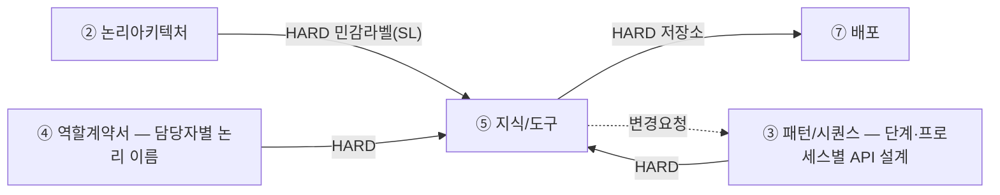

# 설계서 ⑤ 지식/도구 — 작성 가이드

## 1. 이 설계서가 답하는 질문

**"이 담당자는 무엇을 근거로 답하는가."**  
질문마다 답을 어디서 가져올지, 민감한 값을 어디서 가릴지 못 박는 문서임.

**이걸 안 하면 나는 사고 3줄**

- 집계 질문을 문서 검색에 던져 숫자가 매번 달라짐. 시연에서 무너짐
- 고객 이름·전화가 가려지지 않은 채 외부 모델로 나감. 되돌릴 수 없음
- ⑦ 배포가 저장소를 못 정해 배포 설계가 멈춤

**앞뒤 연결도**

용어 — `HARD`는 앞이 없으면 못 채움.  
②③④는 ⑤ 지식/도구보다 **먼저** 쓰므로 ⑤ 지식/도구는 앞 산출물의 값을 받아 **구체화하는 쪽**임 — 새 이름을 지어내지 않음.

**앞 산출물과 순환하지 않음 — 받기만 하고, 문제가 나오면 `변경요청` 1행만 되돌림.**

| 앞 산출물이 정한 것(논리) | 본 산출물이 정하는 것(구체) |
|------------------------|--------------------------|
| ④ 담당자가 열 수 있는 **저장소 이름과 등급** | 그 안에서 **어느 표의 어느 열까지**(담당자별 허용 열) |
| ④ `사용 정보`의 **세 갈래**(정형·의미 정보·관계 정보) | 갈래마다 **실제 스펙** — 청킹·임베딩 모델·top-k·그래프 스키마 |
| ② 논리아키텍처의 **민감정보 라벨 목록** | 민감 필드 번호(`F-n`)와 **가릴 자리**(`SL-n`)·가리는 방법 |
| ④ 부를 수 있는 **서비스·외부 시스템 이름** | **커넥터 번호·입출력 키·검증 기준** |
| ③ `모델 호출` 열의 `0회`·`N회` | 정형 경로의 **고정 쿼리 / NL2SQL** 표기 |
| ③ 프로세스별 API 설계·State 구조의 **우리 이름**(있으면) | 외부 규격 이름으로 **맞춰 주는 매핑** |

민감 필드 판정과 마스킹 지점도 여기 몫이라 ④ 역할계약서에 되물을 일이 없음.  
파 보니 표가 없거나 외부 API가 없는 필드를 요구하는 등 **나중에 드러난 사실**은 `변경요청` 1행으로 되돌림.

---

## 2. 시작 전 판정

**경로를 새로 판정하지 않음.** ③ 패턴/시퀀스와 ④ 역할계약서가 이미 갈라 놓은 것을 **읽어서 펼침.**  
표본 질문을 새로 만들어 판정하지 않음 — 없던 입력을 지어내면 앞 산출물과 답이 갈림.

**1단계 — ④ 역할계약서의 `사용 정보`를 담당자별로 펼침.**

④ 역할계약서가 담당자마다 저장소를 세 갈래로 나눠 적어 뒀음. 그것이 곧 경로 목록임.

| ④ 역할계약서의 `사용 정보` 갈래 | 이 문서가 구체화할 것 | 3절 설계항목 |
|------|------|------|
| ⑴ **정형** — 표로 된 저장소 이름 | 표·행 수 상한·담당자별 허용 열·금지 컬럼 | 정형 접근 경로 · 담당자별 허용 열 |
| ⑵ **의미 정보(RAG)** — 인덱스 이름 | 청킹·임베딩 모델·top-k·메타데이터 필터 키 | 비정형 경로 선택·정의 |
| ⑶ **관계 정보(GraphRAG)** — 그래프DB 이름 | 그래프 스키마(노드·관계 타입)·홉 수·결과 상한 | 비정형 경로 선택·정의 |

- **④ 역할계약서에 없는 저장소를 여기서 더하지 않음** — 필요하면 `변경요청` 1행을 남기고 진행함
- 그 담당자가 `0건`으로 적은 갈래는 행을 만들지 않음
- ④ 역할계약서에 세 갈래가 전부 `0건`인 담당자는 이 문서에 안 나옴(넘겨받은 값만 쓰는 담당자임)

**2단계 — 정형 갈래 안에서 고정 쿼리인가 NL2SQL인가를 ③ 패턴/시퀀스의 `모델 호출` 열로 가름.**

| 그 단계의 ③ `모델 호출` | 정형 접근 방식 | 왜 |
|------|------|------|
| `0회` | **고정 쿼리** — 사람이 SQL을 미리 박고 파라미터만 바뀜 | 모델이 없으니 SQL을 지을 주체가 없음 |
| `N회` | **NL2SQL** 가능 — 모델이 SQL 문장을 생성함 | 조건 조합이 열려 쿼리를 미리 고정 못 함 |

- **갈림 축은 답의 모양이 아니라 `쿼리를 미리 고정할 수 있나`임** — "지난달 3회 이상 방문한 회원 목록"은
  목록이지만 조건 조합이 열려 고정 못 하고, "이번 달 매출 합계"는 집계지만 고정 쿼리 1개로 끝남
- 이 축은 ③ 패턴/시퀀스 2-4의 `L1 규칙 완결성`과 같은 축이라 **③이 이미 답했음.** 여기서 뒤집지 않음
- `N회`인데 NL2SQL을 안 쓰기로 했으면 5단계 버린 대안에 1줄로 적음

용어 — NL2SQL은 말을 SQL로 바꿔 표를 조회함. 벡터 RAG는 뜻이 가까운 문단을 찾아옴.  
GraphRAG는 개체를 선으로 이어 그 선을 따라감.

**3단계 — 용어사전은 경로가 아니라 덧붙는 층임.**

사내 코드·용어를 1:1로 고정해야 하면 **위 어느 경로에든 얹음** — 정형의 코드 정규화에도,
의미 정보의 질의 확장에도 같이 씀. 경로를 고르는 배타적 분기가 아니므로 ⑴ ~ ⑶ 중 하나로 세지 않음.  
쓸지 안 쓸지와 스펙은 3절 「비정형 경로 선택·정의」에서 1행으로 적음.

**온톨로지도 별도 경로가 아님** — ⑶ 관계 정보(GraphRAG) 스펙 안에서 끝냄. 용어사전과 한 묶음으로 적지 않음.  
**다만 노드·관계 타입은 온톨로지가 아니라 `그래프 스키마`임** — 온톨로지는 그 위에 개념 계층·제약·추론
규칙이 얹힌 것이라 더 넓음. 계층·추론이 필요하면 그래프 스펙의 그 항목에 적음(안 쓰면 `해당 없음`).

**4단계 — 되돌릴 수 없는 판정에 쓰이는 필드를 확률적 경로에서 뺌.**

**틀리면 되돌릴 수 없는 판정에 쓰이는 필드는 확률에 맡기지 않음**(예: 알레르기 여부·투약 용량·본인 확인 판정).  
여기서 할 일과 ③ 패턴/시퀀스에 넘길 일이 나뉨.

| 무엇 | 누가 | 어떻게 |
|------|------|--------|
| 그 필드를 **고정 쿼리 경로로만** 가져옴 | **여기서 정함** | NL2SQL·벡터 RAG·GraphRAG 경로에 그 필드를 넣지 않음 |
| 그 필드를 **LLM 입력에서 지움** | **여기서 정함** | 담당자별 허용 열에서 빼고 커넥터 입출력 키를 만들지 않음 |
| 판정 전에 **결정론 검증 단계를 따로 둠** | **③ 패턴/시퀀스** | 단계가 늘어나므로 여기서 만들지 않고 `변경요청` 1행을 남김 |

- **단계를 늘리는 것은 이 문서가 못 함** — 단계ID를 만들 수 있는 것은 ③ 패턴/시퀀스뿐임.
  경로를 고정하고 입력에서 지우는 것까지가 이 문서의 손이 닿는 범위임
- 칸이 없으면 값이 갈 길이 없음 — 마스킹이 아니라 **아예 빼는 것**임(경계 미통과 항목과 같은 방식)
- ③ 패턴/시퀀스는 되돌릴 수 없는 쓰기를 2-3(인간 개입)·2-4(항상 `0회`)로 이미 막아 뒀음.
  여기서 더 필요한 것만 `변경요청`으로 보냄

**5단계 — 버린 대안 1줄.** "GraphRAG는 비용 때문에 뺌"처럼 남겨야 다시 판단 가능함.  
④ 역할계약서가 갈래를 정해 줬어도 **그 안에서 어떤 방식을 안 골랐는지는 이 문서가 정하는 값임.**

**이 펼침은 최종 확정이 아님.** 여기서 잡은 스펙은 **별도 품질 튜닝**에서 실제 데이터로 검증하고
그때 고침 — 5단계의 버린 대안 1줄이 그때 재판단의 근거가 됨. **이 문서에서 검증하지 않음.**  
**갈래 자체가 틀렸다고 판단되면 여기서 고치지 않고 ④ 역할계약서에 `변경요청` 1행을 남김.**

---

## 3. 설계항목 작성법

**설계항목은 3계열로 나뉨** — `3-1 정보` · `3-2 도구` · `3-3 민감·보존`.  
**검색 품질을 재는 일은 이 문서에 없음** — 골든셋·원천 오류율·통과율은 **별도 품질 튜닝**에서 다룸.
설계 단계에는 저장소 접속 정보가 없어(⑦ 배포가 정함) 실측이 성립하지 않음.  
**이 제목 구조가 곧 산출물의 목차임** — 여기 없는 절을 산출물에 만들지 않고, 여기 있는 절을 빼지도 않음.

산출물이 표인 항목은 그 자리에 표 모양을 함께 보임. **작성법은 문단으로, 산출물은 표로 씀** —
작성법을 표에 밀어 넣으면 칸 안에서 ` `로 줄을 나누게 되고 불렛을 못 씀.

---

### 3-1. 정보

2절 1단계에서 ④ 역할계약서의 `사용 정보`로 펼친 갈래를 여기서 구체화함.  
**정형정보 · 비정형정보** 두 갈래이고, **용어사전**은 둘 중 하나가 아니라 어디든 얹는 층임.

#### 정형정보

**정형 접근 경로**

- 조회할 표(테이블) 이름을 하나씩 적음 — US `[입력 요구사항]`에서 가져옴
- **경로마다 `고정 쿼리`·`NL2SQL` 중 1개를 적음** — 2절 2단계에서 ③ 패턴/시퀀스의 `모델 호출` 열로
  이미 갈렸음. 여기서 다시 판정하지 않음
- 그 표에서 무엇을 얻으려는지 목적을 1줄로 적음
- 조건으로 거르는 값(반경·기간·상태 같은 것)이 있으면 함께 적음
- 읽기 전용 계정만 씀 — 넣기·바꾸기·지우기는 이 경로에 넣지 않음
- 한 번에 가져올 행 수 상한을 숫자로 적음. 못 정했으면 `[확인필요]`로 적음
- **다른 설계서와 대조** — 경로 수가 ③ 패턴/시퀀스의 검색 단계 수와 같고, 적은 방식이
  `모델 호출` 열과 어긋나지 않음

**예시** `code_map` · `고정 쿼리` · 상한 200행 — 3방향 코드 조회

**담당자별 허용 열**

- ④ 역할계약서가 `사용 정보`에 **저장소 이름과 등급까지만** 정했으므로,
  **그 안에서 어느 열까지인지는 여기서 정함**
- **허용한 열만 적음**(금지 열을 따로 적지 않음) — 적힌 것이 곧 허용 목록이고 나머지는 조회가 거부됨
- ④ 역할계약서에 없는 저장소를 여기서 더하지 않음 — 필요하면 ④ 역할계약서에 `변경요청` 1행을 남김
- 민감 필드(`F-n`)가 허용 열에 들어가면 변환 지점(`SL-n`)이 있는지 함께 확인함
- 비정형 저장소는 열이 없으므로 여기 대신 갈래별 필터로 거름 —
  인덱스는 **메타데이터 필터 키**, 그래프DB는 **노드·관계 접근 필터**
- 그 담당자가 그 표를 안 보면 **행을 만들지 않음**
- **다른 설계서와 대조** — ④ 역할계약서의 `사용 정보`에 적힌 저장소가 전건 들어 있음

**산출물 표 모양**

| 담당자 | 표 | 허용 열 | 민감 필드 |
|--------|----|--------|----------|
| `R-2` | `diet_restriction` | `member_id` · `allergen_labels` · `diet_type` | `F-3`(`SL-2`에서 가림) |

**정형 접근 금지 컬럼**

- **정형 접근 경로(표)에만 적용됨** — 비정형 문서·커넥터 값의 제한은 이 항목이 아님
- 담당자가 못 보게 막을 열(컬럼)을 `표.열` 꼴로 하나씩 적음
- 막는 이유를 짧게 붙임(개인정보·계약금액 같은 것)
- 막을 것이 없어도 빈칸으로 두지 않고 `없음(전 항목 허용)`이라고 적음
- **기획 산출물과 대조** — US 보안 체크리스트의 금지 항목이 전건 들어 있음

**산출물 표 모양**

| `표.열` | 막는 이유 |
|--------|----------|
| `cust.phone` | 개인정보 |

#### 비정형정보

**경로 채택·미채택**

- 검토한 후보 방식을 **채택·미채택 모두 적음** — 행 수가 후보 방식 수와 같아야 함
- 미채택 방식마다 버린 이유를 1줄로 적음 — "구축 비용이 MVP 기간을 넘김" 꼴.
  "요즘 많이 씀" 같은 유행은 근거로 쓰지 않음
- 채택한 방식의 스펙은 아래 의미정보·관계정보 절에서 채움
- **④ 역할계약서가 갈래를 줬어도 그 안에서 무엇을 안 골랐는지는 이 문서가 정하는 값임**

**산출물 표 모양**

| 후보 방식 | 채택 | 이유 |
|----------|------|------|
| 의미정보(RAG) | 채택 | 표현이 달라 낱말 일치로 누락됨 |
| 관계정보(GraphRAG) | 미채택 | 구축 비용이 MVP 기간을 넘김 |
| 용어사전 | 채택 | 사내 코드가 두 뜻으로 쓰임 |

##### 의미정보(RAG)

뜻이 가까운 문단을 찾아옴. **④ 역할계약서가 인덱스 이름까지만 정했으므로 나머지는 전부 여기서 정함.**

**인덱스 스펙** — 아래 7항목을 전부 채움. 채택 안 했으면 `해당 없음`, 못 정한 항목은 `[확인필요]`로 둠.

- **인덱스명** — ④ 역할계약서에 적힌 이름을 그대로 씀
- **문서 범위·기준일** — 어느 문서를 언제 기준으로 넣었는지
- **청킹 단위/크기/중첩**
- **임베딩 모델명·버전**
- **검색방식 · top-k · 리랭킹 여부**
- **메타데이터 필터 키 이름·타입** — 못 볼 문서를 걸러내는 키. **인덱스 스키마이므로 이 문서가 정함**
  - 대개 **색인할 때 필터에 쓸 필드를 미리 선언해야** 필터가 걸림. 선언하는 방법과 부르는 이름은
    제품마다 다르므로 **쓰는 제품 문서에서 확인해 적음** — 여기에 제품별 방법을 적어 두지 않음
  - **선언하지 않은 키로 필터하면 오류가 아니라 결과 0건이 되는 제품이 있음** — 권한 필터가 조용히
    풀리고 검색 품질 문제로 오진하게 됨. 필터에 쓸 키는 **타입까지** 적어 선언 목록에 올림
  - **정하는 것은 키 이름과 타입까지임.** 그 키에 실리는 값은 두 군데서 오고 **둘 다 이 문서 것이 아님** —
    색인할 때 문서마다 붙는 값은 **문서 원천**이 가지고, 질의할 때 그 키와 비교하는 값은
    **③ 패턴/시퀀스**의 State(또는 프로세스 경계를 넘어 왔으면 프로세스별 API 설계)가 실어 줌
  - **예시** 인덱스 `설비매뉴얼_idx`에 필터 키 `공개등급`(타입 `keyword`)을 둔 경우 —
    색인 값은 그 매뉴얼 문서에 적힌 등급이고, 질의할 때 비교하는 값은 요청한 담당자의 열람 등급임
- 선택 근거 1줄

- 이 7항목을 비우면 **재색인 때 값이 달라져 이전 평가와 비교가 안 되고**,
  권한 경계를 못 걸러 못 볼 문서가 근거로 인용됨

**예시** `설비매뉴얼_idx` · 2026-07 기준 · 문단 800자/중첩 100 · top-k 5 · 리랭킹 켬

##### 관계정보(GraphRAG)

개체를 선으로 이어 그 선을 따라감. **온톨로지를 별도 경로로 세우지 않고 여기서 끝냄.**

**용어를 섞지 않음** — 노드 타입 + 관계 타입은 **그래프 스키마**임(그래프 도구들이 쓰는 이름 그대로).
온톨로지는 그 위에 **개념 계층**(상위·하위) · **정의역·치역 제약** · **추론 규칙**(전이·역관계·배타)이
얹힌 것이라 더 넓음. **대개는 스키마까지로 끝나고**, 계층·추론이 실제로 필요할 때만
아래 「개념 계층·추론 규칙」 항목을 채움.

**그래프 스펙** — 아래 8항목을 전부 채움. 채택 안 했으면 `해당 없음`, 못 정한 항목은 `[확인필요]`로 둠.

- **노드 타입 목록** · **관계(엣지) 타입·방향** — 여기까지가 **그래프 스키마**임
- **노드 고유키 규칙** — 없으면 재적재 때 노드가 중복으로 계속 불어남
- **추출·검수 방법**
- **최대 홉 수 · 결과 상한**
- **커뮤니티 요약 사용 여부**
- **노드·관계 접근 필터** — 비정형에서 **의미정보의 메타데이터 필터 키에 대응하는 자리임.** 이게 없으면
  홉을 따라가다 못 볼 노드에 닿음
  - 담당자가 **따라갈 수 있는 노드 타입·관계 타입**을 허용 목록으로 적음(적힌 것만 허용)
  - 노드 속성으로 더 거를 것이 있으면 **속성 이름과 타입**을 적음 — 이름·타입은 이 문서 것이고,
    질의할 때 비교하는 값은 ③ 패턴/시퀀스가 실어 줌(메타데이터 필터 키와 같은 구조)
  - **경유 노드에도 같은 필터가 걸리는지 적음** — 끝점만 검사하면 2홉 중간 노드로 새어 나감
  - **관계의 존재 자체도 정보임** — 노드를 가려도 `A와 B가 이어져 있다`가 남으면 안 되는 경우를 밝힘
- **개념 계층·추론 규칙** — 온톨로지 요소임. **안 쓰면 `해당 없음`으로 적고 넘어감**
  - 쓰는 경우는 하나뿐임 — **큰 말로 물었는데 작은 말로 적힌 것까지 나와야 할 때.**
    사용자는 `유제품`을 빼 달라고 하는데 문서에는 `우유`·`치즈`·`버터`로만 적혀 있으면,
    `유제품`이 그 셋의 윗말이라는 것을 어딘가에 적어 둬야 걸림
  - **윗말 – 아랫말 관계를 적고, 그것을 어디서 풀어 쓸지도 함께 적음.** 셋 중 하나임
    - **물을 때 풀기**(질의 확장) — 찾기 전에 `유제품`을 `우유·치즈·버터`로 바꿔 찾음
    - **넣을 때 풀기**(적재 시점) — 문서를 넣을 때 `우유` 문서에 `유제품` 딱지를 미리 붙여 둠
    - **찾은 뒤 풀기**(조회 시점) — 일단 찾고 나서 관계를 따라가 더 끌어옴
  - **어디서 풀지를 안 적으면 관계만 그려 놓고 검색은 그대로임** — 표에는
    `유제품 = 우유·치즈·버터`가 있는데 `유제품`으로 찾으면 아무것도 안 나옴
- 선택 근거 1줄

- **"아니다"도 관계 타입으로 세움** — `좋아함`처럼 "그렇다" 쪽만 만들면
  "이건 안 된다"를 적을 자리가 없음
  - 회원이 우유를 못 먹는다는 것은 `회원 -[제외함]-> 우유`로 **선을 따로 세워** 적음
  - 이 관계를 안 만들고 `회원 — 우유`로만 이어 두면, 선을 따라가는 쪽에서
    **좋아해서 이은 선인지 못 먹어서 이은 선인지 구별이 안 됨**
  - 구별이 안 되면 **못 먹는 것을 추천해 줌** — 빠뜨렸을 때 답이 비는 게 아니라 **정반대가 나옴**

**예시** 노드 `회원`·`식당`·`알레르기 유발물질`(우유·계란·땅콩처럼 알레르기를 일으키는 재료) /
관계 `회원 -[제외함]-> 알레르기 유발물질`(방향 있음) · 최대 2홉

#### 용어사전 — 덧붙는 층

**경로가 아님.** 사내 코드·용어를 1:1로 고정해야 할 때 **위 어느 경로에든 얹음** —
정형의 코드 정규화에도, 의미정보의 질의 확장에도 같이 씀. ⑴ ~ ⑶ 중 하나로 세지 않음.

**사전 스펙** — 아래 7항목을 전부 채움. 채택 안 했으면 `해당 없음`, 못 정한 항목은 `[확인필요]`로 둠.

- **사전 파일 위치·형식**
- **대표어·동의어 목록**
- **어디서 풀지** — 관계정보의 「개념 계층」과 **같은 셋 중에서 고름**. 이름을 다르게 부르지 않음
  - **넣을 때 풀기**(적재 시점) — 색인할 때 동의어를 미리 함께 넣어 둠
  - **물을 때 풀기**(질의 확장) — 찾기 전에 물어온 낱말을 대표어·동의어로 바꿔 찾음
  - **찾은 뒤 풀기**(조회 시점) — 일단 찾고 나서 사전으로 더 끌어오거나 걸러냄
- **보여줄 때 고를 표기** — 화면·응답에 **대표어로 통일해 보일지, 원문 그대로 보일지**.
  위 셋과 축이 다름 — 그건 무엇을 찾을지의 문제고 이건 무엇을 보여줄지의 문제임.
  안 정하면 같은 코드가 화면마다 다른 낱말로 나옴
- **어느 경로에 얹는지** — 정형 · 의미정보 · 관계정보 중. **이 칸이 비면 층이 아니라 경로로 오해됨**
- **1:N 충돌 처리 규칙** — 없으면 코드가 두 뜻일 때 **오류 없이 조용히 틀림**
- **미등록어 처리 규칙** · **갱신 주체·주기** — 없으면 신규 코드 미반영을 검색 품질 문제로 오진함

**예시** `code_map.csv` · 물을 때 풀기 · 보여줄 때는 대표어로 통일 ·
정형 + 의미정보 둘 다에 얹음 · 미등록어는 원문 유지

---

### 3-2. 도구(커넥터)

2절 1단계에서 ④ 역할계약서의 `사용 도구`로 받은 서비스·외부 시스템에 커넥터 번호를 붙이고 규격을 정함.

**입출력 키**

- 커넥터(외부 시스템에 붙는 도구)가 주고받는 값의 이름과 타입을 하나씩 적음
- **키마다 `외부규격`인지 `우리쪽`인지 표시함** — `외부규격`은 외부 시스템이 이미 정해 우리가 바꿀 수 없는
  이름이고, `우리쪽`은 우리가 실어 보내는 값임
- **`외부규격` 키의 주인은 본 산출물임** — 외부 문서·API 명세에 적힌 이름을 그대로 옮기고 출처를
  함께 적음. **④ 역할계약서에는 키가 아예 없음**(서비스 이름과 등급까지만 정함)
- **`우리쪽` 키가 ③ 패턴/시퀀스의 State 구조에 이미 있으면 그 이름을 그대로 베낌** — 거기 없는
  값(그 호출 직전에만 조립돼 워크플로우가 끝날 때까지 안 남는 값)은 이 문서가 새로 이름 붙임
- 둘 사이에 이름이 다르면 **맞춰 주는 자리(매핑)를 1행으로 적음** — 이름이 다른 것 자체는 정상임
- ② 논리아키텍처에서 경계를 못 통과한 항목은 **키 자체를 만들지 않음** — 가리는(마스킹) 것이 아니라
  아예 빼는 것임. 키로 넣어 두고 "안 씀"이라고만 적으면 안 됨
- **다른 설계서와 대조** — `우리쪽` 키 중 State 필드에서 온 것은 ③ 패턴/시퀀스의 State 구조와
  **문자열까지 같음**

**산출물 표 모양**

| 키 | 타입 | 구분 | 출처 · 매핑 |
|----|------|------|------------|
| `facility_id` | string | `외부규격` | GIS API v2 ← `facilityId`(`우리쪽`) |

**검증 기준**

- 그 커넥터가 어느 선을 넘으면 합격인지 합격선을 숫자로 적음. 못 정했으면 `[확인필요]`
- 부르는 순서까지 맞아야 정답으로 볼 것인지 함께 적음 — **순서가 틀리면 부분 점수 없이 0점임**
- "잘 붙으면 됨"처럼 재는 방법이 없는 말은 쓰지 않음
- 커넥터마다 1줄 — 입출력 키를 적은 커넥터 수와 같아야 함

**예시** 호출 순서까지 일치 시 정답

**Mock·실물 구분**

- 커넥터마다 `Mock`·`실물` 중 하나를 적음 — 실제 시스템에 붙는지, 흉내만 내는 가짜(Mock)인지
- **목록은 여기 두되 값의 주인은 ② 논리아키텍처임** — 여기서 새로 정하지 않고 그대로 베낌
- 값이 다르면 ② 논리아키텍처를 따르고, **다르다는 사실만 1행 남김**

**산출물 표 모양**

| 커넥터 | `Mock`·`실물` | ② 논리아키텍처와 |
|--------|--------------|-----------------|
| `C-1` GIS 조회 | `Mock` | 같음 |

**사용 주체**

- 그 커넥터를 누가 부르는지 적음 — ③ 패턴/시퀀스의 어느 단계, ④ 역할계약서의 어느 담당자인지.
  단계 이름은 ③ 패턴/시퀀스의 **문자열을 그대로 씀**
- **같은 외부 시스템을 요청 경로와 배치 경로가 함께 쓰면 둘 다 적음**
- 빈칸으로 두면 **⑦ 배포가 접속 정보를 둘 곳을 못 정하고** 구현에서 배치 경로가 요청 경로의
  설정을 그대로 쓰게 됨 — ④ 역할계약서는 이 문서보다 먼저 쓰므로 여기 값을 못 봄

**예시** `동기화 워커 · 길찾기만`(요청은 캐시)

**키 이름은 두 문서가 층을 나눠 소유함** — 각자 **자기가 실제로 정할 수 있는 것**만 가짐.  
**④ 역할계약서는 키를 하나도 갖지 않음** — 저장소·도구의 이름과 등급까지만 정함.

| 무엇 | 주인 | 왜 그쪽인가 |
|------|------|------------|
| **State 필드 이름** — 워크플로우가 끝날 때까지 남는 값 | ③ 패턴/시퀀스 | 이름 없이는 `필드당 갱신 주체 1개`를 못 씀 |
| **프로세스별 API 설계의 엔드포인트·요청/응답 키 이름** — 프로세스 경계를 넘는 값 | ③ 패턴/시퀀스 | 담당자 묶음이 바뀌어도 안 변하고 흐름이 바뀌면 변함 |
| **커넥터 `외부규격` 키** — 외부 시스템이 정한 이름 | **⑤ 지식/도구(본 산출물)** | 외부가 이미 정해 우리가 개명할 수 없음 |
| **메타데이터 필터 키** — 인덱스에 선언한 필터 필드 이름·타입 | **⑤ 지식/도구(본 산출물)** | 색인할 때 선언해야 필터가 걸리므로 인덱스를 만드는 쪽이 가짐. **이름만 가짐** — 질의할 때 비교하는 값은 ③ 패턴/시퀀스가 실어 줌 |

③ 패턴/시퀀스의 키가 이상해도 여기서 고치지 않고 `변경요청` 1행으로 되돌림.

---

### 3-3. 민감·보존

정형·비정형·커넥터 **셋 다에 걸치는 항목임.** 그래서 갈래마다 따로 적지 않고 여기 한 곳에 모음.

**민감 필드 ID(`F-n`)**

- 민감 필드마다 `F-1`·`F-2`처럼 번호를 붙임 — **번호의 주인은 이 문서임**
- **어떤 필드가 민감한지는 ② 논리아키텍처의 민감정보 라벨 목록에서 옴.** 여기서 판정하지 않고
  번호를 붙이고 가릴 자리를 정함
- ② 논리아키텍처의 민감정보 목록보다 **적을 수 없음** — 파 보고 더 찾으면 늘어남
- 파 보다 ② 논리아키텍처에 없던 필드를 찾으면 **기존 번호는 그대로 두고 뒤에 새 번호를 더함**.
  번호를 다시 매기지 않음 — ⑥ 가드레일/관측이 이미 인용하고 있을 수 있음
- **④ 역할계약서에는 민감 필드가 없음** — ④ 역할계약서는 저장소·도구 이름과 등급까지만 정하고
  민감 필드 판정은 하지 않음. `F-n`을 받아 쓰는 곳은 **⑥ 가드레일/관측의 마스킹**임
- 키 이름 3분할과는 **별개 층임** — `F-n`은 키 이름이 아니라 필드 분류 번호임

**변환 지점(`SL-n`)**

- **`F-n` 하나마다 변환 지점 1개** — 빠진 `F-n`이 있으면 못 가린 필드가 그대로 나감
- 민감한 값을 가리는 자리를 ② 논리아키텍처의 경계 식별자(`SL-n`)로 콕 집어 적음
- 어떻게 가리는지도 함께 적음(별표 처리·해시로 바꾸기·아예 제외)
- 식별자 문자열이 칸에 그대로 들어가야 함 — "서비스에서 적절히"처럼 자리를 안 가리키는 말은 안 됨

**산출물 표 모양** — `F-n`과 한 표에 담음(행마다 1:1이라 두 표로 나누지 않음)

| `F-n` | 필드 | 변환 지점 | 가리는 방법 |
|-------|------|----------|------------|
| `F-2` | 좌표 | `SL-2` 모델 직전 | 반경 1km로 뭉갬 |

**보존·삭제**

- 그 데이터를 얼마나 오래 두는지 기간을 숫자와 단위로 적음. 못 정했으면 `[확인필요]`
- 지우는 방식과 주기를 적음(월 1회 일괄 파기 같은 것)
- 그 기간을 **US 컴플라이언스에서 인용하고 출처를 함께 적음** — "회사 규정대로"는 출처가 아님

**예시** 개통 완료 후 3년

**접근 제한 4종의 경계** — 이름이 비슷해 헷갈리기 쉬움. **막는 층이 달라 하나로 합쳐 적지 않음.**  
**갈래마다 하나씩 있음** — 정형·의미정보·관계정보 각각에 제 몫의 필터가 있고, 그 위에 값을 가리는 층이 얹힘.

| 무엇 | 어디 | 막는 층 |
|------|------|--------|
| `정형 접근 금지 컬럼` | 3-1 정형정보 | `표.열`을 **아예 조회 안 함** |
| `메타데이터 필터 키` | 3-1 의미정보 | 비정형 문서 중 **못 볼 것을 걸러냄** |
| `노드·관계 접근 필터` | 3-1 관계정보 | 따라갈 수 있는 **노드·관계를 제한함**(경유 노드 포함) |
| `변환 지점(SL-n)` | 3-3 여기 | **조회는 되나 값을 가림** |

**갈래를 채택했으면 그 갈래의 필터 칸이 비어 있을 수 없음** — 비면 그 갈래만 권한 경계가 없는 상태가 됨.

## 4. 제출 전 자가 점검표

**앞 산출물에서 읽어 온 것**

- [ ] **경로 갈래가 ④ 역할계약서의 `사용 정보` 3갈래에서 온 것임** — ④에 없는 저장소로 만든 경로 0건
- [ ] **표본 질문으로 경로를 새로 판정한 곳이 0건임** — 사용자가 칠 문장을 이 문서에 만들지 않음
- [ ] 정형 경로마다 `고정 쿼리`·`NL2SQL` 중 하나가 적혔고, **③ 패턴/시퀀스의 `모델 호출` 열과
      어긋난 행 0건**(`0회`인데 NL2SQL이거나, `N회`인데 근거 없이 고정 쿼리인 경우)
- [ ] **이 문서에서 새 단계를 만든 곳이 0건임** — 단계가 필요하면 ③ 패턴/시퀀스로 `변경요청` 1행을 보냈음
- [ ] 민감 필드가 **② 논리아키텍처의 민감정보 라벨 목록**에서 왔고, 그 목록보다 적지 않음
- [ ] 커넥터 `우리쪽` 키 중 State 필드에서 온 것이 ③ 패턴/시퀀스의 State 구조 이름과 어긋난 건수 0건
- [ ] ② 논리아키텍처의 `경계 미통과 항목`이 커넥터 입출력 키에 **하나도 없음**
      (마스킹이 아니라 키 자체를 뺐는지 확인)
- [ ] **`~와 대조` 불렛 4건을 숫자로 세어 판정했음** — 정형 접근 경로(③과 경로 수) ·
      담당자별 허용 열(④와 저장소 전건) · 정형 접근 금지 컬럼(US와 금지 항목 전건) ·
      입출력 키(③과 문자열 일치). **4건 말고는 대조할 앞 값이 없는 항목임**(이 문서가 처음 정하는 값)

**산출물 구성**

- [ ] **절 구성이 3절의 3계열 제목과 같음**(`정보` — 정형정보·비정형정보·용어사전 / `도구` /
      `민감·보존`). 3절에 없는 절 0건, 3절에 있는데 빠진 절 0건
- [ ] 「산출물 표 모양」을 보인 6항목이 표로 적혔고 나머지는 목록임

**정보**

- [ ] 정형 접근 경로에 데이터 행이 1행 이상 있고 `정형 접근 금지 컬럼` 공란이 0건임
      (막을 것이 없으면 `없음(전 항목 허용)`)
- [ ] `경로 채택·미채택` 표의 행 수 = **후보 방식 수**(채택·미채택 표기 포함)
- [ ] 채택한 방식마다 스펙이 전부 채워져 있음 — **의미정보 7항목** · **관계정보 8항목** ·
      **용어사전 7항목**. 미채택 방식은 `해당 없음`
- [ ] **메타데이터 필터 키마다 타입이 적혀 있고, 쓰는 제품의 선언 방법을 확인해 적었음** —
      선언 안 된 키로 필터하면 오류 없이 결과 0건이 되는 제품이 있어 권한 필터가 조용히 풀림
- [ ] 노드·관계 타입을 `온톨로지`라고 부른 곳이 **0건**임 — 그건 `그래프 스키마`이고, 계층·추론을
      쓰면 `개념 계층·추론 규칙` 항목에 적혔고 안 쓰면 `해당 없음`임
- [ ] 관계정보 스펙에 **부정 관계**가 관계 타입으로 세워져 있음(`제외함`·`선택 안 함` 같은 것)
- [ ] **`어디서 풀지`를 관계정보와 용어사전이 같은 이름으로 적었음**(넣을 때 / 물을 때 / 찾은 뒤)
- [ ] 용어사전을 채택했으면 **어느 경로에 얹는지**가 적혀 있음(배타적 경로로 세지 않았음)
- [ ] 경로마다 `버린 대안` 1줄이 있음

**권한 경계**

- [ ] **채택한 갈래마다 접근 제한 칸이 채워져 있음** — 정형=금지 컬럼 · 의미정보=메타데이터 필터 키 ·
      관계정보=노드·관계 접근 필터. 채택했는데 빈 갈래 **0건**
- [ ] 관계정보를 채택했으면 접근 필터에 **경유 노드 검사 여부**가 적혀 있음
      (끝점만 검사하면 중간 노드로 새어 나감)
- [ ] **되돌릴 수 없는 판정에 쓰이는 필드가 확률적 경로(NL2SQL·벡터 RAG·GraphRAG)에 배정된 행 0건**
- [ ] 담당자별 허용 열이 ④ 역할계약서의 `사용 정보`에 적힌 저장소 **전건**을 덮음

**민감·보존**

- [ ] `F-n` 하나마다 변환 지점이 1개씩 있음(빠진 `F-n` 0건)
- [ ] `변환 지점` 칸 전부에 ② 논리아키텍처의 경계 식별자 문자열이 들어감
- [ ] 보존 기간·삭제 주기 숫자를 US 컴플라이언스에서 인용했고 출처를 적음
- [ ] 접근 제한 4종을 **하나로 합쳐 적지 않았음**

- [ ] 쓰기 SQL 금지가 문장으로 있고, 행 수 상한이 숫자이거나 `[확인필요]`로 되물어진 상태임
- [ ] `[확인필요]` 전부가 말미 미확정 항목 표에 1행씩 있음
