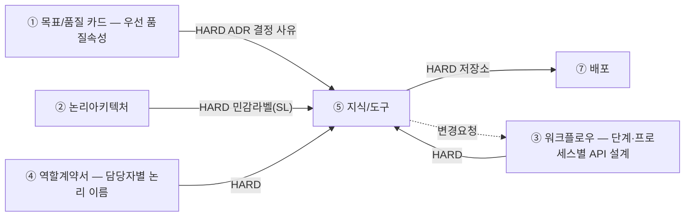

# 설계서 ⑤ 지식/도구 — 작성 가이드

---

- [설계서 ⑤ 지식/도구 — 작성 가이드](#설계서--지식도구--작성-가이드)
  - [1. 이 설계서가 답하는 질문](#1-이-설계서가-답하는-질문)
  - [2. 시작 전 판정](#2-시작-전-판정)
  - [3. 설계항목 작성법](#3-설계항목-작성법)
    - [3-1. 정보](#3-1-정보)
      - [정형정보](#정형정보)
      - [비정형정보](#비정형정보)
        - [의미정보(RAG)](#의미정보rag)
        - [관계정보(GraphRAG)](#관계정보graphrag)
        - [외부검색(웹·영상)](#외부검색웹영상)
      - [용어사전: 덧붙는 층](#용어사전-덧붙는-층)
      - [질의 전처리(Pre): 덧붙는 층](#질의-전처리pre-덧붙는-층)
      - [결과 후처리(Post): 덧붙는 층](#결과-후처리post-덧붙는-층)
      - [검색 판정 기준값](#검색-판정-기준값)
    - [3-2. 도구(커넥터)](#3-2-도구커넥터)
    - [3-3. 민감·보존](#3-3-민감보존)
    - [3-4. 스펙 결정 ADR(Architectural Decision Record)](#3-4-스펙-결정-adrarchitectural-decision-record)
  - [4. 제출 전 자가 점검표](#4-제출-전-자가-점검표)

---

## 1. 이 설계서가 답하는 질문

**"이 담당자는 무엇을 근거로 답하는가."**  
질문마다 답을 어디서 가져올지, 민감한 값을 어디서 가릴지 못 박는 문서임.

**이걸 안 하면 나는 사고 3줄**

- 집계 질문을 문서 검색에 던져 숫자가 매번 달라짐. 시연에서 무너짐
- 고객 이름·전화가 가려지지 않은 채 외부 모델로 나감. 되돌릴 수 없음
- ⑦ 배포가 저장소를 못 정해 배포 설계가 멈춤

**앞뒤 연결도**

용어 — `HARD`는 앞이 없으면 못 채움.  
②③④는 ⑤ 지식/도구보다 **먼저** 쓰므로 ⑤ 지식/도구는 앞 산출물의 값을 받아 **구체화하는 쪽**임 — 새 이름을 지어내지 않음.

**앞 산출물과 순환하지 않음 — 받기만 하고, 문제가 나오면 `변경요청` 1행만 되돌림.**

| 앞 산출물이 정한 것(논리) | 본 산출물이 정하는 것(구체) |
|------------------------|--------------------------|
| ④ 담당자가 열 수 있는 **저장소 이름** | 그 안에서 **어느 테이블의 어느 열까지**(담당자별 허용 열) |
| ④ `사용 정보`의 **세 가지 사용 지식 유형**(정형·의미 정보·관계 정보) | 사용 지식 유형마다 **실제 스펙** — 청킹·임베딩 모델·top-k·그래프 스키마 |
| ② 논리아키텍처의 **민감정보 라벨 목록** | 민감 필드 번호(`F-n`)와 **가릴 자리**(`SL-n`)·가리는 방법 |
| ④ 부를 수 있는 **서비스·외부 시스템 이름** | **커넥터 번호·입출력 키·검증 기준** |
| ③ `모델 호출` 열의 `0회`·`N회` | 정형 경로의 **고정 쿼리 / NL2SQL** 표기 |
| ③ 프로세스별 API 설계·State 구조의 **우리 이름**(있으면) | 외부 규격 이름으로 **맞춰 주는 매핑** |
| ① 목표/품질 카드의 **우선 품질속성 3개** | 스펙 값을 그렇게 잡은 **결정 사유**(3-4 스펙 결정 ADR) |

민감 필드 판정과 마스킹 지점도 여기 몫이라 ④ 역할계약서에 되물을 일이 없음.  
파 보니 테이블이 없거나 외부 API가 없는 필드를 요구하는 등 **나중에 드러난 사실**은 `변경요청` 1행으로 되돌림.

---

## 2. 시작 전 판정

**경로를 새로 판정하지 않음.** ③ 워크플로우와 ④ 역할계약서가 이미 갈라 놓은 것을 **읽어서 펼침.**  
표본 질문을 새로 만들어 판정하지 않음 — 없던 입력을 지어내면 앞 산출물과 답이 갈림.
  
**사용 지식 유형 자체가 틀렸다고 판단되면 여기서 고치지 않고 ④ 역할계약서에 `변경요청` 1행을 남김.**

**이 절은 사용 지식만 다룸 — 도구(커넥터)는 시작 전 판정이 없음.**
- 사용 도구에 대해선 ④ 역할계약서 표B에서 각 단계별로 정의함 
  어느 단계가 어느 서비스를 어떤 등급으로 쓰는지까지 정해져 있음
- 이 문서가 도구에 더할 것은 커넥터 번호(`C-n`)·입출력 키·검증 기준뿐이라
  판정 없이 3-2 「도구(커넥터)」에서 바로 구체화함
- **다만 웹·영상 검색 도구는 근거를 만들어 오므로 지식 쪽에도 자리가 있음**: 호출 규격은 3-2가,
  근거로서의 품질(대상·기간·정렬·본문 확보·인용 표기)은 3-1 「외부검색」이 정함. 판정은 여기서 하지 않음
- 사용 지식에만 판정이 남는 이유: 고정 쿼리/NL2SQL(2단계), 용어사전·온톨로지의 자리(3단계),
  확률적 경로 배제(4단계)처럼 **④가 정하지 않은 갈림길**이 지식 쪽에는 있기 때문임
  
**1단계 — ④ 역할계약서의 `사용 정보`를 담당자별로 펼침.**

④ 역할계약서가 담당자마다 저장소를 세 가지 사용 지식 유형으로 나눠 적어 뒀음. 그것이 곧 경로 목록임.

| ④ 역할계약서 `사용 정보`의 사용 지식 유형 | 이 문서가 구체화할 것 | 3절 설계항목 |
|------|------|------|
| ⑴ **정형** — 테이블로 된 저장소 이름 | 테이블·행 수 상한·담당자별 허용 열·금지 컬럼 | 정형 접근 경로 · 담당자별 허용 열 |
| ⑵ **의미 정보(RAG)** — 벡터DB명 | 청킹·임베딩 모델·top-k·메타데이터 필터 키 | 비정형 경로 선택·정의 |
| ⑶ **관계 정보(GraphRAG)** — 그래프DB 이름 | 그래프 스키마(노드·관계 타입)·홉 수·결과 상한 | 비정형 경로 선택·정의 |

- **④ 역할계약서에 없는 저장소를 여기서 더하지 않음** — 필요하면 `변경요청` 1행을 남기고 진행함
- 그 담당자가 `0건`으로 적은 사용 지식 유형은 행을 만들지 않음
- ④ 역할계약서에 세 사용 지식 유형이 전부 `0건`인 담당자는 이 문서에 안 나옴(넘겨받은 값만 쓰는 담당자임)

**2단계 — 정형 사용 지식 유형에서 NL2SQL이 가능한 단계인지를 ③ 워크플로우의 `모델 호출` 열로 가름.**

NL2SQL은 모델이 SQL을 짓는 방식이므로 **모델 호출이 있는 단계(`N회`)에서만 쓸 수 있음.**

| 그 단계의 ③ `모델 호출` | 정형 접근 방식 | 왜 |
|------|------|------|
| `0회` | **고정 쿼리** — 사람이 SQL을 미리 박고 파라미터만 바뀜 | 모델이 없으니 SQL을 지을 주체가 없음 |
| `N회` | **NL2SQL** 가능 — 모델이 SQL 문장을 생성함 | 질문마다 조건이 달라져 쿼리를 미리 고정 못 함 |

- **어떤 방식을 쓸지는 답의 모양이 아니라 `쿼리를 미리 고정할 수 있나`임** 
   예를 들어 "지난달 3회 이상 방문한 회원 목록"에서 기간, 횟수, 회원 유형의 조건이 달라진다면 NL2SQL 사용하고,   
   조건이 달라지지 않는다면 '고정 쿼리'방식을 사용함  

- 워크플로우 설계는 모델의 유무까지 정의함: `0회` 단계에 NL2SQL을 넣으면 없던 모델 호출이 생겨
  설계가 깨지므로 여기서 뒤집지 않음. `N회`에서 실제 사용 여부는 이 문서가 정함
  (이 축은 ③ 워크플로우의 `L1 규칙 완결성(상황별 예외 없이 규칙만으로 적용 가능)` 판정과 같은 축임)
- `N회`인데 NL2SQL을 안 쓰기로 했으면 5단계 버린 대안에 1줄로 적음

> 용어 NL2SQL은 말을 SQL로 바꿔 테이블을 조회함. 벡터 RAG는 뜻이 가까운 문단을 찾아옴.  
> GraphRAG는 개체를 선으로 이어 그 선을 따라감.

**3단계 — 용어사전은 경로가 아니라 덧붙는 층임.**

**용어사전:**       
- 용어사전은 특정 경로에 종속되지 않는 **횡단 계층(cross-cutting layer)**임
- 사내 코드·용어를 표준 표현과 1:1로 대응시켜야 하면 어느 경로에든 **전처리 층으로 결합**함  
  정형 경로에서는 **코드 정규화**에 의미 정보 경로에서는 **질의 확장(query expansion)**에 같은 사전을 씀
- 따라서 용어사전은 정형정보, 의미정보, 관계정보와 동등한 **네 번째 경로**로 추가하지 않음
- 채택 여부와 스펙은 3절 「비정형 경로 선택·정의」에 1행으로 적음

**온톨로지**
- **온톨로지는 층이 여러 개임**: 아래 표처럼 이 문서가 그 층을 세 자리에 나눠 적음
- 따라서 온톨로지는 ⑶ 관계 정보(GraphRAG) 안에서 다루고, **별도 경로로 추가하지 않음**

| 온톨로지 층 | 이 문서에서 적는 자리 |
|-----------|------------------|
| 용어 목록 · 동의어 | **용어사전**(횡단 계층) |
| **개념과 관계 정의** | **⑴ 노드 타입 · 관계 타입** — 그래프 도구들은 이 층을 `그래프 스키마`라고 부름 |
| 계층 · 추론 규칙 | **⑶ 개념 계층·추론 규칙**(안 쓰면 `해당 없음`) |

- **`온톨로지`라는 이름만 붙이고 위 층을 비워 두지 않음**: 노드·관계 타입만 그려 놓고 설계가
  끝났다고 하지 않고, 계층·추론이 필요한지 ⑶에서 판단해 적음
- 산출물에서 용어사전과 ⑶을 **한 묶음으로 적지 않음**: 용어사전은 어느 경로에든 얹는 횡단 계층이고
  ⑶은 관계정보의 스펙 항목임

**4단계 — 되돌릴 수 없는 판정에 쓰이는 필드를 확률적 경로에서 뺌.**

**틀리면 되돌릴 수 없는 판정에 쓰이는 필드는 확률에 맡기지 않음**(예: 알레르기 여부·투약 용량·본인 확인 판정).  
여기서 할 일과 ③ 워크플로우에 넘길 일이 나뉨.

| 무엇 | 누가 | 어떻게 |
|------|------|--------|
| 불가역 필드를 **고정 쿼리 경로로만** 가져옴 | **여기서 정함** | NL2SQL·벡터 RAG·GraphRAG 경로에 그 필드를 넣지 않음 |
| 불가역 필드를 **LLM 입력에서 지움** | **여기서 정함** | 담당자별 허용 열에서 빼고 커넥터 입출력 키를 만들지 않음 |
| 판정 전에 **결정론 검증 단계를 따로 둠** | **③ 워크플로우** | 단계가 늘어나므로 여기서 만들지 않고 `변경요청` 1행을 남김 |

- **단계를 늘리는 것은 이 문서가 못 함** — 단계ID를 만들 수 있는 것은 ③ 워크플로우뿐임.
  경로를 고정하고 입력에서 지우는 것까지가 이 문서의 손이 닿는 범위임
- ③ 워크플로우는 되돌릴 수 없는 쓰기를 이미 막아 뒀음.
  여기서 더 필요한 것만 `변경요청`으로 보냄

**5단계 — 버린 대안 1줄.** "GraphRAG는 비용 때문에 뺌"처럼 남겨야 다시 판단 가능함.    
- ④ 역할계약서가 사용 지식 유형을 정해 줬어도 **그 안에서 어떤 방식을 안 골랐는지는 이 문서가 정하는 값임.**
- **(참고) 설계 결과는 최종 확정이 아님**   
  - 스펙의 검증(측정)은 개발 단계가 함: 원천 오류율은 `02-dataset`, 골든셋·통과율은 `09-eval`이 잼
  - 측정 결과로 스펙(청킹·top-k·리랭킹 같은 것)을 고치는 튜닝은 **개발자의 몫**임:
    위 버린 대안 1줄이 그때 재판단의 근거가 됨
  - **품질 검증·튜닝 모두 이 문서의 일이 아님**: 여기서는 참고로만 알아 둠  

---

## 3. 설계항목 작성법

**설계항목은 3계열로 나뉨** — `3-1 정보` · `3-2 도구` · `3-3 민감·보존`.
그 뒤에 **`3-4 스펙 결정 ADR`** 1절을 둠: 스펙 값을 왜 그렇게 잡았는지를 여기 한 곳에 모음.  
**이 제목 구조가 곧 산출물의 목차임** — 여기 없는 절을 산출물에 만들지 않고, 여기 있는 절을 빼지도 않음.

- 산출물이 표인 항목은 그 자리에 표 모양을 함께 보임
- **작성법은 문단으로, 산출물은 표로 씀**: 작성법을 표에 밀어 넣으면 칸 안에서 ` `로
  줄을 나누게 되고 불렛을 못 씀

**칸의 값은 세 종류임: `초기값`은 그렇게 표시함**

설계 단계에는 접속 정보도 실데이터도 없음(2절 5단계). 그래서 아래 3절의 칸 중 일부는
**지금 확정할 수 없는 값**임. 확정할 수 없는데 숫자를 적어 두면 개발이 실측 후 바꾸고,
그때부터 설계서와 코드가 갈려 **어느 쪽이 진짜인지 모르게 됨**(이 체계가 가장 경계하는 상태임).

| 종류 | 무엇 | 표기 | 예 |
|------|------|-----|-----|
| **확정값** | 지금 근거가 있는 것 | 값만 적음 | 저장소명 · 제품 · 모델 ID · 차원 수 · 필터 키 이름·타입 · 노드·관계 타입 · 허용 열 · 금지 컬럼 |
| **초기값** | 실측 전 출발점 | **값 앞에 `초기값`을 붙임** | 청크 크기 · 중첩 · top-k · 후보 수 · 융합 파라미터 · 색인 파라미터 · 유사도 임계값 |
| **판정 기준** | 값이 아니라 **무엇을 보고 고칠지** | 문장으로 적음 | "재현율 목표 미달이면 하이브리드로" |

- **`초기값` 표시가 있으면 개발의 튜닝이 설계 위반이 아니라 예정된 절차가 됨**:
  표시가 없으면 같은 변경이 "설계서와 다르게 만든 것"으로 읽힘
- **`초기값`인 칸도 비워 두지 않음**: 출발점이 없으면 개발이 처음 돌릴 값을 지어냄
- **`3-4 스펙 결정 ADR`은 확정값의 사유를 받는 자리임**: `초기값`은 사유가 아니라
  **무엇을 보고 고칠지**를 함께 적음(위 `판정 기준`)
- 어느 종류인지 헷갈리면 이렇게 가름: **접속해 재 보지 않아도 답이 정해지면 확정값**,
  재 봐야 알면 `초기값`임

---

### 3-1. 정보

2절 1단계에서 ④ 역할계약서의 `사용 정보`로 펼친 사용 지식 유형을 여기서 구체화함.

**세 층으로 나뉨**

| 층 | 무엇 | 적용 범위 |
|----|------|---------|
| **경로별 스펙** | 정형정보 · 비정형정보(의미정보 · 관계정보 · **외부검색**) | 그 경로만 |
| **횡단 계층 3종** | 용어사전 · **질의 전처리(Pre)** · **결과 후처리(Post)** | 여러 경로에 얹힘. 경로로 세지 않음 |
| **검색 판정 기준값** | ③이 만든 판정 단계가 쓸 판정 종류 · 임계값 · 보낼 경로 | **정보 검색 워크플로우 패턴은 ③ 2-2 소유**. 여기서 정하지 않음 |

- **외부검색은 ④ `사용 정보`가 아니라 표B `사용도구·외부`에서 옴**: 우리가 색인해 둔 저장소가
  아니라 남의 API라 도구로 승인됨. 그래서 여기서는 **근거로서의 품질만** 정하고 호출 규격은 3-2가 정함
- **횡단 계층은 `어느 경로에 얹는지`를 반드시 적음**: 이 칸이 비면 층이 아니라 경로로 오해됨

#### 정형정보

**정형 접근 경로**

- 조회할 테이블 이름을 하나씩 적음: US `[입력 요구사항]`에서 가져옴
- **경로마다 `고정 쿼리`·`NL2SQL` 중 1개를 적음**: 2절 2단계에서 ③ 워크플로우의 `모델 호출` 열로
  이미 갈렸음. 여기서 다시 판정하지 않음
- 그 테이블에서 무엇을 얻으려는지 목적을 1줄로 적음
- 조건으로 거르는 값(반경·기간·상태 같은 것)이 있으면 함께 적음
- 읽기 전용 계정만 씀: 생성, 수정, 삭제는 이 경로에 넣지 않음
- 한 번에 가져올 행 수 상한을 숫자로 적음. 못 정했으면 `[확인필요]`로 적음
- **다른 설계서와 대조**: 경로 수가 ③ 워크플로우의 검색 단계 수와 같고, 적은 방식이
  `모델 호출` 열과 어긋나지 않음

**예시** `code_map` · `고정 쿼리` · 상한 200행: 3방향 코드 조회

**담당자별 허용 열**

- ④ 역할계약서가 `사용 정보`에 **저장소 이름까지만** 정했으므로,
  **그 안에서 어느 열까지인지는 여기서 정함**(접근 등급은 표A에 없고 표B `사용도구`에 있음)
- **허용한 열만 적음**(금지 열을 따로 적지 않음): 적힌 것이 곧 허용 목록이고 나머지는 조회가 거부됨
- ④ 역할계약서에 없는 저장소를 여기서 더하지 않음: 필요하면 ④ 역할계약서에 `변경요청` 1행을 남김
- 민감 필드(`F-n`)가 허용 열에 들어가면 3-3 「변환 지점(`SL-n`)」에 그 필드를 가리는 행이
  있는지 **확인만** 함: 가릴 자리와 방법을 정하는 곳은 여기가 아니라 `3-3 민감·보존`임
- 이 표는 **정형 저장소만** 다룸: 비정형 저장소는 여기서 정의하지 않음
  (비정형의 접근 제한은 각 스펙 항목과 3-3 「접근 제한 4종의 경계」가 다룸)
- **다른 설계서와 대조**: ④ 역할계약서의 `사용 정보`에 적힌 **정형** 저장소가 전건 들어 있음

**산출물 표 모양**

| 담당자 | 테이블 | 허용 열 | 민감 필드 |
|--------|----|--------|----------|
| `R-D2` | `diet_restriction` | `member_id` · `allergen_labels` · `diet_type` | `F-3`(`SL-2`에서 가림) |

**정형 접근 금지 컬럼**

- **정형 접근 경로(테이블)에만 적용됨**: 비정형 문서·커넥터 값의 제한은 이 항목이 아님
- 담당자가 못 보게 막을 테이블과 열(컬럼)을 하나씩 적음
- 막는 이유를 짧게 붙임(개인정보·계약금액 같은 것)
- 막을 것이 없어도 빈칸으로 두지 않고 `없음(전 항목 허용)`이라고 적음
- **기획 산출물과 대조**: US 보안 체크리스트의 금지 항목이 전건 들어 있음

**산출물 표 모양**

| 테이블 | 열 | 막는 이유 |
|--------|----|----------|
| `cust` | `phone` | 개인정보 |

---

#### 비정형정보

**경로 채택·미채택**

- 검토한 후보 방식을 **채택·미채택 모두 적음**: 행 수가 후보 방식 수와 같아야 함
- 미채택 방식마다 버린 이유를 1줄로 적음: "구축 비용이 MVP 기간을 넘김" 꼴.
  "요즘 많이 씀" 같은 유행은 근거로 쓰지 않음
- 채택한 방식의 스펙은 아래 의미정보·관계정보 절에서 채움
- **④ 역할계약서가 사용 지식 유형을 줬어도 그 안에서 무엇을 안 골랐는지는 이 문서가 정하는 값임**

**산출물 표 모양**

| 후보 방식 | 채택 | 이유 |
|----------|------|------|
| 의미정보(RAG) | 채택 | 표현이 달라 낱말 일치로 누락됨 |
| 관계정보(GraphRAG) | 미채택 | 구축 비용이 MVP 기간을 넘김 |
| 용어사전 | 채택 | 사내 코드가 두 뜻으로 쓰임 |

##### 의미정보(RAG)

뜻이 가까운 문단을 찾아옴. **④ 역할계약서가 벡터DB명까지만 정했으므로 나머지는 전부 여기서 정함.**

**스펙을 두 표로 나눠 적음**: 넣을 때 정해지는 값(**구축 스펙 12열**)과 찾을 때 정해지는 값
(**검색 스펙 7열**)임. 두 표는 `벡터DB명`으로 이어지고, 채택 안 했으면 `해당 없음`,
못 정한 칸은 `[확인필요]`로 둠.

**구축 스펙 12열**

| 열 | 적을 값 |
|----|--------|
| 벡터DB명 | ④ 역할계약서에 적힌 이름을 그대로 씀 |
| 제품·계열 | 제품과 색인 계열을 함께 적음(`Qdrant(HNSW)`·`FAISS(IVF)`). 미정이면 `[확인필요: 벡터DB 제품]` |
| 색인 파라미터 | 근사 색인(HNSW·IVF 계열)을 쓸 때의 값. **이름은 제품이 부르는 대로 적음**: 같은 값을 제품마다 다른 이름으로 부르므로 남의 표기를 옮겨 적으면 개발이 헤맴. **청크가 1만 개 미만으로 추정되면 근사 색인을 안 쓰고 `완전탐색`으로 적고 이 칸은 `해당 없음`**(아래 설명) |
| 소스문서 | 무엇을 넣었는지 종류로 적음(`설비 매뉴얼 PDF`) |
| 건수 | 그 종류의 문서 수를 숫자로 적음(`42건`). 재색인 때 늘거나 줄었는지 대조하는 값임 |
| 기준일 | 그 문서를 **언제 기준으로** 넣었는지. 비면 재색인 때 무엇이 달라졌는지 못 가림 |
| 전처리 | 임베딩할 텍스트를 만들기까지 손대는 것 4가지: **추출**(파서·OCR 여부) · **걸러낼 반복 요소**(머리말·꼬리말·페이지 번호) · **표·이미지 처리**(표는 마크다운으로 · 이미지는 캡션으로 또는 버림) · **색인 전 지울 값**(없으면 `해당 없음`) |
| 청크 크기 | 한 덩어리의 길이를 단위까지 적음(`800자`·`512토큰`) |
| 중첩 크기 | 덩어리 사이 겹치는 길이(오버랩). 안 겹치면 `0` |
| 구분자 | 어디서 자르는지를 값으로 적음(`\n\n` 문단 · `\n` 줄 · 마크다운 헤더). 길이로만 자르면 `없음(고정 길이)` |
| 임베딩 모델 | **모델 ID를 그대로 적음**. 대개 판이 모델 ID에 들어 있어(`text-embedding-3-large` 꼴) **`v1` 같은 버전 접미사를 만들어 붙이지 않음**: 붙이면 실제로 없는 ID가 됨 |
| 차원 수 | 그 모델이 내는 벡터 길이를 숫자로. **모델 ID가 같아도 이 값이 다르면 기존 벡터와 비교가 아예 안 됨**(차원이 달라 거리 계산이 성립하지 않음). 축소를 지원하는 모델은 축소값을 적고, 기본값을 쓰면 그 숫자를 적음 |

- **제품은 이 문서가 정함**: 임베딩 모델을 여기서 정하는데 저장소 제품만 뒤로 미루면 짝이 안 맞고,
  **⑦ 배포는 제품을 받아 접속정보·비밀값만 정함**. 색인 파라미터도 정확도↔속도 트레이드오프라
  ① 우선 품질속성과 직결되므로 3-4 ADR에 근거를 남김
- **전처리를 비우면 `구분자`가 뜻을 잃음**: 텍스트를 어떻게 뽑았는지에 따라 `\n\n`이 문단 경계가
  아닐 수 있음. 관계정보 그래프 스펙의 `추출 방법`·`검수 방법`과 같은 자리임
- **색인된 벡터는 되돌려 지우기 어려움**: 민감 필드(`F-n`)가 소스문서에 있으면 **색인 전에** 지울지를
  이 칸에서 정함(3-3 「변환 지점」과 짝을 이룸)

**작은 규모에서는 근사 색인을 쓰지 않음**
근사 색인은 **다 뒤지지 않고 가까운 것만 빨리 찾는** 방식임. 그 대가로 정확도를 조금 내주는데,
청크가 적으면 **내줄 이유가 없음**: 다 뒤져도 빠르고 정확도는 100%임.

| 규모 | 무엇을 쓰나 | 색인 파라미터 칸 |
|------|-----------|---------------|
| 청크 1만 개 미만 | **완전탐색**(다 뒤짐) | `해당 없음` |
| 그 이상 | 근사 색인(HNSW·IVF 계열) | 제품 표기로 값을 적음 |

- **1만이 경계인 이유는 조정 효과가 아니라 성립 여부임**: IVF 계열은 색인을 만들기 전에
  **묶음을 학습**시켜야 하는데, 널리 쓰는 지침은 묶음 수를 `4√N` ~ `16√N`으로 잡고
  묶음 하나당 학습 벡터를 **최소 30개** 요구함. 1만 개면 가장 작은 묶음 수로 잡아도
  학습 벡터가 모자라 **인덱스를 만들 수 없음**
- **`기본값 사용`이라고 적지 않음**: 그렇게 적으면 개발이 근사 색인을 만들어 놓고
  정확도를 잃은 채 이유를 모름. **안 쓴다고 적어야 그 판단이 남음**
- 규모를 모르면 `[확인필요: 청크 수 추정]`으로 두고 정해지면 위 표로 가름

**산출물 표 모양** (구축 스펙)

| 벡터DB명 | 제품·계열 | 색인 파라미터 | 소스문서 | 건수 | 기준일 | 전처리 | 청크 크기 | 중첩 크기 | 구분자 | 임베딩 모델 | 차원 수 |
|---------|---------|------------|---------|-----|-------|-------|---------|---------|-------|-----------|-------|
| `설비매뉴얼_vdb` | `Qdrant(HNSW)` | 제품 표기로 `m` 16 · `ef_construct` 128 · `hnsw_ef` 64 | 설비 매뉴얼 PDF | 42건 | 2026-07-31 | 레이아웃 파서(OCR 안 씀) · 머리말·페이지번호 제거 · 표는 마크다운 · 이미지 버림 · 색인 전 지울 값 `해당 없음` | `초기값` 800자 | `초기값` 100자 | `\n\n`(문단) | `text-embedding-3-large` | 3072(기본값) |

**검색 스펙 7열**

| 열 | 적을 값 |
|----|--------|
| 벡터DB명 | 구축 스펙의 이름을 그대로 씀(두 표를 잇는 키) |
| 검색 기법 | `유사도`·`BM25`·`하이브리드` 중 1개 |
| 융합 방식 | **`하이브리드`만**: `순위 융합(RRF)`·`가중합` 중 1개. **기본은 순위 융합임**: 점수 체계가 다른 두 결과를 순위로만 합쳐 **조율할 값이 없음**. 가중합은 **평가셋이 있을 때만** 고름(설계 단계에는 없음) |
| 융합 파라미터 | **`하이브리드`만**: 순위 융합이면 상수 1개(제품 기본값이 있으면 `기본값`), 가중합이면 가중치를 숫자로(`BM25 0.3 : 유사도 0.7`). **제품이 부르는 이름을 그대로 적음** |
| 다양성 전략 | `없음`·`mmr` 중 1개. `mmr`은 비슷한 것만 몰리지 않게 다양성을 섞어 뽑음. `mmr`이면 **어느 층에서 하는지**(`엔진 네이티브`·`프레임워크`)와 **다양성 계수를 값과 방향까지** 함께 적음 |
| top-k | 최종으로 담당자에게 넘길 덩어리 수 |
| 후보 수 | **`mmr`일 때만 적음**: 다양성을 계산할 후보 수(top-k보다 큼). **제품·프레임워크가 부르는 이름을 괄호로 병기함**. `없음`이면 `해당 없음` |

- **`BM25`·`하이브리드`를 고르면 키워드 색인도 함께 만들어야 함**: 벡터만 색인해 두고
  하이브리드를 적으면 개발에서 걸릴 곳이 없음. 제품이 키워드 색인을 지원하는지 함께 확인함
- **한국어 고유명사·사내 코드는 벡터만으로 잘 안 잡힘**: 그런 질의가 있으면 `유사도` 단독을
  고른 이유를 3-4 ADR에 남김
- **리랭킹은 여기가 아니라 「결과 후처리(Post)」가 가짐**: 뽑아온 뒤에 하는 일이라 경로별 스펙이
  아니고 의미정보·관계정보 공통임
- **`mmr`의 다양성 계수는 제품마다 방향이 반대임**: 어떤 곳은 `0`이 최대 다양성이고 어떤 곳은
  `1`이 최대 다양성임. **숫자만 적으면 구현 층이 바뀔 때 조용히 뒤집히므로** 값 옆에
  `0이 최대 다양성` 꼴로 방향을 함께 적음
- **`후보 수`의 이름도 층마다 다름**: 프레임워크 리트리버의 이름과 엔진이 부르는 이름이 달라
  그대로 쓰면 구현이 헤맴. **쓰는 제품 문서에서 확인해 괄호로 병기함**

**산출물 표 모양** (검색 스펙)

| 벡터DB명 | 검색 기법 | 융합 방식 | 융합 파라미터 | 다양성 전략 | top-k | 후보 수 |
|---------|---------|---------|------------|-----------|-------|-------|
| `설비매뉴얼_vdb` | 하이브리드(`BM25` + `유사도`) | 순위 융합(RRF) | 기본값(평가셋이 없어 가중합을 안 고름) | `mmr` · 프레임워크 층 · 다양성 계수 0.5(`0`이 최대 다양성인 표기) | `초기값` 5 | `초기값` 20(`fetch_k`) |

**메타데이터 필터**     

**메타데이터 필터 키 이름·타입**: 못 볼 문서를 걸러내는 키. **벡터DB 스키마이므로 이 문서가 정함**
- 대개 **색인할 때 필터에 쓸 필드를 미리 선언해야** 필터가 걸림. 선언하는 방법과 부르는 이름은
  제품마다 다르므로 **쓰는 제품 문서에서 확인해 적음**: 여기에 제품별 방법을 적어 두지 않음
- **선언하지 않은 키로 필터하면 오류가 아니라 결과 0건이 되는 제품이 있음**: 권한 필터가 조용히
  풀리고 검색 품질 문제로 오진하게 됨. 필터에 쓸 키는 **타입까지** 적어 선언 목록에 올림
- **정하는 것은 키 이름과 타입까지임.** 그 키에 실리는 값은 두 군데서 오고 **둘 다 이 문서 것이 아님**:
  색인할 때 문서마다 붙는 값은 **문서 원천**이 가지고, 질의할 때 그 키와 비교하는 값은
  **③ 워크플로우**의 State(또는 프로세스 경계를 넘어 왔으면 프로세스별 API 설계)가 실어 줌
- **아래 공통 필터 3종을 먼저 검토함**: 두거나, 안 두면 그 행에 `해당 없음`과 이유 1줄을 적음.
  이름은 프로젝트에서 정하고 여기서는 **어떤 몫을 하는 키가 있어야 하는지**만 정함

| 공통 필터 | 목적 | 안 두면 |
|---------|-----|--------|
| 열람 경계 키 | 그 담당자가 볼 수 있는 문서만 남김 | 못 볼 문서가 근거로 인용됨 |
| 세대(버전) 키 | 재색인 회차를 가름 | 갈아 끼우는 도중 옛 벡터와 새 벡터가 섞여 나옴 |
| 보존 만료 키 | 3-3 「보존·삭제」 기간이 지난 문서를 검색에서 뺌 | 파기 주기 사이에 만료 문서가 계속 인용됨 |

**키마다 아래 5열을 채움**

| 열 | 적을 값 |
|----|--------|
| 필터 키 | 색인할 때 선언할 필드 이름. **쓰는 제품의 선언 방법을 확인해** 그 이름 그대로 적음 |
| 타입 | `keyword`·`integer`·`keyword 배열`처럼 제품이 쓰는 타입 이름. **타입까지 적어야 선언 목록에 올라감** |
| 목적 | 이 키로 **무엇을 걸러내는지** 1줄. `필요시 사용` 같은 말은 쓰지 않음 |
| 색인 시 값 출처 | 색인할 때 청크마다 붙는 값이 **문서 원천의 어느 항목**에서 오는지 |
| 질의 시 비교값 | 질의할 때 그 키와 비교할 값을 실어 주는 **③ State 필드**(프로세스 경계를 넘었으면 프로세스별 API 설계 키) 이름 |

- **`질의 시 비교값`을 비우면 키는 선언됐는데 비교할 값이 안 실려 필터가 조용히 풀림**:
  ③은 필터 키를 모르므로 **키와 State 필드를 잇는 짝은 이 문서만 적을 수 있음**(③ State를 옮겨
  적는 중복이 아님). 반대로 **이 키를 왜 두는지**는 모든 표에 붙는 `근거 출처` 열이 담음

**산출물 표 모양** (메타데이터 필터 키)

| 필터 키 | 타입 | 목적 | 색인 시 값 출처 | 질의 시 비교값 |
|--------|------|-----|--------------|-------------|
| `공개등급` | `keyword` | 담당자 등급보다 높은 문서를 뺌 | 매뉴얼 문서 머리말의 공개등급 표기 | ③ State `열람등급` |
| `색인세대` | `integer` | 최신 회차만 남김 | 색인 배치가 매긴 회차 번호 | ③ State `색인세대` |

---

##### 관계정보(GraphRAG)

노드를 관계로 이어 그 선을 따라감. **온톨로지를 별도 경로로 설계하지 않고 여기서 작성함.**

**층을 갈라 적음**

- 노드 타입 + 관계 타입은 **온톨로지의 기본 층**(개념과 관계의 정의)이고,
  그래프 도구들은 이 층을 **`그래프 스키마`**라고 부름. 그 이름으로 ⑴에 적음
- 그 위 층이 **개념 계층**(상위·하위)과 **추론 규칙**(전이·역관계·배타)이고 ⑶에서 따로 적음
- **⑶온톨로지가 필요한지는 아래 두 질문으로 가름**: 둘 다 `예`면 채우고, 하나라도 `아니오`면 `해당 없음`
| 질문 | `예`인 경우 |
|------|-----------|
| 질문에 쓰는 말이 원천에 적힌 말보다 **추상 수준이 높은가** | `유제품`으로 묻는데 문서에는 `우유`·`치즈`로만 적혀 있음 |
| 그 차이를 **용어사전으로 못 메우는가** | 같은 것의 다른 이름이 아니라 **포함 관계**라서 동의어로는 안 걸림 |

- **비정형이 많으면 첫 질문이 `예`가 되기 쉬움**: 정형은 코드값 대 코드값이라 있거나 없거나로
  끝나는데, 문서는 구체적인 말로만 적혀 있어 큰 말로 물으면 안 걸림.
  **모델 추출로 만든 그래프는 타입이 잘게 쪼개져**(`우유`·`저지방우유`·`가공유`) 더 그러함

**스펙을 네 파트로 나눠 적음.** 채택 안 했으면 `해당 없음`, 못 정한 칸은 `[확인필요]`로 둠.

| 파트 | 무엇을 정함 | 행 단위 |
|------|-----------|--------|
| ⑴ 그래프 스펙 | **무엇을 정의하고** 어디까지 따라가나 | **그래프DB 1개 = 표 1개**(항목을 행으로 놓음) |
| ⑵ 노드·관계 접근 필터 | 담당자가 따라갈 수 있는 범위 | 담당자 1명 = 1행 |
| ⑶ 개념 계층·추론 규칙 | 큰 말로 물었을 때 작은 말까지 걸리게 하나 | 규칙 1건 = 1행 |
| ⑷ 노드·관계 적재 스펙 | **어디서 어떻게 뽑아 넣고 누가 검수하나** | 원천 1개 = 1행(공통 표) + `모델 추출`인 원천만 1행(모델 추출 표) |

---

**⑴ 그래프 스펙 12항목**

**그래프DB마다 표를 따로 만들고 `그래프DB명`을 표 위 제목으로 뺌.** 노드·관계 타입 목록이
길어지면 한 행에 담기 어려우므로 **항목을 열이 아니라 행으로 놓음**(그래프DB가 1개인 앱도
제목을 둠. 나중에 늘어날 때 구조가 안 바뀜).
**표는 `항목 · 값 · 근거 출처` 3열임** — 세로로 놓아도 근거 출처 열을 빼지 않음.

**노드·관계 타입은 임의로 만들지 않고 원천에서 뽑음** 
| 원천 | 뽑는 방법 | 모델 |
|------|---------|:---:|
| **기존 정형 테이블**(3-1 「정형 접근 경로」) | **변환 규칙을 기계적으로 적용함**(아래 「정형 테이블 → 그래프 변환 규칙」 표) | 안 씀 |
| **소스 문서** | **표본을 스키마 추출기에 넣어 후보 목록을 받음**: 문서 N건을 넣으면 노드·관계 타입과 연결 패턴을 뽑아 줌 | 씀 |

**정형 테이블 → 그래프 변환 규칙**

| 원천 테이블의 모양 | 그래프로 |
|-----------------|--------|
| 보통 테이블 | **노드 타입** 1개. 열은 그 **노드 타입**의 속성 |
| 외래키(FK) | 가리키는 쪽으로 가는 **관계 타입** |
| 연결 테이블 — FK 2개이고 **업무 의미를 가진 열이 없음** | **관계 타입 1개로 흡수됨**: 그 테이블에 대응하는 **노드 타입은 정의하지 않음** |
| 연결 테이블 — FK 2개 + **업무 속성 있음**(수량·단가·상태·유효기간 같은 것) | **관계 타입**으로 두고 그 속성을 **관계 타입의 속성**으로 붙임. 그 속성을 조회·집계 대상으로 삼으면 **노드 타입으로 정의함** |
| **FK 3개 이상** | **노드 타입으로 정의함** — **관계 타입은 양 끝이 둘뿐**이라 삼항 관계를 담을 자리가 없음 |

- **테이블 수와 노드 타입 수는 1:1이 아님**: `회원`·`재료`·`회원재료제외(회원FK, 재료FK)`
  세 테이블은 **노드 타입 2종 + 관계 타입 1종**이 됨(`회원재료제외`에 대응하는 노드 타입은 없음)
- **연결 테이블을 노드 타입으로 정의하면 관계 타입이 하나 더 생김**:
  `회원 -[제외신청]-> 회원재료제외 -[대상]-> 재료`가 되어 두 노드 타입을 잇는 관계 타입이
  **1개에서 2개로** 늘어나고, 실제 탐색에서 **홉이 하나 더 들어** `최대 홉 수` 계산이 어긋남
- **"연결 테이블은 FK 2개"는 흔한 경우일 뿐 규칙이 아님**: `수강신청(학생·과목·학기)`처럼 FK가
  셋이면 **관계 타입으로 못 바꾸고 노드 타입으로** 정의해야 함. FK 수를 먼저 세고 위 표에서
  골라야 어긋나지 않음
- **FK 2개인데 독립 엔티티인 표도 있음**: 두 쪽을 참조하지만 그 자체가 조회 대상이면
  연결 테이블이 아니라 보통 테이블로 봄(예: 두 계정을 참조하는 이체 기록)

**뽑은 뒤 아래 3단계로 확정함**

1. 두 목록을 **합침**. 같은 것을 다르게 부른 것은 하나로 합치고 이름을 정함
2. **관계 타입은 사용하는 워크플로우의 단계가 없으면 제외함** (다음 회차 후보로 1줄만 남김)
3. **노드 타입마다 "어느 원천에서 만들어지나"에 답할 수 있어야 함.** 답이 없는 타입은 아무
   원천도 적재하지 않아 **빈 노드로 남으므로** 정의하지 않음. 그 답은 ⑷ 「적재 스펙」 각 행의
   `대상 타입` 칸에 적히므로, **⑷를 채운 뒤 ⑴로 돌아와 노드 타입 전건이 ⑷ 어느 행에든
   `대상 타입`으로 올라 있는지 대조함**

이 두 규칙이 **과다 설계와 누락을 함께 잡음**: 개수 상한을 숫자로 박지 않고 ③ 단계ID(관계 타입)와
⑷ `대상 타입`(노드 타입)에 1:1로 대조하므로 셀 수 있음. 어긋나는 방향도 함께 드러남 —
⑷에 있는데 ⑴에 없으면 허용 목록 밖 타입을 적재하려는 것임.

- **스키마 추출기의 결과는 확정이 아니라 후보임**: 도구들도 자동 추출 스키마가 불완전하면
  직접 스키마를 주라고 안내함. **표본에 없던 타입은 안 나오므로** 표본 수와 도구를 `도출 원천` 칸에
  함께 적어 무엇을 근거로 뽑았는지 남김(`문서 표본 15건 · 스키마 추출기 사용` 꼴)
- **도구의 기본 타입 목록을 그대로 쓰지 않음**: 대표적인 GraphRAG 구현의 기본값은
  `조직`·`지역`·`인물`등이라 도메인이 하나도 안 담김. 도메인 타입은 반드시 위 방법으로 뽑음
- **정형에서 나온 타입은 모델 추출이 필요 없음**: 변환 규칙으로 옮기면 되므로 ⑷ 「적재 스펙」에서
  `기존 이적`으로 잡히고 추출 비용이 안 붐. 그래서 정형을 먼저 훑는 것이 이득임
- **이벤트스토밍이 있으면 후보 힌트로만 씀**: 사람이 그린 것이라 원천이 아님. 위 두 원천에서
  확인되지 않으면 버림. 특히 이벤트(과거형)를 노드로 정의하면 **시간축이 노드로 불어나 홉 수가 늘어남**

| 항목 | 적을 값 |
|------|--------|
| 제품 | `Neo4j`·`Neptune`처럼 제품 이름만. 미정이면 `[확인필요: 그래프DB 제품]`. **제품 선정은 이 문서가 하고 ⑦ 배포는 접속정보만 정함**(의미정보 `제품`과 같은 자리) |
| 버전 | `5.x`처럼 판을 따로 적음. 버전이 바뀌면 쓸 수 있는 질의 문법이 달라짐 |
| 색인 파라미터 | 홉을 따라갈 때 쓸 **속성 인덱스 목록**. 없으면 홉마다 전체 스캔이 되어 `최대 홉 수`를 지켜도 느려짐. 노드가 적으면 `기본값 사용` |
| 도출 원천 | 타입을 **어디서 어떻게 뽑았나**: `기존 FK 변환`(어느 테이블에서) · `문서 표본 N건 · 스키마 추출기 사용` · `수동 정의` 중 해당하는 것을 다 적음. 표본 수를 빼면 무엇을 근거로 뽑았는지 되짚을 수 없음 |
| 노드 타입 | 정의할 노드 타입을 `·`로 나열. **추출해 보고 적는 결과가 아니라 추출기에 주는 허용 목록임**(⑷가 이 목록 안에서만 뽑음). 여기부터 다음 항목까지가 **그래프 스키마**임 |
| 관계 타입 | `출발 노드 타입 -[관계 타입]-> 도착 노드 타입` 꼴로 나열해 **방향이 표기에 드러나게** 적음(방향은 관계마다 달라 별 항목으로 빼지 않음). **양끝은 실제 노드가 아니라 위 `노드 타입`에 있는 타입임**. 노드 타입과 같이 **허용 목록**이고, **이 표기가 곧 정의역·치역 제약임**(아래 설명) |
| 사용 단계 | 관계 타입마다 **그것을 따라가는 ③ 단계ID**를 짝지어 적음. **짝이 없는 관계 타입은 삭제함** |
| 상충 관계 쌍 | **정반대 뜻이라 같은 출발·도착 짝에 동시에 붙을 수 없는 `관계 타입` 둘**을 `관계 타입 ↔ 관계 타입` 꼴로 적음(예: `선택함 ↔ 제외함`). **노드 타입은 적지 않음** — 위 `관계 타입` 항목에 이미 있어 중복임. 없으면 `없음`. 여기서 하는 것은 **타입 층 선언**이고, 실제로 둘이 함께 붙었는지는 ⑷ 「적재 스펙」의 `합격선`이 **적재된 데이터에서** 잡음 |
| 노드 고유키 규칙 | 무엇으로 같은 노드를 알아보는지. 없으면 재적재 때 노드가 중복으로 계속 불어남 |
| 최대 홉 수 | 몇 단계까지 따라갈지 숫자로 |
| 결과 상한 | 한 번에 가져올 양의 상한을 **숫자 1개와 그 단위로** 적음: `경로 200개` 또는 `노드 500개` 꼴. **노드 수와 관계 수를 각각 적지 않음** — 경로 1개가 이미 노드와 관계를 함께 담으므로(2홉이면 노드 3 + 관계 2) 하나만 막으면 둘 다 막힘. 단위를 안 적으면 개발이 무엇을 세야 하는지 모름 |
| 커뮤니티 요약 읽기 여부 | 질의 경로가 그 요약을 읽나: `읽음`·`안 읽음`. `읽음`이면 무엇을 요약해 두는지 1줄(만들기는 대개 끌 수 없음 — 아래 설명) |

**이 칸이 묻는 것은 만드느냐가 아니라 읽느냐임**

커뮤니티 요약은 그래프를 덩어리로 묶어 덩어리마다 줄거리를 적어 두는 것임.
**대표적인 GraphRAG 구현에서는 이 단계가 색인 파이프라인에 붙어 있어 끄려면 파이프라인 구성을
손봐야 함**: 그래서 "만들지 않는다"를 설계값으로 두기 어렵고, 이 칸은 **질의 경로가 그것을
읽는가**만 정함.

| 값 | 뜻 | 딸려 오는 것 |
|----|----|------------|
| `읽음` | 질의가 요약을 근거로 씀 | 전체를 훑는 질문("이 문서 묶음의 주제는")에 답할 수 있음 |
| `안 읽음` | 만들어져도 질의가 안 읽음 | **전체를 훑는 질의 방식은 못 씀.** 특정 노드에서 출발해 홉을 따라가는 질의만 남음 |

- **`안 읽음`이면 만들기를 끌 수 있는지 확인해 볼 값어치가 있음**: 끌 수 있으면 적재 시간과
  저장 공간이 줄어듦. 다만 못 끄는 것이 흔하므로 **끄는 것을 설계 조건으로 걸지 않음**

- **`소비 안 함`으로 적었다고 적재 비용에서 빼지 않음**: 만드는 일은 그대로 일어남.
  비용은 ⑥ 가드레일/관측이 가지므로 여기서는 `gleaning 반복 수`처럼 **호출 수를 좌우하는 값**만 남김
- **`소비함`이면 ⑴ `사용 단계`에 그 요약을 읽는 ③ 단계가 있어야 함**: 읽는 자리가 없으면
  소비한다고 적을 근거가 없음

**`관계 타입` 표기가 담는 것: 정의역·치역 제약**

관계 타입마다 **어느 노드 타입에서 나가고 어느 노드 타입으로 들어갈 수 있는지**를 못 박는 제약임.

| 용어 | 무엇 | `회원 -[제외함]-> 알레르기 유발물질`에서 |
|------|------|-----------------------------------|
| 정의역(domain) | 그 관계가 **나갈 수 있는 출발 노드 타입** | `회원`. 식당에서 나가는 `제외함`은 허용 안 됨 |
| 치역(range) | 그 관계가 **닿을 수 있는 도착 노드 타입** | `알레르기 유발물질`. 식당으로 닿는 `제외함`은 허용 안 됨 |

- **화살표 표기가 곧 이 제약이므로 따로 적는 칸을 두지 않음**: 같은 값을 두 곳에 적으면
  한쪽만 고쳐질 때 어느 쪽이 진짜인지 모르게 됨
- **한 관계 타입이 여러 짝에 걸리면 짝마다 한 줄씩 적음**: `회원 -[제외함]-> 알레르기 유발물질` ·
  `회원 -[제외함]-> 조리방식`처럼. 이름만 하나 적어 두면 어디서 어디로 갈 수 있는지가 열림
- **제약이 없으면 추출기가 엉뚱한 짝을 만들어도 걸러지지 않음**: ⑷ `스키마 강제`가 이 짝을
  허용값으로 받아 걸러냄
- **다만 이 걸러내기를 도구가 대신 해 준다고 보지 않음**: 대표적인 GraphRAG 구현은 타입 목록을
  **프롬프트 문자열로만** 주고, 구분자 텍스트를 파싱하면서 **허용 목록과 대조하지 않음**.
  관계의 출발·도착 노드 타입도 검사하지 않아 목록 밖 타입이 그대로 적재됨.
  **정의역·치역 제약을 실제로 거는 것은 우리가 만드는 후처리임**(⑷ `스키마 강제` 칸에 그렇게 적음)

- **⑴이 ⑷보다 먼저임**: 타입 목록은 **위 두 원천에서 뽑아 확정 3단계로 정하는 값**이므로
  적재를 돌려 보기 전에 적을 수 있음(정형은 변환 규칙으로, 문서는 표본 스키마 추출로 뽑음).
  ⑷ `모델 추출`은 이 목록을 구조화 출력의 허용값으로 받아 **목록 밖 타입을 버리거나 격리**하고,
  ⑵ 접근 필터도 이 목록이 있어야 담당자별 허용 범위를 걺
- **목록에 정의했는데 원천에 그 정보가 없으면 추출이 0건으로 나옴**: 이것은 설계 단계에서 알 수 없고
  ⑷의 `검수 표본율·합격선`에서 드러남. 그때 `불합격 시 처리`(`수동 정의로 전환` 같은 것)로 착지함
- **어떻게 뽑고 누가 검수하는지는 여기가 아니라 ⑷ 「노드·관계 적재 스펙」이 정함**: 원천이
  2종 이상이면 방식·비용·검수가 갈려 한 칸에 안 들어감
- **"아니다"도 관계 타입으로 정의함**: `좋아함`처럼 "그렇다" 쪽만 정의하면 "이건 안 된다"를 적을
  자리가 없음. 못 먹는 재료가 있다는 것은
  `회원 -[제외함]-> 알레르기 유발물질`처럼 **관계 타입을 따로 정의함**
- 이 관계 타입을 안 만들고 `회원 -[관련함]-> 알레르기 유발물질` 하나로만 두면, 홉을 따라가는
  쪽에서 **좋아해서 이어진 것인지 못 먹어서 이어진 것인지 구별이 안 됨**. 구별이 안 되면
  **못 먹는 것을 추천해 줌** — 빠뜨렸을 때 답이 비는 게 아니라 **정반대가 나옴**.
  그래서 두 관계 타입을 `상충 관계 쌍`에 함께 적어 두고, 적재된 데이터에서 둘이 **같은 출발·도착
  짝에 동시에 붙으면** ⑷가 불합격으로 잡음

**산출물 표 모양** (그래프 스펙: 그래프DB마다 이 꼴로 1개)

**`취향관계_gdb`**

| 항목 | 값 | 근거 출처 |
|------|----|---------|
| 제품 | `Neo4j` | 설계판단 |
| 버전 | `5.x` | 설계판단 |
| 색인 파라미터 | `회원.member_id` · `재료.code` 속성 인덱스 | 설계판단 |
| 도출 원천 | `기존 FK 변환`(재료 마스터 · 회원알레르기 조인 표) + `문서 표본 15건 · 스키마 추출기 사용` | US:UFR-REC-030#알레르기제외 |
| 노드 타입 | `회원` · `식당` · `알레르기 유발물질` | US:UFR-REC-030#알레르기제외 |
| 관계 타입 | `회원 -[제외함]-> 알레르기 유발물질` · `식당 -[사용함]-> 알레르기 유발물질` | US:UFR-REC-030#알레르기제외 |
| 사용 단계 | `제외함`은 `S-R5` 추천 후보 걸러내기 · `사용함`은 `S-R5` 같은 단계 | ③ 단계별 설계 |
| 상충 관계 쌍 | `제외함 ↔ 선택함` | 설계판단 |
| 노드 고유키 규칙 | `회원`은 `member_id` · `알레르기 유발물질`은 표준 코드 | 설계판단 |
| 최대 홉 수 | 2홉 | 설계판단 |
| 결과 상한 | 경로 200개 | 설계판단 |
| 커뮤니티 요약 읽기 여부 | 안 읽음: 질의가 전부 특정 회원·재료에서 출발해 2홉으로 닫힘 | 설계판단 |

---

**⑵ 노드·관계 접근 필터 7열**

비정형에서 **의미정보의 메타데이터 필터 키에 대응하는 자리임.** 이게 없으면 홉을 따라가다
못 볼 노드에 닿음.

| 열 | 적을 값 |
|----|--------|
| 담당자 | ④ 역할계약서의 담당자 ID(`R-Ln`·`R-Dn`) |
| 허용 노드 타입 | 그 담당자가 **따라갈 수 있는** 노드 타입을 나열. **적힌 것만 허용**됨 |
| 허용 관계 타입 | 따라갈 수 있는 관계 타입을 나열. 적히지 않은 선은 못 따라감 |
| 속성 필터 이름 | 노드 속성으로 더 거를 것이 있으면 그 속성 이름. 없으면 `없음` |
| 타입 | 그 속성의 타입(`keyword`·`integer` 꼴). **이름과 타입은 이 문서 것임** |
| 질의 시 비교값 | 그 속성과 비교할 값을 실어 주는 **③ State 필드** 이름(메타데이터 필터 키와 같은 구조) |
| 경유 노드 검사 | 홉을 따라가는 중간에 거쳐 가는 노드에도 같은 필터를 거는지 `검사함`·`끝점만`. `검사함`이면 경유 노드가 허용 목록에 없으면 **그 경로를 아예 따라가지 않음** |

- **`끝점만`선택하면 2홉 이상 질의할 때 출발·도착 노드만 검사해서  
  **양쪽이 허용이면 통과**하는데, 답을 만들려면 중간 노드를 실제로 읽어야 함
  - **예시** `회원 -[제외함]-> 알레르기 유발물질 <-[사용함]- 식당`에서 담당자가 `회원`·`식당`은
    보고 `알레르기 유발물질`은 못 본다고 하면, "이 회원이 피해야 할 식당" 질의는 끝점이 둘 다
    허용이라 통과함. 그런데 나온 식당 목록을 거꾸로 짚으면 **그 회원의 알레르기 항목이 좁혀짐**
  - 그래서 민감 노드가 그래프에 있으면 `끝점만`은 사실상 쓸 수 없는 값임
- **관계의 존재 자체도 정보임**(위와 같은 누출의 다른 면): 위가 **경유 노드를 읽어서** 새는
  것이라면, 이것은 **노드 값을 다 가려도 선이 있다는 사실이 남아서** 새는 것임
  - **예시** `회원 -[제외함]-> 알레르기 유발물질`에서 유발물질 이름을 전부 가려도,
    그 회원에게 `제외함` 선이 **있다는 것만으로** "이 회원은 알레르기가 있다"가 드러남.
    선 개수까지 보이면 **몇 가지인지**까지 드러남
  - 그런 관계가 있으면 대개 그 **관계 타입을 `허용 관계 타입`에서 빼** 아예 못 따라가게 함.
    빼면 답이 성립하지 않는 경우만 남겨 두고 **그 사실을 이 표 아래 1줄로 밝힘**
  - **가리는 방법 자체는 여기서 정하지 않음**: 3-3 「변환 지점」이 정함

**산출물 표 모양** (노드·관계 접근 필터)

| 담당자 | 허용 노드 타입 | 허용 관계 타입 | 속성 필터 이름 | 타입 | 질의 시 비교값 | 경유 노드 검사 |
|--------|-------------|-------------|-------------|------|-------------|-------------|
| `R-L3` | `회원` · `알레르기 유발물질` | `회원 -[제외함]-> 알레르기 유발물질` | `공개범위` | `keyword` | ③ State `요청자ID` | 검사함 |

---

**⑶ 개념 계층·추론 규칙 4열**

**온톨로지의 윗 층임**(⑴이 기본 층). **안 쓰면 표를 만들지 않고 `해당 없음`으로 적고 넘어감.**

쓰는 경우는 **큰 말로 물었는데 작은 말로 적힌 것까지 나와야 할 때**임(채택 여부는 위 두 질문으로
가름). 사용자는 `유제품`을 빼 달라고 하는데 문서에는 `우유`·`치즈`·`버터`로만 적혀 있으면,
`유제품`이 그 셋의 윗말이라는 것을 어딘가에 적어 둬야 걸림.
**비정형 원천이 많은 프로젝트에서는 이 상황이 예외가 아니라 기본값에 가까움.**

| 열 | 적을 값 |
|----|--------|
| 윗말 | 큰 말(상위 개념) 1개 |
| 아랫말 | 그 아래 딸린 말을 `·`로 나열. **용어사전의 대표어로 적음** — 원천 표기가 여러 가지면 먼저 대표어로 정규화해야 계층이 걸림 |
| 추론 종류 | `계층(상위-하위)` · `전이` · `역관계` · `배타` 중 1개. 뜻은 아래 표 |
| 적용 시점 | `적재 시`(딱지를 미리 붙여 둠) · `검색 시`(찾기 전에 낱말을 바꿔 찾음) · `검색 후`(찾고 나서 관계를 따라가 더 끌어옴) 중 1개. **용어사전의 `적용 시점`과 같은 셋을 씀** |

**추론 종류 4가지**

| 추론 종류 | 무엇을 뜻하나 | 예 |
|---------|-------------|-----|
| 계층(상위-하위) | 윗말로 물으면 **아랫말까지 걸림** | `유제품`으로 물으면 `우유`·`치즈`가 나옴 |
| 전이 | `A → B`이고 `B → C`이면 **`A → C`도 참으로 봄** | `치즈 → 유제품`이고 `유제품 → 식품`이면 `치즈`도 `식품`임 |
| 역관계 | 한 방향을 적어 두면 **반대 방향도 참으로 봄** | `회원 -[제외함]-> 재료`가 있으면 `재료 -[제외됨]-> 회원`도 성립 |
| 배타 | 두 개념이 **동시에 참일 수 없음** | `유제품`과 `견과류`는 겹치지 않음 |

- **쓰는 경우 대부분은 `계층`임**: 나머지 셋은 필요가 확인될 때만 씀
- **`전이`는 `최대 홉 수`를 넘어 퍼짐**: 홉을 2로 막아 뒀어도 전이를 켜면 3단계 밖 노드가 결과에
  들어올 수 있음. 켜면 `결과 상한`을 함께 다시 봄
- **`역관계`를 켰으면 반대 방향을 적재하지 않음**: 양쪽을 다 넣으면 같은 사실이 두 관계로 남아
  ⑷ 검수에서 중복으로 잡힘
- **`배타`는 노드·개념 층의 상충임**: 관계 층의 상충은 ⑴ `상충 관계 쌍`이 담음. 둘을 한 칸에 적지 않음
- **`적용 시점`을 안 적으면 관계만 그려 놓고 검색은 그대로임**: 표에는
  `유제품 = 우유·치즈·버터`가 있는데 `유제품`으로 찾으면 아무것도 안 나옴
- **용어사전이 먼저 돌고 개념 계층이 나중임**: 문서에 `milk`·`우유(전지)`로 적혀 있으면
  용어사전이 `우유`로 정규화해 준 뒤에야 `유제품`의 아랫말로 걸림. 순서가 뒤집히면 같은 것을
  다른 아랫말로 세어 계층이 새어 나감
- **용어사전과 개념 계층은 층이 다르므로 한 표에 섞지 않음**

| 층 | 무엇을 잇나 | 예 |
|----|-----------|-----|
| 용어사전 | 같은 것의 **다른 이름**(N:1) | `한전` · `㈜한전` → `한국전력공사` |
| 개념 계층 | **다른 것인데 포함 관계**(1:N) | `유제품` ⊃ `우유` · `치즈` |

  `우유`를 `유제품`으로 **바꿔** 버리면 원래 뜻이 사라짐: 용어사전은 **바꾸는** 것이고
  개념 계층은 **넓히는** 것이라 방향이 다름

**산출물 표 모양** (개념 계층·추론 규칙)

| 윗말 | 아랫말 | 추론 종류 | 적용 시점 |
|------|-------|---------|-----------|
| `유제품` | `우유` · `치즈` · `버터` | 계층(상위-하위) | 검색 시 |

---

**⑷ 노드·관계 적재 스펙 — 공통 9열 + 모델 추출 7열**

⑴이 **무엇을 정의할지**를 정했으면 여기서 **그것을 어디서 어떻게 뽑아 넣을지**를 정함.
**원천 1개 = 1행**임: 원천이 2종 이상이면 방식·비용·검수가 갈리므로 한 행에 뭉치지 않음.

**표를 둘로 나눔**: 원천마다 반드시 채우는 **공통 9열**과, `추출 방식`이 `모델 추출`인 행만
채우는 **모델 추출 7열**임. 두 표는 `원천`으로 이어짐.
**모델 추출이 하나도 없으면 둘째 표를 만들지 않음**(`해당 없음`으로 칸을 채울 일이 없어짐).

**⑷-1 공통 9열** — 원천 1개 = 1행

| 열 | 적을 값 |
|----|--------|
| 대상 타입 | 이 행이 만드는 노드·관계 타입(⑴에 있는 것만) |
| 원천 | `V-04` 원천명 · 테이블 이름 · 문서 종류. **둘째 표와 잇는 키임** |
| 추출 방식 | `기존 이적`(테이블을 그대로 옮김) · `규칙 매핑` · `모델 추출` · `수동 정의` 중 1개 |
| 관계 출처 | 관계마다 어디서 왔는지 남기는 방법: `관계 속성에 문서ID·청크ID` 또는 `원천 문서를 노드로 두어 이음` |
| 적재 방식·주기 | `전체 재적재` · `증분` + 주기 + 세대 키(의미정보 `색인세대`와 같은 몫) |
| 검수 표본율 | 무엇을 몇 % 보나(`신규 관계 10%`). `일부`·`표본` 같은 말은 쓰지 않음 |
| 판정자 | 누가 보나(`영양사 1명`·`도메인 담당자 2명`). 직무로 적고 사람 이름을 적지 않음 |
| 합격선 | 숫자와 방향(`관계 정확도 90% 미만이면 불합격`). **⑴ `상충 관계 쌍`이 `없음`이 아니면 "그 쌍이 같은 출발·도착 짝에 동시에 붙으면 건수와 무관하게 불합격"을 함께 적음**(정확도와 달리 1건도 허용하지 않는 조건임) |
| 불합격 시 처리 | 미달일 때 무엇을 하나: `해당 원천 미적재` · `수동 정의로 전환` · `임계값 조정 후 재추출` |

**⑷-2 모델 추출 7열** — `추출 방식`이 `모델 추출`인 원천만 1행

| 열 | 적을 값 |
|----|--------|
| 원천 | 공통 표의 `원천`을 그대로 씀(두 표를 잇는 키) |
| 추출 단위 | `문서 1건` · `청크`(의미정보와 같은 경계) · `테이블 행` |
| 추출 모델 | 모델 ID를 그대로 적음. **모델 ID 자체가 판을 가리키므로 `v1` 같은 접미사를 붙이지 않음**(붙이면 실제로 없는 ID가 됨). 모델이 바뀌면 이전 그래프와 대조가 안 됨 |
| 스키마 강제 | ⑴의 허용 타입 목록을 어떻게 강제하나(`구조화 출력`·`프롬프트 목록만`)와 목록 밖 타입 처리(`버림`·`격리`). **대개 우리가 만들어야 하는 후처리임**(아래 설명) |
| gleaning 반복 수 | 한 청크에서 **다 뽑았는지 되물어 더 뽑는 최대 횟수**(모든 청크에 각각 적용됨). 값은 최댓값이고 "더 없다"가 나오면 조기 종료됨. 도구 기본값이 있으면 그 값을 적음. **재현율을 올리는 대신 청크당 호출이 그만큼 늘어남** |
| 동일 개체 판별 | 같은 대상을 한 노드로 모으는 규칙(별칭 사전 경유 · 유사도 임계값 · **실패 시 신규 생성 금지**) |
| 실패 처리 | `버림` · `1회 재시도` · `보류큐` |

- **적재에 드는 호출 수·금액은 이 문서가 정하지 않음**: 설계 단계에는 청크 수도 출력 토큰도
  추정뿐이고, **금액의 주인은 ⑥ 가드레일/관측**임(공통규격 「값의 주인」). 실측은 개발 단계가 함.
  다만 `gleaning 반복 수`·`추출 단위`처럼 **호출 수를 좌우하는 설계값은 여기서 정함**
- **`기존 이적`·`규칙 매핑`인 원천은 둘째 표에 행이 없음**: 정형 테이블에 이미 있는 관계에
  모델 추출을 붙이지 않기 위해 추출 방식을 먼저 가름
- **`동일 개체 판별`이 없으면 홉이 끊김**: 같은 대상이 `한국전력공사`·`㈜한전`·`한전` 세 노드로
  갈라지면 2홉 질의가 빈 결과를 냄. `노드 고유키 규칙`은 원천 ID가 있는 노드만 덮으므로
  비정형에서 나온 노드는 이 열이 필요함
- **`관계 출처`가 없으면 검수 자체가 성립하지 않음**: 틀린 관계를 찾아도 어느 문서에서 왔는지 몰라
  고칠 수 없고, 답에 근거를 달 수도 없음
- **적재 배치의 모델 호출은 ④ 표B에 배치 워크플로우 단계가 있으면 그 단계와 짝을 맞춤**:
  없으면 여기서 값을 가질 근거가 없으므로 ③에 `변경요청` 1행을 남김

**산출물 표 모양** (⑷-1 공통)

| 대상 타입 | 원천 | 추출 방식 | 관계 출처 | 적재 방식·주기 | 검수 표본율 | 판정자 | 합격선 | 불합격 시 처리 |
|---------|------|---------|---------|-------------|-----------|-------|-------|-------------|
| `알레르기 유발물질` · `식당 -[사용함]-> 알레르기 유발물질` | 재료 마스터 테이블 | 기존 이적 | 관계 속성에 원천 테이블·행 키 | 전체 재적재 · 주 1회 · 세대 키 사용 | 신규 코드 10% | 영양사 1명 | 정확도 95% 미만이면 불합격 | 해당 원천 미적재 |
| `회원 -[제외함]-> 알레르기 유발물질` | 회원 문의 이력 문서 | 모델 추출 | 관계 속성에 문서ID·청크ID | 증분 · 일 1회 · 세대 키 사용 | 신규 관계 10% | 영양사 1명 | 정확도 90% 미만이면 불합격 · **상충 쌍 동시 존속은 1건이라도 불합격** | 수동 정의로 전환 |

**산출물 표 모양** (⑷-2 모델 추출)

| 원천 | 추출 단위 | 추출 모델 | 스키마 강제 | gleaning 반복 수 | 동일 개체 판별 | 실패 처리 |
|------|---------|---------|-----------|:-------------:|-------------|---------|
| 회원 문의 이력 문서 | 청크(800자) | `claude-sonnet-5` | **후처리로 강제**: ⑴ 허용 목록으로 타입·정의역·치역 대조, 목록 밖은 격리(도구가 안 걸러 줌) | 1 | 별칭 사전 경유 · 유사도 0.9 미만이면 보류(신규 생성 금지) | 1회 재시도 후 보류큐 |

---

##### 외부검색(웹·영상)

밖에서 실시간으로 근거를 가져옴. **우리가 색인해 둔 것이 아니라 매번 남의 것을 불러오는 경로임.**

**3-2 도구와 축이 다름 — 같은 도구가 두 곳에 나오지만 겹치는 값은 없음**

| 어디 | 무엇을 정함 | 안 적으면 |
|------|-----------|----------|
| **여기(3-1)** | 근거로서의 품질: 대상·기간·정렬·결과 수·본문 확보·캐시·인용 표기 | 개발이 도구를 임의로 고르고 인용 없이 답을 만듦 |
| **3-2 도구(커넥터)** | 호출 규격: 커넥터 번호(`C-n`)·입출력 키·검증 기준·Mock/실물·사용 주체 | ⑦ 배포가 키·접속 정보를 못 정함 |

- **두 절을 잇는 것은 `커넥터` 열임**: 여기 행마다 3-2의 `C-n`을 적어 짝을 만듦.
  ④ 역할계약서 표B `사용도구·외부`에 그 도구가 등급과 함께 있어야 하고,
  **없으면 여기서 더하지 않고 ④에 `변경요청` 1행을 남김**(접근 승인은 ④ 몫임)
- **질의가 밖으로 나가는 경로임**: 사용자 질의에 민감 필드(`F-n`)가 실려 있으면 그대로 외부
  API로 나감. **3-3 「변환 지점」에 나가기 전에 지우는 `SL-n`을 잡음**(색인 전 지울 값과 같은 방식)
- 도구 선택 자체(무료·유료 · AI 요약 필요 여부 · 특정 엔진 전용 · 자막 대 영상)는 **3-4 ADR 행**으로 남김

**경로마다 아래 9열을 채움**

| 열 | 적을 값 |
|----|--------|
| 검색 대상 | `웹`·`영상` 중 1개 |
| 도구 | ④ 표B `사용도구·외부`에 적힌 이름을 그대로 씀(`Tavily`·`DuckDuckGo`·`Google Serper`·`SerpAPI`·`YouTube Data API`·`youtube-transcript-api` 꼴) |
| 커넥터 | 3-2에서 붙인 `C-n`. 짝이 없으면 3-2에 행을 만듦 |
| 기간 지정 | 기간을 좁힐 수 있는지와 쓸 값. **파라미터 이름과 값을 함께 적음**: 이름이 도구마다 달라 뜻만 적으면 개발이 못 찾음. 못 좁히면 `지원 안 함` |
| 정렬 지정 | **3값 중 1개**: `전용 파라미터 있음`(이름과 값을 적음) · `질의 문법으로 우회`(그 문법을 적음) · `없음`. **`없음`이면 관련도 순으로 고정됨**: 최신순이 필요한 질의는 답이 흔들리므로 기간 지정으로 대신할지 함께 적음 |
| 결과 수 상한 | 한 번에 받을 결과 수. 못 정했으면 `[확인필요]` |
| 본문 확보 방법 | 근거로 쓸 본문을 어떻게 얻는지: **`API 내장`**(도구가 본문까지 돌려줌. 그 옵션 이름을 적음) · `본문 추출기`(광고·머리말을 걷어내고 본문만) · `전체 HTML` · `직접 파싱` · `추출 안 함`(요약문만 씀). 영상은 자막 확보 방법을 적음 |
| 캐시 유효기간 | 같은 질의를 다시 물을 때 얼마나 재사용하는지. 안 쓰면 `없음`(그만큼 호출 비용·지연이 늘어남). **그 도구 약관의 보관 상한을 괄호로 병기함**(아래 설명) |
| 인용 표기 | 답에 무엇을 붙일지: 출처 URL · 제목 · **조회 시각**. 실시간 결과는 시각이 없으면 나중에 검증이 안 됨 |

- **`본문 확보 방법`은 벡터DB 구축 스펙의 `전처리`와 같은 몫임**: 검색 결과를 그대로 모델에 넣으면
  광고·메뉴까지 근거로 들어감. 무엇을 넣을지 여기서 못 박음
- **도구가 이미 본문을 주는지 먼저 확인함**: 검색 API 중에는 **본문까지 정리해 돌려주는 옵션**이
  있는 것이 있음. 그런 도구에 본문 추출기를 덧대면 **같은 일을 두 번 함**.
  반대로 **제목·링크·짧은 요약만 주는 도구**는 본문을 따로 가져와야 하므로 이 칸이 비면 안 됨
- **`API 내장`을 골랐으면 그 옵션 이름을 적음**: 기본값이 요약문만 주는 도구가 많아
  옵션을 안 켜면 본문이 안 옴
- **영상은 자막과 영상 검색을 나눠 적음**: 자막 확보와 영상 검색은 제약이 서로 달라
  한 행에 뭉치지 않음
- **자막 확보는 "무료 도구로 된다"고 전제하지 않음**: 자막 도구들은 대개 공개되지 않은 내부 경로를
  쓰고, **데이터센터 IP를 막는 일이 잦음**. 내 PC에서 되던 것이 서버에 올리면 막히는 자리임.
  그래서 이 칸에 **`배포 환경`(로컬·서버)과 `막혔을 때 처리`를 함께 적음**(대리 접속 경로를 두거나,
  자막 없이 답하거나). 공식 API로 자막 본문을 받는 길은 **대개 영상 소유자 권한을 요구**하므로
  남의 영상에는 대체재가 못 됨
- **영상 검색의 기간·정렬은 공식 API가 줌**: 최신순이 필요하면 그 경로를 씀

**캐시는 짧게 잡는 위험만 있는 것이 아님**

캐시를 안 두면 호출 비용과 지연이 늘어남. 반대로 **길게 두면 약관을 어길 수 있음**:
검색 결과를 얼마나 보관해도 되는지 상한을 두는 곳이 있고, 응답 헤더가 정한 기간을
넘기지 말라고 하는 곳도 있음.

- **`캐시 유효기간` 옆에 그 도구의 보관 상한을 괄호로 적음**: `24시간(약관 상한 없음)` ·
  `7일(상한 30일)` 꼴. 상한을 못 찾았으면 `[확인필요: 보관 상한]`으로 둠
- **상한이 없다고 확인한 것과 안 찾아본 것을 구분해 적음**: 안 찾아보고 비워 두면
  다음 사람이 상한이 없는 줄 앎
- **검색 결과에 개인정보가 섞이면 약관과 별개로 3-3 「보존·삭제」가 함께 걸림**

**산출물 표 모양**

| 검색 대상 | 도구 | 커넥터 | 기간 지정 | 정렬 지정 | 결과 수 상한 | 본문 확보 방법 | 캐시 유효기간 | 인용 표기 |
|---------|------|-------|---------|---------|-----------|-------------|------------|---------|
| 웹 | `Tavily` | `C-3` | 최근 1년(`time_range=year`) | 없음(관련도 고정) · 최신성은 기간 지정으로 대신함 | 5건 | `API 내장`(`include_raw_content=markdown`) | 24시간(약관 상한 없음) | 출처 URL · 제목 · 조회 시각 |
| 웹 | `Google Serper` | `C-5` | 최근 1개월(`tbs=qdr:m`) | 질의 문법으로 우회(`tbs=sbd:1`) | 10건 | 본문 추출기(제목·링크·요약만 오므로 별도 확보) | 없음 | 출처 URL · 제목 · 조회 시각 |
| 영상 | 자막 확보 도구 | `C-6` | 지원 안 함(자막 확보 전용) | 없음 | 자막 1건 | 자막 텍스트 그대로 · 배포 환경 `서버` · 막혔을 때 `대리 접속 경로, 실패 시 자막 없이 답함` | 7일(상한 30일) | 영상 URL · 제목 · 조회 시각 |

#### 용어사전: 덧붙는 층

- **경로가 아니라 어느 경로에든 얹는 횡단 계층임**(2절 3단계와 같음)
- 사내 코드·용어를 표준 표현과 1:1로 대응시켜야 할 때 씀: 정형의 코드 정규화에도,
  의미정보의 질의 확장에도 같은 사전을 씀
- ⑴ 정형 ~ ⑶ 관계 정보와 나란한 네 번째 경로로 세지 않음
- **이 사전을 받아 쓰는 곳이 세 군데임**: 정형의 **코드 정규화** · 의미정보의 **질의 확장** ·
  관계정보의 **⑷ `동일 개체 판별`**(별칭을 한 노드로 모음)과 **⑶ 개념 계층의 아랫말 정규화**.
  그래서 `어느 경로에 얹는지` 칸에 관계정보를 적었으면 그 두 자리와 어긋나지 않게 맞춤

**사전 스펙**: 아래 7항목을 전부 채움. 채택 안 했으면 `해당 없음`, 못 정한 항목은 `[확인필요]`로 둠.

- **사전 파일 위치·형식**
- **대표어·동의어 목록**
- **적용 시점**: 관계정보의 「개념 계층」과 **같은 셋 중에서 고름**. 이름을 다르게 부르지 않음
  - **`적재 시`**: 색인할 때 동의어를 미리 함께 넣어 둠
  - **`검색 시`**(질의 확장): 찾기 전에 물어온 낱말을 대표어·동의어로 바꿔 찾음
  - **`검색 후`**: 일단 찾고 나서 사전으로 더 끌어오거나 걸러냄
- **보여줄 때 고를 표기**: 화면·응답에 **대표어로 통일해 보일지, 원문 그대로 보일지**.
  위 셋과 축이 다름: 그건 무엇을 찾을지의 문제고 이건 무엇을 보여줄지의 문제임.
  안 정하면 같은 코드가 화면마다 다른 낱말로 나옴
- **어느 경로에 얹는지**: 정형 · 의미정보 · 관계정보 중. **이 칸이 비면 층이 아니라 경로로 오해됨**
- **1:N 충돌 처리 규칙**: 없으면 코드가 두 뜻일 때 **오류 없이 조용히 틀림**
- **미등록어 처리 규칙** · **갱신 주체·주기**: 없으면 신규 코드 미반영을 검색 품질 문제로 오진함

**예시** `code_map.csv` · `검색 시` · 보여줄 때는 대표어로 통일 ·
정형 + 의미정보 둘 다에 얹음 · 미등록어는 원문 유지

---

#### 질의 전처리(Pre): 덧붙는 층

찾기 전에 **질의를 바꾸는** 기법임. 용어사전과 같은 횡단 계층이라 경로로 세지 않음.

- **의미정보·관계정보뿐 아니라 정형(NL2SQL)에도 얹힘**: 질의를 바꾸는 일이라 경로에 종속되지 않음.
  그래서 기법마다 `어느 경로에 얹는지`를 반드시 적음
- **모델 호출이 늘어남**: 네 기법 모두 모델을 한 번 이상 더 부름. **③ 워크플로우의 `모델 호출`
  횟수·최악값 예산과 대조하고, 늘어난 몫이 예산을 넘으면 여기서 줄이지 않고 ③에 `변경요청` 1행을 남김**
- 안 쓰면 그 행에 `미사용`과 이유 1줄을 적음. 행을 지우지 않음(검토했다는 사실이 남아야 함)

| 기법 | 무엇을 하나 | 언제 값을 함 |
|------|-----------|------------|
| Rewriting | 질의를 검색에 맞게 다시 씀(군말·지시어 제거) | 대화 맥락의 `그거`·`아까 그것`이 그대로 오는 경우 |
| Multi-Query | 한 질의를 여러 갈래로 늘려 각각 찾고 합침 | 같은 뜻을 여러 낱말로 쓰는 문서 뭉치 |
| HyDE | 가짜 답을 먼저 지어 그 답으로 찾음 | 질의가 짧아 벡터가 흐릴 때 |
| Step-Back | 더 큰 물음으로 한 칸 올려 찾음 | 좁은 질의라 배경 문단이 안 걸릴 때 |

**산출물 표 모양**

| 기법 | 쓸지 | 어느 경로에 얹는지 | 설정값 | 늘어나는 모델 호출 |
|------|------|-----------------|-------|-----------------|
| Rewriting | 사용 | 의미정보 · 관계정보 | 직전 3턴을 붙여 다시 씀 | 질의당 1회 |
| Multi-Query | 사용 | 의미정보 | 3갈래로 늘림 · 합칠 때 중복 제거 | 질의당 1회 |
| HyDE | 미사용 | — | 지연 예산을 넘김 | 0회 |
| Step-Back | 미사용 | — | MVP 질의가 이미 넓음 | 0회 |

---

#### 결과 후처리(Post): 덧붙는 층

뽑아온 뒤에 **후보를 다루는** 기법임. 의미정보·관계정보·외부검색에 공통으로 얹힘.

- **`Filtering`은 메타데이터 필터 키와 다른 층임**: 필터 키는 **찾을 때** 걸러 아예 안 가져오는 것이고
  여기 `Filtering`은 **가져온 뒤** 점수·조건으로 더 걷어내는 것임. 둘을 한 칸에 합쳐 적지 않음
- **`리랭킹`의 자리는 여기임**: 경로별 스펙이 아니라 공통이라 벡터DB 검색 스펙에서 뺐음
- **`Compression`은 근거를 줄이는 일이라 답의 근거가 사라질 수 있음**: 무엇을 버리는지와
  남길 상한을 함께 적음
- **`Fusion`은 여러 결과를 합침**: Multi-Query·하이브리드를 쓰면 합칠 대상이 생기므로 짝을 맞춰 봄.
  합치는 규칙(`RRF` 같은 것)을 적음

| 기법 | 무엇을 하나 | 안 적으면 |
|------|-----------|----------|
| 리랭킹 | 후보를 다시 줄 세움 | top-k 안에 엉뚱한 것이 남음 |
| Filtering | 점수·조건으로 가져온 것을 더 걷어냄 | 점수가 낮은 근거까지 답에 들어감 |
| Compression | 긴 근거를 줄여 프롬프트에 넣음 | 프롬프트가 상한을 넘어 잘림 |
| Fusion | 여러 검색 결과를 하나로 합침 | 갈래마다 다른 답이 나와 어느 것을 쓸지 안 갈림 |

**산출물 표 모양**

| 기법 | 쓸지 | 어느 경로에 얹는지 | 설정값 |
|------|------|-----------------|-------|
| 리랭킹 | 사용 | 의미정보 | `bge-reranker-v2-m3` · 후보 20 → 5 |
| Filtering | 사용 | 의미정보 · 외부검색 | 점수 0.5 미만 버림 |
| Compression | 미사용 | — | 근거가 짧아 필요 없음 |
| Fusion | 사용 | 의미정보 | `RRF` · Multi-Query 3갈래를 합침 |

---

#### 검색 판정 기준값

**정보 검색 워크플로우 패턴은 ③ 워크플로우가 정함.** ③ 2-2가 4문(Q1 ~ Q4) 조합으로 판정해
라우터·서브에이전트·반복 구간으로 표기해 뒀고, 여기서는 그 판정 단계가 **무엇을 보고 어디로
보내는지**만 채움.

- **여기서 패턴을 고르지 않음**: 패턴을 고르면 판정 단계가 늘고, 단계가 늘면 ④ 역할계약서가
  담당자 병합 판정을 다시 돌려야 하며, ④가 바뀌면 이 문서의 1단계도 다시 바뀜.
  **③ → ④ → ⑤ 순서가 순환하므로** 필요하다고 판단되면 ③에 `변경요청` 1행만 남김
- **③에 판정 단계가 없으면 이 절은 `해당 없음`임**: 없는 단계에 쓸 기준값을 만들지 않음
- **기준값이 없으면 개발이 임계값을 지어냄**: `결과 맞나`를 판정하려면 무엇이 몇 점 미만일 때
  틀린 것인지가 있어야 함
- **`보낼 경로`는 3-1에 있는 경로만 지목함**: 정형·의미정보·관계정보·외부검색 중 실재하는 것만 씀.
  외부검색으로 보내려면 「외부검색」에 행이 있어야 함
- **최대 반복 횟수는 ③ 소유임**: 여기서 정하면 ③의 최악값 예산 계산과 갈림

| 열 | 적을 값 |
|----|--------|
| ③ 판정 단계 | 기준값을 쓰는 단계ID와 이름. ③에 있는 것을 **그대로 인용**하고 여기서 만들지 않음 |
| 판정 종류 | ③ 2-2의 4문 중 무엇에서 생긴 단계인지: `검색 여부`(Q1) · `경로 선택`(Q2) · `결과 검증`(Q3) · `도구 루프`(Q4) |
| 무엇을 보나 | 판정에 쓰는 값(질의 유형 · 질의 복잡도 등급 · 리랭킹 최고 점수 · 결과 건수) |
| 임계값·등급 | 숫자와 방향을 함께(`0.4 미만이면 미달`) 또는 등급 목록(`단순`·`복합`). `적절히`처럼 잴 수 없는 말은 쓰지 않음 |
| 보낼 경로 | 판정 결과마다 **3-1의 어느 경로로** 보내는지(`검색 생략` · `정형 고정 쿼리` · `의미정보` · `관계정보` · `외부검색 C-3` · `재검색`) |

**산출물 표 모양**

| ③ 판정 단계 | 판정 종류 | 무엇을 보나 | 임계값·등급 | 보낼 경로 |
|-----------|---------|-----------|-----------|---------|
| `S-R2` 검색 필요 판정 | `검색 여부`(Q1) | 질의 유형 | 인사·잡담이면 검색 생략 | 생략 시 바로 답함 · 아니면 `S-R3`으로 |
| `S-R3` 질의 복잡도 판정 | `경로 선택`(Q2) | 질의 복잡도 등급 | `단순`·`복합` 2단계 | 단순은 정형 고정 쿼리 · 복합은 의미정보 + 관계정보 |
| `S-R7` 검색 결과 품질 판정 | `결과 검증`(Q3) | 리랭킹 최고 점수 | 0.4 미만이면 미달 | 미달이면 외부검색 `C-3` · 통과면 답 생성으로 |

---

### 3-2. 도구(커넥터)

- ④ 역할계약서 표B가 단계마다 붙여 둔 `사용 도구`(내부·외부, 등급)에서 받은
  서비스·외부 시스템에 커넥터 번호를 붙이고 규격을 정함
- **어느 서비스인지·등급이 무엇인지는 ④가 이미 정했고, 여기서는 번호·연동 방식·규격만 더함**
- **웹·영상 검색 도구는 3-1 「외부검색」에도 행이 있음**: 여기는 호출 규격만 정하고 근거로서의
  품질은 그쪽이 정함. 두 절은 `C-n`으로 짝을 이루므로 **한쪽에만 있는 도구가 없어야 함**

**연동 방식과 제공자 구분: 모든 커넥터가 채움**

붙는 방법이 셋이라 **커넥터마다 어느 방법인지 먼저 적음.** 방법이 갈리면 뒤에 채울 칸도 갈림.

| 칸 | 적을 값 |
|----|--------|
| 연동 방식 | `REST`(HTTP API 호출) · `MCP 서버`(도구 목록을 서버가 제공) · `CLI·스크립트`(우리 쪽에서 프로세스를 띄워 부름) 중 1개 |
| 제공자 구분 | `내부`(우리가 만들거나 운영함) · `외부`. **`외부`면 그 도구가 하는 일을 우리가 못 바꿈** |

**방식마다 더 채우는 칸이 다름**

| 연동 방식 | 더 채우는 칸 |
|----------|------------|
| `REST` | 입출력 키 |
| `MCP 서버` | 전송 방식·접속점 · 허용 도구 목록 · MRTR 사용 |
| `CLI·스크립트` | 실행 명령 · 인자 전달 방식 |

- **`검증 기준` · `Mock·실물 구분` · `사용 주체`는 방식과 무관하게 전부 채움**
- 안 해당하는 칸은 `해당 없음`으로 적음: 방식이 다르다는 이유로 칸을 지우지 않음

**입출력 키**(`연동 방식`이 `REST`인 커넥터만)

- 커넥터(외부 시스템에 붙는 도구)가 주고받는 값의 이름과 타입을 하나씩 적음
- **키마다 `외부규격`인지 `우리쪽`인지 표시함**: `외부규격`은 외부 시스템이 이미 정해 우리가 바꿀 수 없는
  이름이고, `우리쪽`은 우리가 실어 보내는 값임
- **`외부규격` 키의 주인은 본 산출물임**: 외부 문서·API 명세에 적힌 이름을 그대로 옮기고 출처를
  함께 적음. **④ 역할계약서에는 키가 아예 없음**(서비스 이름과 등급까지만 정함)
- **이 항목은 `REST`에만 해당함**: `MCP 서버`는 도구의 입력·출력 규격을 **서버가 알려 주므로**
  여기에 키를 옮겨 적지 않음. 옮겨 적으면 사본이 되고, 서버가 바꾸면 설계서가 조용히 틀림.
  `CLI·스크립트`는 키가 아니라 **인자**로 주고받으므로 아래 「실행 명령·인자 전달 방식」이 대신함
- **`우리쪽` 키가 ③ 워크플로우의 State 구조에 이미 있으면 그 이름을 그대로 베낌**: 거기 없는
  값(그 호출 직전에만 조립돼 워크플로우가 끝날 때까지 안 남는 값)은 이 문서가 새로 이름 붙임
- 둘 사이에 이름이 다르면 **맞춰 주는 자리(매핑)를 1행으로 적음**: 이름이 다른 것 자체는 정상임
- ② 논리아키텍처에서 경계를 못 통과한 항목은 **키 자체를 만들지 않음**: 가리는(마스킹) 것이 아니라
  아예 빼는 것임. 키로 넣어 두고 "안 씀"이라고만 적으면 안 됨
- **다른 설계서와 대조**: `우리쪽` 키 중 State 필드에서 온 것은 ③ 워크플로우의 State 구조와
  **문자열까지 같음**

**산출물 표 모양**

| 키 | 타입 | 구분 | 출처 · 매핑 |
|----|------|------|------------|
| `facility_id` | string | `외부규격` | GIS API v2 ← `facilityId`(`우리쪽`) |

**MCP 서버 3칸**(`연동 방식`이 `MCP 서버`인 커넥터만)

`MCP 서버`는 **도구 여러 개를 묶어 제공하는 서버**임. 그래서 서버 1개를 1행으로 적고,
그 서버의 도구 중 **우리가 부르기로 한 것만** 골라 적음.

| 칸 | 적을 값 |
|----|--------|
| 전송 방식·접속점 | `프로세스 기동`(우리가 서버를 띄움: 기동 명령을 적음) · `원격 호출`(주소로 붙음: 접속 주소를 적음) 중 1개. **⑦ 배포가 이 값으로 자격을 어떻게 넣을지 정하므로 비우지 않음** |
| 허용 도구 목록 | 우리가 부를 도구 이름을 하나씩 적음. **적힌 것만 부름** |
| MRTR 사용 | 도구가 **한 번에 안 끝나고 값을 더 달라며 되물어 오는지**: `안 씀` · `씀`(무엇을 되묻는지 1줄) |

- **서버가 도구를 나중에 늘릴 수 있음**: 그래서 `허용 도구 목록`이 필요함. 목록에 없는 도구는
  부르지 않음(④가 승인한 것만 쓰는 것과 같은 축임)
- **등급은 ④가 정한 값이 정본임**: 서버가 도구마다 "읽기 전용"·"파괴적" 같은 표시를 함께 주지만
  **그 표시로 등급을 덮지 않음**. 표시가 ④ 등급보다 위험하게 읽히면 ④에 `변경요청` 1행을 남김
- **`MRTR 사용`이 `씀`이면 ③ 워크플로우에 `변경요청` 1행을 남김**: 되물어 오는 횟수에 상한이
  필요한데 **반복 상한의 주인은 ③**임. 상한이 없으면 서버가 계속 되물어도 끝나지 않음
- 서버가 하는 일이 웹·영상 검색이면 **3-1 「외부검색」에도 행이 있어야 함**(`REST`와 같은 규칙)

**산출물 표 모양** (MCP 서버)

| 커넥터 | 제공자 구분 | 전송 방식·접속점 | 허용 도구 목록 | MRTR 사용 |
|--------|-----------|----------------|--------------|----------|
| `C-5` 사내 일정 | `내부` | 프로세스 기동 `node ./mcp/schedule-server.js` | `일정 조회` · `빈 시간 찾기` | 안 씀 |

**CLI·스크립트 2칸**(`연동 방식`이 `CLI·스크립트`인 커넥터만)

우리 쪽에서 **프로세스를 띄워 부르는** 도구임(셸 스크립트·`node` 스크립트·명령줄 도구).

| 칸 | 적을 값 |
|----|--------|
| 실행 명령 | 실행할 스크립트 경로나 명령 이름. **⑦ 배포가 이것을 배포 단위에 넣어야 하므로** 비우지 않음 |
| 인자 전달 방식 | `배열로 전달`(권장) · `셸 경유`(그 이유를 함께 적음) |

- **인자를 문자열로 이어 붙여 셸에 넘기지 않음**: 모델이 만든 값이나 사용자 입력이 인자에 실리면
  **명령이 통째로 바뀔 수 있음**. 값은 배열의 한 칸으로 넘김
- `셸 경유`를 골랐으면 **⑥ 가드레일/관측에 차단 규칙을 요청함**: 여기서 거르는 방법을 정하지 않음
- 성공·실패 판정은 새 칸을 만들지 않고 **아래 `검증 기준`에 종료 코드로 적음**

**산출물 표 모양** (CLI·스크립트)

| 커넥터 | 제공자 구분 | 실행 명령 | 인자 전달 방식 |
|--------|-----------|---------|--------------|
| `C-6` 이미지 변환 | `외부` | `ffmpeg` | 배열로 전달 |

**검증 기준**

- 그 커넥터가 어느 선을 넘으면 합격인지 합격선을 숫자로 적음. 못 정했으면 `[확인필요]`
- **`CLI·스크립트`는 종료 코드로 적음**(`0이면 합격` 꼴): 프로세스 도구는 응답 본문이 아니라
  종료 코드가 성공·실패를 가름
- 부르는 순서까지 맞아야 정답으로 볼 것인지 함께 적음: **순서가 틀리면 부분 점수 없이 0점임**
- "잘 붙으면 됨"처럼 재는 방법이 없는 말은 쓰지 않음
- 커넥터마다 1줄: 입출력 키를 적은 커넥터 수와 같아야 함

**예시** 호출 순서까지 일치 시 정답

**Mock·실물 구분**

- 커넥터마다 `Mock`·`실물` 중 하나를 적음: 실제 시스템에 붙는지, 흉내만 내는 가짜(Mock)인지
- **목록은 여기 두되 값의 주인은 ② 논리아키텍처임**: 여기서 새로 정하지 않고 그대로 베낌
- 값이 다르면 ② 논리아키텍처를 따르고, **다르다는 사실만 1행 남김**

**산출물 표 모양**

| 커넥터 | `Mock`·`실물` | ② 논리아키텍처와 |
|--------|--------------|-----------------|
| `C-1` GIS 조회 | `Mock` | 같음 |

**사용 주체**

- 그 커넥터를 누가 부르는지 적음: **④ 역할계약서 표B의 `워크플로우 \| 단계` 값을 그대로 옮겨 적고,
  그 행이 속한 담당자 ID(`R-Ln`·`R-Dn`·`R-Hn`)도 함께 적음.** 표B는 이미 단계 1개 = 행 1개로
  "이 단계가 이 도구를 이 등급으로 쓴다"를 정해 뒀으므로, **어느 단계·담당자가 부르는지를 여기서
  새로 판정하지 않음**: 이 문서는 그 도구 이름에 커넥터 번호(`C-n`)만 붙임
- **같은 외부 시스템을 요청 경로와 배치 경로가 함께 쓰면 둘 다 적음**(④ 표B에 두 행으로 갈라져 있을 것임)
- 빈칸으로 두면 **⑦ 배포가 접속 정보를 둘 곳을 못 정하고** 구현에서 배치 경로가 요청 경로의
  설정을 그대로 쓰게 됨

**예시** `R-D4 · W-7 일일 취향 학습 배치 \| S-B12 배치 완료 신호 전달`(요청 경로는 캐시만 씀, 배치만 실호출)

**키 이름은 두 문서가 층을 나눠 소유함**

- 각자 **자기가 실제로 정할 수 있는 것**만 가짐  
- **④ 역할계약서는 키를 하나도 갖지 않음**: 저장소 이름과 도구의 이름·등급까지만 정함

| 무엇 | 주인 | 왜 그쪽인가 |
|------|------|------------|
| **State 필드 이름**: 워크플로우가 끝날 때까지 남는 값 | ③ 워크플로우 | 이름 없이는 `필드당 갱신 주체 1개`를 못 씀 |
| **프로세스별 API 설계의 엔드포인트·요청/응답 키 이름**: 프로세스 경계를 넘는 값 | ③ 워크플로우 | 담당자 묶음이 바뀌어도 안 변하고 흐름이 바뀌면 변함 |
| **커넥터 `외부규격` 키**: 외부 시스템이 정한 이름 | **⑤ 지식/도구(본 산출물)** | 외부가 이미 정해 우리가 개명할 수 없음 |
| **메타데이터 필터 키**: 벡터DB에 선언한 필터 필드 이름·타입 | **⑤ 지식/도구(본 산출물)** | 색인할 때 선언해야 필터가 걸리므로 벡터DB를 만드는 쪽이 가짐. **이름만 가짐**: 질의할 때 비교하는 값은 ③ 워크플로우가 실어 줌 |

③ 워크플로우의 키가 이상해도 여기서 고치지 않고 `변경요청` 1행으로 되돌림.

---

### 3-3. 민감·보존

정형·비정형·커넥터 **셋 다에 걸치는 항목임.** 그래서 사용 지식 유형마다 따로 적지 않고 여기 한 곳에 모음.

**민감 필드와 변환 지점**

**민감 필드 1개 = 1행**임. `F-n`과 `SL-n`이 행마다 1:1이라 두 표로 나누지 않음.

| 열 | 적을 값 |
|----|--------|
| `F-n` | `F-1`·`F-2`처럼 붙인 번호. **번호의 주인은 이 문서임** |
| 필드 | 그 민감 필드 이름. **어떤 필드가 민감한지는 ② 논리아키텍처의 민감정보 라벨 목록에서 옴** — 여기서 판정하지 않음 |
| 변환 지점 | 가리는 자리를 ② 논리아키텍처의 경계 식별자(`SL-n`)로 **콕 집어** 적음. `서비스에서 적절히`처럼 자리를 안 가리키는 말은 안 됨 |
| 가리는 방법 | `별표 처리` · `해시로 바꾸기` · `아예 제외` · `반경으로 뭉개기` 처럼 **무엇을 하는지** |
| 근거 출처 | ② 민감정보 라벨의 항목 ID(파 보다 새로 찾은 것은 `설계판단`) |

- **`F-n` 하나마다 변환 지점 1개**: 빠진 `F-n`이 있으면 못 가린 필드가 그대로 나감
- ② 논리아키텍처의 민감정보 목록보다 **적을 수 없음**: 파 보고 더 찾으면 늘어남
- 파 보다 ② 논리아키텍처에 없던 필드를 찾으면 **기존 번호는 그대로 두고 뒤에 새 번호를 더함**.
  번호를 다시 매기지 않음: ⑥ 가드레일/관측이 이미 인용하고 있을 수 있음
- **④ 역할계약서에는 민감 필드가 없음**: ④는 저장소 이름과 도구 이름·등급까지만 정하고
  민감 필드 판정은 하지 않음. `F-n`을 받아 쓰는 곳은 **⑥ 가드레일/관측의 마스킹**임
- 키 이름 3분할과는 **별개 층임**: `F-n`은 키 이름이 아니라 필드 분류 번호임
- **나가는 값에도 변환 지점이 필요함**: 지금까지는 들어온 값을 가리는 자리였지만,
  3-1 「외부검색」을 채택했으면 **질의가 외부 API로 나가는 지점**도 경계임. 사용자 질의에
  민감 필드가 실릴 수 있으면 나가기 전에 지우는 `SL-n`을 잡음(색인 전 지울 값과 같은 방식)

**산출물 표 모양**

| `F-n` | 필드 | 변환 지점 | 가리는 방법 | 근거 출처 |
|-------|------|----------|------------|---------|
| `F-1` | 회원 전화번호 | `SL-1` 외부 인증 호출 직전 | 아예 제외(키를 만들지 않음) | ②:SL-1#카카오인증 |
| `F-2` | 좌표 | `SL-2` 모델 직전 | 반경 1km로 뭉갬 | ②:SL-2#위치전달 |
| `F-3` | 알레르기 항목 | `SL-3` 외부검색 질의 직전 | 아예 제외(질의에 싣지 않음) | 설계판단(3-1 외부검색 채택) |

**보존·삭제**

**대상 1개 = 1행**으로 적음. 열은 아래 5개임.

| 열 | 적을 값 |
|----|--------|
| 대상 | 무엇을 보존하나: 3-1의 저장소(정형 테이블 · 벡터DB · 그래프DB)와 **`체크포인트(흐름 상태)`** |
| 보존 기간 | 얼마나 오래 두는지 **숫자와 단위로**. 못 정했으면 `[확인필요]` |
| 지우는 방식 | `행 단위 파기` · `테이블 단위 파기` · `색인 재생성` 처럼 **무엇을 지우는지**. 방식과 주기를 한 칸에 뭉치지 않음 |
| 삭제 주기 | 언제 도나(`월 1회` · `일 1회` · `기간 경과 즉시`) |
| 근거 출처 | 그 기간을 **US 컴플라이언스에서 인용**하고 항목 ID를 적음. `회사 규정대로`는 출처가 아님 |

- **3-1의 저장소 외에 `체크포인트(흐름 상태)` 행을 반드시 둠**: 3-1에 없는 저장소지만 보존 기간의
  주인은 이 절임. ③ 워크플로우의 「체크포인트 보존」 표가 `보존 사유 = 없음`으로 전부 채워져
  있으면 `해당 없음`으로 적고 **행은 지우지 않음**

**산출물 표 모양**

| 대상 | 보존 기간 | 지우는 방식 | 삭제 주기 | 근거 출처 |
|------|---------|-----------|---------|---------|
| `cust` 회원 테이블 | 개통 완료 후 3년 | 행 단위 파기 | 월 1회 | US:NFR-SEC-040#보존기간 |
| `설비매뉴얼_vdb` | 문서 폐기 시 즉시 | 색인 재생성(세대 교체) | 문서 폐기 통보 시 | US:NFR-SEC-041#문서폐기 |
| `취향관계_gdb` | 회원 탈퇴 후 30일 | 행 단위 파기(회원 참조 노드·관계) | 일 1회 | US:NFR-SEC-042#탈퇴처리 |
| 체크포인트(흐름 상태) | `min(승인 대기 5분, 위치정보 6개월)` → 스레드 완료 즉시 파기 | 행 단위 파기 | 기간 경과 즉시(미완 승인 대기는 대기 타임아웃 초과 후) | US:NFR-SEC-043#상태보존 |

**체크포인트(흐름 상태)의 보존·삭제**

③ 워크플로우가 `무엇을 · 언제 · 어떤 키로` 남기는지까지 정했고, **얼마나 두는가는 이 절이 정함.**
체크포인트는 State 전체 스냅샷이라 민감 필드가 원문으로 앉으므로 `F-n`과 같은 층에서 다룸.

- **기간 계산 규칙**: `체크포인트 보존 기간 = min(③의 스레드 최소 생존 시간, 개인정보 보존 상한)`.
  ③의 하한이 개인정보 상한보다 **길면 그 자체가 규정 충돌임**: 기간을 늘리지 않고
  **State에서 그 민감 필드를 빼는 쪽으로 감**(색인 전 제거와 같은 방식)
- ③의 「체크포인트 보존」 표에서 `적재되는 민감 State 필드`를 받아 필드마다 아래 셋 중 하나로 판정함
  - `아예 제외`: State 필드로 두지 않거나 저장 대상에서 뺌. **1차 방어이며 이걸 먼저 고름**
  - `저장 시 암호화`: 남겨야 하면 저장 암호화를 요건으로 적음. **`F-n`이 별도 암호화 키를
    요구하는 필드면 체크포인터 단일 키로는 요건 미달임**: 그때는 `아예 제외`로 되돌림
  - `그대로 저장`: 민감 라벨이 없는 필드만 해당
- **삭제 방식은 행 단위 파기임**: 한 표에 워크플로우별 상태가 섞이고 유효 수명이 다르므로
  표 단위 파기를 걸 수 없음(2-2 5번 질문과 같은 구조)
- **회원 단위 삭제 요청 범위에 체크포인트를 포함함**: 세션 격리 키에 단위 참조값이 있어 골라 지울 수 있음.
  범위에서 빠지면 원본을 지워도 사본이 남음
- 삭제를 실행한 사실을 감사 기록에 남기고 **삭제 대상 값 자체는 기록에 남기지 않음**

이 판정 결과는 위 「보존·삭제」 표의 **`체크포인트(흐름 상태)` 행**에 적음(별도 표를 만들지 않음).

**접근 제한 4종의 경계**

- 이름이 비슷해 헷갈리기 쉬움. **막는 층이 달라 하나로 합쳐 적지 않음**  
- **사용 지식 유형마다 하나씩 있음**: 정형·의미정보·관계정보 각각에 제 몫의 필터가 있고,
  그 위에 값을 가리는 층이 얹힘

| 무엇 | 어디 | 막는 층 |
|------|------|--------|
| `정형 접근 금지 컬럼` | 3-1 정형정보 | `테이블.열`을 **아예 조회 안 함** |
| `메타데이터 필터 키` | 3-1 의미정보 | 비정형 문서 중 **못 볼 것을 걸러냄** |
| `노드·관계 접근 필터` | 3-1 관계정보 | 따라갈 수 있는 **노드·관계를 제한함**(경유 노드 포함) |
| `변환 지점(SL-n)` | 3-3 여기 | **조회는 되나 값을 가림** |

**사용 지식 유형을 채택했으면 그 유형의 필터 칸이 비어 있을 수 없음**: 비면 그 유형만 권한 경계가 없는 상태가 됨.

---

### 3-4. 스펙 결정 ADR(Architectural Decision Record)

**② 논리아키텍처의 「배치 결정 ADR」과 같은 꼴임.** ②는 무엇을 어디에 둘지를 남기고,
여기는 **스펙 값을 왜 그렇게 잡았는지**를 남김.

- **① 목표/품질 카드의 우선 품질속성 3개를 근거로 적음**: 응답시간·정확성·비용 같은 목표가
  스펙 값 결정 근거가 되었음을 기술. "요즘 많이 씀" 같은 유행은 근거로 쓰지 않음
- 결정마다 **후보 · 장단점 · 결정 사유** 3가지를 적음(②와 같은 3요소)
- **관행값을 그대로 쓴 칸은 적지 않음**: 관행에서 벗어난 칸만 남겨야 튜닝할 때 볼 곳이 드러남
- 3-1 정보의 스펙 값(제품·색인 파라미터·청킹·검색 기법·top-k·홉 수·Pre/Post 채택·패턴 기준값)과
  3-2 검증 기준이 대상임.
- **개발자가 튜닝할 때 되돌아보는 자리임**: 2절 5단계의 버린 대안 1줄과 짝을 이룸

**산출물 표 모양**

| 결정 | 후보 | 장단점 | 결정 사유(① 품질속성) |
|------|------|-------|---------------------|
| top-k를 5로 둠 | 5 · 10 · 20 | 크면 근거가 늘지만 프롬프트가 길어져 응답이 느려짐 | 응답시간 목표 3초를 지켜야 해 하단으로 잡음 |
| 검색 기법을 하이브리드로 둠 | 유사도 · BM25 · 하이브리드 | 하이브리드는 색인을 둘 만들어야 하지만 사내 코드 질의가 벡터만으로는 누락됨 | 정확성 목표의 누락률 요건 |
| 벡터DB를 `Qdrant(HNSW)`로 둠 | Chroma · Qdrant · FAISS | FAISS는 빠르나 메타데이터 필터 선언이 없어 권한 필터를 사후 처리해야 함 | 보안 요건상 필터가 색인에 선언돼야 함 |
| 품질 미달 임계값을 0.4로 둠 | 0.3 · 0.4 · 0.5 | 높이면 재검색이 잦아 지연이 늘고 낮추면 부실한 근거가 통과함 | 정확성 목표의 근거 적합률 요건 |

## 4. 제출 전 자가 점검표

**앞 산출물에서 읽어 온 것**

- [ ] **경로가 ④ 역할계약서 `사용 정보`의 세 사용 지식 유형에서 온 것임**: ④에 없는 저장소로 만든 경로 0건
- [ ] **표본 질문으로 경로를 새로 판정한 곳이 0건임**: 사용자가 칠 문장을 이 문서에 만들지 않음
- [ ] 정형 경로마다 `고정 쿼리`·`NL2SQL` 중 하나가 적혔고, **③ 워크플로우의 `모델 호출` 열과
      어긋난 행 0건**(`0회`인데 NL2SQL이거나, `N회`인데 근거 없이 고정 쿼리인 경우)
- [ ] **이 문서에서 새 단계를 만든 곳이 0건임**: 단계가 필요하면 ③ 워크플로우로 `변경요청` 1행을 보냈음
- [ ] 민감 필드가 **② 논리아키텍처의 민감정보 라벨 목록**에서 왔고, 그 목록보다 적지 않음
- [ ] 커넥터 `우리쪽` 키 중 State 필드에서 온 것이 ③ 워크플로우의 State 구조 이름과 어긋난 건수 0건
- [ ] **커넥터마다 `연동 방식`·`제공자 구분`이 채워져 있음**(공란 0건)
- [ ] **입출력 키를 적은 행이 전부 `연동 방식 = REST`임**: `MCP 서버` 행에 키를 적은 곳 **0건**
      (도구의 입력·출력 규격은 서버가 알려 주므로 옮겨 적지 않음)
- [ ] `MCP 서버` 행마다 **전송 방식·접속점 · 허용 도구 목록 · MRTR 사용**이 채워져 있고,
      `허용 도구 목록`이 **도구 이름으로** 적혀 있음(`전체`·`필요시` 같은 말 0건)
- [ ] `MRTR 사용`이 `씀`인 행마다 **③에 `변경요청` 1행**을 남겼음(왕복 상한의 주인은 ③)
- [ ] `CLI·스크립트` 행마다 **실행 명령 · 인자 전달 방식**이 채워져 있고,
      `셸 경유`인 행은 **그 이유와 ⑥ 차단 규칙 요청**이 함께 있음
- [ ] `사용 주체`의 `워크플로우 | 단계`·담당자 ID가 ④ 역할계약서 표B의 값과 **문자열까지 같음**
      (여기서 새로 판정하거나 지어낸 단계·담당자 조합 0건)
- [ ] ② 논리아키텍처의 `경계 미통과 항목`이 커넥터 입출력 키에 **하나도 없음**
      (마스킹이 아니라 키 자체를 뺐는지 확인)
- [ ] **`~와 대조` 불렛 4건을 숫자로 세어 판정했음**: 정형 접근 경로(③과 경로 수) ·
      담당자별 허용 열(④와 정형 저장소 전건) · 정형 접근 금지 컬럼(US와 금지 항목 전건) ·
      입출력 키(③과 문자열 일치). **4건 말고는 대조할 앞 값이 없는 항목임**(이 문서가 처음 정하는 값)

**산출물 구성**

- [ ] **`3-4 스펙 결정 ADR` 절이 있고, 결정마다 후보·장단점·결정 사유 3가지가 적혀 있음**:
      결정 사유가 ① 목표/품질 카드의 우선 품질속성을 근거로 함(유행을 근거로 쓴 행 0건)
- [ ] **절 구성이 3절의 제목과 같음**(`정보`: 정형정보 · 비정형정보(의미정보·관계정보·외부검색) ·
      용어사전 · 질의 전처리(Pre) · 결과 후처리(Post) · 검색 판정 기준값 / `도구` / `민감·보존` /
      `스펙 결정 ADR`). 3절에 없는 절 0건, 3절에 있는데 빠진 절 0건
- [ ] 「산출물 표 모양」을 보인 항목이 전건 표로 적혔고 나머지는 목록임

**정보**

- [ ] 정형 접근 경로에 데이터 행이 1행 이상 있고 `정형 접근 금지 컬럼` 공란이 0건임
      (막을 것이 없으면 `없음(전 항목 허용)`)
- [ ] `경로 채택·미채택` 표의 행 수 = **후보 방식 수**(채택·미채택 표기 포함)
- [ ] 채택한 방식마다 스펙이 전부 채워져 있음: **의미정보 구축 12열 + 검색 7열 + 1항목** ·
      **관계정보 4파트**(그래프 스펙 12항목 · 접근 필터 7열 · 개념 계층 4열 ·
      적재 스펙 공통 9열 + 모델 추출 7열) ·
      **외부검색 9열** ·
      **용어사전 7항목**. 미채택 방식은 `해당 없음`
- [ ] **관계 타입마다 `사용 단계`가 짝지어져 있음**(짝 없는 관계 타입 0건)
- [ ] **⑴ 노드 타입 전건이 ⑷ 「적재 스펙」의 `대상 타입`에 올라 있음**(어느 행에도 없는
      노드 타입 0건). 거꾸로 ⑷ `대상 타입`에 있는데 ⑴에 없는 타입도 0건임
- [ ] ⑴ 그래프 스펙 표가 **`항목 · 값 · 근거 출처` 3열**이고 `도출 원천`에 **뽑은 방법과
      표본 수**가 적혀 있음(`문서 표본 N건`처럼). **이벤트스토밍만을 근거로 적은 행 0건**
- [ ] 정형 테이블이 있는 프로젝트는 `도출 원천`에 **`기존 FK 변환`이 먼저 나옴**: 정형에서 나올
      타입까지 모델 추출로 돌린 곳 0건
- [ ] **⑷-1 공통 표에 원천이 전건 1행씩 있음**(9열 공란 0건)
- [ ] **⑷-1에서 `추출 방식`이 `모델 추출`인 원천이 ⑷-2에 1행씩 있음**(양쪽 `원천` 값이 문자열까지
      같고, 한쪽에만 있는 원천 0건). `모델 추출`이 하나도 없으면 ⑷-2 표를 만들지 않았음
- [ ] **그래프 적재의 호출 수·금액을 적은 칸 0건**: 설계 단계에는 추정뿐이고 금액의 주인은
      ⑥ 가드레일/관측임(호출 수를 좌우하는 `gleaning 반복 수`·`추출 단위`는 채워져 있음)
- [ ] **모델 ID에 `v1` 같은 버전 접미사를 붙인 칸 0건**(임베딩 모델·추출 모델 모두).
      모델 ID가 곧 판임
- [ ] 의미정보에 **`차원 수`가 채워져 있음**: 모델 ID만 있고 차원이 빈 행 0건
- [ ] `하이브리드`를 골랐으면 **`융합 방식`·`융합 파라미터`가 둘 다 있음**.
      평가셋 없이 `가중합`을 고른 행이 있으면 3-4 ADR에 그 근거가 있음
- [ ] `mmr`을 골랐으면 **구현 층과 다양성 계수의 방향**이 함께 적혀 있고,
      `후보 수`에 **제품·프레임워크 이름이 병기**돼 있음
- [ ] **`초기값`으로 표시해야 할 칸에 표시가 있음**(청크 크기 · 중첩 · top-k · 후보 수 ·
      융합 파라미터 · 색인 파라미터 · 유사도 임계값). 확정값처럼 적어 둔 곳 **0건**
- [ ] ⑷-1 행마다 `관계 출처`·`검수 표본율`·`판정자`가 있고, `합격선`이 숫자이며
      `불합격 시 처리`가 적혀 있음
- [ ] ⑴ `상충 관계 쌍`이 `없음`이 아니면 ⑷-1의 `합격선`에 **그 쌍의 동시 존속을
      1건도 허용하지 않는 조건**이 적혀 있음(빠진 행 0건)
- [ ] 관계정보 ⑵ 접근 필터가 **담당자마다 1행** 있고 `경유 노드 검사` 칸이 채워져 있음.
      ⑶ 개념 계층은 쓰면 규칙마다 1행이고 안 쓰면 `해당 없음`임
- [ ] **의미정보·관계정보에 `제품`이 적혀 있음**(`[확인필요: 제품]`도 허용). 색인 파라미터는
      값이거나 `기본값 사용`임(빈 칸 0건)
- [ ] `전처리` 칸에 추출 · 걸러낼 반복 요소 · 표·이미지 처리 · 색인 전 지울 값 **4가지가 다** 적혀 있음
- [ ] 다양성 전략이 `없음`인 행의 `후보 수`가 `해당 없음`이고, `mmr`인 행은
      `후보 수`가 **top-k보다 큰 숫자**임(어긋난 행 0건)
- [ ] 검색 기법이 `하이브리드`면 **가중치가 숫자로** 적혀 있고, 키워드 색인도 만드는 것으로
      구축 스펙에 반영됐음
- [ ] **횡단 계층 3종(용어사전 · Pre · Post)마다 `어느 경로에 얹는지`가 적혀 있음**:
      미사용 기법도 행으로 남아 있고 이유 1줄이 있음(행을 지운 곳 0건)
- [ ] **Pre 기법이 늘리는 모델 호출 횟수가 적혀 있고 ③ 워크플로우 예산과 대조했음**:
      넘으면 `변경요청` 1행이 있음
- [ ] `Filtering`(가져온 뒤 걷어냄)과 `메타데이터 필터 키`(찾을 때 안 가져옴)를 **한 칸에 합쳐
      적지 않았음**
- [ ] **③에 판정 단계가 있으면 단계마다 `판정 종류`(Q1 ~ Q4)·`임계값·등급`·`보낼 경로`가
      채워져 있고, `보낼 경로`가 3-1에 실재하는 경로만 지목함**(판정 단계가 없으면 이 절은 `해당 없음`)
- [ ] **이 문서에서 정보 검색 워크플로우 패턴을 정하거나 반복 횟수를 정한 곳 0건임**: 패턴은 ③ 2-2 소유이고
      필요하면 `변경요청` 1행만 남김
- [ ] **외부검색을 채택했으면 행마다 `커넥터`(`C-n`)가 3-2에 짝이 있음**(한쪽에만 있는 도구 0건).
      도구 이름이 ④ 표B `사용도구·외부`에 있음(없으면 `변경요청` 1행)
- [ ] 외부검색 행마다 `본문 확보 방법`·`인용 표기`가 채워져 있음(인용에 **조회 시각** 포함)
- [ ] **본문을 이미 돌려주는 도구에 본문 추출기를 덧댄 행 0건**(같은 일을 두 번 함).
      `API 내장`을 골랐으면 **그 옵션 이름**이 적혀 있음
- [ ] `정렬 지정`이 **3값 중 1개**임(`전용 파라미터 있음`·`질의 문법으로 우회`·`없음`).
      `기간 지정`·`정렬 지정`에 **파라미터 이름과 값이 함께** 적혀 있음
- [ ] 자막 확보 행에 **`배포 환경`과 `막혔을 때 처리`가 적혀 있음**: 데이터센터에서 막히는 일이
      잦아 "무료로 된다"만 적으면 서버에서 조용히 실패함
- [ ] `캐시 유효기간`마다 **보관 상한이 괄호로 병기**돼 있음(못 찾았으면 `[확인필요: 보관 상한]`).
      상한을 확인한 것과 안 찾아본 것이 구분돼 있음
- [ ] **청크 1만 개 미만인데 근사 색인 파라미터를 적은 행 0건**: 그 규모는 `완전탐색`이고
      색인 파라미터는 `해당 없음`임. 색인 파라미터를 적었으면 **제품이 부르는 이름**을 씀
- [ ] `커뮤니티 요약 읽기 여부`가 **`읽음`·`안 읽음`으로** 적혀 있음(`사용`·`미사용` 표기 0건).
      `읽음`이면 ⑴ `사용 단계`에 그 요약을 읽는 ③ 단계가 있음
- [ ] **메타데이터 필터 키마다 타입이 적혀 있고, 쓰는 제품의 선언 방법을 확인해 적었음**:
      선언 안 된 키로 필터하면 오류 없이 결과 0건이 되는 제품이 있어 권한 필터가 조용히 풀림
- [ ] 필터 키마다 `질의 시 비교값`이 ③의 State 필드(또는 프로세스별 API 설계 키)를 콕 집어
      가리킴(빈 칸 0건)
- [ ] 공통 필터 3종(열람 경계 · 세대(버전) · 보존 만료)이 각각 키로 있거나 `해당 없음`과
      이유 1줄이 적혀 있음(둘 다 없는 행 0건)
- [ ] **`온톨로지`라고 적은 곳이 있으면 ⑶ 「개념 계층·추론 규칙」이 채워져 있음**: 이름만 붙이고
      ⑶이 `해당 없음`인 곳 **0건**. ⑴은 `그래프 스키마`라는 이름으로 적혔고, 계층·추론을
      쓰면 `개념 계층·추론 규칙` 항목에 적혔고 안 쓰면 `해당 없음`임
- [ ] 관계정보 ⑴ 그래프 스펙의 `관계 타입` 칸에 **부정 관계**가 정의돼 있고 방향이 화살표로
      드러남(`제외함`·`선택 안 함` 같은 것)
- [ ] **`적용 시점`을 관계정보와 용어사전이 같은 이름으로 적었음**(`적재 시` / `검색 시` / `검색 후`)
- [ ] 용어사전을 채택했고 `어느 경로에 얹는지`에 **관계정보가 있으면**, ⑶ 아랫말이 대표어이고
      ⑷ `동일 개체 판별`이 그 사전을 가리킴(어긋난 곳 0건)
- [ ] 용어사전을 채택했으면 **어느 경로에 얹는지**가 적혀 있음(배타적 경로로 세지 않았음)
- [ ] 경로마다 `버린 대안` 1줄이 있음

**권한 경계**

- [ ] **채택한 사용 지식 유형마다 접근 제한 칸이 채워져 있음**: 정형=금지 컬럼 · 의미정보=메타데이터 필터 키 ·
      관계정보=노드·관계 접근 필터. 채택했는데 빈 사용 지식 유형 **0건**
- [ ] 관계정보를 채택했으면 접근 필터에 **경유 노드 검사 여부**가 적혀 있음
      (끝점만 검사하면 중간 노드로 새어 나감)
- [ ] **되돌릴 수 없는 판정에 쓰이는 필드가 확률적 경로(NL2SQL·벡터 RAG·GraphRAG)에 배정된 행 0건**
- [ ] 담당자별 허용 열이 ④ 역할계약서의 `사용 정보`에 적힌 저장소 **전건**을 덮음

**민감·보존**

- [ ] **「민감 필드와 변환 지점」이 필드마다 1행인 표이고 5열(`F-n`·`필드`·`변환 지점`·
      `가리는 방법`·`근거 출처`)이 공란 0건임**
- [ ] `F-n` 하나마다 변환 지점이 1개씩 있음(빠진 `F-n` 0건)
- [ ] `변환 지점` 칸 전부에 ② 논리아키텍처의 경계 식별자 문자열이 들어감
- [ ] 3-1 「외부검색」을 채택했으면 **질의가 나가는 지점의 `SL-n`이 1건 이상** 있음
      (사용자 질의에 민감 필드가 실릴 수 있는데 나가는 경계가 없는 경우 0건)
- [ ] **「보존·삭제」가 대상마다 1행인 표이고 5열(`대상`·`보존 기간`·`지우는 방식`·`삭제 주기`·
      `근거 출처`)이 공란 0건임**. 3-1의 채택한 저장소 전건과 **`체크포인트(흐름 상태)` 행**이 있음
- [ ] 보존 기간 숫자를 US 컴플라이언스에서 인용했고 항목 ID가 적혀 있음(`회사 규정대로` 0건)
- [ ] 접근 제한 4종을 **하나로 합쳐 적지 않았음**
- [ ] 「보존·삭제」에 **`체크포인트(흐름 상태)` 대상 행이 있음**(③이 전부 `보존 사유 = 없음`이면
      `해당 없음`으로 적혀 있어도 통과. 행을 지운 곳 0건)
- [ ] 체크포인트 보존 기간이 `min(③의 스레드 최소 생존 시간, 개인정보 보존 상한)`으로 계산됐고
      **③의 하한보다 짧게 적힌 곳 0건**임(짧으면 승인·재정의가 유실됨)
- [ ] ③의 `적재되는 민감 State 필드` 전건이 `아예 제외`·`저장 시 암호화`·`그대로 저장` 중
      하나로 판정됐음(미판정 0건). 별도 암호화 키를 요구하는 `F-n`이 `저장 시 암호화`로 남은 행 0건
- [ ] 회원 단위 삭제 요청 범위에 **체크포인트가 포함**돼 있음

- [ ] 쓰기 SQL 금지가 문장으로 있고, 행 수 상한이 숫자이거나 `[확인필요]`로 되물어진 상태임
- [ ] `[확인필요]` 전부가 말미 미확정 항목 표에 1행씩 있음
