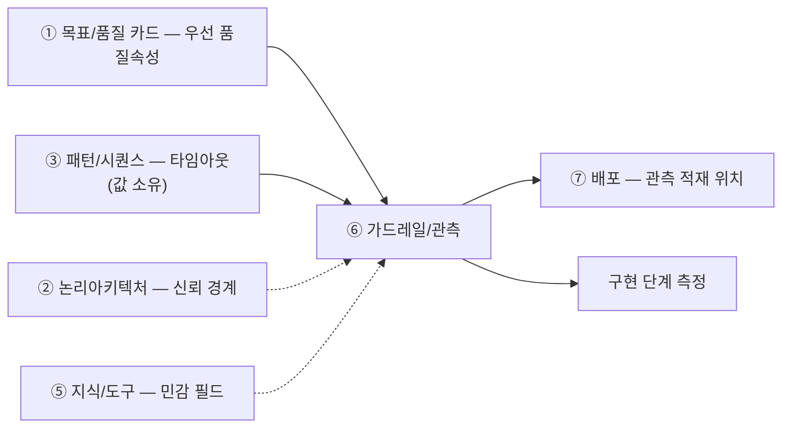

# 설계서 ⑥ 가드레일/관측 — 작성 가이드

작성: 커넥니(도구 연동 엔지니어) · 2026-08-06 · 공통 규격 v1 적용

---

## 1. 이 설계서가 답하는 질문

**"이 시스템이 사고를 치기 전에, 어디서 어떻게 막는가."**

③ 패턴/시퀀스 위에 제한 장치와 기록 지점을 겹쳐 그리는 문서임.
새 단계를 만들지 않고 있는 단계에 태그만 붙임.

**이걸 안 하면 나는 사고 3줄**

- 모델 호출이 루프를 돌아 한 달 예산을 며칠에 씀. 청구서를 봐야 앎
- 고객 이름·전화번호가 응답과 로그에 남음. 유출은 사후에 발견됨
- 품질이 나빠도 원인 단계를 못 찾음. 기록이 없으면 못 고침

실선은 필수 입력, 점선은 참고임.

---

## 2. 시작 전 판정

값부터 정하면 반드시 막힘. **위치를 먼저 정함.**

### 2-1. 가드레일은 세 지점에만 걸림

| 지점 | 무엇을 막나 | 대표 장치 |
|------|------------|----------|
| 입력측 | 외부 글이 지시로 둔갑함(프롬프트 주입) | 외부 글은 데이터로만 취급 |
| 도구 호출측 | 권한 밖 실행 · 과금 폭주 | 최소 권한 · 호출 상한 · 승인 |
| 출력측 | 민감정보가 밖으로 나감 | 반환 직전 노출 검사 |

### 2-2. 단계마다 던지는 5문

예/아니오로만 답함. 1번에서 막히면 뒤가 다 막힘.

| # | 질문 | 예 | 아니오 |
|---|------|----|--------|
| 1 | ③ 패턴/시퀀스의 단계 목록이 확정됐나 | 3절로 감 | ③ 패턴/시퀀스부터 끝냄 |
| 2 | 이 단계가 **우리가 쓰지 않은 문자열**을 읽나(외부 API 응답·캐시 적재값 포함) | 입력측 태그 | 건너뜀 |
| 3 | 쓰기·발송·과금을 하나 | 승인 지점 후보 | 건너뜀 |
| 4 | 민감 필드를 만지나 | 마스킹 태그 | 건너뜀 |
| 5 | 모델을 부르나 | 비용·타임아웃 태그 | `해당 없음` |

**Q2를 "사용자 입력"으로만 읽으면 안 됩니다.** 자유 입력창이 없어도 외부 API 응답의
이름·설명 문자열이 캐시를 거쳐 프롬프트에 들어감. 놓치면 입력측이 0건이 됨.

### 2-3. 승인 지점은 기본 거부부터

"위험해 보이는 곳"에 감으로 붙이지 않음. 순서가 있음.

1. ⑤ 지식/도구의 커넥터 표에서 **쓰기·발송·과금** 행을 전부 뽑음
2. 뽑힌 행을 **일단 전부 승인 필요**로 둠(기본 거부)
3. 되돌릴 수 있는 것만 근거를 적고 자동 실행으로 내림
4. **되돌릴 수 없는데 사람 승인이 시간 제약상 불가하면** 상한·1회 제한 같은
   **제한 장치로 대체**하고 근거를 적음

되돌릴 수 있음의 기준 — 취소 수단이 있고 5분 안에 원상복구됨.
4단계의 예 — 자동 발송 알림임. 회수는 못 하나 사람이 낄 시간이 없으므로
"1회만 발송"처럼 원문이 이미 건 상한이 승인을 대신함.

---

## 3. 설계항목 작성법

각 칸 첫 줄은 규격임 — **형태**(값의 모양) · **비면**(빈칸에 적을 값) ·  
**주인**(값을 가진 다른 산출물. 없으면 생략) · **대조**(다 채운 뒤 맞출 것).  
그 아래 대시 불렛이 채우는 요령임.  
설계항목은 `위치 → 제한 → 가리기 → 측정 → 공통` 계열 순으로 놓았음.

| 설계항목 | 무엇을 적나 | 어디서 가져오나 | 예시 |
|----|------------|----------------|--------|
| 관측(무슨 일이 있었는지 남기는 기록) 기록 지점 | **형태** 단계 식별자 + 항목 이름 목록 · **비면** [확인필요: 기록 지점] · **대조** ③의 계층 수와 기록 항목 수 일치 - 어느 단계에서 기록을 남기는지 단계 식별자로 적음 - 그 단계에서 남길 **항목 이름을 하나씩** 씀(요청ID·걸린 시간·토큰 수·실패 사유처럼) - ③ 패턴/시퀀스가 나눈 계층 수와 기록 항목 수를 같은 개수로 맞춤 - 여러 계층을 한 항목에 합치면 어느 단계가 터졌는지 못 찾음 | US 실패 사유 + BM 측정 방법 | `요청ID·지연·토큰·실패사유` |
| 출력측 검사 | **형태** 3종 중 1개 + 걸렸을 때 행동 · **비면** [확인필요] · **대조** 0건이면 ②의 출력 경계·⑤의 민감 필드로 재판정 - 밖으로 내보내기 직전에 무엇을 걸러낼지 적음 - 검사 방식을 `패턴`·`필드 지정`·`라벨 목록` **3종 중 1개**로 못 박음 - `패턴`을 골랐으면 그 행에 정규식(글자 모양 규칙)을 적거나 `[확인필요]`로 남김 - 걸렸을 때 무엇을 하는지(가림·중단) 1줄 적음 - 이 칸이 비면 모델이 지어낸 민감 형식 문자열을 아무도 못 잡음 | 민감정보 목록의 검사 방식 3종 | `패턴 · 전화번호 정규식` |
| 비용 상한 | **형태** 금액 + 단위(요청 1건당) · **비면** [확인필요: 예산] · **대조** 단계별 몫 합계가 100%인지 - 모델 호출에 쓸 수 있는 돈의 상한을 **요청 1건당 금액**으로 적음 - 모델을 부르는 단계마다 몫(비율)을 나눠 적고 합이 100%인지 확인함. **단계가 1개뿐이면 배분이 뜻을 잃으므로 감시 대상을 요청당 모델 호출 건수로 바꿈** - 재시도·루프 배수를 곱한 **최악 금액**을 함께 적음 - 예산 원값을 모르면 `[확인필요: 예산]`이라고 적음 - 안 적으면 청구서를 받을 때까지 초과를 못 알아챔 | BM 비용 표 + ③ 패턴/시퀀스의 호출 횟수 | `33.3%(Σ3단계=100원/건)` |
| 타임아웃 | **형태** 숫자 + 단위 + S-n 인용 · **비면** [확인필요: ③ 값] · **주인** ③ 패턴/시퀀스(인용만) · **대조** ③ S-n과 숫자 일치 - ③ 패턴/시퀀스 표의 숫자를 **그대로 옮겨 적음** — 여기서 새로 정하지 않음 - 어디서 옮겼는지 자리(`S-n` 행)를 값 옆에 같이 적음 - 값이 이상해 보여도 고치지 않고 `변경요청` 1행만 적음 - 두 문서에 서로 다른 숫자가 남으면 어느 쪽이 진짜인지 모르게 됨 | **③ 패턴/시퀀스의 표에서 인용만** | `30초(③ 패턴/시퀀스의 타임아웃 표 S-3 행)` |
| 차단 규칙 | **형태** 조건 → 행동 꼴 + 알릴 대상 · **비면** [확인필요: 차단 조건] · **대조** 점수 합산이 아니라 거름망인지 - 무엇을 보면 즉시 멈추는지 **조건 → 행동** 꼴로 적음 - 멈춘 뒤 누구에게 알리는지 함께 적음 - 차단은 점수 합산이 아니라 **거름망**이라고 명시함 — 실적이 좋아도 통과시키지 않음 - 조건이 두루뭉술하면 구현에서 점수 하나로 뭉쳐 무력화됨 | US 차단형 검증 + PR 승인 지점 | `규제 위반 → 즉시 중단·법무 통보` |
| 마스킹(가리기) | **형태** 필드 이름 + 가리는 방법 짝 · **비면** 해당 없음 · **주인** ⑤ 지식/도구의 민감 필드(인용만) · **대조** 관측 기록·오류 로그 행 포함 - 가릴 필드 이름을 하나씩 씀(고객 이름·전화·주소처럼) - 필드마다 **가리는 방법**을 짝으로 적음(뒤 4자리만 남김·전부 별표 등) - 화면뿐 아니라 기록(로그·오류 메시지·감사 기록)에도 같은 규칙을 거는지 표시함 - 필드 이름과 방법이 짝으로 안 붙으면 구현에서 각자 다르게 가림 | ⑤ 지식/도구의 민감 필드 + ② 논리아키텍처의 민감정보 라벨(`SL-n`) | `고객 전화 뒤 4자리 치환` |
| 품질 측정 대상 | **형태** 품질 3개 이하 + 목표값 + 문항 수 · **비면** [확인필요: 목표값] · **주인** ① 우선 품질(인용만) · **대조** 문항 수로 목표값 표현 가능 - 재려는 품질 이름을 **3개 이하**로 골라 적음 - 품질마다 **목표 숫자**와 **재는 문항 수**를 함께 적음 - 그 문항 수로 목표 숫자를 표현할 수 있는지 확인함(95%를 재려면 판정 눈금이 5%p 이하) - 숫자가 없으면 나중에 통과·실패를 가릴 수 없음 | ① 목표/품질 카드의 우선 품질 3개 | `정합성 오류율 10% 이하 / 20문항` |
| 근거 출처 | **형태** {약칭}:{항목ID}#{하위} 형식 1개 · **비면** [확인필요] · **대조** 자체 결정이면 설계판단 표기+각주 1줄 - 칸마다 근거 위치를 `{약칭}:{항목ID}#{하위}` **형식 1개**로 적음 - 근거를 못 찾으면 빈칸으로 두지 않고 `[확인필요]`로 적음 - 우리가 정한 값이면 `설계판단`이라고 표시하고 각주 1줄을 붙임 - 공란으로 두면 검토자가 그 값을 확인할 길이 없어짐 | `{약칭}:{항목ID}#{하위}` | `US:NFR-SYS-020#마스킹` |

`검사 방식`은 `패턴`·`필드 지정`·`라벨 목록` 3종만 씀. 정규식은 `패턴` 행에만 적음.

**타임아웃이 안 맞아 보여도 ⑥ 가드레일/관측을 고치지 않음.** ③ 패턴/시퀀스에 `변경요청` 1행을 남기고 인용 그대로 둠
(G-4 판정). 두 곳에서 고치면 어느 쪽이 진짜인지 모르게 됨.

**관측 기록도 마스킹 대상 표의 행임**

출력 직전 1회만 가리면 **로그·트레이스·오류 메시지에 원문이 남음.** 아래 4행을 반드시 추가함.

| 추가할 행 | 왜 필요한가 |
|----------|------------|
| 관측 기록의 입력 요약 | 프롬프트 원문이 그대로 적재됨 |
| 오류 메시지·스택 | 실패한 입력값이 통째로 실림 |
| 감사 로그의 변경 전후 값 | 원본과 수정본이 둘 다 남음 |
| 접근 로그 | 법정 보관 기간 동안 값이 살아 있음 |

**근거 없는 점검 칸은 비워 둠**

금융 점검표의 `최소수집`·`비식별` 2건은 금융위 가이드라인에 **근거가 없음**.
다른 법령 근거를 `US NFR 컴플라이언스 → ES 규제 반영표` 순으로 찾고, 못 찾으면 `[확인필요]`로 남김.
근거 없이 채우면 규제 문서를 잘못 인용한 것이 됨.

**점검 항목 목록의 `계열 0건` 표기도 그대로 믿지 않는 편이 낫습니다.** `② 논리아키텍처의 출력 경계`와
`⑤ 지식/도구의 민감 필드`로 다시 판정함. 모델이 만든 문장이 사용자에게 나가면 `출력 측 노출 검사`가
0건일 수 없음. 그대로 따르면 설계서의 출력측 검사 절을 통째로 지우게 됨.

**실패 대응은 ③ 패턴/시퀀스가 소유함**

재시도·폴백·중단 조건은 ③ 패턴/시퀀스에서 정함(G-5 판정). ⑥ 가드레일/관측은 그 결과를 **관측 항목으로 검증만** 함.
⑥ 가드레일/관측에 적을 것은 "재시도 3회"가 아니라 "재시도 횟수를 기록 항목에 넣음"임.
**③ 패턴/시퀀스가 나눈 계층 수와 기록 항목 수를 같게 함.** 4계층을 한 칸에 합치면 어디가 터졌는지 못 찾음.

**관측 이름은 아직 표준 후보임**

OTel GenAI 이름 규칙은 `Development` 단계이고 확정 표준이 아님.
쓰되 `표준 후보 · 조회일 기준` 1줄을 병기함.

**미검증 설계 표기**

호출·측정을 안 했으면 머리에 `미검증 설계`로 적음.

---

## 4. 제출 전 자가 점검표

- [ ] 오버레이 단계 수가 ③ 패턴/시퀀스의 단계 수와 **같은 숫자**임
- [ ] 3종 태그(비용·타임아웃·마스킹) 열에 공란인 행이 **0건**임
- [ ] 타임아웃 칸이 전부 `③ 패턴/시퀀스의 타임아웃 표 S-n 행` 형식임
- [ ] 마스킹 표에 관측 기록·오류 로그 행이 **있음**
- [ ] 쓰기·발송·과금 도구가 전부 승인 또는 제한 장치를 **가짐**
- [ ] 품질 측정 문항 수가 **숫자**로 적혀 있음
- [ ] 그 문항 수로 목표값을 **표현할 수 있음**(예 — 95%를 재려면 판정 눈금이 5%p 이하)
- [ ] 출력측 검사 행의 `검사 방식`이 3종 중 1개이고, 패턴 행에 정규식이 있거나 `[확인필요]`임
- [ ] 근거 없는 행에 `설계판단` 표기와 각주 1줄이 있음
- [ ] `[확인필요]` 태그가 전부 미확정 항목 표에 **1행씩** 있음
- [ ] 호출·측정을 안 했으면 `미검증 설계`라고 적혀 있음

---

## 5. 다음으로 넘기는 값과 근거 자료

| 넘기는 값 | 받는 곳 | 없으면 |
|----------|--------|--------|
| 관측 기록 적재 위치 | ⑦ 배포의 저장소 배치 표 | 시작은 가능 |
| 기록 항목·품질 문항 | 구현 단계 측정 | 원인 추적 불가 |

**되돌려 보내는 값** — ⑥ 가드레일/관측이 확정하면 앞 산출물의 `[확인필요]`가 닫히는 것임.

| 되돌려 보내는 값 | 받는 곳 | 없으면 |
|----------------|--------|--------|
| 비용 상한의 **단위 확정**(요청 1건당) | ① 목표/품질 카드의 비용 태그 | ① 목표/품질 카드에 태그가 남음 |
| 타임아웃·재시도 `변경요청` 1행 | ③ 패턴/시퀀스 | 값이 두 개로 남음 |
| 걸 단계가 ③ 패턴/시퀀스에 없을 때의 **트리거 추가 요청** | ③ 패턴/시퀀스 | 임시 지점에만 걸림 |

| 아티클 | 거는 칸 |
|--------|--------|
| [A06](../references/articles/A06_std_owasp-agentic-top10.md) §7 · §4 Q6 | `위협` 열 고정 선택지(ASI01 ~ ASI10) · `승인 필요` 근거 |
| [A07](../references/articles/A07_spec_otel-genai-semconv.md) §4 Q6 ~ Q8 | 스팬 이름 · 토큰·오류 칸. `Development`(표준 후보) 병기 필수 |
| [A10](../references/articles/A10_reg_fsc-ai-guideline.md) §4 Q3 · §5 | 강도 `필수`/`권고` 2분 · `최소수집`·`비식별`은 근거 없음 |
