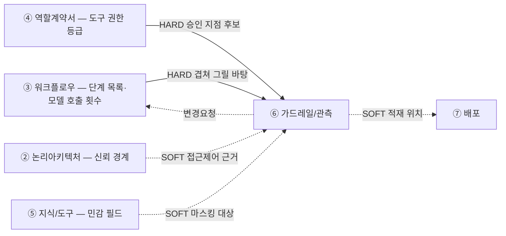

# 설계서 ⑥ 가드레일/관측: 작성 가이드

## 1. 이 설계서가 답하는 질문

**"이 시스템이 사고를 치기 전에, 어디서 어떻게 막는가."**

③ 워크플로우 위에 제한 장치와 기록 지점을 겹쳐 그리는 문서임.
새 단계를 만들지 않고 있는 단계에 태그만 붙임.

**이걸 안 하면 나는 사고 3줄**

- 비용: 모델 호출이 루프를 돌아 한 달 예산을 며칠에 씀. 청구서를 봐야 앎
- 성능: 품질이 나빠도 원인 단계를 못 찾음. 기록이 없으면 못 고침
- 보안: 고객 이름·전화번호가 응답과 로그에 남음. 유출은 사후에 발견됨

**앞뒤 연결도**

`HARD` 없으면 못 채움 · `SOFT` 나중에 고침.  
**타임아웃·재시도는 ③ 워크플로우 표에 있고 이 문서에 옮겨 적지 않음**: 겹쳐 적으면
같은 숫자가 두 곳에 남음. 값이 이상해 보이면 ③ 워크플로우에 `변경요청` 1행을 되돌림.

---

## 2. 시작 전 판정

값부터 정하면 반드시 막힘. **위치를 먼저 정함.**

### 2-1. 가드레일은 세 지점에만 걸림

| 지점 | 무엇을 막나 | 대표 장치 |
|------|------------|----------|
| 입력측 | **외부 정보**가 지시로 둔갑함(프롬프트 주입) | 외부 정보는 불신임 콘텐츠로 취급 |
| 도구 호출측 | 권한 밖 실행 · 과금 폭주 | 최소 권한 · 호출 상한 · 승인 |
| 출력측 | 민감정보가 밖으로 나감 | 반환 직전 노출 검사 |

**하네스 대응 라벨**

이 가이드는 산출물 표에 제품 이름을 쓰지 않고 중립어만 씁니다. 다만 중립어만으로는 그것이
실제로 무엇을 켜고 무엇을 짜는 일인지 가늠하기 어려우므로, 아래 대응을 **이 표 1곳에만** 둡니다.
3절의 산출물 표에는 이 오른쪽 칸의 말이 들어가지 않습니다.

| 이 가이드의 말 | 흐름 조립 프레임워크에서 대개 부르는 것 |
|---------------|----------------------------------|
| 자동 수집 도구 | 실행 이력을 모아 주는 추적 서비스 연동. 환경변수 몇 개로 켜면 프레임워크를 지나는 실행이 전부 남음 |
| `도구 기본` | 그 연동만으로 트레이스에 앉는 값(입력·출력·토큰·지연·오류) |
| `우리가 넣음` | 우리 함수에 붙이는 추적 표시 1줄, 또는 기록 호출. 둘 중 무엇으로 할지는 개발이 고름 |
| `실행 중 카운터` | 모델 호출 종료 이벤트에 거는 처리기. **실행을 실제로 멈출 수 있는 자리는 여기뿐임** |
| `사후 집계` | 이미 적재된 트레이스를 나중에 합산하는 것. 볼 수는 있어도 못 막음 |
| `원문 전송 차단` | 추적 서비스로 보내기 전에 입력·출력을 치환하는 설정 |
| 승인 지점 | 실행을 멈춰 두고 사람 판단을 받은 뒤 재개하는 지점 |

`참고 라벨 · 조회일 기준`. 프레임워크마다 이름이 다르고 판올림에 따라 바뀌므로 **가리키는 대상이
같은지만** 보고 씁니다. 공통규격이 문헌 이름을 `참고 라벨`로 병기하는 것과 같은 방식임.

### 2-2. 단계마다 던지는 5문

예/아니오로만 답함. 1번에서 막히면 뒤가 다 막힘.

| # | 질문 | 예 | 아니오 |
|---|------|----|--------|
| 1 | ③ 워크플로우의 단계 목록이 확정됐나 | 3절로 감 | ③ 워크플로우부터 끝냄 |
| 2 | 이 단계가 **외부 정보**를 읽나: 내용을 **우리가 정하지 않은 문자열** | 입력측 태그 | 건너뜀 |
| 3 | 쓰기·발송·과금을 하나 | 승인 지점 후보 | 건너뜀 |
| 4 | 민감 필드를 만지나 | 마스킹 태그 | 건너뜀 |
| 5 | 모델을 부르나 | 비용 태그 | `해당 없음` |

**Q2의 `외부 정보`는 2-1 입력측이 막는 그것과 같은 것임**: 내용을 우리 코드가 정하지 않아
**밖에서 바꿔 넣을 수 있는 문자열**을 말함. 아래 4가지가 전부 해당함.

- 사람이 입력창에 친 글
- 사람이 올린 문서
- **외부 API 응답의 이름·설명 문자열**: 자유 입력창이 없는 앱에서 가장 자주 놓치는 자리임.
  **도구 목록을 서버가 제공하는 커넥터(⑤의 `MCP 서버`)는 그 도구 설명도 여기 해당함**:
  도구를 호출 전에 설명이 먼저 모델에 들어감
- **캐시에 적재된 값**: 한 번 들어온 외부 정보가 캐시를 거쳐 뒤늦게 프롬프트에 들어감

### 2-3. 승인 지점은 기본 거부부터

"위험해 보이는 곳"에 감으로 붙이지 않음. 순서가 있음.

1. **④ 역할계약서 표B의 `사용도구·내부`·`사용도구·외부` 열에서 `쓰기(되돌림 불가)`·
   `쓰기(되돌림 가능)` 행을 전부 뽑음**: 등급을 가진 것은 ④ 역할계약서임. ⑤ 지식/도구에는
   읽기·쓰기 등급이 없으므로 거기서 뽑을 수 없음. **표B는 단계 1개 = 행 1개라 뽑은 행의
   `워크플로우 \| 단계` 값이 곧 승인 지점의 정확한 위치임**: ③으로 되돌아가 위치를 다시
   찾지 않음. 뽑은 도구의 커넥터 ID(`C-A1`·`C-M1`·`C-C1` 꼴)만 ⑤ 지식/도구에서 가져와 붙임
2. 뽑힌 행을 **일단 전부 승인 필요**로 둠(기본 거부)
3. 되돌릴 수 있는 것만 근거를 적고 자동 실행으로 내림
4. **되돌릴 수 있어도 그 1회가 3-2 「비용 상한」의 절반을 넘게 쓰면 자동 실행으로 내리지 않음**:
   되돌릴 수는 있어도 쓴 돈은 안 돌아옴
5. **되돌릴 수 없는데 사람 승인이 시간 제약상 불가하면** 상한·1회 제한 같은
   **제한 장치로 대체**하고 근거를 적음

**판정 축은 2개임**: `되돌림`(3번) · `비용`(4번). 두 축 중 하나라도 걸리면 승인으로 올리고,
어느 축에 걸렸는지를 3-2 「승인 지점」 표의 `걸린 축` 칸에 그대로 적음.
`신뢰도`를 축으로 더 쓰려면 **⑤ 지식/도구 3-1의 「검색 패턴별 판정 기준값」을 인용**하고
여기서 숫자를 새로 정하지 않음.

되돌릴 수 있음의 기준: 취소 수단이 있고 5분 안에 원상복구됨.  
5단계의 예: 자동 발송 알림임. 회수는 못 하나 사람이 낄 시간이 없으므로
"1회만 발송"처럼 원문이 이미 건 상한이 승인을 대신함.

---

## 3. 설계항목 작성법

**설계항목은 3계열로 나뉨**: `3-1 관측` · `3-2 제한` · `3-3 가리기`.  
**품질 목표·측정 대상은 이 문서에 없음**: ① 목표/품질 카드가 `측정 방법 · 채점 수단 · 목표값`을
이미 갖고 문항 구성은 별도 품질 튜닝 소관임. 여기서 옮겨 적으면 값이 두 곳에 남음.
**다만 3-2 「알림 임계값」이 ① 목표값을 인용하는 칸은 예외임**: 인용은 값을 옮겨 적는 것이 아니라
①을 가리키는 것이고 숫자는 ①에서 봄.  
**이 제목 구조가 곧 산출물의 목차임**: 여기 없는 절을 산출물에 만들지 않고 여기 있는 절을 빼지도 않음.

**호출·측정을 안 했으면 문서 머리에 `미검증 설계`로 적음**: 산출물 7종은 실행 전 설계임.

항목마다 **항목명**(굵게) 다음에 채우는 요령 불렛, 마지막에 **「산출물 표 모양」** 표를 둠.  
**작성법은 문단으로, 산출물은 표로 씀**: 작성법을 표에 밀어 넣으면 칸 안에서 ` `로 줄을 나누게 되고
불렛을 못 씀. 반대로 **산출물은 전부 표**이므로 항목마다 표 모양을 그대로 보임.

**칸마다 근거 출처를 붙임**: `{약칭}:{항목ID}#{하위}` 형식 1개. 못 찾으면 `[확인필요]`,
우리가 정한 값이면 `설계판단`이라고 표시하고 각주 1줄을 붙임. 공란으로 두면 검토자가 그 값을 확인할 길이 없어짐.
(예: `US:NFR-SYS-020#마스킹`)

**워크플로우별로 적는 항목과 전역으로 한 번만 적는 항목이 갈림**: ③ 워크플로우가 워크플로우마다
단계를 따로 그렸으므로 **단계에 붙는 항목은 워크플로우마다 다시 적음**.

| 항목 | 어떻게 적나 |
|------|-----------|
| 기록 지점 · 구간 기록 항목 · 출력측 검사 · 승인 지점 · 비용 상한 · 차단 규칙 | **워크플로우마다 표 1개**: 단계·구간에 붙는 항목임 |
| 관측 이름 규칙 · 관측 적재처 · 알림 임계값 · 마스킹 | **전역 표 1개**: 프로젝트·필드 단위라 워크플로우와 무관함 |

- **마스킹을 워크플로우별로 나누지 않음**: 같은 필드를 워크플로우마다 다르게 가리면 구현에서
  규칙이 갈림. **필드 1개에 가리는 방법 1개**임
- **워크플로우마다 제목 1개를 두고 그 아래에 표를 둠**: 제목은 ③ 워크플로우의 워크플로우 표에
  적힌 **ID와 이름을 그대로** 씀(`` #### `W-1` 오늘의 추천조회 `` 꼴). ③ 워크플로우와 같은 방식임.
  **⑥이 ID를 새로 붙이지 않음**: ③ 「워크플로우 표」가 발급한 것을 인용만 함
- **제목이 워크플로우를 가리키므로 표 안에는 단계ID만 적음**: 행마다 워크플로우명을 반복하지 않음
  - **예외는 3-2 「승인 지점」 표 1개뿐임**: 그 표만 단계를 `ID. 이름` 꼴로 적음.
    ④ 표B의 행과 문자열로 대조하는 유일한 표라서임. 그 표도 워크플로우명은 제목이 가리킴
- 워크플로우가 1개인 앱도 제목을 둠. 나중에 늘어날 때 구조가 안 바뀜

---

### 3-1. 관측

**기록 지점**

- 어느 단계에서 기록을 남기는지 **단계ID**로 적음: ③ 워크플로우가 붙인 번호를 그대로 씀.
  워크플로우는 표의 제목이 가리키므로 행에 다시 쓰지 않음
- 그 단계에서 남길 **항목 이름을 하나씩** 씀(요청ID·걸린 시간·토큰 수·실패 사유처럼)
- **③ 워크플로우가 재시도 계층에 붙인 이름마다 기록 항목을 1개씩 둠**: ③ 워크플로우가
  재시도를 두 층 이상으로 나눠 이름을 적었으면(예: `단계 자체 재시도` · `상위 재계획 재시도`)
  그 이름을 그대로 기록 항목 이름으로 씀. **한 항목에 합치면 어느 층에서 터졌는지 못 찾음**
  - **상위 층은 단계가 아니라 구간에 붙음**: 재수행은 여러 단계를 되돌려 감싸므로
    단계 행에 정의 불가. ③ 워크플로우가 `max_iter`·착지 노드를 단계 표 밖에 적는 것과 같은 층위임
  - **단계 표 아래에 표를 1개 따로 둠**: 열은 `구간 · 기록 항목`.
    **첫 행은 항상 `전체`**(워크플로우 1회분)이고 **루프마다 행을 1개씩 더함**
  - **`전체` 행에는 한 요청·실행 1회분의 결과를 적음**: `요청ID` · 전체 지연 · 총 토큰 ·
    최종 상태(성공·부분성공·실패) · 종료 사유. **단계 기록을 다 더해도 이 값은 안 나옴**:
    어디서 끝났는지·왜 끝났는지가 단계 행에는 없고, 전체 지연도 단계 지연의 합이 아님
    (단계 사이의 대기·분기 시간이 끼임)
  - **루프 행에는 그 층의 횟수 · 상한 소진 여부 · 착지 노드**를 적음:
    소진해서 어디로 떨어졌는지가 남아야 원인을 찾음
  - `요청ID`처럼 **층을 잇는 항목은 두 표에 다 넣음**
  - **루프가 없어도 이 표를 만듦**: 행이 `전체` 1개로 줄 뿐임
  - 전체 기록 항목 수와는 무관함: `요청ID`·`지연`·`토큰`은 재시도 층과 관계가 없음
- 못 정했으면 `[확인필요: 기록 지점]`으로 적음
- 기록할 항목은 US 실패 사유와 BM 측정 방법에서 가져옴

**`누가 남기나` 칸은 도구가 주는 값과 우리가 넣는 값을 가름**: 흐름 조립 프레임워크에
자동 수집 도구를 붙이면 그 프레임워크를 지나는 실행은 켜는 것만으로 전부 트레이스에 앉습니다.
그래서 기록 항목 중 상당수는 이미 공짜로 남아 있고, 그것까지 직접 계측하라고 적으면
개발이 같은 값을 두 번 만듭니다.

**갈림길은 두 층이고 묻는 곳이 다름**: 위 칸은 프로젝트당 1번, 아래 칸은 행마다 답함.

| 층 | 어디서 정하나 | 값 |
|----|------------|----|
| 자동 수집 도구를 쓰나 | **3-1 「관측 적재처」에서 전역 1회** | `예` · `아니오` |
| 이 항목이 도구를 켠 것만으로 남나 | 이 표의 **행마다** | `도구 기본` · `우리가 넣음` |

- **「관측 적재처」가 `아니오`면 이 열을 두지 않음**: 전 행이 `우리가 넣음`이라 열이 뜻을 잃음
- **한 칸에 두 값을 섞지 않음**: 한 단계에서 갈리면 행을 나눠 행마다 1개씩 적음
- **`우리가 넣음`을 어떤 기법으로 넣을지는 여기서 정하지 않음**: 함수에 추적 표시를 붙이든
  기록 호출을 쓰든 개발 소관임. 설계는 **남는가 안 남는가**만 가름
- **이 열을 두는 이유는 하나임**: 자동 수집 도구를 켜도 **트레이스에 애초에 없는 값**이 있음.
  `근거문서수`·`필터적중여부`처럼 우리 도메인에서만 뜻이 있는 값이 그것임. 표시가 없으면
  "도구를 켰으니 다 남는다"로 넘어가 그 값이 영영 안 남음
- **구간 기록 항목 표에도 같은 열을 둠**: `총토큰`은 도구가 주지만 `최종상태`·`종료사유`는
  대개 우리가 넣어야 하는 값임

**산출물 표 모양** (`` `W-1` 오늘의 추천조회 `` 표 · ③ 워크플로우가 재시도를 2층으로 나눈 경우)

| 단계 | 기록 항목 | 누가 남기나 |
|------|----------|-----------|
| `S-R3` | `요청ID` · `지연` · `토큰` · `실패사유` | `도구 기본` |
| `S-R3` | `단계재시도횟수` | `우리가 넣음` |
| `S-R5` | `요청ID` · `지연` · `토큰` · `실패사유` | `도구 기본` |
| `S-R5` | `단계재시도횟수` · `근거문서수` | `우리가 넣음` |

같은 단계에서 값이 갈려 **행을 나눠 적은 모양**임.

**구간 기록 항목** (같은 워크플로우 · 단계 표 아래에 표 1개)

| 구간 | 기록 항목 | 누가 남기나 |
|------|----------|-----------|
| `전체` | `요청ID` · `전체지연` · `총토큰` | `도구 기본` |
| `전체` | `최종상태` · `종료사유` | `우리가 넣음` |
| `S-R4 ~ S-R7` | `재계획재시도횟수` · `상한소진여부` · `착지노드` | `우리가 넣음` |

**`전체` 행은 루프가 없어도 둠**: 최종 상태·종료 사유는 단계 행을 다 더해도 안 나옴.
루프가 없으면 이 표가 `전체` 2행짜리가 됨(`도구 기본` 1행 + `우리가 넣음` 1행).

**적는 것은 항목 이름이고 그 값이 아님**: 위 표의 `단계재시도횟수`는 **기록에 남길 칸의 이름**임.
그 칸에 `3`이 찍히는 것은 실행할 때의 일이고 **숫자를 이 문서에 적지 않음**(③ 워크플로우 소유).
재시도·폴백·중단 조건의 숫자도 같음: 여기서는 **그 결과가 기록에 남는 칸이 있는지만** 봄.

**관측 이름 규칙**

자동으로 수집한 트레이스는 프레임워크가 붙인 이름으로 쌓입니다. 그 이름이 ③ 워크플로우의
단계와 안 맞으면 **트레이스를 보고도 어느 단계가 터졌는지 되짚을 수 없습니다.** 이름을
맞추는 규칙을 전역 표 1개로 적습니다.

- **워크플로우명이 아니라 워크플로우ID를 씀**: 이름은 길고 다듬는 과정에서 바뀜.
  **③ 「워크플로우 표」가 발급한 `W-n`을 인용만 하고 ⑥이 새로 붙이지 않음**
- **단계ID도 ③ 것을 그대로 붙임**: 여기서 새 이름을 짓지 않음
- **우리 함수는 함수명을 그대로 씀**: 설계가 `역할` 같은 어휘를 새로 만들면 개발이 그것을
  다시 매핑해야 함. 실제 함수명을 채우는 것은 개발 몫이고 설계는 **규칙만** 정함
- **State 필드 이름을 꼬리표로 쓰지 않음**(③ 소유). 꼬리표에는 `요청ID`처럼 이 문서가
  기록 항목으로 이미 정한 것만 씀
- **접두·구분자 같은 문자열 조립 문법은 개발 몫임**: 여기서는 무엇을 무엇과 잇는지만 정함
- 이름 규칙에 아직 확정 표준이 없는 부호를 쓸 때는 **`표준 후보 · 조회일 기준` 1줄을 병기**함

**산출물 표 모양** (전역 표 1개)

| 대상 | 이름 규칙 | 되짚을 곳 |
|------|----------|----------|
| 실행 1회 | `{워크플로우ID}` | ③ 워크플로우 표 |
| 단계 | `{워크플로우ID}.{단계ID}` | ③ 단계ID |
| 구간 | `{워크플로우ID}.{시작ID}~{끝ID}` | 위 「구간 기록 항목」 표 |
| 우리 함수 | `{단계ID}.{함수명}` | 그 단계 |
| 꼬리표 | `요청ID` · `워크플로우ID` | 두 기록 표를 잇는 값 |

**관측 적재처**

기록을 **어디에 쌓는지**를 정하는 자리임. ⑦ 배포 2-3 비밀값 표의 `관측·기록` 행이 이 표를
받아 제품과 전송 키를 정하므로, 이 표가 비면 ⑦이 채울 값이 없습니다.

**표 위에 전역 판정 1줄을 먼저 적음**: `자동 수집 도구를 쓰나 = 예 · 아니오`.
프로젝트당 한 번만 정하고, 이 값으로 「기록 지점」의 `누가 남기나` 열을 둘지가 갈립니다.

- **자동 수집 도구를 켜면 프롬프트 원문이 통째로 적재처로 감**: 입력·출력이 그대로 실림.
  `원문 전송 차단` 칸이 비면 3-3 마스킹이 있어도 무력함. **출력 직전에 가려도 트레이스에는
  이미 원문이 앉아 있음**
- **제품 이름을 여기서 고르지 않음**: 성격까지만 적음. 제품·전송 키·런타임 안밖 배치·
  지역 제한은 ⑦ 배포 소유임. 제품이 궁금하면 ⑦ 표를 봄
- `밖으로 나가나`가 `예`면 **국외 이전 근거**를 `US NFR 컴플라이언스 → ES 규제 반영표` 순으로
  찾고 못 찾으면 `[확인필요]`로 남김. **지역 고정 요건 자체는 ⑦ 3-3이 정하므로 여기서는
  예·아니오만 표시함**
- **밖에 있는 적재처 하나로만 보내지 않는지 봄**: 나중에 품질 집계·비용 정산이 그 기록을
  읽어야 하는데 밖으로만 나가면 읽을 자리가 없음. 읽을 자리가 필요하면 1줄 적음
- 안 정했으면 `[확인필요: 적재처]`로 적음

**산출물 표 모양** (전역 표 1개)

`자동 수집 도구를 쓰나`: `예`

| 무엇을 쌓나 | 적재처 성격 | 밖으로 나가나 | 원문 전송 차단 |
|------------|------------|-------------|--------------|
| 실행 트레이스 | 밖에 있는 관리형 추적 서비스 | 예(국외) | 보내기 직전 입력·출력 치환 1벌 |
| 구조화 로그 | 사내 저장소 | 아니오 | `F-1` 마스킹 적용 |
| 감사 로그 | 사내 저장소 | 아니오 | 요약·해시만 적재 |

---

### 3-2. 제한

**출력측 검사**

- 밖으로 내보내기 직전에 무엇을 걸러낼지 적음. 단계는 **단계ID**로 적음(워크플로우는 제목이 가리킴)
- **나가는 자리가 워크플로우마다 다름**: 동기 요청은 화면·응답, 스케줄 배치는 저장소·알림.
  워크플로우마다 다시 판정함
- 검사 방식을 `패턴`·`필드 지정`·`라벨 목록` **3종 중 1개**로 못 박음. 이 3종만 쓰고 다른 이름을 만들지 않음

| 방식 | 무엇으로 잡나 | 잘 잡는 것 | 못 잡는 것 |
|------|------------|----------|----------|
| `패턴` | **글자 모양**: 정규식으로 적음 | 전화번호·계좌번호처럼 **형식이 정해진 값**. 모델이 지어낸 값도 형식만 맞으면 걸림 | 형식이 없는 값(사람 이름·주소) |
| `필드 지정` | **응답 구조의 자리**: 키 경로로 적음 | 구조화된 응답의 그 칸. 값이 어떻게 생겼든 확실히 걸림 | 모델이 **문장 속에 녹여 쓴** 같은 값 |
| `라벨 목록` | **미리 정한 값의 목록** | 값의 종류가 유한하고 형식이 없는 것(알레르기 유발물질 코드 같은 것) | 목록에 **없는 신규 값** |

- **고르는 법**: 형식이 있으면 `패턴`, 나가는 자리가 정해져 있으면 `필드 지정`,
  값이 목록으로 닫히면 `라벨 목록`
- **한 필드에 둘 이상 필요하면 그 필드를 여러 행으로 나눠 행마다 1개씩 적음**: 한 칸에 두 방식을
  섞으면 구현에서 하나만 걸고 끝냄
- `패턴`을 골랐으면 그 행에 **정규식**(글자 모양 규칙)을 적거나 `[확인필요]`로 남김.
  정규식은 `패턴` 행에만 적음
- 걸렸을 때 무엇을 하는지(가림·중단) 1줄 적음
- 이 칸이 비면 모델이 지어낸 민감 형식 문자열을 아무도 못 잡음
- **`0건`이 나오면 그대로 두지 않고** ② 논리아키텍처의 출력 경계와 ⑤ 지식/도구의 민감 필드로 다시 판정함

**산출물 표 모양** (`` `W-1` 오늘의 추천조회 `` 표)

| 단계 | 검사 방식 | 무엇을 걸러내나 | 걸렸을 때 |
|------|----------|--------------|----------|
| `S-R9` | `패턴` | 전화번호 정규식 | 가림 |
| `S-R9` | `필드 지정` | `member.email` | 가림 |

같은 단계에 방식이 2개 필요해 **행을 나눠 적은 모양**임.

**승인 지점**

2-3에서 기본 거부로 시작해 뽑고 내린 결과를 **표로 남기는 자리**임. 판정만 하고 표를 안 남기면
어느 도구가 왜 자동으로 내려갔는지 검토자가 확인할 길이 없습니다.

- **행 수는 ④ 역할계약서 표B의 `쓰기(되돌림 불가)`·`쓰기(되돌림 가능)` 행 수와 같음**:
  자동 실행으로 내린 행도 **지우지 않고** 근거를 달아 남김. 지우면 기본 거부에서 시작했다는
  증거가 사라짐
- 단계는 **`ID. 이름` 꼴**로 적음(워크플로우는 제목이 가리킴). ⑥에서 이 꼴로 적는 표는
  여기뿐이고 다른 표는 단계ID만 둠. 그 위치는 ④ 표B의 `워크플로우 | 단계` 값에서
  **단계 부분을 그대로** 옮김. ③을 다시 훑어 새로 찾지 않음
- **단계명은 ③ 「단계별 설계」의 `행동 1개` 열 값을 그대로 인용함**: ④ 표B가 단계명을 적을 때
  쓰는 것과 같은 인용 규칙임. 줄여 쓰거나 다른 말로 바꾸지 않음
- 도구 이름과 권한 등급은 **④ 표B에서 인용**함. ⑤ 지식/도구에는 등급이 없어 거기서 못 뽑음
- `걸린 축`에 2-3이 정한 축 이름을 적음: `되돌림` · `비용`. 둘 다 걸리면 둘 다 적음
- `결론`은 `승인` · `자동 실행` · `제한 장치` 중 1개임. `자동 실행`·`제한 장치`면 근거를 1줄 붙임
- **`승인자`는 ④의 승인자 짝짓기를 인용함**: ⑥이 승인자를 새로 정하지 않음.
  ④에 짝이 없으면 `[확인필요: 승인자]`로 적음
- **승인 대기 시간 상한을 적지 않음**: 시간은 ③ 워크플로우 소유임. 볼 일이 있으면 ③ 표를 봄
- `신뢰도`를 축으로 쓰려면 **⑤ 3-1 「검색 패턴별 판정 기준값」의 `합격선`을 인용**하고 숫자를 새로 정하지 않음

**산출물 표 모양** (`` `W-1` 오늘의 추천조회 `` 표)

| 단계 | 도구(④ 표B) | 등급 | 걸린 축 | 결론 | 승인자(④) |
|------|------------|------|--------|------|----------|
| `S-R7`. 추천 확정 알림 보내기 | 추천 확정 알림 발송 | 쓰기(되돌림 불가) | 되돌림 | 제한 장치: 1회만 발송 | — |
| `S-R8`. 예약 확정 처리 | 예약 확정 | 쓰기(되돌림 불가) | 되돌림 · 비용 | 승인 | 운영 담당자 |

`결론`이 `제한 장치`인 행은 **사람 승인이 시간 제약상 불가하다는 근거**를 각주 1줄로 붙임.

**비용 상한**

- 모델 호출에 쓸 수 있는 돈의 상한을 **그 워크플로우의 예산 단위**로 적음:
  ③ 워크플로우가 트리거별로 이미 갈라 둔 기준을 그대로 씀
  - 동기 요청(`S-R`) → **요청 1건당**
  - 스케줄 배치(`S-B`) → **실행 1회당**. 처리 건수 전제를 함께 적음
  - 이벤트(`S-E`) → **이벤트 1건당**
- **`요청당`으로 못 박지 않음**: 배치 워크플로우에는 요청이 없어 셀 수 없음
- 모델을 부르는 단계마다 몫(비율)을 나눠 적고 **합이 100%인지 확인함**
- **단계가 1개뿐이면 배분이 뜻을 잃으므로** 감시 대상을 요청당 모델 호출 건수로 바꿈
- 재시도·루프 배수를 곱한 **최악 금액**을 함께 적음: 배수는 ③ 워크플로우의 `모델 호출` 열에서 가져옴
- 예산 원값을 모르면 `[확인필요: 예산]`이라고 적음. 안 적으면 청구서를 받을 때까지 초과를 못 알아챔
- **상한에 닿았을 때 무엇을 하는지 함께 적음**: 이 칸이 비면 상한이 숫자로만 있고
  아무 일도 일어나지 않음
  - `안전 종료`(부분 결과 반환) · `더 싼 모델로 내려 계속` · `대기열로 미룸` ·
    `하드 스톱 + 알림` 중에서 고르고 **알릴 대상**을 함께 적음
  - **판정 시점을 함께 적음**: 요청·실행 누적이 닿는 순간인지, 일·월 누적이 닿을 때인지.
    이벤트처럼 건당 금액이 작으면 건당이 아니라 **일 누적**으로 봐야 폭주를 잡음
  - **상한 · 판정 시점 · 초과 시 처리는 워크플로우 단위임**(단계마다 다르지 않음).
    표 위에 적고 단계 표에는 몫·금액만 둠
- **누가 세고 누가 막는지를 `집행 지점`으로 함께 적음**: 이 칸이 없으면 상한과 초과 시 처리를
  다 적고도 **실행이 안 멈춤**

| 집행 지점 | 언제 보나 | 막을 수 있나 |
|----------|----------|------------|
| `사후 집계` | 이미 적재된 기록을 나중에 합산함 | **아니오**: 볼 때는 이미 다 쓴 뒤임 |
| `실행 중 카운터` | 모델 호출이 끝날 때마다 누적을 봄 | 예 |

- **`초과 시 처리`가 `하드 스톱`·`안전 종료`·`더 싼 모델로 내림`인데 `집행 지점`이
  `사후 집계`면 그 상한은 성립하지 않음**: 관측 도구는 실행이 끝난 뒤에 보는 것이라 못 막음.
  실행 중에 멈추려면 호출마다 누적을 세는 자리가 따로 있어야 함
- **`대기열로 미룸`도 실행 중 판정임**: 미룰지를 실행 전에 알아야 미룰 수 있음
- **`사후 집계`로 둘 수 있는 것은 알림뿐임**: 넘은 사실을 나중에 알리는 것은 성립함.
  그때는 `초과 시 처리`를 `알림만`으로 적고 막는다고 적지 않음

**산출물 표 모양**: 워크플로우마다 표 1개. **트리거에 따라 단위와 판정 시점이 다름.**

`` `W-1` 오늘의 추천조회 ``(동기 요청): 상한 `100원/요청` · 판정 `요청 누적이 닿는 순간` ·
초과 시 `안전 종료(규칙 기반 대체 추천 반환)` · 알림 `운영 담당자` · 집행 `실행 중 카운터`

| 단계 | 몫 | 최악 배수 | 최악 금액 |
|------|----|---------|----------|
| `S-R5` | 33.3% | ×6(재시도 3 × 루프 2) | 200원/요청 |

`` `W-2` 일일 취향 갱신 ``(스케줄 배치): 상한 `5,000원/실행(1만 건 전제)` · 판정 `실행 누적이 닿는 순간` ·
초과 시 `남은 건을 다음 실행으로 미룸` · 알림 `데이터 담당자` · 집행 `실행 중 카운터`

| 단계 | 몫 | 최악 배수 | 최악 금액 |
|------|----|---------|----------|
| `S-B4` | 100% | ×2(재시도 1) | 10,000원/실행 |

`` `W-3` 추천 확정 알림 ``(이벤트): 상한 `20원/이벤트` · 판정 **`일 누적이 닿을 때`** ·
초과 시 `하드 스톱 + 알림` · 알림 `운영 담당자` · 집행 `실행 중 카운터`

| 단계 | 몫 | 최악 배수 | 최악 금액 |
|------|----|---------|----------|
| `S-E2` | 100% | ×2(재시도 1) | 40원/이벤트 |

**이벤트만 판정 시점이 `일 누적`임**: 건당 20원은 넘기 어렵고 실제 위험은 이벤트 폭주이므로
건당으로 보면 상한이 있으나 마나임.

**타임아웃은 이 문서에 적지 않음**: ③ 워크플로우의 단계별 설계 표에 `타임아웃(상한)` 열이
이미 있음. 여기 옮겨 적으면 같은 숫자가 두 곳에 남아 어느 쪽이 진짜인지 모르게 됨.
**타임아웃을 볼 일이 있으면 ③ 워크플로우 표를 봄.**

**차단 규칙**

- 무엇을 보면 즉시 멈추는지 **조건 → 행동** 꼴로 적음
- 멈춘 뒤 **누구에게 알리는지** 함께 적음
- **차단은 점수 합산이 아니라 거름망이라고 명시함**: 실적이 좋아도 통과시키지 않음.
  조건이 두루뭉술하면 구현에서 점수 하나로 뭉쳐 무력화됨
- 조건을 못 정했으면 `[확인필요: 차단 조건]`으로 적음
- 조건은 US 차단형 검증과 기획의 승인 지점에서 가져옴

**멈추는 규칙이 3종임**: 이름이 비슷해 겹쳐 적기 쉬우므로 **무엇을 보고 언제 판정하나**로 가름.

| 무엇 | 어디 | 무엇을 보나 | 언제 판정하나 |
|------|------|-----------|------------|
| `초과 시 처리` | ③ 워크플로우 | **시간·반복 상한**이 소진됐나 | **단계 경계**에서 |
| 비용 `초과 시 처리` | ⑥ 비용 상한 항목 | **누적 금액**이 상한에 닿았나 | 요청·실행·일 **누적이 닿는 순간**(단계 경계와 무관) |
| `차단 규칙` | ⑥ 여기 | **내용이 무엇인가**: 상한과 무관하게 값 자체 | 그 값이 나온 즉시 |

**시간·반복 상한만 ③ 워크플로우임**: ③ 워크플로우는 금액을 모르므로 비용 초과는 여기가 가짐.
차단 규칙에는 **상한 이야기를 적지 않음**: 상한은 위 두 줄이 맡음.

**아래 「알림 임계값」은 이 3종에 안 들어감**: 그것은 **멈추는 규칙이 아니라 알리는 규칙**임.
넘어도 실행은 계속되고 사람에게만 전달됨. 멈춰야 하는 것을 알림으로 적으면 아무것도 안 멈춤.

**산출물 표 모양** (`` `W-1` 오늘의 추천조회 `` 표)

| 단계 | 조건 | 행동 | 알릴 대상 |
|------|------|------|----------|
| `S-R9` | 규제 위반 문구가 응답에 있음 | 즉시 중단 | 법무 |

**근거 없는 점검 칸은 비워 둠**: 금융 점검표의 `최소수집`·`비식별` 2건은 금융위 가이드라인에
**근거가 없음.** 다른 법령 근거를 `US NFR 컴플라이언스 → ES 규제 반영표` 순으로 찾고
못 찾으면 `[확인필요]`로 남김. 근거 없이 채우면 규제 문서를 잘못 인용한 것이 됨.

**알림 임계값**

여기까지의 항목이 `알릴 대상`을 여러 번 요구했으나 **무엇을 넘으면 알리는지**는 아직 없습니다.
임계값이 없으면 알림 대상만 적히고 알림은 안 울립니다. 전역 표 1개로 적습니다.

**적을 수 있는 절대 숫자는 ⑥이 소유한 축뿐임**: 비용, 검사에 걸린 비율, 보안 검출 건수.
나머지 축은 주인이 따로 있으므로 **인용하거나 비율로만** 적습니다.

| 축 | 절대 숫자를 적나 | 어떻게 적나 |
|----|----------------|-----------|
| 비용 | 적음 | 3-2 「비용 상한」의 소진율·예상 대비 비율 |
| 검사에 걸린 비율 | 적음 | 출력측 검사·입력측 검출 건수는 ⑥이 정한 값임 |
| 지연 · 정확도 | **안 적음** | **① 목표/품질 카드의 목표값을 인용**함(`① 목표값 초과` 꼴). 숫자는 ①에서 봄 |
| 되돌아간 횟수 | **안 적음** | **③ 워크플로우 반복 상한의 비율**로 적음(`③ 상한의 50%` 꼴) |

- **①·③의 숫자를 이 표에 옮겨 적으면 값이 두 곳에 남음**: ①이 목표를 고쳐도 여기가 안 따라옴
- 넘었을 때 `경고`인지 `즉시`인지를 함께 적음. **`즉시`는 1건만으로 알리는 것**임
- `알릴 대상`은 3-2의 다른 항목이 쓰는 이름과 같은 말로 씀. 새 조직 이름을 만들지 않음
- 근거가 없는 임계값은 `설계판단`으로 표시하고 각주 1줄을 붙임
- 정할 수 없으면 `[확인필요: 임계값]`으로 적음

**산출물 표 모양** (전역 표 1개)

| 무엇을 보나 | 임계 | 넘으면 | 알릴 대상 |
|------------|------|-------|----------|
| 비용 상한 소진율 | 80% | 경고 | 운영 담당자 |
| 예상 대비 실제 비용 | 150% | 경고 | 운영 담당자 |
| 되돌아간 횟수 | ③ 반복 상한의 50% | 경고 | 개발 담당자 |
| 지연 | ① 목표값 초과 | 경고 | 운영 담당자 |
| 출력측 검사에 걸린 비율 | 15% | 경고 | 품질 담당자 |
| 민감 필드 검출 | 1건 | 즉시 | 보안 담당자 |

`지연` 행에 숫자가 없는 것이 맞음: 그 값은 ① 목표/품질 카드가 가짐.

---

### 3-3. 가리기

**마스킹**

- **전역 표 1개로 적음**: 워크플로우별로 나누지 않음. 필드 1개에 가리는 방법 1개임
- 가릴 필드 이름을 하나씩 씀: **⑤ 지식/도구의 민감 필드(`F-n`)를 인용만 함.** 여기서 새 번호를 붙이지 않음
- 필드마다 **가리는 방법**을 짝으로 적음(뒤 4자리만 남김·전부 별표 등).
  이름과 방법이 짝으로 안 붙으면 구현에서 각자 다르게 가림
- 가리는 자리는 ② 논리아키텍처의 민감정보 라벨(`SL-n`)로 가리킴
- 가릴 것이 없으면 `해당 없음`으로 적음
- **화면뿐 아니라 기록에도 같은 규칙을 거는지 표시함**: 아래 5행을 반드시 포함함

| 반드시 넣을 행 | 왜 필요한가 | 거는 자리 |
|----------|------------|----------|
| 관측 기록의 입력 요약 | 프롬프트 원문이 그대로 적재됨 | 3-1 「관측 적재처」의 `원문 전송 차단` 칸과 **같은 자리** |
| 오류 메시지·스택 | 실패한 입력값이 통째로 실림 | 기록을 남기기 직전 |
| 감사 로그의 변경 전후 값 | 원본과 수정본이 둘 다 남음 | 기록을 남기기 직전 |
| 접근 로그 | 법정 보관 기간 동안 값이 살아 있음 | 기록을 남기기 직전 |
| **체크포인트에 적재된 State** | 재개·승인 대기를 위해 State를 **통째로** 남기므로 요약이 아니라 원문이 앉고, 관측 기록보다 오래 살아 있음 | 저장 직전(⑤ 3-3 판정 인용) |

출력 직전 1회만 가리면 **로그·트레이스·오류 메시지에 원문이 남습니다.**

**첫 행이 가장 놓치기 쉽습니다.** 자동 수집 도구를 켜면 프롬프트 원문이 **우리 코드를 거치지 않고**
프레임워크에서 곧바로 적재처로 갑니다. 출력 직전에 아무리 잘 가려도 그 경로는 안 지나므로
**가리는 자리를 「관측 적재처」의 `원문 전송 차단` 칸에 맞춰야** 합니다. 두 칸이 다른 자리를
가리키면 한쪽만 걸려 원문이 그대로 나갑니다.

**체크포인트 행은 다른 4행과 거는 층이 다릅니다.** 나머지는 값이 경계를 나갈 때(`SL-n`) 걸리지만
체크포인트 쓰기는 내부 저장이라 `SL-n`에 걸리지 않습니다. 그래서 이 행의 `가리는 방법`은
**⑤ 지식/도구 3-3이 판정한 `아예 제외` · `저장 시 암호화`를 인용**합니다: ⑥이 새로 정하지 않습니다.
③ 워크플로우의 「체크포인트 보존」이 전부 `보존 사유 = 없음`이면 이 행을 `해당 없음`으로 적습니다.

**산출물 표 모양** (전역 표 1개)

| `F-n` | 필드 | 가리는 방법 | 거는 곳 |
|-------|------|-----------|--------|
| `F-1` | 고객 전화 | 뒤 4자리만 남김 | `SL-2` · 관측 기록 · 오류 메시지 · 감사 로그 · 접근 로그 |

---

## 4. 제출 전 자가 점검표

- [ ] **산출물 절 구성이 3절의 3계열 제목과 같음**(`관측` / `제한` / `가리기`).
      3절에 없는 절 0건, 3절에 있는데 빠진 절 0건
- [ ] **품질 목표·측정 대상·문항 수를 적은 칸이 0건임**(① 목표/품질 카드와 품질 튜닝 소관).
      **「알림 임계값」이 ① 목표값을 인용한 칸은 예외임**: 숫자를 옮겨 적지 않고 `① 목표값 초과` 꼴로만 적혀 있으면 통과
- [ ] **워크플로우마다 오버레이 표가 1개씩 있고** 각 표의 단계 수가 ③ 워크플로우의
      **그 워크플로우** 단계 수와 같은 숫자임
- [ ] **워크플로우마다 제목이 있고 그 `W-n`과 이름이 ③ 워크플로우의 워크플로우 표와 같음**:
      ID를 빼고 이름만 쓴 제목 **0건** · ⑥이 ID를 새로 발급한 곳 **0건**
- [ ] 표 안에 **워크플로우명을 반복한 행이 0건**임(제목이 가리킴). 단계는 「승인 지점」 표만
      `ID. 이름` 꼴이고 나머지 표는 **단계ID만** 적혀 있음
- [ ] **마스킹이 전역 표 1개임**: 워크플로우별로 쪼갠 곳 **0건**
- [ ] 비용 상한의 단위가 그 워크플로우의 **트리거에 맞음**(동기=요청당 · 배치=실행당 · 이벤트=건당)
- [ ] ③ 워크플로우가 재시도 계층에 붙인 **이름마다 기록 항목이 1개씩** 있음
      (두 층을 한 항목에 합친 곳 **0건**. 층이 1개인 앱은 항목도 1개면 통과)
- [ ] **워크플로우마다 `구간 기록 항목` 표가 1개씩 있고 첫 구간이 `전체`임**:
      `요청ID` · 전체 지연 · 총 토큰 · 최종 상태 · 종료 사유가 적혀 있음.
      루프가 없다고 표를 뺀 곳 **0건**(`누가 남기나`가 갈려 `전체`가 두 행으로 나뉜 것은 통과)
- [ ] **루프가 있으면 그 아래에 루프 개수만큼 행이 더 있음**: 행마다 되돌아가는 구간 ·
      그 층의 횟수 · 상한 소진 여부 · 착지 노드가 적혀 있음.
      루프 층을 **단계 표에 넣은 곳 0건**
- [ ] 2종 태그(비용·마스킹) 열에 공란인 행이 **0건**임
- [ ] **타임아웃·재시도 값을 적은 칸이 0건임**(③ 워크플로우 표에 있음)
- [ ] 차단 규칙이 전부 **내용을 보고 멈추는 것**임: 상한 초과 조건을 적은 행 **0건**
      (시간·반복 상한은 ③ 워크플로우, 비용 상한은 `비용 상한` 항목이 맡음)
- [ ] **워크플로우마다 비용 `상한 · 판정 시점 · 초과 시 처리 · 알릴 대상 · 집행 지점`
      5가지가 다 있음**: 하나라도 비면 상한이 숫자로만 남아 아무 일도 일어나지 않음
- [ ] **`초과 시 처리`가 `하드 스톱`·`안전 종료`·`더 싼 모델로 내림`·`대기열로 미룸`인
      워크플로우의 `집행 지점`이 전부 `실행 중 카운터`임**: `사후 집계`로 적힌 곳 **0건**
      (사후로는 못 막음. 사후로 둘 수 있는 것은 `알림만`뿐임)
- [ ] 비용 판정 시점이 그 트리거에 맞음: **이벤트는 건당이 아니라 일·월 누적으로 봤는지**
- [ ] **「관측 적재처」 표가 전역 1개 있고 표 위에 `자동 수집 도구를 쓰나`가
      `예`·`아니오`로 적혀 있음**
- [ ] **`예`이면 기록 지점 표와 구간 기록 표에 `누가 남기나` 열이 있고 행마다 2종 중 1개가
      적혀 있음**: 공란 **0건** · 한 칸에 두 값을 섞은 곳 **0건**.
      **`아니오`이면 그 열이 없음**(전 행이 같은 값이라 열이 뜻을 잃음)
- [ ] **기록 항목 칸에 추적 표시·기록 호출 같은 구현 기법을 적은 곳이 0건임**(개발 소관)
- [ ] **적재처 행마다 `밖으로 나가나`와 `원문 전송 차단`이 채워짐**:
      `밖으로 나가나 = 예`인데 `원문 전송 차단`이 빈 행 **0건**
- [ ] **적재처 표에 제품 이름을 확정해 적은 칸이 0건임**(제품·전송 키·지역 제한은 ⑦ 소유.
      성격까지만 적음)
- [ ] **「관측 이름 규칙」 표가 전역 1개 있고 ③의 워크플로우ID·단계ID와 함수명을 그대로 씀**:
      ⑥이 새 이름을 지은 곳 **0건** · State 필드 이름을 꼬리표로 쓴 곳 **0건**
- [ ] **「알림 임계값」 표에 ①·③ 소유값의 절대 숫자를 적은 칸이 0건임**:
      지연·정확도는 ① 인용, 되돌아간 횟수는 ③ 상한의 비율로만 적혀 있음
- [ ] **「승인 지점」 표의 행 수가 ④ 표B의 `쓰기(되돌림 불가)`·`쓰기(되돌림 가능)` 행 수와
      같음**: 자동 실행으로 내렸다고 지운 행 **0건**
- [ ] **승인 행의 `승인자`가 ④의 승인자 짝짓기를 인용했고 ⑥이 새로 정한 승인자 0건임**
- [ ] **승인 대기 시간 상한을 적은 칸이 0건임**(③ 워크플로우 소유)
- [ ] **마스킹 「반드시 넣을 행」 5행에 `거는 자리`가 다 적혀 있고, `관측 기록의 입력 요약` 행의
      자리가 「관측 적재처」의 `원문 전송 차단` 칸과 같은 자리를 가리킴**
- [ ] 마스킹 표에 관측 기록·오류 로그 행이 **있음**
- [ ] 마스킹 표에 **체크포인트 적재 State 행이 있음**(③ 「체크포인트 보존」이 전부 `보존 사유 = 없음`이면
      `해당 없음`으로 적혀 있어도 통과. 행을 지운 곳 0건)
- [ ] 체크포인트 행의 `가리는 방법`이 ⑤ 3-3의 판정(`아예 제외`·`저장 시 암호화`)을 인용했고
      ⑥이 새로 정한 방법 **0건**임
- [ ] 쓰기·발송·과금 도구가 전부 승인 또는 제한 장치를 **가짐**
- [ ] 승인 지점의 위치가 ④ 역할계약서 표B의 행과 **문자열까지 같음**: 「승인 지점」 표의
      `단계` 칸이 ④ 표B `워크플로우 | 단계` 칸의 **단계 부분**과 같고, 워크플로우 부분은
      ⑥의 **제목**과 같음(③을 다시 훑어 위치를 새로 판정한 곳 0건)
- [ ] 출력측 검사 행의 `검사 방식`이 3종 중 1개이고 패턴 행에 정규식이 있거나 `[확인필요]`임
- [ ] 근거 없는 행에 `설계판단` 표기와 각주 1줄이 있음
- [ ] `[확인필요]` 태그가 전부 미확정 항목 표에 **1행씩** 있음
- [ ] 호출·측정을 안 했으면 `미검증 설계`라고 적혀 있음

