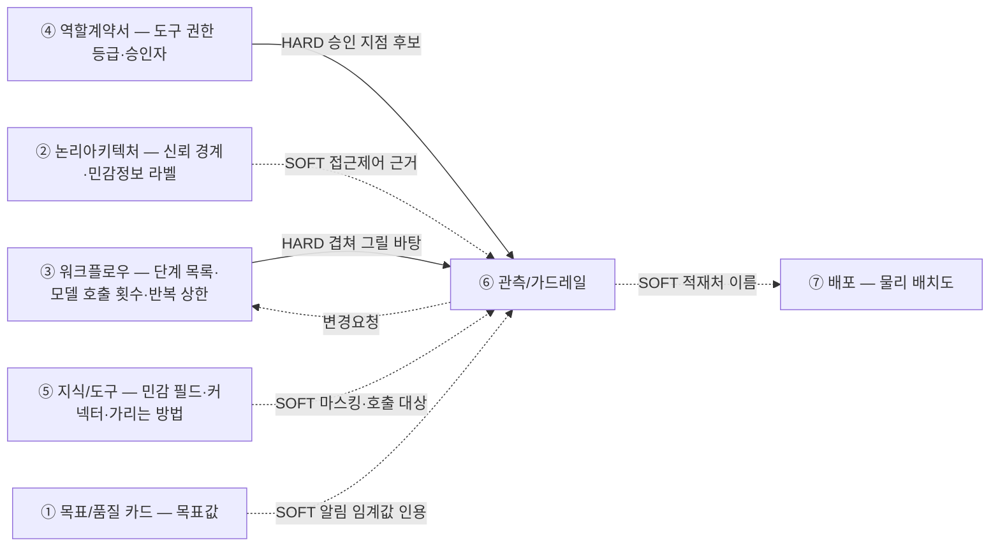

# 설계서 ⑥ 관측/가드레일: 작성 가이드

---

- [설계서 ⑥ 관측/가드레일: 작성 가이드](#설계서--관측가드레일-작성-가이드)
  - [1. 이 설계서가 답하는 질문](#1-이-설계서가-답하는-질문)
  - [2. 9대 리스크와 막는 자리](#2-9대-리스크와-막는-자리)
  - [3. 설계항목 작성법](#3-설계항목-작성법)
    - [3-1. 관측](#3-1-관측)
      - [단계별 구조화 로그 항목](#단계별-구조화-로그-항목)
      - [구간별 구조화 로그 항목](#구간별-구조화-로그-항목)
      - [구조화 로그 관측 이름 규칙](#구조화-로그-관측-이름-규칙)
      - [관측 적재처](#관측-적재처)
    - [3-2. 가드레일](#3-2-가드레일)
      - [입력측 처리](#입력측-처리)
      - [승인 지점](#승인-지점)
      - [위임 호출 상한](#위임-호출-상한)
      - [커넥터 호출 상한](#커넥터-호출-상한)
      - [연속 실패 차단](#연속-실패-차단)
      - [비용 상한](#비용-상한)
      - [출력측 검사](#출력측-검사)
      - [차단 규칙(Kill-Switch)](#차단-규칙kill-switch)
      - [알림 임계값](#알림-임계값)
      - [마스킹](#마스킹)
  - [4. 제출 전 자가 점검표](#4-제출-전-자가-점검표)

---

## 1. 이 설계서가 답하는 질문

**"이 시스템이 사고를 치기 전에, 어디서 어떻게 막는가."**

③ 워크플로우 위에 제한 장치와 단계별 구조화 로그 항목을 겹쳐 그리는 문서임.
새 단계를 만들지 않고 있는 단계에 태그만 붙임.

**이걸 안 하면 나는 사고 3줄**

- 비용: 모델 호출이 루프를 돌아 한 달 예산을 며칠에 씀. 청구서를 봐야 앎
- 성능: 품질이 나빠도 원인 단계를 못 찾음. 기록이 없으면 못 고침
- 보안: 외부 문서의 문장이 지시로 읽히고, 고객 이름·전화번호가 응답과 로그에 남음

**이 세 줄이 곧 하네스 9대 실행 리스크임**: 비용 3종 · 성능 3종 · 보안 3종으로 나뉨.
9건 전부를 이 문서가 받거나 앞 설계서로 넘기며, 어느 항목이 어느 리스크를 받는지는 2절이 정함.

**앞뒤 연결도**



`HARD` 없으면 못 채움 · `SOFT` 나중에 고침.

**②⑤가 `SOFT`인 이유**: 없어도 문서를 시작할 수는 있으나 마스킹·입력측 처리 칸이
`[확인필요]`로 남음. ③④는 단계와 등급이 없으면 **표의 행 자체를 만들 수 없어** `HARD`임.

**타임아웃·재시도·반복 상한은 ③ 워크플로우 표에 있고 이 문서에 옮겨 적지 않음**: 겹쳐 적으면
같은 숫자가 두 곳에 남아 어느 쪽이 진짜인지 모르게 됨. 값이 이상해 보이면 여기서 고치지 않고
③ 워크플로우에 `변경요청` 1행을 되돌림.

**단, 다른 문서가 아직 정의하지 않은 성격은 그 값을 인용하면서 이 문서가 새로 정의할 수 있음**:
**이미 있는 값을 그대로 옮겨 적는 것(복제)과, 어느 문서에도 없는 값을 이 문서가 처음 정의하는
것(재정의)은 다름** — 복제는 금지, 재정의는 허용. 예를 들어 재시도 **횟수**는 ③ 값을 인용만
하지만, 재시도 **간격**(고정 대기·지수 백오프처럼 그 반복을 어떤 리듬으로 도는지)은 ③·④·⑤
어디에도 자리가 없으므로 이 문서가 새로 정의하고 `근거 출처`에 `설계판단(이유 1줄)`로 남김.
**재정의한 값은 반드시 인용한 원본 값(예: ③의 재시도 횟수)과 같이 적어 둘의 관계가 보이게 함.**

**또한, 이미 다른 문서가 정한 숫자라도 이 문서가 운영상 이유로 더 엄격한(작거나 같은) 값으로
낮춰 잡을 수 있음**: 예를 들어 ③의 계산식이 만드는 `호출 수 상한`의 이론적 최댓값을 그대로
안 쓰고, 비용·안정성 이유로 그보다 낮은 숫자에서 먼저 끊을 수 있음. **원본 값보다 큰 숫자로
완화하는 것은 금지**임(구조적으로 일어날 수 없는 호출까지 상한으로 잡으면 상한의 뜻을 잃음).
낮춰 잡았으면 원본 계산값과 낮춘 이유를 함께 적음(`근거 출처`에 `설계판단(이유 1줄)`).

---

## 2. 9대 리스크와 막는 자리

값부터 정하면 반드시 막힘. **무엇을 막는지와 어디서 막는지를 먼저 정함.**

하네스 9대 실행 리스크를 막는 자리는 **입력측 · 도구 호출측 · 출력측** 셋뿐임.
리스크마다 이 문서의 어느 항목이 받는지를 아래 표로 못 박음.

| 리스크 | 무엇이 터지나 | 막는 지점 | 이 문서의 항목 | ⑥이 인용만 하는 것(값의 주인) |
|-------|-------------|:--------:|--------------|--------------------------|
| 돌 무한 루프 | 제어 실패로 같은 구간을 계속 돌아 비용이 폭증함 | 도구 호출측 | 구간별 구조화 로그 항목 · 알림 임계값 | ③ 반복 상한(`max_iter`) · 착지 노드 |
| 토 토큰 누수 | 컨텍스트가 비대해져 호출마다 쓰는 토큰이 불어남 | 도구 호출측 | 비용 상한 · 알림 임계값 | ④ 사용 모델 · ⑤ top-k·청킹 |
| 폭 Agent 폭주 | 호출 수·병렬 수·위임 깊이가 한꺼번에 늘어 비용이 급증함 | 도구 호출측 | **위임 호출 상한 · 커넥터 호출 상한** | ③ 재시도·반복 상한 · ⑤ 커넥터 ID |
| 멈 시스템 마비 | 바깥 도구의 연속 실패가 흐름 전체를 끌고 내려감 | 도구 호출측 | **연속 실패 차단** | ③ 단계 경계의 `초과 시 처리` |
| 느 응답 지연 | 처리가 느려져 사용자가 기다리다 떠남 | 도구 호출측 | 단계별 구조화 로그 항목 · 알림 임계값 | ③ 타임아웃 · ① 응답시간 목표 |
| 할 할루시네이션 전파 | 근거 없는 출력이 다음 단계 입력이 되어 뒤가 다 오염됨 | 출력측 | 차단 규칙(필수 2행) | ⑤ 검색 판정 `합격선` · ④ 성공기준 |
| 침 Prompt Injection | 외부 문자열이 지시로 읽혀 의도한 동작이 바뀜 | 입력측 | **입력측 처리** | ⑤ 커넥터 응답 키 · 허용 도구 목록 |
| 유 데이터 유출 | 민감정보가 응답·로그·트레이스로 밖에 나감 | 출력측 | 출력측 검사 · 마스킹 · 관측 적재처 | ② `SL-n` · ⑤ `F-n`·가리는 방법 |
| 권 권한 오남용 | 되돌릴 수 없는 실행이 승인 없이 나감 | 도구 호출측 | 승인 지점 | ④ 도구 권한 등급 · 승인자 |

- **`이 문서의 항목` 칸이 비면 그 리스크는 미통제임**: 3절에 그 항목이 실재해야 함.
  이 표가 이 문서의 완결성을 재는 자리임
- **오른쪽 칸의 값을 여기서 새로 정하지 않음**: 어긋나면 그 문서에 `변경요청` 1행을 되돌림
- **채우는 순서는 비용 → 성능 → 보안임**: 비용 3종은 숫자와 카운터만 있으면 즉시 효과가 나고
  보안 3종은 프롬프트 구조·경계 설계를 건드려야 하므로 마지막에 정교화함.
  **순서는 채우는 순서일 뿐이고 빼도 되는 것은 없음**
- 리스크 이름의 한 글자 부호(돌·토·폭 / 멈·느·할 / 침·유·권)는 암기 힌트임: 산출물에 적지 않음

**하네스 대응 라벨**

산출물 표에는 제품 이름을 쓰지 않고 중립어만 씀. 프레임워크마다 이름이 다르고 판올림에 따라
바뀌므로 **가리키는 대상이 같은지만** 보고 씀. 아래 3개는 3절이 판정 기준으로 쓰므로
뜻이 갈리면 설계가 틀림. 나머지 중립어는 쓰는 항목이 그 자리에서 풀어씀.

| 이 가이드의 말 | 무엇을 가리키나 | 왜 갈라 두나 |
|---------------|---------------|------------|
| `실행 중 카운터` | 호출이 끝날 때마다 누적을 보는 처리기 | **실행을 실제로 멈출 수 있는 자리는 여기뿐임** |
| `사후 집계` | 이미 적재된 기록을 나중에 합산하는 것 | 볼 수는 있어도 **못 막음**. 알림에만 쓸 수 있음 |
| `원문 전송 차단` | 적재처로 보내기 전에 입력·출력을 치환하는 설정 | 이 자리를 안 걸면 출력측을 다 막아도 트레이스로 새어 나감 |

---

## 3. 설계항목 작성법

**설계항목은 2계열 14개로 나뉨**: `3-1 관측` 4개 · `3-2 가드레일` 10개.
`가드레일`은 사고를 막는 장치를 통칭하는 말임: 승인·상한·차단·가리기가 다 여기 들어감.
**3-2의 항목 순서는 2절의 막는 지점 순서를 따름**(입력측 → 도구 호출측 → 출력측 → 전역).
**이 제목 구조가 곧 산출물의 목차임**: 여기 없는 절을 산출물에 만들지 않고 여기 있는 절을 빼지도 않음.

**말미 부속 표는 공통규격 「부속 표 4종의 열 구성」을 그대로 씀**: 이 산출물에 해당하는 것만 두고
**`변경요청` 표(`무엇 / 받는 곳 / 사유` 3열)는 0건이어도 만듦.** 3절 항목이 아니라 문서 말미 부속임.

**품질 목표·측정 대상은 이 문서에 없음**: ① 목표/품질 카드가 `측정 방법 · 채점 수단 · 목표값`을
이미 갖고 문항 구성은 별도 품질 튜닝 소관임. 여기서 옮겨 적으면 값이 두 곳에 남음.
**다만 3-2 「알림 임계값」이 ① 목표값을 인용하는 칸은 예외임**: 인용은 값을 옮겨 적는 것이 아니라
①을 가리키는 것이고 숫자는 ①에서 봄.

**③의 단계 목록이 확정되기 전에는 시작하지 않음**: 겹쳐 그릴 바탕이 없으면 표의 행을 만들 수 없음.
확정 전이면 ③ 워크플로우를 먼저 끝냄.

**호출·측정을 안 했으면 문서 머리에 `미검증 설계`로 적음**: 산출물 7종은 실행 전 설계임.
실제로 돌려 본 숫자가 아니라 설계값이라는 사실이 문서에 남아야 함.

**항목마다 이 순서로 씀**: **항목명**(굵게) → **열 정의 표**(`열 \| 적을 값`) → 교차문서 규칙
불렛 → **「산출물 표 모양」**. 작성법은 문단·표로, 산출물은 전부 표로 씀.
**작성법을 표에 밀어 넣지 않음**: 칸 안에서 `<br>`로 줄을 나누게 되고 불렛을 못 씀.

**전 항목이 전역 표임**: 워크플로우로 표를 쪼개지 않고 **`워크플로우` 열을 붙여 한 표에 모음.**

- **한 표에 모아야 빠진 것이 바로 드러남**: 쪼개면 표를 다 열어 보고서야 기록이 안 붙은 단계,
  상한이 없는 커넥터를 셀 수 있음. 워크플로우가 늘어도 행만 늘어남
- **`워크플로우`·`단계`·`대상` 칸은 `ID. 이름` 꼴로 씀**: ID만 적으면 `S-R5`가 무엇인지 알 수
  없어 읽는 사람이 ③을 계속 되짚어야 함. **단계명은 ③ 「단계별 설계」의 `행동 1개` 값을 그대로
  인용**하고 줄여 쓰지 않음. 이름이 바뀌면 일괄 치환으로 맞춤
- **워크플로우 축이 없는 항목은 그 열을 두지 않음**: 「구조화 로그 관측 이름 규칙」·「관측 적재처」·
  「알림 임계값」은 프로젝트 단위, 「마스킹」은 필드 단위임
- **마스킹을 워크플로우별로 나누지 않음**: 같은 필드를 워크플로우마다 다르게 가리면 구현에서
  규칙이 갈림. **필드 1개에 가리는 방법 1개**임
- **⑥이 ID를 새로 붙이지 않음**: 워크플로우ID·단계ID·커넥터ID는 ③④⑤가 발급한 것을 인용만 함

**근거 출처 열은 판정성 표에만 둠**: 형식은 공통규격 「근거 출처 표기법」의 `{약칭}:{항목ID}#{하위}`
1개임(예: `US:NFR-SEC-020#마스킹`). 못 찾으면 `[확인필요]`, 우리가 정한 값이면
`설계판단(이유 1줄)`로 적음. **공란으로 두면 검토자가 그 값을 확인할 길이 없어짐.**

| 근거 출처 열 | 어느 표 | 왜 |
|:-----------:|--------|----|
| 둠 | 3-2 「가드레일」의 표 **전부**(10개) · 3-1 「관측 적재처」 | 이 문서가 판정해 정한 값이라 근거를 물을 수 있음 |
| 안 둠 | 3-1 「단계별 구조화 로그 항목」 · 「구간별 구조화 로그 항목」 · 「구조화 로그 관측 이름 규칙」 | ③의 단계ID와 항목 이름을 인용하는 표라 출처가 항상 ③ 하나임(설계판단) |

---

### 3-1. 관측

관측이 남기는 기록은 **트레이싱 로그 · 구조화 로그 · 감사 로그** 3종임. 이름이 갈리는 이유는
쌓는 방식과 정의하는 곳이 서로 다르기 때문임.

| 종류 | 무엇이 남기나 | 정의하는 곳 |
|------|-------------|-----------|
| 트레이싱 로그 | 추적 도구가 자동으로 남김(자동 계측) | 이 문서가 값을 정의하지 않음. 도구를 켜는 것만으로 남음 |
| 구조화 로그 | 우리가 설계한 필드를 코드가 직접 찍음 | 「단계별 구조화 로그 항목」·「구간별 구조화 로그 항목」·「구조화 로그 관측 이름 규칙」 3개 |
| 감사 로그 | 승인·자동 실행·제한 장치 판정 | 3-2 「승인 지점」 표 전건(그 표 머리에 정의를 둠) |

셋 다 **어디에 쌓는지**는 아래 「관측 적재처」 1곳이 받음.

#### 단계별 구조화 로그 항목

**전역 표 1개임**: ③의 전 워크플로우·전 단계를 한 표에 담음. **단계 1개 = 행 1개.**

| 열 | 적을 값 |
|----|--------|
| 워크플로우 | `ID. 이름` 꼴(`W-1. 오늘의 추천조회`). ③ 「워크플로우 표」에서 인용 |
| 단계 | `ID. 이름` 꼴(`S-R3. 동의·사전 조건 확인`). 이름은 ③ 「단계별 설계」의 `행동 1개` 값을 **그대로** 씀 |
| 기록 항목 | 그 단계에서 남길 **칸 이름**을 하나씩 `·`로 나열(`요청ID`·`지연`·`토큰`·`실패사유`). US 실패 사유와 BM 측정 방법에서 가져옴. ③이 재시도 계층에 이름을 붙였으면(`단계 자체 재시도`·`상위 재계획 재시도` 꼴) **그 이름을 그대로** 항목 이름으로 씀. 못 정했으면 `[확인필요: 단계별 구조화 로그 항목]` |

- **누가 남기는지는 묻지 않음**: 수집 도구를 켜도 우리가 직접 남겨야 하는 값이 늘 있으므로
  **설계가 가릴 축이 아님.** 어떤 기법으로 남기든 개발 소관이고, 이 표는 **남길 칸이 있는지만** 정함
- **적는 것은 칸 이름이고 그 값이 아님**: 아래 표의 `단계재시도횟수`는 **기록에 남길 칸의 이름**임.
  그 칸에 `3`이 찍히는 것은 실행할 때의 일이고 **숫자를 이 문서에 적지 않음**(③ 소유).
  재시도·폴백·중단 조건의 숫자도 같음
- **재시도 계층을 한 항목에 합치지 않음**: 어느 층에서 터졌는지 못 찾음. 상위 층은 단계가 아니라
  구간에 붙으므로 다음 항목이 받음
- **「입력측 처리」·「출력측 검사」에 걸린 건수도 기록 항목으로 둠**: 「알림 임계값」이 그 값을
  축으로 쓰므로 남는 칸이 없으면 임계값을 잴 수 없음
- **단말·프론트엔드 구간처럼 우리가 손대지 않는 단계는 행을 만들지 않음**: ③이 `담당자 없음`으로
  표시한 단계임

**산출물 표 모양** (전역 표 1개 · ③이 재시도를 2층으로 나눈 경우)

| 워크플로우 | 단계 | 기록 항목 |
|----------|------|----------|
| `W-1. 오늘의 추천조회` | `S-R2. 추천 요청 접수` | `요청ID` · `지연` · `실패사유` · `입력측검출건수` |
| `W-1. 오늘의 추천조회` | `S-R3. 동의·사전 조건 확인` | `요청ID` · `지연` · `실패사유` · `단계재시도횟수` |
| `W-1. 오늘의 추천조회` | `S-R5. 추천 3개·이유 1줄 생성` | `요청ID` · `지연` · `토큰` · `실패사유` · `단계재시도횟수` · `근거문서수` |
| `W-1. 오늘의 추천조회` | `S-R9. 추천 응답 반환` | `요청ID` · `지연` · `출력측검사적중건수` · `마스킹적용건수` |
| `W-2. 일일 취향 갱신` | `S-B4. 취향 벡터 재계산` | `요청ID` · `지연` · `토큰` · `실패사유` · `단계재시도횟수` |

**하지 말아야 할 칸**

| 잘못된 칸 | 무엇이 틀렸나 |
|----------|-------------|
| 기록 항목에 `재시도 3회` | 실행 시의 **숫자**를 적었음. 칸 이름(`단계재시도횟수`)만 적음 |
| 기록 항목에 `로그 남김` | 무엇을 남기는지가 없음. 항목 이름을 하나씩 적음 |
| 기록 항목에 `데코레이터로 계측` | 구현 기법을 적었음(개발 소관) |
| 단계 칸에 `S-R3`만 적음 | `ID. 이름` 꼴이 아님. ③ `행동 1개` 값을 함께 적음 |

#### 구간별 구조화 로그 항목

**상위 재시도·되돌기 층은 단계가 아니라 구간에 붙음**: 재수행은 여러 단계를 되돌려 감싸므로
단계 행에 정의할 수 없음. ③ 워크플로우가 `max_iter`·착지 노드를 단계 표 밖에 적는 것과 같은 층위임.
**「단계별 구조화 로그 항목」과 같이 전역 표 1개**로 두고 `워크플로우` 열을 붙임.

| 열 | 적을 값 |
|----|--------|
| 워크플로우 | `ID. 이름` 꼴. **워크플로우마다 `전체` 행이 1개씩 있어야 함** |
| 구간 | `전체`(그 워크플로우 1회분) 또는 되돌아가는 구간(`S-R4 ~ S-R7` 꼴). 범위는 ③ 「반복 구간」 표의 `되돌아가는 구간`을 그대로 인용함 |
| 기록 항목 | `전체` 행은 `요청ID` · 전체 지연 · 총 토큰 · 최종 상태(성공·부분성공·실패) · 종료 사유. 루프 행은 **그 층의 횟수 · 상한 소진 여부 · 착지 노드** |

- **루프가 없는 워크플로우도 `전체` 행을 둠**: **최종 상태·종료 사유는 단계 기록을 다 더해도
  안 나오고** 전체 지연도 단계 지연의 합이 아님(단계 사이의 대기·분기 시간이 끼임)
- **루프 층을 「단계별 구조화 로그 항목」에 넣지 않음**: 넣으면 그 값이 어느 바퀴의 것인지 안 갈림
- **상한을 소진해서 어디로 떨어졌는지가 남아야 원인을 찾음**: `상한소진여부`와 `착지노드`가
  둘 다 있어야 "상한까지 돌고 안전 종료했다"와 "한 바퀴에 끝났다"를 구분함
- `요청ID`처럼 **층을 잇는 항목은 두 표에 다 넣음**: 단계 기록과 구간 기록을 이어 볼 수 있어야 함
- **「연속 실패 차단」이 열린 사실은 `전체` 행의 종료 사유로 남음**: 그 값이 없으면 왜 부분 결과가
  나갔는지 나중에 못 밝힘

**산출물 표 모양** (전역 표 1개)

| 워크플로우 | 구간 | 기록 항목 |
|----------|------|----------|
| `W-1. 오늘의 추천조회` | `전체` | `요청ID` · `전체지연` · `총토큰` · `최종상태` · `종료사유` |
| `W-1. 오늘의 추천조회` | `S-R4 ~ S-R7` | `재계획재시도횟수` · `상한소진여부` · `착지노드` |
| `W-2. 일일 취향 갱신` | `전체` | `요청ID` · `전체지연` · `총토큰` · `최종상태` · `종료사유` |

**루프가 없으면 그 워크플로우의 행이 `전체` 1개로 줄 뿐임**: 행을 지우지 않음.

#### 구조화 로그 관측 이름 규칙

수집 도구가 쌓는 기록에는 그 도구나 프레임워크가 붙인 이름이 달림. 그 이름이 ③ 워크플로우의
단계와 안 맞으면 **기록을 보고도 어느 단계가 터졌는지 되짚을 수 없음.** 이름을 맞추는 규칙을
전역 표 1개로 적음.

**자동 계측은 라이브러리 경계만 알고 워크플로우 경계는 모름**: 모델·HTTP·DB 호출은 켜는 것만으로
이름이 붙지만 그것이 어느 워크플로우의 어느 단계인지는 우리만 앎. **그래서 실행·단계·구간 이름은
우리가 붙여야 함.**

| 열 | 적을 값 |
|----|--------|
| 대상 | `실행 1회` · `단계` · `구간` · `공통 라벨` **4행 고정**. 대상을 늘리거나 빼지 않음 |
| 이름 규칙 | ③의 부호를 무엇과 잇는지만 적음(`{워크플로우ID}.{단계ID}` 꼴). **접두·구분자 같은 문자열 조립 문법은 개발 몫임** |
| 되짚을 곳 | 그 이름의 성분이 실재하는 **표와 열**을 집어 적음 |

**이름 3층이 겹쳐 쌓이는 모양** (기록은 중첩된 나무로 남음)

```
W-1                        전체
├─ W-1.S-R2                단계
├─ W-1.S-R4~S-R7           구간(루프 전체)
│  ├─ W-1.S-R4             1바퀴
│  ├─ W-1.S-R7
│  ├─ W-1.S-R4             2바퀴
│  └─ W-1.S-R7
└─ W-1.S-R9
전 계층 공통 라벨: 요청ID · 워크플로우ID
```

- **`공통 라벨`은 이름이 아니라 거르는 값임**: 이름은 "무엇인가"를 말하고 공통 라벨은
  "어느 건인가"를 말함. `W-1.S-R5` 기록이 100건 쌓였을 때 그중 한 요청만 보려면 `요청ID`로
  걸러야 하므로 **모든 계층에 함께 붙임**
- **조립된 이름을 두 기록 표에 열로 적지 않음**: 이름은 그 행의 `워크플로우`·`단계`·`구간` 칸에서
  조립되는 파생값임. 행마다 적으면 ID를 고칠 때 이름이 안 따라옴
- **함수 단위 이름은 정하지 않음**: 단계 안의 모델·도구 호출은 수집 도구가 자체 이름으로 기록을
  만들어 우리 규칙이 지지 않고, 함수마다 만들면 기록이 폭발함. **한 단계 안을 갈라 봐야 하면
  이름을 만들지 않고 ③에 단계 분할 `변경요청` 1행을 남김**
- **워크플로우명이 아니라 워크플로우ID를 씀**: 이름은 길고 다듬는 과정에서 바뀜.
  **③ 「워크플로우 표」가 발급한 `W-n`을 인용만 하고 ⑥이 새로 붙이지 않음**
- **State 필드 이름을 공통 라벨로 쓰지 않음**(③ 소유). 공통 라벨에는 `요청ID`처럼 이 문서가
  기록 항목으로 이미 정한 것만 씀
- 이름 규칙에 아직 확정 표준이 없는 부호를 쓸 때는 **`표준 후보 · 조회일 기준` 1줄을 병기**함
- **조립 문법을 코드 어디에 한 번만 박는가는 개발 몫임**: 개발 프롬프트 `05-guardrail.md`가 다룸

**산출물 표 모양** (전역 표 1개)

| 대상 | 이름 규칙 | 되짚을 곳 |
|------|----------|----------|
| 실행 1회 | `{워크플로우ID}` | ③ 「워크플로우 표」의 `워크플로우ID` |
| 단계 | `{워크플로우ID}.{단계ID}` | 「단계별 구조화 로그 항목」의 `워크플로우`·`단계` 열 |
| 구간 | `{워크플로우ID}.{시작ID}~{끝ID}` | 「구간별 구조화 로그 항목」의 `워크플로우`·`구간` 열 |
| 공통 라벨 | `요청ID` · `워크플로우ID`를 **모든 계층에 함께 붙임** | 두 기록 표를 잇는 값 |

#### 관측 적재처

기록을 **어디에 쌓는지**를 정하는 자리임. **제품·전송 키·안/밖 배치는 설계 범위 밖**(구현·운영
단계에서 결정)이고, 이 문서는 성격과 전송 여부까지만 정함. ⑦ 배포는 여기서 이름만 인용해
물리 배치도에 얹음.

| 열 | 적을 값 |
|----|--------|
| 로그 유형 | 쌓는 것마다 1행(`트레이싱 로그` · `구조화 로그` · `감사 로그`). 쌓지 않는 것은 행을 만들지 않음 |
| 저장소 유형 | **성격까지만**(`관리형 클라우드` · `사내 저장소`). 제품·전송 키·런타임 안밖 배치·지역 제한은 **설계 범위 밖**(구현·운영 단계에서 결정) |
| 외부 전송 | `예(국외)` · `예(국내)` · `아니오` 중 1개. `예(국외)`면 국외 이전 근거를 작성. **지역 고정 요건 자체는 설계 범위 밖이므로 여기서는 예·아니오만 표시함** |
| 원문 전송 차단 | 적재처로 보내기 전에 입력·출력을 무엇으로 치환하나(`보내기 직전 입력·출력 치환 1벌` · `요약·해시만 적재` 꼴). **이 값을 3-2 「마스킹」이 별도 행으로 다시 정의하지 않고 그대로 따름** |

- **`트레이싱 로그`를 쌓으면 프롬프트 원문이 통째로 적재처로 감**: 입력·출력이 그대로 실림.
  `원문 전송 차단` 칸이 비면 「마스킹」이 있어도 무력함. **출력 직전에 가려도 트레이스에는
  이미 원문이 저장돼 있음**
- **밖에 있는 적재처 하나로만 보내지 않는지 봄**: 나중에 품질 집계·비용 정산이 그 기록을
  읽어야 하는데 밖으로만 나가면 읽을 자리가 없음. 읽을 자리가 필요하면 1줄 적음
- **감사 로그는 다른 두 계열과 수명이 다름**: 법정 보관 기간이 붙으면 보존 기간의 주인은
  ⑤ 지식/도구 3-3이므로 여기서 기간을 적지 않고 그 사실만 `근거 출처`에 남김
- **`감사 로그` 행을 두면 그 내용이 어디서 오는지도 함께 적음**: 새 기록 항목을 여기서
  만들지 않고 **3-2 「승인 지점」 표 전건**을 가리킴. 승인 지점 표가 없으면(모든 도구가
  자동 실행이면) 감사 로그 행도 만들지 않음

**산출물 표 모양** (전역 표 1개)

| 로그 유형 | 저장소 유형 | 외부 전송 | 원문 전송 차단 | 근거 출처 |
|------------|------------|-------------|--------------|---------|
| 트레이싱 로그 | 밖에 있는 관리형 추적 서비스 | 예(국외) | 보내기 직전 입력·출력 치환 1벌 | `[확인필요]` |
| 구조화 로그 | 사내 저장소 | 아니오 | `F-1` 마스킹 적용 | `US:NFR-SEC-040#로그` |
| 감사 로그 | 사내 저장소 | 아니오 | 요약·해시만 적재 | `US:NFR-SEC-041#감사` |

---

### 3-2. 가드레일

#### 입력측 처리

**외부 정보를 읽는 단계마다 행 1개**임. 외부 문자열이 **지시로 읽히는 것**을 막는 자리임.
`외부 정보`는 **내용을 우리 코드가 정하지 않아 밖에서 바꿔 넣을 수 있는 문자열**이며
아래 5종이 전부임: 그 단계가 5종 중 하나라도 읽으면 행을 만듦.

**전 단계 공통 원칙 2가지 — 단계마다 다르게 정하지 않으므로 표의 칸이 아님**

| 원칙 | 무엇을 하나 | 왜 전 단계 공통인가 |
|------|-----------|------------------|
| **경계 표시** | 외부 문자열을 `<untrusted_contents> … </untrusted_contents>` XML 태그로 감쌈. 태그 이름을 프로젝트마다 지어내지 않음 | 한 단계만 빼면 그 단계가 통로가 됨 |
| **역할 분리** | **시스템 프롬프트에는 우리 지시만 두고** 외부 문자열은 유저 프롬프트·도구 결과 블록으로 넘김. 지시 문장에 문자열로 이어 붙이지 않음 | 같은 문자열 안에 있으면 모델이 지시와 데이터를 가를 근거가 없음 |

**지시 무력화 문장도 전 단계 공통임**: 구획 안의 명령형 문장을 **데이터로만 취급**한다는 문장을
시스템 프롬프트에 1벌 둠. 구획만 있고 이 문장이 없으면 모델이 왜 무시해야 하는지 모름.

**이 둘은 가르는 장치이고 잡는 장치가 아님**: 넘어온 문자열이 공격인지 아닌지를 판정하지 않으므로
**"걸림"이 없음.** 검출은 아래 `코드검사`만 함.

| 열 | 적을 값 |
|----|--------|
| 워크플로우 | `ID. 이름` 꼴(`W-1. 오늘의 추천조회`). ③ 「워크플로우 표」에서 인용 |
| 단계 | `ID. 이름` 꼴(`S-R2. 추천 요청 접수`). 이름은 ③ 「단계별 설계」의 `행동 1개` 값을 **그대로** 씀 |
| 외부 정보 종류 | 아래 5종 중 **1개**. 여러 개면 행을 나눔 |
| 코드검사 | `사용` · `미사용` 중 1개. **모델이 아니라 결정론적 코드가 값을 훑어 거르는 것**임 |
| 검사시점 | `받는 즉시` · `캐시 적재 전` · `프롬프트 조립 직전` 중 **해당하는 것을 전부** `·`로 나열함(아래 기본 자리 표). `코드검사 = 미사용`이면 `해당 없음` |
| 찾는 값·패턴 | `코드검사 = 사용`이면 **무엇을 찾는지** 잴 수 있는 꼴로 적음(정규식 · 값 목록 · 길이 상한 · 허용 문자 집합). `미사용`이면 `해당 없음` |
| 걸렸을 때 | **코드검사에 걸렸을 때** 하는 일: `그 값만 버리고 계속` · `안전 종료` · `사람 확인` 중 1개 + 알릴 대상. `코드검사 = 미사용`이면 `해당 없음` |
| 근거 출처 | 공통규격 표기법 |

**`외부 정보 종류` 5종**

| 종류 | 무엇 | 어디서 세나 |
|------|------|-----------|
| `사람 입력` | 입력창에 친 글 | ③ 단계의 참여 주체가 사용자인 단계 |
| `올린 문서` | 사용자가 올린 파일의 본문 | ③ 단계 중 파일을 받는 단계 |
| `외부 응답 문자열` | 커넥터 응답의 **자유 문자열 칸**과 도구 실행 결과(`tool_result`) 내용 | ⑤ 3-2 커넥터의 `응답 키` |
| `캐시 적재값` | 한 번 들어온 외부 정보가 캐시를 거쳐 뒤늦게 프롬프트에 들어감 | ⑤ 3-1 「외부검색」의 `캐시 저장소`·`캐시 유효기간` 칸이 있는 경로 |
| `MCP 도구 설명` | `tools/list`·`resources/list`·`prompts/list` 응답의 도구 이름·설명·입력 스키마 설명문 | ⑤ 「커넥터 목록」의 `MCP 서버` 커넥터 전건 |

- **`코드검사`는 바깥 값이 우리 쪽으로 들어오는 자리에서 코드가 훑는 것임**: 값을 아예
  버리거나(허용 목록 밖), 일부만 뽑아 넘기거나(제목·URL만), 형식을 강제함. **모델이
  요약·판정하는 것은 코드검사가 아님** — 요약하려면 원문이 이미 모델에 들어가 주입이 끝남
- **검사 시점은 `프롬프트 조립 직전` 한 곳이 아님**: 종류에 따라 값이 들어오는 자리가 앞에 있음.
  거기서 안 걸면 **모델에 안 가는 경로가 빈 채로 남음** — 외부 응답이 저장소·다음 단계로만
  흘러도 그 값은 나중에 프롬프트나 화면에 실림

**종류별 기본 검사 시점** — 이보다 앞자리를 빼지 않음

| 외부 정보 종류 | 기본 검사 시점 | 왜 그 자리인가 |
|--------------|-------------|--------------|
| `사람 입력` | 프롬프트 조립 직전 | 입력창에서 곧바로 프롬프트로 감 |
| `올린 문서` | 받는 즉시 · 프롬프트 조립 직전 | 파일은 저장소에도 저장되므로 받는 자리에서 한 번 더 훑음 |
| `외부 응답 문자열` | **받는 즉시** | 모델에 안 가고 저장소·다음 단계로만 흘러도 오염됨 |
| `캐시 적재값` | **캐시 적재 전 · 프롬프트 조립 직전** | 적재 전에 걸러도 유효기간 안에 꺼내 쓸 때 또 들어감 |
| `MCP 도구 설명` | **받는 즉시**(`list_*` 응답) | 도구를 한 번도 부르지 않아도 설명문이 먼저 컨텍스트에 저장됨 |
- **`찾는 값·패턴`을 공격 문구 목록으로만 채우지 않음**: `이전 지시 무시` 같은 문구는 바꿔 쓸 수
  있음. **값의 꼴을 좁히는 쪽**이 강함(허용 문자 집합 · 길이 상한 · 값 목록)
- **`코드검사 = 미사용`도 정상임**: 값의 꼴이 열려 있어 코드로 가를 수 없는 자유 텍스트가 그럼.
  그때는 위 공통 원칙 2가지만으로 막고 `걸렸을 때`를 `해당 없음`으로 둠
- **`외부 응답 문자열`의 자유 문자열 칸은 타입이 `string`이면서 값 목록이 닫히지 않아
  문장을 넣을 수 있는 칸임**: `results.raw_content`·`title`·`설명`은 해당하고
  `status_code` 같은 코드·`number`·날짜 형식은 아님. **자유 입력창이 없는 앱에서 가장 자주
  빠지는 자리임**
- **`MCP 도구 설명`은 도구를 부르기 전에 모델에 들어감**: 도구를 한 번도 부르지 않아도 그
  설명문이 먼저 컨텍스트에 저장됨. 여기서는 `코드검사 = 사용`으로 두고 **⑤ 「허용 도구 목록」에
  우리가 적은 설명으로 갈아 끼우는 것**을 `찾는 값·패턴`에 적음. `제공자 구분`이 `내부`인
  서버도 판올림되면 설명이 바뀜
- **⑤ 「허용 도구 목록」은 부를 도구를 제한하는 통제이고 설명문의 내용을 검사하지 않음**:
  두 통제를 한 칸에 섞어 적지 않음(허용 목록이 있어도 설명문 주입은 그대로 들어옴)
- **`캐시 적재값`은 들어온 자리와 쓰이는 자리가 다름**: 캐시에 넣기 전에 한 번 걸었어도
  유효기간 안에 다시 꺼내 쓰는 단계에서 또 프롬프트에 들어감. **꺼내 쓰는 단계에도 행을 두고
  `검사 시점`에 두 시점을 함께 적음**
- **걸린 건수는 「단계별 구조화 로그 항목」에 칸이 있어야 함**: 「알림 임계값」의 `입력측 검출 건수`가
  그 값을 씀
- **행이 0건이면 놓친 것으로 보고 다시 셈**: 외부 문자열이 하나도 없는 앱은 드묾

**산출물 표 모양** (전역 표 1개)

| 워크플로우 | 단계 | 외부 정보 종류 | 코드검사 | 검사 시점 | 찾는 값·패턴 | 걸렸을 때 | 근거 출처 |
|----------|------|--------------|:-------:|---------|------------|----------|---------|
| `W-1. 오늘의 추천조회` | `S-R2. 추천 요청 접수` | `사람 입력` | 사용 | 프롬프트 조립 직전 | 길이 200자 상한 · 허용 문자 집합(한글·영숫자·공백·`,.!?`) 밖 문자 | 그 값만 버리고 계속 · 운영 담당자 | `US:NFR-SEC-050#입력검사` |
| `W-1. 오늘의 추천조회` | `S-R4. 후보 음식점 조회` | `외부 응답 문자열` | 사용 | 받는 즉시 | `desc` 칸에서 제목·주소만 뽑고 나머지 문자열은 버림 | 그 값만 버리고 계속 · 운영 담당자 | 설계판단(⑤ `C-A1` 응답 `desc`) |
| `W-1. 오늘의 추천조회` | `S-R4. 후보 음식점 조회` | `캐시 적재값` | 사용 | 캐시 적재 전 · 프롬프트 조립 직전 | 적재 전은 위 `desc` 규칙과 같음. 꺼낼 때는 허용 문자 집합 밖 문자 | 그 값만 버리고 계속 · 운영 담당자 | 설계판단(⑤ 캐시 유효기간 60분) |
| `W-1. 오늘의 추천조회` | `S-R6. 사내 설비 조회 호출` | `MCP 도구 설명` | 사용 | 받는 즉시(`list_*` 응답) | 서버 설명문을 버리고 ⑤ 「허용 도구 목록」에 적은 설명으로 갈아 끼움 | 안전 종료 · 보안 담당자 | 설계판단(⑤ `C-M1` 채택) |

**하지 말아야 할 칸**

| 잘못된 칸 | 무엇이 틀렸나 |
|----------|-------------|
| 코드검사 `사용` · 찾는 값·패턴 `프롬프트 인젝션 탐지` | 무엇을 찾는지가 없음. 정규식·값 목록·길이 상한처럼 잴 수 있는 꼴로 적음 |
| 코드검사 `사용` · 찾는 값·패턴 `모델이 위험도를 판정` | 모델 판정은 코드검사가 아님. 원문이 이미 모델에 들어감 |
| 코드검사 `사용` · 찾는 값·패턴 `허용 도구 목록으로 제한` | 허용 목록은 부를 도구를 고르는 통제이고 설명문을 검사하지 않음 |
| 코드검사 `미사용` · 걸렸을 때 `안전 종료` | 검출하는 자리가 없는데 걸렸을 때가 적혀 있음. `해당 없음`으로 둠 |
| `외부 응답 문자열` · 검사 시점 `프롬프트 조립 직전` | 받는 자리를 뺐음. 모델에 안 가고 저장소로만 흘러도 오염됨 |
| `캐시 적재값` · 검사 시점 `캐시 적재 전` | 꺼내 쓰는 자리를 뺐음. 유효기간 안에 또 프롬프트에 들어감 |
| 단계 칸에 `S-R2`만 적음 | `ID. 이름` 꼴이 아님. ③ `행동 1개` 값을 함께 적음 |

#### 승인 지점

**이 표가 감사 로그의 정의임**: 판정 행(워크플로우·단계·도구·등급·걸린 축·결론·승인자) 전건이
감사 로그로 감. 행마다 따로 표시하지 않고 표 전체가 대상임. 「관측 적재처」의 `감사 로그` 행이
이 표를 출처로 인용함.

**"위험해 보이는 곳"에 감으로 붙이지 않음.** 아래 순서로 뽑고 내린 결과를 표로 남김.
판정만 하고 표를 안 남기면 어느 도구가 왜 자동으로 내려갔는지 검토자가 확인할 길이 없음.

1. **④ 역할계약서 표B의 `사용도구·내부`·`사용도구·외부` 열에서 `쓰기(되돌림 불가)`·
   `쓰기(되돌림 가능)` 행을 전부 뽑음**: 등급을 가진 것은 ④ 역할계약서임. ⑤ 지식/도구에는
   읽기·쓰기 등급이 없으므로 거기서 뽑을 수 없음. **표B는 단계 1개 = 행 1개라 뽑은 행의
   `워크플로우 \| 단계` 값이 곧 승인 지점의 정확한 위치임**: ③으로 되돌아가 위치를 다시
   찾지 않음. 뽑은 도구의 커넥터 ID(`C-A1`·`C-M1`·`C-C1` 꼴)만 ⑤ 지식/도구에서 가져와 붙임
2. 뽑힌 행을 **일단 전부 승인 필요**로 둠(기본 거부)
3. 되돌릴 수 있는 것만 근거를 적고 자동 실행으로 내림
4. **되돌릴 수 있어도 그 1회가 「비용 상한」의 절반을 넘게 쓰면 자동 실행으로 내리지 않음**:
   되돌릴 수는 있어도 쓴 돈은 안 돌아옴
5. **되돌릴 수 없는데 사람 승인이 시간 제약상 불가하면** 상한·1회 제한 같은
   **제한 장치로 대체**하고 근거를 적음

**판정 축은 `되돌림`(3번) · `비용`(4번) 2개임.** 하나라도 걸리면 승인으로 올리고 어느 축에
걸렸는지를 아래 표의 `걸린 축` 칸에 그대로 적음.

**되돌릴 수 있음의 기준**: 취소 수단이 있고 5분 안에 원상복구됨. 헷갈리는 예를 표로 둠.

| 도구 | 되돌릴 수 있나 | 왜 |
|------|:------------:|----|
| 임시 저장 값 갱신 | 예 | 이전 값을 다시 쓰면 원상복구됨 |
| 예약 확정 | 아니오 | 상대 시스템에 자리가 잡히고 취소에 위약이 붙음 |
| 알림·메일 발송 | 아니오 | 회수 수단이 없음. 5번의 제한 장치 대상임 |
| 파일 업로드 | `[확인필요]` | 삭제 수단이 있고 5분 안에 지워지면 예. 확인 못 하면 아니오로 둠 |
| 모델 호출 | 예(되돌림) · 아니오(비용) | 바깥에 남는 변화는 없으나 쓴 돈은 안 돌아옴. **4번 축으로 판정함** |

| 열 | 적을 값 |
|----|--------|
| 워크플로우 | `ID. 이름` 꼴. ④ 표B `워크플로우 \| 단계`의 **워크플로우 부분을 그대로** 옮김 |
| 단계 | `ID. 이름` 꼴. ④ 표B의 **단계 부분을 그대로** 옮김. 단계명은 ③ 「단계별 설계」의 `행동 1개` 값을 그대로 인용하고 줄여 쓰거나 다른 말로 바꾸지 않음 |
| 도구 | ④ 표B `사용도구`의 이름을 그대로 인용. ⑤ 커넥터 ID(`C-A1` 꼴)를 함께 붙일 수 있음 |
| 등급 | ④ 표B의 `쓰기(되돌림 불가)`·`쓰기(되돌림 가능)`. ⑤ 지식/도구에는 등급이 없어 거기서 못 뽑음 |
| 걸린 축 | `되돌림` · `비용` 중 걸린 것. 둘 다 걸리면 둘 다 적음 |
| 결론 | `승인` · `자동 실행` · `제한 장치` 중 1개. `제한 장치`는 무엇으로 대체했는지 함께 씀(`1회만 발송` 꼴). **`자동 실행`·`제한 장치`는 `근거 출처`에 `설계판단(이유 1줄)`을 적음** |
| 승인자 | **④의 승인자 짝짓기를 인용**함(`R-H1` 운영 담당자 꼴). ⑥이 새로 정하지 않고, ④에 짝이 없으면 `[확인필요: 승인자]` |
| 근거 출처 | 공통규격 표기법 |

- **행 수는 ④ 표B의 `쓰기(되돌림 불가)`·`쓰기(되돌림 가능)` 행 수와 같음**: 자동 실행으로 내린
  행도 **지우지 않고** 근거를 달아 남김. 지우면 기본 거부에서 시작했다는 증거가 사라짐
- **승인 대기 시간 상한을 적지 않음**: 시간은 ③ 워크플로우 소유임. ③ 「단계별 설계」의
  `인간 개입` 열이 `사전 승인, 대기 타임아웃 [값]`을 이미 갖고 있음
- **⑥이 승인 지점을 새로 만들 수는 없음**: ④에 등급이 없는 도구를 여기서 승인 대상으로 올리면
  계약에 없는 통제가 됨. 필요하면 ④에 `변경요청` 1행을 남김
- **`쓰기(되돌림 불가)`인데 ③에 사전 승인 단계가 없으면 ③에 `변경요청` 1행**: 승인은 흐름이
  멈추는 지점이라 단계 없이 성립하지 않음
- **승인하는 사람과 사후 감사하는 사람이 같으면 ④에 `변경요청` 1행**: 자기 승인을 자기가
  감사하면 통제가 아님. 짝짓기의 주인은 ④임
- **5번의 예는 자동 발송 알림임**: 회수는 못 하나 사람이 낄 시간이 없으므로 "1회만 발송"처럼
  원문이 이미 건 상한이 승인을 대신함
- **되돌릴 수 없는 쓰기는 「위임 호출 상한」·「커넥터 호출 상한」이 아니라 이 표가 막음**: 상한으로 횟수를 줄이는 것과
  승인으로 막는 것은 층이 다름. 한 단계에 둘 다 걸릴 수 있으나 표를 섞지 않음
- `신뢰도`를 축으로 쓰려면 **⑤ 3-1 「검색 패턴별 판정 기준값」의 `합격선`을 인용**하고
  숫자를 새로 정하지 않음

**산출물 표 모양** (전역 표 1개)

| 워크플로우 | 단계 | 도구(④ 표B) | 등급 | 걸린 축 | 결론 | 승인자(④) | 근거 출처 |
|----------|------|------------|------|--------|------|----------|---------|
| `W-1. 오늘의 추천조회` | `S-R7. 추천 확정 알림 보내기` | 추천 확정 알림 발송 `C-A3` | 쓰기(되돌림 불가) | 되돌림 | 제한 장치: 1회만 발송 | — | 설계판단(발송 전 사람이 낄 시간이 없음) |
| `W-1. 오늘의 추천조회` | `S-R8. 예약 확정 처리` | 예약 확정 `C-A4` | 쓰기(되돌림 불가) | 되돌림 · 비용 | 승인 | `R-H1` 운영 담당자 | `US:UFR-RSV-030#승인` |
| `W-1. 오늘의 추천조회` | `S-R10. 추천 이력 적재` | 이력 저장소 쓰기 | 쓰기(되돌림 가능) | 되돌림 | 자동 실행 | — | 설계판단(같은 키로 다시 써 원상복구됨) |

#### 위임 호출 상한

**서브에이전트에게 위임하는 하위 워크플로우마다 행 1개**임(③ 서브에이전트 위임 단계ID).
위임 깊이·호출 수·병렬 수가 한꺼번에 늘어 비용이 급증하는 것을 막음.
**커넥터(외부 시스템 호출)는 여기서 받지 않고 「커넥터 호출 상한」이 받음**: 위임은 그 자체가
모델을 부르고 반복·재시도를 자체적으로 도는 또 다른 에이전틱 워크플로우라 성격이 다름.
**판정 기준은 물리적 프로세스 경계가 아니라 ③ 「워크플로우 표」에 별도의 하위 워크플로우
(`W-n`)로 등록됐는가임**: 등록돼 있으면 그 호출이 프로세스 경계를 넘는 API로 구현되더라도
위임임. ③ 「프로세스별 API 설계」의 **고정 엔드포인트**(별도 워크플로우 없이 값만 넘기고 마는
결정론적 호출)는 프로세스 경계를 넘어도 위임이 아님 — 우리가 양쪽을 다 설계한 호출이라
폭주의 대상이 아니기 때문임.

| 열 | 적을 값 |
|----|--------|
| 워크플로우 | `ID. 이름` 꼴(`W-2. 문의 조사`). ③ 「워크플로우 표」에서 인용 |
| 대상 | `ID. 이름` 꼴. ③ 위임 단계(`S-R9. 하위 조사 위임`). **④ 표B `사용도구`에 없는 대상을 여기서 더하지 않음**(없으면 ④에 `변경요청` 1행) |
| 동시 실행 상한 | 같은 시각에 몇 개까지 도나(숫자). ③ 시퀀스에서 병렬로 묶인 수를 넘지 않음. 병렬 구간이 없으면 `1` |
| 위임 깊이 상한 | ③ 「워크플로우 표」에서 위임이 몇 겹으로 이어지는지를 숫자로 셈 |
| 호출 수 상한 | 그 워크플로우 1회당 최대 호출 수. **기본값은 ③의 `(1+재시도) × (1+최대 반복 횟수)`로 계산해 인용**함. **비용·안정성 이유로 그보다 낮은(더 엄격한) 숫자로 낮춰 잡을 수 있음**(위 원칙 1절 참고). 어느 쪽이든 식·원본값을 괄호에 남김 |
| 근거 출처 | 공통규격 표기법. 낮춰 잡은 `호출 수 상한`은 `설계판단(이유 1줄)`로 적음 |

- **`재시도 간격`(백오프)은 이 표에 두지 않음**: 위임은 낱개 API 호출이 아니라 **그 자체가
  독립된 하위 워크플로우**라, 재시도 대상이 "그 워크플로우 전체를 다시 도는 것"임. 그 하위
  워크플로우 **안**에서 실제로 바깥을 부르는 지점(커넥터 호출)은 이미 그 워크플로우 자신의
  「커넥터 호출 상한」이 재시도 간격을 가짐. 위임 껍데기 자체를 다시 도는 간격까지 여기서 얹으면
  같은 재시도 성격이 두 층에 겹쳐 적힘
- **집행 지점은 `실행 중 카운터`뿐임**: `사후 집계`로는 못 끊으므로 열을 두지 않고 이 문장으로
  고정함(비용 상한과 같은 축임)
- **`호출 수 상한`을 낮춰 잡아도 ③ 계산값보다 큰 숫자로는 못 올림**: 구조적으로 일어날 수 없는
  호출을 상한으로 잡는 건 의미가 없음. ③이 계산식 자체를 고치면 이 칸도 따라 바뀜
- **위임 깊이가 늘면 ③ 「워크플로우 표」에 그 하위 워크플로우 행이 있는지 확인함**: ③은
  서브에이전트 위임을 워크플로우 표의 별도 행으로 받으므로 **행이 없는 깊이는 설계에 없는 호출임**.
  **`위임 깊이 상한`은 낮춰 잡지 않음**: ③이 이미 정한 구조를 그대로 세는 값이라, 낮추면
  설계된 위임 단계가 못 도는 모순이 생김
- **`동시 실행 상한`을 비우면 병렬이 무제한이 됨**: 같은 서브에이전트를 병렬로 부르면 그 하위
  워크플로우 자체의 처리 한계에 먼저 걸려 「연속 실패 차단」이 열림. 두 표를 함께 봄
- **되돌릴 수 없는 쓰기 도구는 이 표가 아니라 「승인 지점」이 막음**: 상한으로 횟수를 줄이는 것과
  승인으로 막는 것은 층이 다름. 둘 다 걸릴 수 있으나 표를 섞지 않음

**산출물 표 모양** (전역 표 1개)

| 워크플로우 | 대상 | 동시 실행 상한 | 위임 깊이 상한 | 호출 수 상한 | 근거 출처 |
|----------|------|-------------|-------------|-----------|---------|
| `W-2. 문의 조사` | `S-R9. 하위 조사 위임` | 1 | 2 | 3회 | 설계판단(③ `W-3` 롤업 · 깊이 2겹) |

#### 커넥터 호출 상한

**바깥 시스템을 부르는 커넥터마다 행 1개**임(⑤ 커넥터 ID). 호출 수·병렬 수가 한꺼번에 늘어
비용이 급증하거나 상대 시스템의 속도 제한에 걸리는 것을 막음.
**우리 프로세스끼리 부르는 것은 세지 않음**: ③ 「프로세스별 API 설계」의 엔드포인트는 우리가
양쪽을 다 만들므로 폭주·마비의 대상이 아님.

| 열 | 적을 값 |
|----|--------|
| 워크플로우 | `ID. 이름` 꼴(`W-2. 문의 조사`). ③ 「워크플로우 표」에서 인용 |
| 대상 | `ID. 이름` 꼴. ⑤ 커넥터(`C-A2. Tavily 웹 검색`). **④ 표B `사용도구`에 없는 대상을 여기서 더하지 않음**(없으면 ④에 `변경요청` 1행) |
| 동시 실행 상한 | 같은 시각에 몇 개까지 도나(숫자). ③ 시퀀스에서 병렬로 묶인 수를 넘지 않음. 병렬 구간이 없으면 `1` |
| 호출 수 상한 | 그 워크플로우 1회당 최대 호출 수. **기본값은 ③의 `(1+재시도) × (1+최대 반복 횟수)`로 계산해 인용**함. **비용·안정성 이유로 그보다 낮은(더 엄격한) 숫자로 낮춰 잡을 수 있음**(위 원칙 1절 참고). 어느 쪽이든 식·원본값을 괄호에 남김 |
| 재시도 간격 | 재시도 사이를 어떤 리듬으로 쉬나(`고정 대기(500ms)` · `지수 백오프(초기 500ms · 배수 2 · 최대 대기 8초)` 꼴). **③·④·⑤ 어디에도 없는 값이라 이 문서가 새로 정의함**(위 원칙 1절 참고). `재시도 횟수`는 새로 정하지 않고 ③ 값을 그대로 괄호에 인용함 |
| 근거 출처 | 공통규격 표기법. `재시도 간격`과 낮춰 잡은 `호출 수 상한`은 `설계판단(이유 1줄)`로 적음 |

- **집행 지점은 `실행 중 카운터`뿐임**: `사후 집계`로는 못 끊으므로 열을 두지 않고 이 문장으로
  고정함(비용 상한과 같은 축임)
- **`호출 수 상한`을 낮춰 잡아도 ③ 계산값보다 큰 숫자로는 못 올림**: 구조적으로 일어날 수 없는
  호출을 상한으로 잡는 건 의미가 없음. ③이 계산식 자체를 고치면 이 칸도 따라 바뀜
- **`재시도 간격`이 비면 재시도가 곧바로 연달아 붙어 나감**: 상대 시스템의 속도 제한에 더 빨리
  걸리고, 그 커넥터가 겪는 일시 장애에도 곧장 재요청이 몰려 오히려 복구를 늦춤
- **`재시도 간격`이 있으면 ③의 `최악값` 공식이 과소평가일 수 있음**: `최악값 = 타임아웃(상한) ×
  (1+재시도 횟수)` 공식은 재시도 사이의 대기 시간을 안 더함. 그 차이가 크면 ③에 `변경요청` 1행을
  남김(이 문서가 ③ 값을 직접 고치지 않음)
- **`동시 실행 상한`을 비우면 병렬이 무제한이 됨**: 같은 커넥터를 병렬로 부르면 상대 시스템의
  속도 제한에 먼저 걸려 「연속 실패 차단」이 열림. 두 표를 함께 봄
- **되돌릴 수 없는 쓰기 도구는 이 표가 아니라 「승인 지점」이 막음**: 상한으로 횟수를 줄이는 것과
  승인으로 막는 것은 층이 다름. 둘 다 걸릴 수 있으나 표를 섞지 않음

**산출물 표 모양** (전역 표 1개)

| 워크플로우 | 대상 | 동시 실행 상한 | 호출 수 상한 | 재시도 간격 | 근거 출처 |
|----------|------|-------------|-----------|-----------|---------|
| `W-2. 문의 조사` | `C-A2. Tavily 웹 검색` | 2 | 6회(재시도 1 × 루프 2 → `2 × 3`) | 지수 백오프(초기 500ms · 배수 2 · 최대 대기 4초, 재시도 1회) | 설계판단(상대 API 속도 제한 회피) |
| `W-2. 문의 조사` | `C-M1. 사내 설비 조회 MCP` | 1 | 2회(재시도 1) | 고정 대기(1초, 재시도 1회) | 설계판단(사내망 지연 안정적이라 고정 대기로 충분) |

#### 연속 실패 차단

「위임 호출 상한」·「커넥터 호출 상한」과 **같은 `대상` 목록**을 쓰는 별도 표임. 상한은 예방이고
이 표는 복구임. 바깥 도구·서브에이전트의 연속 실패가 흐름 전체를 끌고 내려가는 것을 막음.

| 열 | 적을 값 |
|----|--------|
| 워크플로우 | 「위임 호출 상한」·「커넥터 호출 상한」의 `워크플로우` 값을 그대로 씀 |
| 대상 | 「위임 호출 상한」·「커넥터 호출 상한」의 `대상` 값을 합쳐 그대로 씀(`ID. 이름` 꼴). **두 표를 합친 대상 집합과 이 표의 대상 집합이 같아야 함** |
| 연속 실패 임계 | 몇 번 연속 실패하면 호출을 끊나(숫자). ③의 재시도 횟수보다 크게 잡음(재시도 안에서 끊기면 재시도가 뜻을 잃음) |
| 차단 시간 | 끊은 상태를 얼마나 유지하나(숫자·단위). 이 시간이 지나면 한 번 다시 불러 보고 살아 있으면 닫음 |
| 차단 중 대체 응답 | `캐시 값` · `부분 결과` · `대기열로 미룸` · `안전 종료` 중 1개 + **사용자에게 보일 것 1줄** |
| 근거 출처 | 공통규격 표기법 |

- **`차단 시간`이 비면 회로가 열리지 않은 것과 같음**: 끊고 곧바로 다시 부르면 실패가 계속 번짐
- **`대기열로 미룸`은 동기 요청에 못 씀**: 사람이 기다리는 흐름은 미룰 자리가 없음.
  스케줄 배치·이벤트 워크플로우에만 씀
- **`캐시 값`을 고르면 ⑤ 3-1의 `캐시 유효기간`과 맞춰 봄**: 유효기간이 짧으면 차단 시간 동안
  내놓을 캐시가 비어 있음
- **③의 `초과 시 처리`와 층이 다름**: ③은 **한 단계**의 시간·반복 상한이 소진됐을 때 단계
  경계에서 판정하고, 여기는 **그 대상에 쌓인 연속 실패**를 단계 경계와 무관하게 판정함.
  ③에 `안전 종료`가 적혀 있어도 이 표가 따로 필요함
- **차단이 열린 사실이 기록에 남아야 함**: 「구간별 구조화 로그 항목」의 `전체` 행 `종료사유`에
  그 값이 들어감. 안 남으면 왜 부분 결과가 나갔는지 나중에 못 밝힘

**산출물 표 모양** (전역 표 1개 · 「커넥터 호출 상한」 표 아래)

| 워크플로우 | 대상 | 연속 실패 임계 | 차단 시간 | 차단 중 대체 응답 | 근거 출처 |
|----------|------|-------------|---------|----------------|---------|
| `W-2. 문의 조사` | `C-A2. Tavily 웹 검색` | 5회 | 60초 | 부분 결과: 사내 문서 근거만으로 답하고 웹 근거가 없음을 밝힘 | 설계판단(대체 경로가 있음) |
| `W-2. 문의 조사` | `C-M1. 사내 설비 조회 MCP` | 3회 | 120초 | 캐시 값: 최근 조회값과 그 조회 시각을 함께 보임 | 설계판단(⑤ 캐시 유효기간 30분) |
| `W-2. 문의 조사` | `S-R9. 하위 조사 위임` | 3회 | 300초 | 안전 종료: 조사 실패와 다음 행동을 안내 | `US:UFR-INQ-070#실패` |

#### 비용 상한

**표 2개로 씀**: 워크플로우 단위 값과 단계 배분은 축이 달라 한 표에 안 들어감.
⑴ 「예산과 초과 처리」(워크플로우 1개 = 1행) · ⑵ 「단계 배분」(단계 1개 = 1행). 둘 다 전역 표임.

**⑴ 예산과 초과 처리 — 8열**

| 열 | 적을 값 |
|----|--------|
| 워크플로우 | `ID. 이름` 꼴. ③ 「워크플로우 표」에서 인용 |
| 상한 | 그 워크플로우의 **예산 단위**로 적음: 동기 요청(`S-R`)은 `요청 1건당` · 스케줄 배치(`S-B`)는 `실행 1회당`(처리 건수 전제 함께) · 이벤트(`S-E`)는 `이벤트 1건당`. **`요청당`으로 못 박지 않음**(배치에는 요청이 없어 셀 수 없음). 예산 원값을 모르면 `[확인필요: 예산]` |
| 세는 단위 | `금액` · `토큰` 중 1개(둘 다면 둘 다). **금액만 세면 단가가 싼 모델의 컨텍스트 비대화를 못 잡음** |
| 판정 시점 | 요청·실행 누적이 닿는 순간인지, 일·월 누적이 닿을 때인지. **이벤트처럼 건당 금액이 작으면 일 누적으로 봐야 폭주를 잡음** |
| 초과 시 처리 | `안전 종료`(부분 결과 반환) · `더 싼 모델로 내려 계속` · `대기열로 미룸` · `하드 스톱 + 알림` · `알림만` 중 1개. **이 칸이 비면 상한이 숫자로만 있고 아무 일도 일어나지 않음** |
| 알릴 대상 | 3-2의 다른 항목이 쓰는 이름과 같은 말로 씀. 새 조직 이름을 만들지 않음 |
| 집행 지점 | `실행 중 카운터` · `사후 집계` 중 1개. **누가 세고 누가 막는지가 없으면 다 적고도 실행이 안 멈춤** |
| 근거 출처 | 공통규격 표기법 |

**⑵ 단계 배분 — 6열**

| 열 | 적을 값 |
|----|--------|
| 워크플로우 | `ID. 이름` 꼴 |
| 단계 | `ID. 이름` 꼴. **모델을 부르는 단계만** 행이 됨(③ `모델 호출` 열이 `N회`인 단계) |
| 몫 | 비율. **워크플로우 안에서 합이 100%** |
| 최악 배수 | ③ 「단계별 설계」의 `모델 호출` 열에서 가져옴. 곱한 항을 괄호에 남김 |
| 최악 금액 | `상한 × 최악 배수` |
| 근거 출처 | 공통규격 표기법 |

**환산식을 함께 남김**: 숫자만 적으면 예산이 바뀔 때 다시 계산할 근거가 없음.

```
요청당 상한 = 월 예산 상한 ÷ 월 예상 건수
최악 금액   = 요청당 금액 × 최악 배수(재시도 배수 × 루프 배수)
단계 몫     = 그 단계의 모델 호출 횟수 ÷ 워크플로우 전체 모델 호출 횟수
```

- **`초과 시 처리`가 막는 것이면 `집행 지점`은 `실행 중 카운터`뿐임**: 관측 도구는 실행이 끝난
  뒤에 보는 것이라 못 막음. 실행 중에 멈추려면 호출마다 누적을 세는 자리가 따로 있어야 함.
  **`사후 집계`로 둘 수 있는 것은 `알림만`임**
- **`대기열로 미룸`도 실행 중 판정임**: 미룰지를 실행 전에 알아야 미룰 수 있음
- **⑵에 그 워크플로우 단계가 1개뿐이면 배분이 뜻을 잃으므로** 감시 대상을 요청당 모델 호출
  건수로 바꿈(`몫`은 `100%`로 두고 그 사실을 `근거 출처`에 적음)
- **⑴의 워크플로우가 ⑵에도 있어야 함**: ⑴에만 있고 ⑵에 행이 없으면 어느 단계가 그 돈을 쓰는지
  안 보임. 모델을 부르는 단계가 없는 워크플로우는 ⑴에도 행을 만들지 않음
- **비용 합계는 병렬 구간도 전부 더함**: 동시에 돌아도 토큰은 각각 씀. 시간 합계가 병렬을
  최댓값만 더하는 것과 다름(③ 워크플로우의 `모델 호출` 열 규칙과 같음)
- **타임아웃은 이 문서에 적지 않음**: ③ 「단계별 설계」에 `타임아웃(상한)` 열이 이미 있음

**산출물 표 모양** ⑴ 예산과 초과 처리 (전역 표 1개. **트리거에 따라 단위와 판정 시점이 다름**)

| 워크플로우 | 상한 | 세는 단위 | 판정 시점 | 초과 시 처리 | 알릴 대상 | 집행 지점 | 근거 출처 |
|----------|------|---------|---------|------------|---------|---------|---------|
| `W-1. 오늘의 추천조회` | 100원/요청 | 금액 | 요청 누적이 닿는 순간 | 안전 종료(규칙 기반 대체 추천 반환) | 운영 담당자 | 실행 중 카운터 | 설계판단(`V-05` 월 상한 ÷ 월 20만 건) |
| `W-2. 일일 취향 갱신` | 5,000원/실행(1만 건 전제) | 금액 · 토큰 | 실행 누적이 닿는 순간 | 남은 건을 다음 실행으로 미룸 | 데이터 담당자 | 실행 중 카운터 | 설계판단(`V-05` 월 상한 ÷ 월 30회) |
| `W-3. 추천 확정 알림` | 20원/이벤트 | 금액 | **일 누적이 닿을 때** | 하드 스톱 + 알림 | 운영 담당자 | 실행 중 카운터 | 설계판단(건당이 작아 일 누적으로 봄) |

**산출물 표 모양** ⑵ 단계 배분 (전역 표 1개)

| 워크플로우 | 단계 | 몫 | 최악 배수 | 최악 금액 | 근거 출처 |
|----------|------|----|---------|----------|---------|
| `W-1. 오늘의 추천조회` | `S-R5. 추천 3개·이유 1줄 생성` | 66.7% | ×6(재시도 3 × 루프 2) | 200원/요청 | 설계판단(③ 모델 호출 2회) |
| `W-1. 오늘의 추천조회` | `S-R9. 추천 응답 반환` | 33.3% | ×2(재시도 1) | 60원/요청 | 설계판단(③ 모델 호출 1회) |
| `W-2. 일일 취향 갱신` | `S-B4. 취향 벡터 재계산` | 100% | ×2(재시도 1) | 10,000원/실행 | 설계판단(③ 모델 호출 1회) |
| `W-3. 추천 확정 알림` | `S-E2. 알림 문구 생성` | 100% | ×2(재시도 1) | 40원/이벤트 | 설계판단(③ 모델 호출 1회) |

**이벤트만 판정 시점이 `일 누적`임**: 건당 20원은 넘기 어렵고 실제 위험은 이벤트 폭주이므로
건당으로 보면 상한이 있으나 마나임.

**하지 말아야 할 칸**

| 잘못된 칸 | 무엇이 틀렸나 |
|----------|-------------|
| 상한 `100원/요청` · 초과 시 `하드 스톱` · 집행 `사후 집계` | 사후로는 못 막음. 막는 처리는 `실행 중 카운터`여야 함 |
| 배치 워크플로우에 상한 `월 1,000만 원` | 그 워크플로우의 예산 단위가 아님. `실행 1회당`으로 환산해 적음 |
| 같은 워크플로우의 몫이 `60%` · `30%` | 합이 100%가 아님. 빠진 10%가 어디 있는지 안 보임 |

#### 출력측 검사

밖으로 내보내기 직전에 무엇을 걸러낼지 적음. **나가는 자리가 워크플로우마다 다름**: 동기 요청은
화면·응답, 스케줄 배치는 저장소·알림이므로 워크플로우마다 다시 판정함.

| 열 | 적을 값 |
|----|--------|
| 워크플로우 | `ID. 이름` 꼴. ③ 「워크플로우 표」에서 인용 |
| 단계 | `ID. 이름` 꼴. 밖으로 내보내기 직전 단계임 |
| 검사 방식 | `패턴` · `필드 지정` · `라벨 목록` **3종 중 1개**(아래 표). 이 3종만 쓰고 다른 이름을 만들지 않음 |
| 무엇을 걸러내나 | `패턴`이면 **정규식**을 적거나 `[확인필요]`, `필드 지정`이면 키 경로(`member.email` 꼴), `라벨 목록`이면 값 목록 |
| 걸렸을 때 | `가림` · `중단` 중 1개 |
| 근거 출처 | 공통규격 표기법 |

| 방식 | 무엇으로 잡나 | 잘 잡는 것 | 못 잡는 것 |
|------|------------|----------|----------|
| `패턴` | **글자 모양**: 정규식으로 적음 | 전화번호·계좌번호처럼 **형식이 정해진 값**. 모델이 지어낸 값도 형식만 맞으면 걸림 | 형식이 없는 값(사람 이름·주소) |
| `필드 지정` | **응답 구조의 자리**: 키 경로로 적음 | 구조화된 응답의 그 칸. 값이 어떻게 생겼든 확실히 걸림 | 모델이 **문장 속에 녹여 쓴** 같은 값 |
| `라벨 목록` | **미리 정한 값의 목록** | 값의 종류가 유한하고 형식이 없는 것(알레르기 유발물질 코드 같은 것) | 목록에 **없는 신규 값** |

- **고르는 법**: 형식이 있으면 `패턴`, 나가는 자리가 정해져 있으면 `필드 지정`,
  값이 목록으로 닫히면 `라벨 목록`
- **한 필드에 둘 이상 필요하면 그 필드를 여러 행으로 나눠 행마다 1개씩 적음**: 한 칸에 두 방식을
  섞으면 구현에서 하나만 걸고 끝냄
- **정규식은 `패턴` 행에만 적음**: 다른 방식 행에 정규식을 적으면 어느 방식이 실제로 도는지
  안 갈림
- **검사가 모델 호출을 쓰면 ③ 예산과 대조함**: 출력측 검사에 모델을 부르면 없던 호출이 생김.
  넘으면 여기서 줄이지 않고 ③에 `변경요청` 1행을 남김
- **`0건`이 나오면 그대로 두지 않고** ② 논리아키텍처의 출력 경계와 ⑤ 지식/도구의 민감 필드로
  다시 판정함. 모델이 만든 문장이 화면·푸시로 나가는 자리는 대개 여럿임

**산출물 표 모양** (전역 표 1개)

| 워크플로우 | 단계 | 검사 방식 | 무엇을 걸러내나 | 걸렸을 때 | 근거 출처 |
|----------|------|----------|--------------|----------|---------|
| `W-1. 오늘의 추천조회` | `S-R9. 추천 응답 반환` | `패턴` | 전화번호 정규식 `0\d{1,2}-?\d{3,4}-?\d{4}` | 가림 | `US:NFR-SEC-020#마스킹` |
| `W-1. 오늘의 추천조회` | `S-R9. 추천 응답 반환` | `필드 지정` | `member.email` | 가림 | `US:NFR-SEC-020#마스킹` |
| `W-1. 오늘의 추천조회` | `S-R9. 추천 응답 반환` | `라벨 목록` | 등록 알레르겐 코드 20종 | 중단 | `US:UFR-REC-011#식이제한` |

같은 단계에 방식이 3개 필요해 **행을 나눠 적은 모양**임.

#### 차단 규칙(Kill-Switch)

**건별로 자동 발동하는 Kill-Switch임**: 사람이 수동으로 내리는 전역 스위치가 아니라, 조건에
걸리면 **그 요청 하나의 흐름만** 코드가 즉시 멈춤. **차단은 점수 합산이 아니라 거름망임**:
실적이 좋아도 통과시키지 않음. 조건이 두루뭉술하면 구현에서 점수 하나로 뭉쳐 무력화됨.

| 열 | 적을 값 |
|----|--------|
| 워크플로우 | `ID. 이름` 꼴. ③ 「워크플로우 표」에서 인용 |
| 단계 | `ID. 이름` 꼴. 걸 단계가 ③에 없으면 임시 지점에 걸지 않고 ③에 `변경요청` 1행을 남김 |
| 조건 | 무엇을 보면 멈추는지. **내용을 보고 멈추는 것만** 적고 상한은 적지 않음. 못 정했으면 `[확인필요: 차단 조건]`. 조건은 US 차단형 검증과 기획의 승인 지점에서 가져옴 |
| 행동 | `즉시 중단` · `후속 단계로 넘기지 않음` 중 1개 |
| 위반 누적 상한 | 같은 조건이 같은 요청·세션 안에서 몇 번 반복되면 `행동`보다 더 센 조치로 올리나(숫자, 없으면 `없음`). **③·⑥ 어디에도 없는 값이라 이 문서가 새로 정의함**(위 원칙 1절 참고). 시간·반복·비용 상한과는 다른 축(내용 위반이 반복된 횟수)이라 헷갈리지 않음 |
| 상향 조치 | `위반 누적 상한`을 채웠을 때의 조치(`세션 안전 종료` · `즉시 알림으로 격상` 꼴). `위반 누적 상한`이 `없음`이면 `해당 없음` |
| 알릴 대상 | 멈춘 뒤 누구에게 알리나 |
| 근거 출처 | 공통규격 표기법. `위반 누적 상한`·`상향 조치`를 포함해 **근거가 없는 점검 항목은 채우지 않고 `[확인필요]`로 남김**: 탐색 순서는 공통규격 「근거 출처 표기법」의 `US NFR 컴플라이언스 → ES 규제 반영표` 순임 |

**반드시 넣을 행 2개(할루시네이션 전파 방지 — Grounding 검증)** — 출력이 근거(Grounding)에
기반하고 규격을 지키는지 확인해, 근거 없는 출력이 다음 단계로 번지는 것을 막음

| 반드시 넣을 행 | 조건 | 왜 필요한가 |
|--------------|------|-----------|
| Grounding 실패(근거 없는 출력) | 근거를 요구하는 응답인데 인용 근거가 0건임 | 근거 없는 문장이 다음 단계 입력이 되면 그 뒤 전부가 오염됨(할루시네이션 전파) |
| 규격 위반 출력 | 다음 단계가 기대한 필수 키·값 범위를 벗어남 | 자유 텍스트를 그대로 넘기면 실패가 한참 뒤에서 드러남 |

- **모델이 스스로 말한 확신도만 믿지 않음**: 근거가 실재하는지와 구조가 맞는지를 봄.
  `확신함`이라는 표현은 조건이 될 수 없음
- **④ 표B의 `성공기준`과 층이 다름**: ④는 그 단계의 통과 조건이고 여기는 **위반했을 때 무엇을
  멈추고 누구에게 알리나**임. ⑤ 3-1 Q3 `합격선`은 검색 결과 품질이고 이 2행은 출력 자체임

**멈추는 규칙이 3종임**: 이름이 비슷해 겹쳐 적기 쉬우므로 **무엇을 보고 언제 판정하나**로 가름.

| 무엇 | 어디 | 무엇을 보나 | 언제 판정하나 |
|------|------|-----------|------------|
| `초과 시 처리` | ③ 워크플로우 | **시간·반복 상한**이 소진됐나 | **단계 경계**에서 |
| 비용 `초과 시 처리` | ⑥ 「비용 상한」 | **누적 금액·토큰**이 상한에 닿았나 | 요청·실행·일 **누적이 닿는 순간** |
| `차단 규칙` | ⑥ 여기 | **내용이 무엇인가**: 상한과 무관하게 값 자체 | 그 값이 나온 즉시 |

**시간·반복 상한만 ③ 워크플로우임**: ③은 금액을 모르므로 비용 초과는 ⑥이 가짐.
차단 규칙에는 **상한을 적지 않음**: 상한은 위 두 줄이 맡음.

**단, `위반 누적 상한`은 이 3종과 다른 새 축임**: 저 셋은 "얼마나 오래·몇 바퀴·얼마를 썼나"를
재고, `위반 누적 상한`은 **"같은 내용 위반이 몇 번 반복됐나"**를 잼. 시간·반복·비용 어디에도
속하지 않는 값이라 이 문서가 새로 정의함(위 원칙 1절 참고). **대부분의 조건은 `없음`으로 둠**:
1건만으로 이미 충분히 위험한 조건(규제 위반 문구 등)은 굳이 올릴 필요가 없고, 근거 없는 출력처럼
**반복 자체가 더 위험 신호인 조건**에만 채움.

**아래 「알림 임계값」은 이 3종에 안 들어감**: 그것은 **멈추는 규칙이 아니라 알리는 규칙**임.
넘어도 실행은 계속되고 사람에게만 전달됨. 멈춰야 하는 것을 알림으로 적으면 아무것도 안 멈춤.

**산출물 표 모양** (전역 표 1개)

| 워크플로우 | 단계 | 조건 | 행동 | 위반 누적 상한 | 상향 조치 | 알릴 대상 | 근거 출처 |
|----------|------|------|------|-------------|---------|----------|---------|
| `W-1. 오늘의 추천조회` | `S-R9. 추천 응답 반환` | 규제 위반 문구가 응답에 있음 | 즉시 중단 | 없음 | 해당 없음 | 법무 | `US:NFR-CMP-010#금지문구` |
| `W-1. 오늘의 추천조회` | `S-R5. 추천 3개·이유 1줄 생성` | 추천 3개 중 근거 인용이 0건인 항목이 있음(Grounding 실패) | 후속 단계로 넘기지 않음 | 같은 요청 안 3회 | 세션 안전 종료 | 품질 담당자 | 설계판단(Grounding 실패 필수 행 · 반복은 근거 생성 자체가 고장난 신호) |
| `W-1. 오늘의 추천조회` | `S-R5. 추천 3개·이유 1줄 생성` | 응답에 `reason` 키가 없거나 확신 스코어가 0~1 밖임 | 후속 단계로 넘기지 않음 | 없음 | 해당 없음 | 개발 담당자 | 설계판단(규격 위반 필수 행) |

**하지 말아야 할 칸**

| 잘못된 칸 | 무엇이 틀렸나 |
|----------|-------------|
| 조건에 `타임아웃 8초 초과` | 상한 초과는 ③ 소유임. 내용을 보고 멈추는 것만 적음 |
| 조건에 `품질 점수가 낮음` | 점수 하나로 뭉갰음. 무엇이 몇 점 미만인지는 ⑤ `합격선`을 인용함 |
| 조건에 `오류 발생 시` | 어떤 오류인지가 없어 판정이 안 됨 |

#### 알림 임계값

앞 항목이 `알릴 대상`을 여러 번 요구했으나 **무엇을 넘으면 알리는지**는 아직 없음.
임계값이 없으면 알림 대상만 적히고 알림은 안 울림. 전역 표 1개로 적음.

**적을 수 있는 절대 숫자는 ⑥이 소유한 축뿐임**: 나머지 축은 주인이 따로 있으므로
**인용하거나 비율로만** 적음.

| 축 | 절대 숫자를 적나 | 어떻게 적나 |
|----|:--------------:|-----------|
| 비용 | 적음 | 「비용 상한」의 소진율 · 예상 대비 비율 |
| 입력 컨텍스트 소진율 | 적음 | 모델 컨텍스트 상한 대비 비율(토큰 누수를 잡는 축) |
| 검사에 걸린 비율·건수 | 적음 | 출력측 검사 적중·입력측 검출 건수는 ⑥이 정한 값임 |
| 연속 실패 차단 발생 | 적음 | 「연속 실패 차단」이 열린 횟수는 ⑥이 정한 값임 |
| 지연 · 정확도 | **안 적음** | **① 목표/품질 카드의 목표값을 인용**함(`① 목표값 초과` 꼴) |
| 되돌아간 횟수 | **안 적음** | **③ 워크플로우 반복 상한의 비율**로 적음(`③ 상한의 50%` 꼴) |

| 열 | 적을 값 |
|----|--------|
| 무엇을 보나 | 위 표의 축 이름 |
| 임계 | 숫자 또는 인용(`① 목표값 초과` · `③ 반복 상한의 50%`). 정할 수 없으면 `[확인필요: 임계값]` |
| 넘으면 | `경고` · `즉시` 중 1개. **`즉시`는 1건만으로 알리는 것**임 |
| 재발송 억제 | 같은 축이 임계를 계속 넘을 때 다음 알림까지 얼마나 쉬나(`10분` 꼴, 없으면 `없음`). **③·④·⑤ 어디에도 없는 값이라 이 문서가 새로 정의함**(위 원칙 1절 참고). `즉시` 축은 1건도 놓치면 안 되므로 보통 `없음` |
| 알릴 대상 | 3-2의 다른 항목과 같은 이름으로 씀. 새 조직 이름을 만들지 않음 |
| 근거 출처 | 공통규격 표기법. `재발송 억제`를 포함해 근거가 없으면 `설계판단(이유 1줄)` |

- **①·③의 숫자를 이 표에 옮겨 적으면 값이 두 곳에 남음**: ①이 목표를 고쳐도 여기가 안 따라옴
- **`즉시`를 여러 축에 붙이지 않음**: 자주 울리는 알림은 곧 무시됨. `즉시`는 되돌릴 수 없는
  유출·보안 검출처럼 **1건이 곧 사고인 축**에만 씀
- **`재발송 억제`가 없으면 알림이 곧 무시됨**: `경고` 축이 짧은 간격으로 계속 울리면 담당자가
  알림을 끄거나 무시하게 됨. 억제 창 동안은 같은 축·같은 대상 조합의 알림을 한 번만 보냄
- **잴 칸이 기록에 있어야 함**: 「단계별 구조화 로그 항목」·「구간별 구조화 로그 항목」에 그 값을 남기는 칸이 없으면
  임계값이 있어도 못 잼

**산출물 표 모양** (전역 표 1개)

| 무엇을 보나 | 임계 | 넘으면 | 재발송 억제 | 알릴 대상 | 근거 출처 |
|------------|------|-------|-----------|----------|---------|
| 비용 상한 소진율 | 80% | 경고 | 30분 | 운영 담당자 | 설계판단(잔여 20%로 대체 경로 전환 가능) |
| 예상 대비 실제 비용 | 150% | 경고 | 30분 | 운영 담당자 | 설계판단 |
| 입력 컨텍스트 소진율 | 70% | 경고 | 30분 | 개발 담당자 | 설계판단(상한 근처면 이력 절삭이 필요함) |
| 되돌아간 횟수 | ③ 반복 상한의 50% | 경고 | 10분 | 개발 담당자 | 설계판단 |
| 연속 실패 차단 발생 | 1시간에 3회 | 경고 | 10분 | 운영 담당자 | 설계판단 |
| 지연 | ① 목표값 초과 | 경고 | 10분 | 운영 담당자 | `BM:8-KeyMetrics#응답시간` |
| 출력측 검사에 걸린 비율 | 15% | 경고 | 30분 | 품질 담당자 | 설계판단 |
| 입력측 검출 건수 | 1시간에 5건 | 경고 | 10분 | 보안 담당자 | 설계판단 |
| 민감 필드 검출 | 1건 | 즉시 | 없음 | 보안 담당자 | `US:NFR-SEC-020#마스킹` |

`지연` 행에 숫자가 없는 것이 맞음: 그 값의 주인은 ① 목표/품질 카드임.

#### 마스킹

**⑥이 이 항목에서 새로 정하는 것은 `거는 곳` 하나임**: 어떤 필드가 민감한지는 ②가, 어떤 방식으로
가리는지는 ⑤ 3-3이 이미 정했음. ⑥은 그 규칙을 **기록 계열에도 걸리게** 하는 자리임.

| 열 | 적을 값 |
|----|--------|
| `F-n` | **⑤ 지식/도구 3-3의 민감 필드 번호를 인용만 함.** 여기서 새 번호를 붙이지 않음 |
| 필드 | ⑤의 필드 이름을 그대로 씀. 가릴 것이 없으면 표에 `해당 없음` 1행 |
| 가리는 방법 | **⑤ 3-3 「민감 필드와 변환 지점」의 `가리는 방법`을 그대로 인용함**(`마스킹`·`해싱`·`제외`·`모호화` + 괄호에 무엇을 남기는지). **⑥이 새로 정하지 않음**: ⑤가 남길 자리·솔트·거칠기까지 이미 정했고 두 곳에 적으면 한쪽만 고쳐짐 |
| 거는 곳 | **이 문서가 정하는 값임.** ② 논리아키텍처의 `SL-n`으로 경계를 가리키고, **아래 「반드시 넣을 행」 4개 중 해당하는 것을 함께 나열**함 |
| 근거 출처 | 공통규격 표기법 |

**반드시 넣을 행 4개** — 출력 직전 1회만 가리면 로그·트레이스·오류 메시지에 원문이 남음

| 반드시 넣을 행 | 왜 필요한가 | 거는 자리 |
|--------------|------------|----------|
| 오류 메시지·스택 | 실패한 입력값이 통째로 실림 | 기록을 남기기 직전 |
| 감사 로그의 변경 전후 값 | 원본과 수정본이 둘 다 남음 | 기록을 남기기 직전 |
| 접근 로그 | 법정 보관 기간 동안 값이 살아 있음 | 기록을 남기기 직전 |
| 체크포인트에 적재된 State | 재개·승인 대기를 위해 State를 **통째로** 남기므로 요약이 아니라 원문이 저장되고, 관측 기록보다 오래 살아 있음 | 저장 직전(⑤ 3-3 판정 인용) |

- **관측 기록(트레이싱 로그)의 원문 차단은 3-1 「관측 적재처」의 `원문 전송 차단` 칸이 전담함**: 이 표에 같은 행을 다시 만들지 않음
- **체크포인트 행은 거는 층이 다름**: 나머지 3행은 값이 경계를 나갈 때(`SL-n`) 걸리지만
  체크포인트 쓰기는 내부 저장이라 `SL-n`에 걸리지 않음. 그래서 이 행의 `가리는 방법`은
  **⑤ 3-3이 체크포인트에 대해 판정한 `아예 제외`·`저장 시 암호화`를 인용**함.
  ③ 「체크포인트 보존」이 전부 `보존 사유 = 없음`이면 이 행을 `해당 없음`으로 적음
- **필드 1개에 가리는 방법 1개임**: 워크플로우별로 쪼개면 구현에서 규칙이 갈림
- **⑤보다 필드가 적을 수 없음**: ⑤ 3-3의 `F-n` 전건이 이 표에 있어야 함. 기록 계열에만 나오는
  필드를 새로 찾았으면 ⑤에 `변경요청` 1행을 남기고 번호를 받아 옴

**산출물 표 모양** (전역 표 1개)

| `F-n` | 필드 | 가리는 방법 | 거는 곳 | 근거 출처 |
|-------|------|-----------|--------|---------|
| `F-1` | 회원 전화번호 | `마스킹`(뒤 4자리만) | `SL-1` · 오류 메시지 · 감사 로그 · 접근 로그 | `US:NFR-SEC-020#마스킹` |
| `F-2` | 좌표 | `모호화`(반경 1km 격자) | `SL-2` · 오류 메시지 | `US:NFR-SEC-021#위치` |
| `F-3` | 알레르기 항목 | `아예 제외`(⑤ 3-3 체크포인트 판정) | 체크포인트 저장 직전 | 설계판단(⑤ 3-3 인용) |

**하지 말아야 할 칸**

| 잘못된 칸 | 무엇이 틀렸나 |
|----------|-------------|
| `F-1` · 개인정보 · 보호함 · (거는 곳 빈칸) | 필드 이름과 방법이 짝으로 없고 거는 곳이 비었음 |
| `F-1` · 회원 전화번호 · `마스킹`(앞 3자리만) | ⑤가 정한 방법과 다름. ⑥이 새로 정하지 않고 인용함 |
| `F-2` · 좌표 · `모호화`(반경 1km 격자) · 화면 출력 직전 | 기록 계열이 빠졌음. 출력만 가리면 트레이스·로그에 원문이 남음 |

---

## 4. 제출 전 자가 점검표

**산출물 구성**

- [ ] **절 구성이 3절의 2계열 제목과 같음**(`관측` / `가드레일`). 3절에 없는 절 0건,
      3절에 있는데 빠진 절 0건. **항목이 14개이고 3-2 순서가
      `입력측 → 도구 호출측 → 출력측 → 전역`임**(마스킹이 전역 마지막 항목임)
- [ ] **2절 대응표의 `이 문서의 항목` 칸이 전부 3절에 실재함**: 항목이 없어 미통제로 남은
      리스크 **0건**. `⑥이 인용만 하는 것` 칸의 값을 이 문서에서 새로 정한 곳 **0건**
- [ ] **막는 장치 5종이 전부 3절 항목으로 받아짐**: 입력측 처리 · 승인 지점 ·
      호출 상한(위임 호출 상한·커넥터 호출 상한 2개 표로 나뉨) · 비용 상한 · 마스킹.
      판정만 하고 산출물에 안 남은 것 **0건**
- [ ] **워크플로우마다 제목이 있고 그 `W-n`과 이름이 ③ 「워크플로우 표」와 같음**:
      ID를 빼고 이름만 쓴 제목 **0건** · ⑥이 ID를 새로 발급한 곳 **0건**
- [ ] **전 항목이 전역 표 1개임**: 워크플로우마다 쪼갠 표 **0건** · 워크플로우 제목 아래에
      표를 둔 곳 **0건**
- [ ] **`워크플로우`·`단계`·`대상` 칸이 전부 `ID. 이름` 꼴임**: ID만 있거나 이름만 있는 칸
      **0건**. 단계명이 ③ 「단계별 설계」의 `행동 1개` 값과 **문자열까지 같음**
- [ ] **워크플로우 축이 없는 4항목에 `워크플로우` 열을 만든 곳 0건**(구조화 로그 관측 이름 규칙 ·
      관측 적재처 · 알림 임계값 · 마스킹)
- [ ] **근거 출처 열이 3절 머리말 표의 `둠` 쪽 표 11개에 있고 `안 둠` 쪽 3개에 없음**.
      `둠` 쪽 표의 공란 **0건**(못 찾은 칸은 `[확인필요]`, 우리가 정한 값은 `설계판단(이유 1줄)`)
- [ ] **품질 목표·측정 대상·문항 수를 적은 칸 0건**(①과 품질 튜닝 소관).
      「알림 임계값」이 `① 목표값 초과` 꼴로만 인용한 칸은 예외로 통과
- [ ] **타임아웃·재시도·반복 상한 값을 적은 칸 0건**(③ 워크플로우 표에 있음)
- [ ] `[확인필요]` 태그가 전부 미확정 항목 표에 **1행씩** 있고, **`변경요청` 표가 0건이어도 있음**
      (열은 공통규격의 `무엇 / 받는 곳 / 사유` 3열)
- [ ] 호출·측정을 안 했으면 문서 머리에 `미검증 설계`라고 적혀 있음

**관측**

- [ ] **3-1 관측 4개 항목이 전부 전역 표 1개씩임**: 워크플로우별로 쪼갠 표 **0건**
- [ ] **「단계별 구조화 로그 항목」에 ③의 전 워크플로우·전 단계가 행으로 있음**: 행 수가 ③ 전체 단계 수와 같고
      (③이 `담당자 없음`으로 표시한 단말 구간은 제외) **기록이 안 붙은 단계 0건** ·
      한 단계를 여러 행으로 쪼갠 곳 **0건**
- [ ] **「구간별 구조화 로그 항목」에 워크플로우마다 `전체` 행이 1개씩 있음**(루프가 없다고 뺀 워크플로우
      **0건**). 그 행에 `요청ID`·전체 지연·총 토큰·최종 상태·종료 사유가 적혀 있음
- [ ] **루프가 있으면 그 워크플로우에 루프 구간 행이 더 있음**: 행마다 그 층의 횟수 ·
      상한 소진 여부 · 착지 노드가 있고 구간 범위가 ③ 「반복 구간」 표와 같음.
      **루프 층을 「단계별 구조화 로그 항목」에 넣은 곳 0건**
- [ ] ③이 재시도 계층에 붙인 **이름마다 기록 항목이 1개씩** 있음(두 층을 한 항목에 합친 곳
      **0건**. 층이 1개인 앱은 항목도 1개면 통과)
- [ ] **입력측 검출 건수·출력측 검사 적중 건수를 남기는 칸이 「단계별 구조화 로그 항목」에 있음**:
      「알림 임계값」이 그 값을 축으로 쓰는데 남는 칸이 없는 경우 **0건**
- [ ] **기록 항목 칸에 구현 기법이나 실행 시의 숫자를 적은 곳 0건**: 누가 어떻게 남기는지는
      묻지 않으므로 그 축을 열로 만든 곳도 **0건**
- [ ] **「관측 적재처」 표가 전역 1개 있고 행마다 `외부 전송`·`원문 전송 차단`이 채워짐**:
      `외부 전송 = 예`인데 차단이 빈 행 **0건**. **제품 이름을 확정해 적은 칸 0건**
      (제품·전송 키·지역 제한은 설계 범위 밖)
- [ ] **「구조화 로그 관측 이름 규칙」 표가 전역 1개 있고 4행 고정임**(`실행 1회`·`단계`·`구간`·`공통 라벨`):
      ③의 워크플로우ID·단계ID를 그대로 썼고 ⑥이 새 이름을 지은 곳 **0건** · 함수 단위 이름을
      정한 곳 **0건** · State 필드 이름을 공통 라벨로 쓴 곳 **0건**
- [ ] **조립된 관측 이름을 두 기록 표에 열로 적은 곳 0건**(ID 칸에서 조립되는 파생값임)

**가드레일**

- [ ] **「입력측 처리」에 워크플로우마다 행이 1개 이상 있음**(0건인 워크플로우가 있으면 다시 셈).
      `외부 정보 종류`가 5종 중 1개이고 한 칸에 여러 종류를 넣은 행 **0건**
- [ ] **전 단계 공통 원칙 2가지(경계 표시 · 역할 분리)가 항목 머리에 문장으로 있고 표의 칸으로
      쪼개진 곳 0건**: 태그가 `<untrusted_contents>`이고 시스템 프롬프트와 유저 프롬프트를
      가른다는 문장이 있음. 지시 무력화 문장도 전 단계 공통으로 1벌 있음
- [ ] **`코드검사`가 `사용`·`미사용` 중 1개임**: `사용`인데 `검사 시점`이나 `찾는 값·패턴`이
      빈 행 **0건** · `미사용`인데 `검사 시점`·`찾는 값·패턴`·`걸렸을 때`가 `해당 없음`이 아닌 행 **0건**
- [ ] **`검사 시점`이 종류별 기본 시점보다 앞자리를 뺀 행 0건**: `외부 응답 문자열`·
      `MCP 도구 설명`에 `받는 즉시`가 있고, `캐시 적재값`에 `캐시 적재 전`과
      `프롬프트 조립 직전`이 **둘 다** 있음
- [ ] **`찾는 값·패턴`이 잴 수 있는 꼴임**(정규식 · 값 목록 · 길이 상한 · 허용 문자 집합):
      `프롬프트 인젝션 탐지`처럼 못 재는 말 **0건** · 모델 판정을 적은 행 **0건**
- [ ] **⑤ 「커넥터 목록」의 `MCP 서버` 커넥터마다 `MCP 도구 설명` 행이 있음**(빠진 커넥터 **0건**).
      **허용 도구 목록을 주입 방어로 적은 칸 0건**(막는 층이 다름)
- [ ] **⑤ 3-1 「외부검색」에 `캐시 저장소`가 있는 경로마다 `캐시 적재값` 행이 있음**(빠진 경로 **0건**)
- [ ] **「승인 지점」 표의 행 수가 ④ 표B의 `쓰기(되돌림 불가)`·`쓰기(되돌림 가능)` 행 수와 같음**:
      자동 실행으로 내렸다고 지운 행 **0건**. `결론`이 `자동 실행`·`제한 장치`인 행마다
      `근거 출처`에 `설계판단(이유 1줄)`이 있음
- [ ] **승인 지점의 위치가 ④ 표B의 행과 문자열까지 같음**: `단계` 칸이 ④ 표B
      `워크플로우 | 단계`의 **단계 부분**과 같고 워크플로우 부분은 ⑥의 **제목**과 같음
      (③을 다시 훑어 위치를 새로 판정한 곳 0건)
- [ ] **`승인자`가 ④의 승인자 짝짓기 인용이고 ⑥이 새로 정한 승인자 0건**.
      **승인 대기 시간 상한을 적은 칸 0건**(③ 소유)
- [ ] 쓰기·발송·과금 도구가 전부 `승인` 또는 `제한 장치`를 **가짐**: `걸린 축`이 빈 행 **0건**
- [ ] **서브에이전트에게 위임하는 하위 워크플로우마다 「위임 호출 상한」에 행이 1개 있음**: `동시 실행 상한`·
      `호출 수 상한` 공란 **0건**. `호출 수 상한`이 ③의 `(1+재시도) × (1+최대 반복 횟수)`보다 큰
      행 **0건**(낮춰 잡은 행은 원본값과 이유가 함께 있으면 통과)이고 식이 괄호에 남아 있음.
      **`재시도 간격` 열이 이 표에 있는 곳 0건**(위임은 하위 워크플로우 전체를 다시 도는 것이라
      낱개 호출의 백오프 개념이 안 맞음. 그 성격은 하위 워크플로우 자신의 「커넥터 호출 상한」이
      가짐). **커넥터 행이 이 표에 섞인 곳 0건**(「커넥터 호출 상한」 소관)
- [ ] **위임 깊이가 적힌 행마다 ③ 「워크플로우 표」에 그 하위 워크플로우 행이 있음**(없는 깊이 **0건**).
      **`위임 깊이 상한`을 낮춰 잡은 행 0건**(③이 정한 구조를 그대로 셈)
- [ ] **바깥 시스템을 부르는 커넥터마다 「커넥터 호출 상한」에 행이 1개 있음**: `동시 실행 상한`·
      `호출 수 상한`·`재시도 간격` 공란 **0건**. `호출 수 상한`이 ③의 계산식보다 큰 행 **0건**
      (낮춰 잡은 행은 원본값과 이유가 함께 있으면 통과)이고 식이 괄호에 남아 있음. `재시도 간격`에
      ③의 재시도 횟수가 함께 인용돼 있음. **위임 행이 이 표에 섞인 곳 0건**(「위임 호출 상한」 소관)
- [ ] **「위임 호출 상한」·「커넥터 호출 상한」을 합친 대상 집합과 「연속 실패 차단」의 `대상` 집합이 같음**:
      한쪽에만 있는 대상 **0건**
- [ ] **`연속 실패 임계`가 ③의 재시도 횟수보다 큼**(재시도 안에서 끊기는 행 **0건**).
      `차단 시간`·`차단 중 대체 응답` 공란 **0건**
- [ ] **동기 요청 워크플로우에 `대기열로 미룸`을 적은 행 0건**.
      `차단 중 대체 응답`이 `캐시 값`인 행은 ⑤의 `캐시 유효기간`과 대조됐음
- [ ] **비용 상한이 표 2개임**(⑴ 예산과 초과 처리 8열 · ⑵ 단계 배분 6열). ⑴에 워크플로우마다
      1행이 있고 `상한`·`세는 단위`·`판정 시점`·`초과 시 처리`·`알릴 대상`·`집행 지점`이
      다 채워짐. 하나라도 비면 상한이 숫자로만 남아 아무 일도 일어나지 않음
- [ ] **⑴의 워크플로우가 ⑵에도 행으로 있음**(⑴에만 있고 ⑵에 없는 워크플로우 **0건**)
- [ ] **`초과 시 처리`가 막는 것(`하드 스톱`·`안전 종료`·`더 싼 모델로 내림`·`대기열로 미룸`)인데
      `집행 지점`이 `사후 집계`인 곳 0건**: 사후로 둘 수 있는 것은 `알림만`뿐임
- [ ] 비용 상한의 단위가 그 워크플로우의 **트리거에 맞음**(동기=요청당 · 배치=실행당 ·
      이벤트=건당)이고, **이벤트는 판정 시점이 일·월 누적임**
- [ ] **⑵에서 워크플로우마다 `몫`의 합이 100%이고 환산식이 남아 있음**. 모델 호출 단계가
      1개뿐이면 감시 대상을 요청당 모델 호출 건수로 바꿨음
- [ ] 출력측 검사 행의 `검사 방식`이 3종 중 1개이고 `패턴` 행에 정규식이 있거나 `[확인필요]`임.
      **한 칸에 두 방식을 섞은 행 0건** · `패턴`이 아닌 행에 정규식을 적은 곳 **0건**
- [ ] **출력측 검사가 `0건`인 워크플로우가 있으면 ②의 출력 경계와 ⑤의 민감 필드로 다시
      판정한 기록이 응답에 있음**
- [ ] **차단 규칙에 「반드시 넣을 행」 2행(근거 없는 출력 · 규격 위반 출력)이 있음**.
      차단 규칙이 전부 **내용을 보고 멈추는 것**이고 상한 초과 조건을 적은 행 **0건**
      (시간·반복 상한은 ③, 비용 상한은 「비용 상한」이 맡음)
- [ ] **`위반 누적 상한`과 `상향 조치`가 짝으로 채워짐**: 한쪽만 `없음`·`해당 없음`이고
      다른 쪽은 값이 있는 행 **0건**
- [ ] **근거가 없는 규제·안전 점검 칸을 채운 곳 0건**: 못 찾으면 `[확인필요]`로 남겼음
- [ ] **「알림 임계값」 표에 ①·③ 소유값의 절대 숫자를 적은 칸 0건**: 지연·정확도는 ① 인용,
      되돌아간 횟수는 ③ 상한의 비율로만 적혀 있음
- [ ] **`넘으면`이 `경고`·`즉시` 중 1개이고 `즉시`가 붙은 축이 보안 계열뿐임**(자주 울리는
      알림은 무시됨). 임계값을 재는 데 필요한 칸이 「단계별 구조화 로그 항목」·「구간별 구조화 로그 항목」에 다 있음
- [ ] **`재발송 억제` 공란 0건**: `즉시` 축이 `없음`이 아닌데 이유가 없는 행 **0건**

- [ ] **마스킹이 전역 표 1개임**: 워크플로우별로 쪼갠 곳 **0건**. `F-n`이 ⑤ 인용이고 ⑥이
      새 번호를 붙인 곳 **0건**. ⑤ 3-3의 `F-n` 전건이 이 표에 있음(빠진 필드 **0건**)
- [ ] **`가리는 방법`이 ⑤ 3-3의 값과 문자열까지 같음**: ⑥이 새로 정하거나 괄호의 남기는 값을
      바꿔 적은 행 **0건**(방식·솔트·거칠기의 주인은 ⑤임)
- [ ] **「반드시 넣을 행」 4개가 `거는 곳`에 나열돼 있음**: 관측 기록(트레이싱 로그)의 원문 차단을
      이 표에 별도 행으로 다시 둔 곳 **0건**(3-1 「관측 적재처」의 `원문 전송 차단`이 전담)
- [ ] **체크포인트 적재 State 행이 있음**(③ 「체크포인트 보존」이 전부 `보존 사유 = 없음`이면
      `해당 없음`으로 적혀 있어도 통과. 행을 지운 곳 **0건**). 그 행의 `가리는 방법`이
      ⑤ 3-3의 체크포인트 판정(`아예 제외`·`저장 시 암호화`) 인용임
- [ ] 마스킹 표에 **오류 로그 행이 있음**: 출력 직전 1회만 가린 설계 **0건**

**9대 리스크 커버리지**

- [ ] 9대 리스크 9건이 2절 표에서 **3절 항목 또는 다른 문서의 주인**으로 전부 추적됨
- [ ] 돌·느: 반복 구간마다 기록 행이 있고 알림 임계값에 되돌아간 횟수·지연 축이 있음
- [ ] 토: 비용 상한의 `세는 단위`에 토큰이 걸린 워크플로우가 있거나, 없는 이유가 응답에 있음
- [ ] 폭·멈: 위임·커넥터 호출마다 **상한과 실패 차단이 둘 다** 있음
- [ ] 할: 근거 없는 출력·규격 위반 출력이 **후속 단계로 안 넘어감**
- [ ] 침: 외부 문자열이 들어오는 단계마다 행이 있고 **경계 표시·역할 분리**가 공통 원칙으로 걸려 있음
- [ ] 유: 출력측 검사 · 마스킹 4행 · 원문 전송 차단 **셋이 다** 채워져 있음
- [ ] 권: 되돌릴 수 없는 쓰기마다 승인자 또는 제한 장치가 있음
