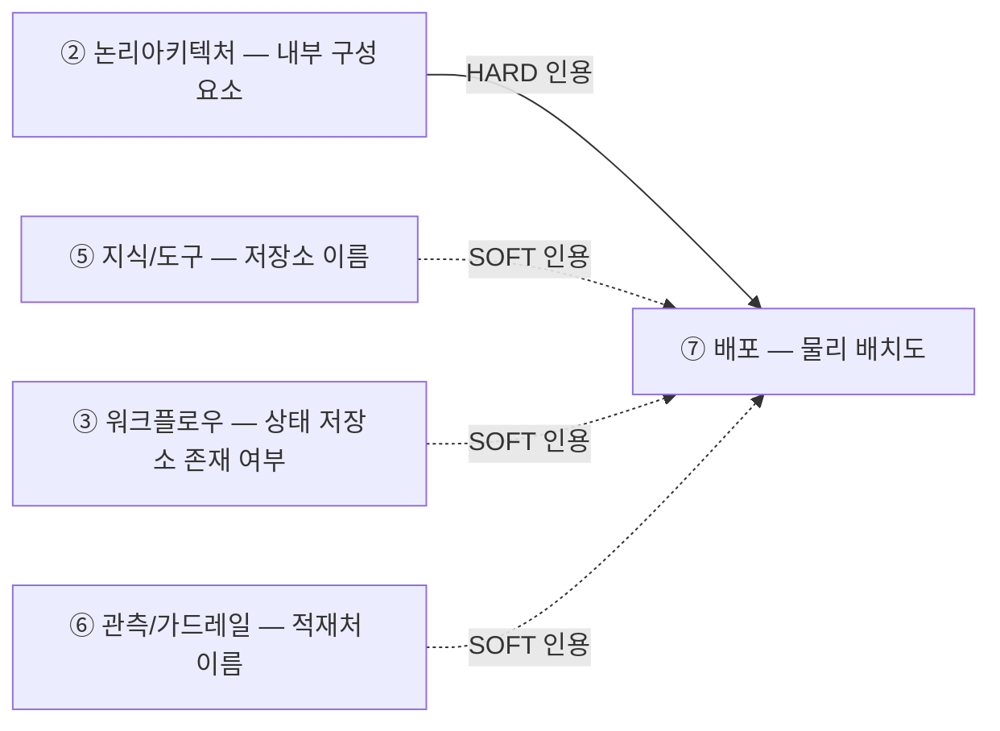
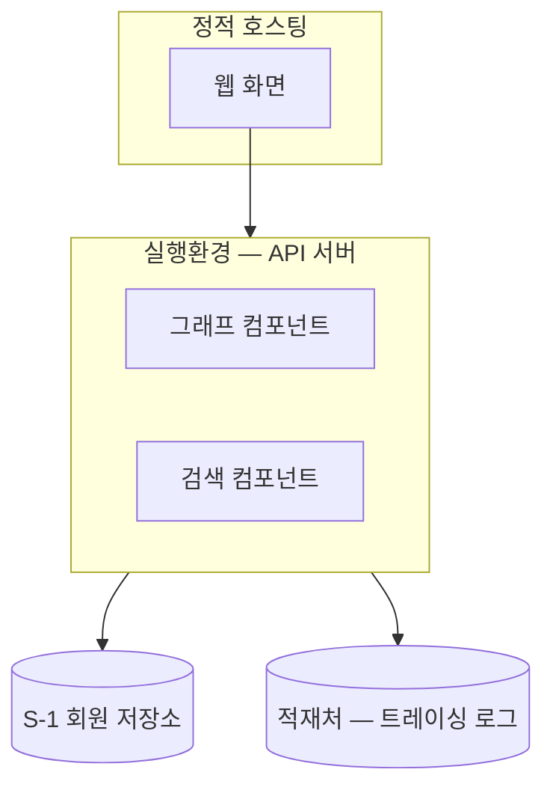

# 설계서 ⑦ 배포: 작성 가이드

## 1. 이 설계서가 답하는 질문

**"② 논리아키텍처의 구성요소가 실제로 어디에 놓이는가."**

물리 배치를 그림 1장(mermaid)으로 남김. **MAS(멀티에이전트시스템) 설계의 핵심이 아니므로
최소화함**: 프로세스를 몇 덩어리로 나눌지는 ② 논리아키텍처가 이미 정했고, 비밀값·포트·
저장소 세부 배치·롤백 절차는 **설계 범위 밖**임(구현·운영 단계에서 정함).

**이걸 안 하면 나는 사고 1줄**

- 구성요소가 어느 실행환경에 놓이는지 아무도 그려 두지 않아 구현 착수 때 다시 물어봄

**앞뒤 연결도**

`HARD` 없으면 못 채움 · `SOFT`는 있으면 그림에 이름만 얹고 없으면 뺌.
**7종의 마지막이라 다음 설계서로 넘기는 값이 없음.**

---

## 2. 설계항목 작성법

**산출물은 mermaid 그림 1개임.** 판정 절차나 표를 따로 만들지 않음.

**구성요소 배치**

- ② 논리아키텍처의 내부 구성도에서 구성요소 이름을 **그대로 인용**해 실행환경(서버·컨테이너·
  호스팅 등) 단위로 묶어 그림
- ② 논리아키텍처가 이미 나눈 대로 씀: **여기서 다시 나누거나 합치지 않음**
- ② 논리아키텍처의 구성요소를 **빠짐없이 1:1로** 배치함. 어디에도 안 들어간 요소가 있으면
  그 건수를 그림 밑에 숫자로 적음

**저장소·상태 저장소·적재처 표시**

- ⑤ 지식/도구의 저장소, ③ 워크플로우가 존재를 정한 상태 저장소(체크포인터), ⑥ 관측/가드레일의
  적재처를 **이름만** 박스로 그림에 얹음
- 제품·접속정보·비밀값·안/밖 배치·포트는 적지 않음: **이 설계서의 범위 밖**임
- 상태 저장소·적재처가 없으면(③·⑥이 `보존 사유 = 없음`·행 없음으로 정리했으면) 그림에서 뺌

**예시**

**설계 범위 밖 표기**

- 비밀값 주입 경로, 포트, 저장소 안/밖 세부 배치, 백업·복구, 배포 절차·롤백은 **모두 구현·운영
  단계에서 정함**. 이 문서에는 적지 않고 "설계 범위 밖" 1줄만 남김
- **미검증 설계 표기**: 실제 배포를 안 했으면 머리에 `미검증 설계`라고 적음

---

## 3. 제출 전 자가 점검표

- [ ] 그림이 **mermaid 코드**로 되어 있음
- [ ] ② 논리아키텍처의 구성요소가 빠짐없이 1:1로 그림에 있고 미대응 건수가 숫자로 적혀 있음
- [ ] ⑤ 저장소·③ 상태 저장소·⑥ 적재처가 **존재하는 것만** 이름으로 그림에 있음
- [ ] 비밀값·포트·접속정보·안/밖 세부 배치·백업·롤백 절차가 **문서에 없음**(설계 범위 밖)
- [ ] 배포를 안 했으면 `미검증 설계`라고 적혀 있음
