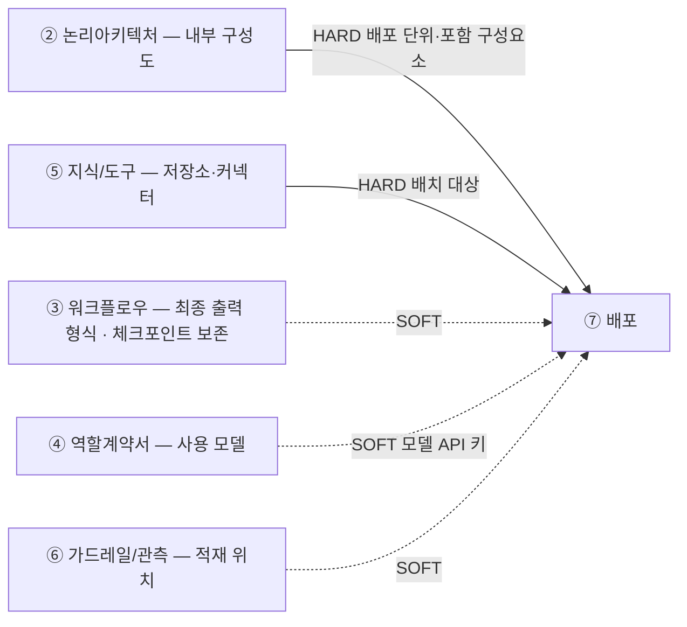

# 설계서 ⑦ 배포: 작성 가이드

## 1. 이 설계서가 답하는 질문

**"이 시스템을 몇 덩어리로 포장해서, 어디에 올리고, 열쇠는 어떻게 넣는가."**

배포 단위 · 포트 · 비밀값 주입 · 저장소 배치 4가지를 확정함.
**② 논리아키텍처·⑤ 지식/도구만 있으면 시작할 수 있고** ③ 워크플로우·④ 역할계약서·
⑥ 가드레일/관측을 기다리지 않음(`SOFT` 3건은 없어도 채우고 나중에 고침).

**이걸 안 하면 나는 사고 3줄**

- 배포 당일 오전이 "몇 개로 나눌까" 논쟁으로 통째로 사라짐
- API 키가 코드·설정 파일에 박혀 저장소에 올라감. 되돌려도 이력에 남음
- 로그와 데이터가 재시작하면 사라짐. 사고 원인을 볼 기록이 없음

**앞뒤 연결도**

`HARD` 없으면 못 채움 · `SOFT` 나중에 고침.
**7종의 마지막이라 다음 설계서로 넘기는 값이 없음**: 산출물을 구현(이미지 빌드)과
배포 실행이 그대로 씀. 그래서 3-2에 **`배포 실행 입력값 목록`** 항목을 둠.

---

## 2. 시작 전 판정

### 2-1. 나눌까 합칠까: 4문

예/아니오로 답함. 기본은 1덩어리임. **Q1 ~ Q3 중 하나라도 `예`면 나눔 후보이고
Q4가 `아니오`면 무조건 합침**(Q4가 거부권).

| # | 질문 | 예 = 나눔 근거 |
|---|------|---------------|
| 1 | 배포 형태가 다른가 | 앱 스토어 · 정적 호스팅은 따로 감 |
| 2 | 늘리고 줄이는 기준이 다른가 | 한쪽만 부하가 튀면 따로 감 |
| 3 | 접근 권한 등급이 다른가 | 민감 데이터를 만지는 쪽은 따로 감 |
| 4 | 나눠도 응답시간 목표를 지키나 | **아니오면 무조건 합침** |

- **배포 절차를 1종으로 고정**: 부담은 덩어리 수보다 절차 종류 수에 비례함
- **줄이는 순서를 미리 적음**: 무엇을 먼저 합칠지와 그 대가를 표로 남김

### 2-2. 저장소는 안인가 밖인가

| 질문 | 예 | 아니오 |
|------|----|--------|
| 재시작해도 남아야 하나 | 런타임 **밖** | 안에 둬도 됨 |
| 여러 덩어리가 같이 쓰나 | 런타임 **밖** | 안에 둬도 됨 |
| 법정 보존 기간이 있나 | 런타임 **밖** · 변조 방지 | 안에 둬도 됨 |
| 국내 보관 제한이 있나 | 지역 고정 명시 | 제한 없음 |
| **보존 기간이 다른 데이터가 섞이나** | **분리 저장 또는 컬럼 단위 파기** | 표 단위 파기로 됨 |

`밖`이 하나라도 걸리면 밖임. 헷갈리면 밖에 둠.

**5번째 질문이 규정 위반을 잡는 자리임.** 기간이 다른 데이터가 한 표에 있으면 자동 삭제를
표 단위로 걸 수 없음. 짧게 잡으면 남길 것을 지우고 길게 잡으면 지울 것이 남음. 둘 다 위반임.

**체크포인터(상태 저장소)도 이 판정을 받음**: ⑤ 지식/도구의 3갈래에 없는 저장소이지만
③ 워크플로우의 「체크포인트 보존」이 `보존 사유`를 하나라도 적었으면 저장소가 실재함.
5문을 그대로 돌리면 대개 이렇게 나옴.

| 질문 | 체크포인터에서는 |
|------|----------------|
| 재시작해도 남아야 하나 | 축 A(재개)·축 B(정지·재진입)가 있으면 **예**: 재기동으로 날아가면 재개·승인이 성립하지 않음 |
| 여러 덩어리가 같이 쓰나 | 3-1 「런타임 규모 상한」의 **최대가 2 이상이면 예** |
| 법정 보존 기간이 있나 | 체크포인트 자체엔 하한이 없음. 다만 민감 필드가 실리면 **하한이 아니라 상한**이 생김(파기 의무) |
| 국내 보관 제한이 있나 | State에 식별자·좌표가 실리면 다른 저장소와 같은 지역 고정 대상 |
| 보존 기간이 다른 데이터가 섞이나 | **예**: 한 표에 워크플로우별 상태가 섞이고 유효 수명이 다름 → **행 단위 파기** |

**저장 등급은 여기서 판정하고 제품 이름은 2-3 문의 경로로 채움.** 위에서부터 답해 처음 걸리는 등급을 씀.

| # | 질문 | `예`면 | 근거가 있는 곳 |
|---|------|-------|--------------|
| 1 | ③의 「체크포인트 보존」이 **전부** `보존 사유 = 없음`인가 | 체크포인터 없음(그 사실을 1줄 남김) | ③ 「체크포인트 보존」 |
| 2 | 재기동·재배포 뒤 이어서 해야 하나 | **휘발 저장 탈락** | ③ 축 A·B · 이 설계서 3-4 |
| 3 | 같은 흐름을 인스턴스 2개 이상이 만지나 | **단일 노드 파일 저장 탈락** → 공유 저장 | 3-1 「런타임 규모 상한」의 최대 · ② 프로세스 분리표 |
| 4 | 사람 승인 대기가 한 요청의 수명보다 긴가 | **공유 저장 필수** | ③ 「인간 개입」의 대기 타임아웃 |

| 판정 결과 | 저장 등급 | 쓰이는 자리 |
|----------|----------|-----------|
| 1번 `예` | 없음 | 만들지 않음 |
| 2번 `아니오` · 인스턴스 1 | 휘발 메모리 | 개발·단위시험 |
| 2번 `예` · 3번 `아니오` | 단일 노드 파일 기반 | 단일 서버 파일럿 |
| 3번 또는 4번 `예` | **공유 트랜잭션 저장** | 운영 |

- **제품 이름을 여기서 고르지 않음**: 등급까지만 정하고 제품은 2-3의 `무엇을 묻나` 경로로 채움
- **환경마다 등급이 갈리면 운영 기준 1개만 적음**: 개발용 휘발 저장으로 갈아 끼우는 것은 설정 몫임
- 3번이 `예`인데 휘발·단일 노드로 적으면 **재개가 다른 인스턴스에 안 붙어 외부 부작용이 두 번 남음**

### 2-3. 비밀값은 무엇이 있는지부터 셈

**기술 스택 7행에서 기계적으로 뽑음.** 생각으로 만들지 않음.

**7행은 이 설계서가 정함**: ② 논리아키텍처에도 다른 어느 설계서에도 이 표가 없음.
아래 표의 `어디서 가져오나`에 앞 설계서가 적힌 행은 **거기서 가져오고**,
**나머지는 사용자에게 문의해 채움.** `[확인필요]`로 넘기지 않음: 비밀값 경로가 비면 실행이 안 뜸.

| 스택 행 | 나오는 비밀값 | 어디서 가져오나 |
|---------|--------------|----------------|
| 모델 벤더 | 모델 API 키 | ④ 역할계약서의 `사용 모델`. 미사용이면 키 없음 |
| 정형 접근 | 관계형 저장소 접속정보 | ⑤ 지식/도구 3-1 정형정보의 **테이블 이름** |
| 비정형 접근 | 벡터·그래프 저장소 접속정보 | ⑤ 지식/도구 3-1의 **의미정보 벡터DB명 · 관계정보 그래프DB명** |
| 도구 연결 규격 | 커넥터 접속정보 | ⑤ 지식/도구 3-2의 커넥터 = ② 논리아키텍처의 외부 서비스 |
| 오케스트레이션·패키징 | 런타임·이미지 저장소 접근 정보 | **이 설계서 3-1의 배포 형태** |
| 관측·기록 | 기록 수집기 전송 키(없으면 `해당 없음`) | ⑥ 가드레일/관측의 적재 위치 |
| 상태 저장(체크포인터) | 상태 저장소 접속정보 · 저장 암호화 키(민감 State가 실릴 때만) | **존재 여부**는 ③ 워크플로우의 「체크포인트 보존」. 등급과 배치는 **이 설계서 2-2 · 3-3**. ③이 전부 `보존 사유 = 없음`이면 `해당 없음` |

비밀값은 *수단*이 아니라 **대상**에서 나오므로 이 도출이 성립함: 어느 제품인지 몰라도
"관계형 저장소에 붙는다"는 사실만으로 접속정보 항목이 있어야 함을 알 수 있음.

**제품이 안 정해진 행은 사용자에게 문의함**

앞 설계서에서 **이름은 나오지만 제품이 안 정해진 경우**가 잦음:
⑤가 제품을 `[확인필요: 제품]`으로 남긴 것처럼. 그때는 다음을 물음.
(**제품 선정은 ⑤ 소유임** — 여기서 새로 고르지 않고 ⑤에 값이 없을 때만 물어 채움)

| 무엇을 묻나 | 왜 필요한가 |
|------------|------------|
| 그 행의 **제품·서비스 이름** | 접속정보의 모양이 제품마다 다름(접속 문자열 · 키 쌍 · 토큰) |
| 비밀값을 **어디에 두나** | 3-2 주입 경로의 `출발지`가 됨 |

- **묻고 답을 받아 표에 적음.** 못 받으면 그 행만 `[확인필요: 제품 미정]`으로 두고
  나머지 행은 끝까지 채움: 한 행 때문에 표 전체를 비우지 않음
- `해당 없음`과 `[확인필요]`를 구분해 적음: 모델을 안 쓰면 `해당 없음`이고 쓰는데 벤더가
  안 정해졌으면 `[확인필요]`임

---

## 3. 설계항목 작성법

**설계항목은 4계열로 나뉨**: `3-1 단위` · `3-2 연결` · `3-3 저장` · `3-4 되돌리기`.
**이 제목 구조가 곧 산출물의 목차임**: 여기 없는 절을 산출물에 만들지 않고 여기 있는 절을 빼지도 않음.

항목마다 **항목명**(굵게) 다음에 채우는 요령 불렛, 마지막에 `예시`를 둠.
**작성법은 문단으로, 산출물은 표로 씀**: 작성법을 표에 밀어 넣으면 칸 안에서 ` `로 줄을 나누게 되고
불렛을 못 씀.

**산출물은 표 4개임**: 이 문서의 항목은 **한 표의 열**이므로 항목마다 표를 따로 만들지 않음.
각 항목의 `예시`는 그 열에 들어갈 **칸 값**의 예임.

| # | 표 | 열(= 3절 항목) | 몇 행 |
|---|----|---------------|------|
| 1 | **배포 단위 표** | 단위 이름 · 포함 구성요소 · 배포 형태 · 규모 상한 · 내부 포트 · 노출 포트 · 단위별 되돌리기 | 단위마다 1행 |
| 2 | **비밀값 주입 표** | 항목명 · 쓰는 단위 · 경로(`출발지 → 도착지`) | 비밀값마다 1행 |
| 3 | **저장소 배치 표** | 저장소 · 안/밖 · 지역·보존·변조 제한 · **백업·복구 대상** | 저장소마다 1행 + **상태 저장소 1행** + **MCP 핸들 1행** |
| 4 | **배포 실행 입력값 표** | 값 이름 · 언제 정해지나 · 어디서 받아오나 | 실행 시점 값마다 1행 |

**배포 단위 표 모양**

| 단위 | 포함 구성요소 | 배포 형태 | 규모 상한 | 내부 포트 | 노출 포트 | 되돌리기 |
|------|-------------|----------|----------|----------|----------|---------|
| API | 그래프 · 검색 · API 서버 | 런타임 이미지 | 최소 2 · 최대 10 | `8080`(`/health`) | `80 → 8080` | 직전 이미지 태그로 교체 |
| 프론트 | 웹 화면 | 정적 호스팅 | — | — | `443` | 직전 빌드로 교체 |

**표 밖에 적는 것 3개**: 단위마다 반복되지 않는 값임.

- `분할 근거`: 전체에 1건(2-1 문항 번호와 답)
- `되돌릴 수 없는 데이터 변경`: 3-4의 3칸 표
- `미검증 설계` 표기: 문서 머리에 1줄

**칸마다 근거 출처를 붙임**: `{약칭}:{항목ID}#{하위}` 형식 1개. 못 찾으면 `[확인필요: 무엇이 필요한가]`,
우리가 정한 값이면 `설계판단`이라고 적고 각주 1줄을 붙임. 공란으로 두면 검토자가 출처를 확인할 길이 없어짐.
(예: `US:NFR-SYS-080#국내 저장`)

---

### 3-1. 단위

**패키징 단위 수**

- 몇 덩어리로 포장할지를 **숫자 1개**로 적음. 괄호로 각 덩어리의 이름을 붙임
- **3덩어리를 넘겼으면 넘긴 이유를 1줄 적음**
- 숫자가 없으면 배포 담당이 무엇을 몇 개 만들지 정할 수 없음. 모르면 `[확인필요: 구성도]`
- 덩어리 이름은 ② 논리아키텍처의 내부 구성도에서 가져옴

**예시** `2개(API 1 · 프론트 1)`

**포함 구성요소**

- 덩어리마다 그 안에 들어가는 구성요소 이름을 하나씩 씀: **② 논리아키텍처의 이름을 인용만 함**
- ② 논리아키텍처의 요소를 **빠짐없이 1:1로** 붙임
- 어느 덩어리에도 안 들어간 요소가 있으면 **그 건수를 숫자로 적음**
- 뭉뚱그려 적으면 무엇이 빠졌는지 확인할 방법이 없음
- **다른 설계서와 대조**: ② 논리아키텍처 요소와 1:1이고 미대응 건수가 숫자로 적혀 있음

**예시** `그래프 · 검색 · API 서버`

**배포 형태**

- `런타임 이미지(실행 꾸러미)`·`앱 스토어 배포`·`정적 호스팅`·`관리형 실행` **4종 중 1개**를 적음
- **덩어리마다 따로 적음**: 형태가 다르면 그 자체가 나누는 근거가 됨
- `관리형 실행`은 우리가 이미지를 만들지 않는 것(함수·게이트웨이·스케줄러)에만 씀
- **4종에 없는 말(플랫폼 이름 등)은 형태가 아니라 장소이므로 적지 않음**

**예시** `앱 스토어 배포`

**런타임 규모 상한**

- 동시에 몇 개까지 띄울지를 **최소·최대 숫자 2개**로 적음
- 그 숫자의 근거가 되는 **요구사항 번호**를 함께 적음: US 확장성 NFR에서 가져옴
- 자동으로 늘릴지 사람이 늘릴지는 과제 범위 안일 때만 적음
- **최대 숫자가 없으면 부하가 튈 때 비용이 위로 열려 있음.** 모르면 `[확인필요: 확장성 NFR]`

**예시** `최소 2 · 최대 10`

**분할 근거**

- 2-1의 4문 중 **어느 문항의 답 때문에 나눴는지** 문항 번호와 예/아니오를 적음
- 나누지 않았으면 **버린 대안 1줄**을 적음: 무엇을 떼는 안을 왜 버렸는지
- **Q4가 `아니오`면 나누지 않았다고 그대로 적음**
- 근거를 안 적으면 나중에 합칠 판단을 다시 처음부터 해야 함

**예시** `Q2 예 — 한 요청이 검색·생성을 연속 호출`

---

### 3-2. 연결

**내부 포트**

- 실행 꾸러미 안에서 앱이 듣는 포트 번호를 **숫자 1개**로 적음
- 노출 포트(밖에서 들어오는 번호)와 다를 수 있으므로 따로 적음
- 살아 있는지 확인하는 경로(`/health` 등)가 있으면 함께 적음
- 안 적으면 배포 담당이 방화벽·서비스 설정을 못 만듦. 모르면 `[확인필요: 앱 설정]`
- **자기 표 안에서 확인**: 단위마다 내부·노출 2칸이 다 차 있음(대조할 다른 설계서가 없는 항목임)

**예시** `8080` · 확인 경로 `/health`

**노출 포트**

- 밖에서 이 덩어리로 들어올 때 쓰는 포트 번호를 **숫자 1개**로 적음
- 내부 포트와 어떻게 이어지는지 **화살표로 적음**
- 밖으로 열지 않는 덩어리는 `노출 없음`이라고 적음. 비워 두면 밖에서 접속할 길이 아예 생기지 않음

**예시** `80 → 8080`

**비밀값 주입 경로**

비밀값은 키·비밀번호처럼 밖에 나가면 안 되는 값임.

- 비밀값 **항목 이름**과 그것이 앱까지 들어가는 길을 적음. 길은 `출발지 → 도착지` 꼴로 적음
- **실제 값은 어디에도 적지 않음**: 항목명·쓰는 단위·경로만 적음
- **2-3의 7행에서 뽑은 항목이 전부 이 표에 있는지 세어 확인함**
- 경로가 비면 실행할 때 열쇠가 없어 뜨지 않음. 쓰는 비밀값이 없으면 `해당 없음`

**예시** `모델 API 키 — 비밀 객체 → 환경변수`

**배포 실행 입력값 목록**

- 배포 당일 **사람이 손으로 넣어야 하는 값**만 뽑아 표로 적음: 이미지 태그 · 환경 이름 ·
  비밀값을 어디서 받아오는지
- **설계값을 다시 늘어놓는 것이 아님**: 위 항목들에서 **실행 시점에 정해지는 것만** 골라 적음.
  포트·저장소 배치처럼 설계에서 이미 확정된 값은 여기 다시 쓰지 않음
- 없으면 배포 당일에 값을 찾아다니게 됨

**예시** `이미지 태그(빌드 후 확정) · 환경 이름(스테이징/운영) · 모델 API 키(비밀 저장소 경로)`

**위반 3종**: "평문 금지"만 적으면 무엇이 위반인지 안 보임. 아래가 실제 사고임.

| # | 위반 형태 | 왜 위험한가 | 대신 |
|---|----------|------------|------|
| 1 | 이미지 레이어에 구움 | 이미지를 받은 누구나 꺼낼 수 있음 | 실행 시 주입 |
| 2 | 배포 설정 파일에 평문 | 저장소 이력에 영구히 남음 | 비밀 객체 참조 |
| 3 | 로그·오류 메시지에 출력 | 로그 열람 권한 = 키 열람 권한 | 값을 가려 기록 |

**3번이 가장 자주 나옴**: 접속 실패 로그에 접속 문자열이 통째로 찍힘.

---

### 3-3. 저장

**저장소 배치**

- 저장소마다 런타임 **안/밖**을 1개로 정해 적음: 목록은 ⑤ 지식/도구에서 **인용만 함**
  (3-1 정형정보의 테이블 이름 · 의미정보 벡터DB명 · 관계정보 그래프DB명)
- 지역 제한(국내 보관)·보존 기간·변조 방지가 걸리면 함께 적음. 없으면 `제한 없음`
- **보존 기간이 다른 데이터가 한곳에 섞였으면 나눠 저장한다고 적음**
- **다른 설계서와 대조**: ⑤ 지식/도구의 저장소와 맞춰 **대응·미대응 건수를 숫자로 적음**
- **백업·복구 대상 여부를 칸으로 둠**: 대상이면 그렇게 적고, 제외면 근거를 1줄 적음.
  대개는 복구가 목적이지만 **체크포인터는 복구가 부작용 재발임**(아래 항목)

**예시** `런타임 밖 · 국내 지역 고정 · 3년 보존 · 백업 대상`

**상태 저장소(체크포인터) 배치**

③ 워크플로우가 `무엇을 · 언제 · 어떤 키로` 남기는지를 정했고 ⑤ 지식/도구가 `얼마나 두는가`를
정했음. **어느 등급에 어떻게 두는가가 이 항목임.**

- **⑤의 3갈래 목록 밖의 행이므로 배치 표에 1행을 직접 더함**: MCP 핸들 행과 같은 위상임
  (⑤에서 오지 않는 행이 이미 관측 기록·MCP 핸들로 있음). 이 행은 ⑤ 대조 건수에 넣지 않음
- 2-2에서 판정한 **저장 등급**(휘발 · 단일 노드 · 공유 트랜잭션 저장)을 적고 안/밖을 정함
- 보존 기간은 **⑤ 지식/도구 3-3에서 인용만 함**: 여기서 숫자를 새로 정하지 않음.
  ⑤에 값이 없으면 `[확인필요: 체크포인트 보관 기간]`으로 되물음
- **`보존 사유 = 없음`으로 판정했어도 행을 지우지 않고** 값만 `해당 없음`으로 적고 근거를 1줄 남김
- **백업·복구 대상 칸을 반드시 채움**: 복구하면 이미 끝난 흐름이 되살아나 결제·발송이 다시 나감.
  대상으로 두면 **복구 뒤 재개를 막는 방법**을 1줄 함께 적음
- **기동 시 상태 스키마 준비를 누가 몇 번 실행하는지 1줄 적음**: 인스턴스마다 동시에 실행하면
  같은 준비가 겹쳐 실패하거나 절반만 만들어짐. 배포 절차의 **선행 1회**로 뺌
- 「런타임 규모 상한」의 근거 계산에 **상태 저장소 연결 몫을 숫자로 넣음**: 빠뜨리면 연결 상한을 넘김

**예시** `공유 트랜잭션 저장 · 런타임 밖 · 국내 지역 고정 · 보존은 ⑤ 3-3 인용 · 행 단위 파기 · 백업 제외(복구 시 흐름 재개 위험)`

**MCP 핸들 보관 위치**

`MCP`는 모델이 바깥 도구를 부르는 방식을 정한 규약임(Model Context Protocol).
**MCP 핸들**은 다음 호출에 다시 실어 보내라고 **MCP 서버가 준 참조값**임: MCP를 쓸 때만 생기므로
항목 이름에 `MCP`를 붙임.

- 도구 호출 사이에 주고받는 핸들을 어디에 두는지 **1행으로 적음**
- **MCP를 안 쓰기로 판정했어도 행을 지우지 않고** 값만 `해당 없음`으로 적음
- `해당 없음`으로 적었으면 **그렇게 판정한 근거를 1줄 남김**:
  모델이 도구를 고르는 구간이 0건이면 안 쓰는 것이 정상임
- 행을 지우면 판정했다는 사실 자체가 사라져 나중에 다시 따짐

MCP가 무상태로 바뀌면서 세션이 없어짐. 짧게 사는 값이지만 **어디에 두는지는 정해야 함.**

**예시** 배치 표에 1행 · 미사용이면 `해당 없음`

---

### 3-4. 되돌리기

**"어떻게 올리나"만 적고 "어떻게 되돌리나"를 안 적는 일이 잦음.** 아래 둘은 축이 달라 따로 적음.

**단위별 되돌리기**

- 단위마다 직전 버전으로 돌아가는 방법을 **1줄**로 적음
- 못 돌아가는 단위는 **그렇게 적음**: 비워 두지 않음

**되돌릴 수 없는 데이터 변경**

**코드는 돌아가는데 데이터가 안 돌아오는 경우임.** 이미지를 되돌려도 덮어쓴 값은 그대로 남음.

| 칸 | 무엇을 적나 |
|----|-----------|
| 무엇이 되돌아오지 않나 | 배치가 덮어쓴 학습 결과 · 지운 컬럼 |
| **직전 값 1세대 보관 여부** | **필수 칸.** 안 남기면 원복 수단 없음 |
| 배포 전 준비 | 추가만 먼저 배포하고 삭제는 다음 판으로 |

**상태 저장소 스키마 변경도 이 표의 1행임**: 이미지는 되돌아갔는데 스키마가 새 판이면
구판 코드가 새 State 필드를 못 읽어 **배포는 성공으로 보이는데 재개만 실패함.**
State 필드가 늘거나 줄면(③ 「State 구조」 변경) 이 행을 채움: 더하는 변경을 먼저 올리고
지우는 변경은 다음 판으로 미루는 순서가 `배포 전 준비` 칸에 들어감.

**④ 역할계약서가 `쓰기(되돌림 불가) 0건`이라 해도 이 표가 비지 않음**: ④ 역할계약서는 **외부 부작용**,
⑦ 배포는 **데이터 원복 수단**을 봄. 축이 달라 둘 다 참일 수 있음.

**미검증 설계 표기**: 실제 배포를 안 했으면 머리에 `미검증 설계`라고 적음.

---

## 4. 제출 전 자가 점검표

- [ ] 패키징 단위 수가 **숫자**로 적혀 있음
- [ ] ② 논리아키텍처의 구성요소와 배포 단위가 1:1로 붙고 미대응이 **0건**임
- [ ] 단위마다 내부 포트·노출 포트 **2칸**이 다 차 있음
- [ ] 비밀값 7행이 **앞 설계서 또는 사용자 문의 답**에서 나왔고 주입 경로 **공란 0건**임
- [ ] 기술 스택 표가 **7행**이고 지운 행 **0건**임(`상태 저장` 행이 `해당 없음`이어도 통과)
- [ ] `상태 저장` 행이 ③ 「체크포인트 보존」과 어긋나지 않음: ③에 `보존 사유`가 1건 이상인데
      `해당 없음`으로 적은 행 **0건**
- [ ] 제품이 안 정해진 행만 `[확인필요: 제품 미정]`이고 **`해당 없음`과 구분**돼 있음
- [ ] 비밀값 **실제 값이 문서에 없음**
- [ ] ⑤ 지식/도구의 저장소가 **전부** 배치 표에 있고 안·밖이 정해짐
- [ ] 보존 기간이 섞인 저장소가 **0건**이거나 분리·컬럼 파기가 적혀 있음
- [ ] **`배포 실행 입력값 목록`에 실행 시점 값만 있음**: 포트·저장소 배치처럼 설계에서 확정된
      값을 다시 늘어놓은 행 **0건**
- [ ] `MCP 핸들 보관 위치` 행이 **있음**(값이 `해당 없음`이어도 통과)
- [ ] 배치 표에 **`상태 저장소(체크포인터)` 행이 있음**(`해당 없음`이면 판정 근거 1줄이 붙어 있음)
- [ ] 저장 등급이 「런타임 규모 상한」의 최대와 어긋나지 않음: **최대가 2 이상인데
      휘발·단일 노드로 적은 행 0건**
- [ ] 「런타임 규모 상한의 근거 계산」에 **상태 저장소 연결 몫이 숫자로** 들어가 있음
- [ ] 체크포인트 보존 기간을 ⑤ 지식/도구 3-3에서 **인용**했고 ⑦이 새로 정한 숫자 **0건**임
      (⑤에 값이 없으면 `[확인필요: 체크포인트 보관 기간]`으로 되물은 기록이 있음)
- [ ] 배치 표에 **`백업·복구 대상` 칸이 저장소마다 채워져 있고**, 상태 저장소가 대상이면
      복구 뒤 흐름 재개를 막는 방법이 1줄 있음
- [ ] **기동 시 상태 스키마 준비를 누가 몇 번** 실행하는지 1줄 적혀 있음(인스턴스마다 동시 실행 아님)
- [ ] 단위별 되돌리기와 **되돌릴 수 없는 데이터 변경 목록**이 둘 다 있음
- [ ] ③ 「State 구조」가 변경 대상이면 **상태 저장소 스키마 변경 행**이 있고
      `직전 값 1세대 보관 여부`가 차 있음
- [ ] 범위 밖 항목이 본문에 없고 대조 기록에만 **건수와 함께** 있음
- [ ] 배포를 안 했으면 `미검증 설계`라고 적혀 있음
