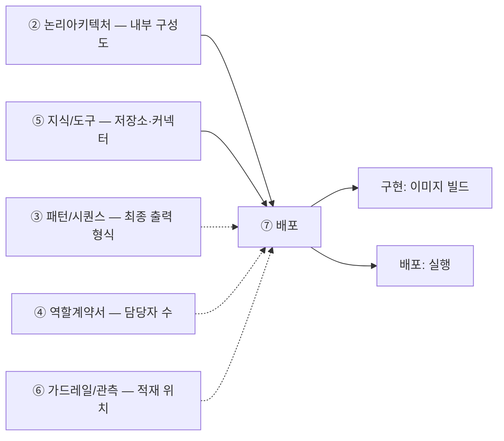

# 설계서 ⑦ 배포 — 작성 가이드

작성: 커넥니(도구 연동 엔지니어) · 2026-08-06 · 공통 규격 v1 적용

---

## 1. 이 설계서가 답하는 질문

**"이 시스템을 몇 덩어리로 포장해서, 어디에 올리고, 열쇠는 어떻게 넣는가."**

배포 단위 · 포트 · 비밀값 주입 · 저장소 배치 4가지를 확정함.
② 논리아키텍처·⑤ 지식/도구만 있으면 시작할 수 있고 ③ 패턴/시퀀스·④ 역할계약서·⑥ 가드레일/관측을 기다리지 않음(점선 3건은 참고 입력임).

**이걸 안 하면 나는 사고 3줄**

- 배포 당일 오전이 "몇 개로 나눌까" 논쟁으로 통째로 사라짐
- API 키가 코드·설정 파일에 박혀 저장소에 올라감. 되돌려도 이력에 남음
- 로그와 데이터가 재시작하면 사라짐. 사고 원인을 볼 기록이 없음

실선은 없으면 못 채우는 입력, 점선은 참고임.

---

## 2. 시작 전 판정

### 2-1. 나눌까 합칠까 — 4문

예/아니오로 답함. 기본은 1덩어리임. **Q1 ~ Q3 중 하나라도 `예`면 나눔 후보이고,
Q4가 `아니오`면 무조건 합침**(Q4가 거부권).

| # | 질문 | 예 = 나눔 근거 |
|---|------|---------------|
| 1 | 배포 형태가 다른가 | 앱 스토어 · 정적 호스팅은 따로 감 |
| 2 | 늘리고 줄이는 기준이 다른가 | 한쪽만 부하가 튀면 따로 감 |
| 3 | 접근 권한 등급이 다른가 | 민감 데이터를 만지는 쪽은 따로 감 |
| 4 | 나눠도 응답시간 목표를 지키나 | **아니오면 무조건 합침** |

**상한은 과정 기간에 종속됨.** 3일 과정이면 1 ~ 2덩어리이고 3개를 넘기면 당일에 못 끝냄.
수 주 이상 과제는 4문 결과를 그대로 따르는 편이 낫습니다. 대신 2가지로 부담을 막음.

- **배포 절차를 1종으로 고정** — 부담은 덩어리 수보다 절차 종류 수에 비례함
- **줄이는 순서를 미리 적음** — 무엇을 먼저 합칠지와 그 대가를 표로 남김

### 2-2. 저장소는 안인가 밖인가

| 질문 | 예 | 아니오 |
|------|----|--------|
| 재시작해도 남아야 하나 | 런타임 **밖** | 안에 둬도 됨 |
| 여러 덩어리가 같이 쓰나 | 런타임 **밖** | 안에 둬도 됨 |
| 법정 보존 기간이 있나 | 런타임 **밖** · 변조 방지 | 안에 둬도 됨 |
| 국내 보관 제한이 있나 | 지역 고정 명시 | 제한 없음 |
| **보존 기간이 다른 데이터가 섞이나** | **분리 저장 또는 컬럼 단위 파기** | 표 단위 파기로 됨 |

`밖`이 하나라도 걸리면 밖임. 헷갈리면 밖에 둠.

**5번째 질문이 규정 위반을 잡는 자리임.** 기간이 다른 데이터가 한 표에 있으면 자동 삭제를
표 단위로 걸 수 없음. 짧게 잡으면 남길 것을 지우고 길게 잡으면 지울 것이 남음. 둘 다 위반임.

### 2-3. 비밀값은 무엇이 있는지부터 셈

**기술 스택 6행**에서 기계적으로 뽑음. 생각으로 만들지 않음.

**6행은 ② 논리아키텍처의 부속 표가 아님.** ② 논리아키텍처에는 이 표가 없음. 6행은 **프로젝트 파라미터**이며 출처는
`prompts/design/_shared/프로젝트정보.md`의 변수 `V-07`임. 그 파일 3절 `V-07` 기입란을
채워 옮겨 적으면 됨. **비었거나 `프로젝트 확정 필요`인 일이 잦으므로** 그때는 비운 채
넘기지 않고 **오른쪽 칸으로 대체 도출함.** 이것이 정식 절차임.

| 스택 행 | 나오는 비밀값 | `V-07` 미기입 시 대체 출처 |
|---------|--------------|--------------------------|
| 모델 벤더 | 모델 API 키 | ④ 역할계약서의 `사용 모델`. 미사용이면 키 없음 |
| 정형 접근 | 관계형 저장소 접속정보 | ⑤ 지식/도구의 저장소 목록 |
| 비정형 접근 | 색인·그래프 저장소 접속정보 | ⑤ 지식/도구의 저장소 목록 |
| 도구 연결 규격 | 커넥터 접속정보 | ⑤ 지식/도구의 커넥터 = ② 논리아키텍처의 외부 서비스 |
| 오케스트레이션·패키징 | 런타임·이미지 저장소 접근 정보 | ⑦ 배포 2절 자기 표 |
| 관측·기록 | 기록 수집기 전송 키(없으면 `해당 없음`) | ⑥ 가드레일/관측의 적재 위치 |

비밀값은 *수단*이 아니라 **대상**에서 나오므로 이 대체가 성립함. `V-07`이 뒤에 채워져도
오른쪽 칸을 지우지 않음. 둘은 대체가 아니라 **짝**임.

---

## 3. 설계항목 작성법

각 칸 첫 줄은 규격임 — **형태**(값의 모양) · **비면**(빈칸에 적을 값) ·  
**주인**(값을 가진 다른 산출물. 없으면 생략) · **대조**(다 채운 뒤 맞출 것).  
그 아래 대시 불렛이 채우는 요령임.

| 설계항목 | 무엇을 적나 | 어디서 가져오나 | 예시 |
|----|------------|----------------|--------|
| 패키징 단위 수 | **형태** 숫자 1개 + 괄호에 덩어리 이름 · **비면** [확인필요: 구성도] · **대조** 3개 초과면 이유 1줄 있는지 - 몇 덩어리로 포장할지를 **숫자 1개**로 적음 - 괄호로 각 덩어리의 이름을 붙임(API 1 · 프론트 1처럼) - 3덩어리를 넘겼으면 넘긴 이유를 1줄 적음 - 숫자가 없으면 배포 담당이 무엇을 몇 개 만들지 정할 수 없음 | ② 논리아키텍처의 내부 구성도 | `2개(API 1 · 프론트 1)` |
| 포함 구성요소 | **형태** 덩어리마다 요소 이름 목록 · **비면** [확인필요: ②의 요소] · **주인** ② 논리아키텍처(인용만) · **대조** ②와 1:1 · 미대응 건수 숫자 - 덩어리마다 그 안에 들어가는 구성요소 이름을 하나씩 씀 - ② 논리아키텍처의 요소를 **빠짐없이 1:1로** 붙임 - 어느 덩어리에도 안 들어간 요소가 있으면 그 건수를 숫자로 적음 - 뭉뚱그려 적으면 무엇이 빠졌는지 확인할 방법이 없음 | ② 논리아키텍처의 요소와 1:1 대응 | `그래프·검색·API 서버` |
| 배포 형태 | **형태** 4종 중 1개(덩어리마다) · **비면** [확인필요] · **대조** 4종 밖의 말(플랫폼 이름) 0건 - `런타임 이미지(실행 꾸러미)`·`앱 스토어 배포`·`정적 호스팅`·`관리형 실행` **4종 중 1개**를 적음 - 덩어리마다 따로 적음 — 형태가 다르면 그 자체가 나누는 근거가 됨 - `관리형 실행`은 우리가 이미지를 만들지 않는 것(함수·게이트웨이·스케줄러)에만 씀 - 4종에 없는 말(플랫폼 이름 등)은 형태가 아니라 장소이므로 적지 않음 | **4종 중 1개** — 런타임 이미지 · 앱 스토어 배포 · 정적 호스팅 · 관리형 실행 | `앱 스토어 배포` |
| 런타임 규모 상한 | **형태** 최소·최대 숫자 2개 + 근거 요구사항 번호 · **비면** [확인필요: 확장성 NFR] · **대조** 최대 숫자 공란 0건 - 동시에 몇 개까지 띄울지를 **최소·최대 숫자 2개**로 적음 - 그 숫자의 근거가 되는 요구사항 번호를 함께 적음 - 자동으로 늘릴지 사람이 늘릴지는 그것이 과제 범위 안일 때만 적음 - 최대 숫자가 없으면 부하가 튈 때 비용이 위로 열려 있음 | US 확장성 NFR | `최소 2 · 최대 10` |
| 분할 근거 | **형태** 2-1 문항 번호 + 예/아니오 답 · **비면** 버린 대안 1줄 · **대조** Q4가 아니오면 나누지 않음 표기 - 2-1의 4문 중 어느 문항의 답 때문에 나눴는지 문항 번호와 답을 적음 - 나누지 않았으면 **버린 대안 1줄**을 적음 — 무엇을 떼는 안을 왜 버렸는지 - Q4가 `아니오`면 나누지 않았다고 그대로 적음 - 근거를 안 적으면 나중에 합칠 판단을 다시 처음부터 해야 함 | 2-1의 4문 답 | `한 요청이 검색·생성 연속 호출` |
| 내부 포트 | **형태** 숫자 1개 + 살아있는지 확인 경로 · **비면** [확인필요: 앱 설정] · **대조** 단위마다 내부·노출 2칸 다 찼는지 - 실행 꾸러미 안에서 앱이 듣는 포트 번호를 **숫자 1개**로 적음 - 노출 포트(밖에서 들어오는 번호)와 다를 수 있으므로 따로 적음 - 살아 있는지 확인하는 경로(`/health` 등)가 있으면 함께 적음 - 안 적으면 배포 담당이 방화벽·서비스 설정을 못 만듦 | 앱 설정 | `8080` |
| 노출 포트 | **형태** 숫자 1개 + 노출 → 내부 화살표 · **비면** 노출 없음 · **대조** 내부 포트 번호와 이어지는지 - 밖에서 이 덩어리로 들어올 때 쓰는 포트 번호를 **숫자 1개**로 적음 - 내부 포트와 어떻게 이어지는지 화살표로 적음(`80 → 8080`처럼) - 밖으로 열지 않는 덩어리는 `노출 없음`이라고 적음 - 비워 두면 밖에서 접속할 길이 아예 생기지 않음 | 서비스 설정 | `80` |
| 비밀값(키·비밀번호) 주입 경로 | **형태** 항목명 + 출발지 → 도착지 꼴 · **비면** 해당 없음 · **주인** 파라미터 V-07(프로젝트정보.md) · **대조** 2-3의 6행과 개수 일치 - 비밀값 **항목 이름**과 그것이 앱까지 들어가는 길을 적음 - 길은 `출발지 → 도착지` 꼴로 적음(비밀 객체에서 환경변수로 등) - **실제 값은 어디에도 적지 않음** — 항목명·쓰는 단위·경로만 적음 - 2-3의 6행에서 뽑은 항목이 전부 이 표에 있는지 세어 확인함 - 경로가 비면 실행할 때 열쇠가 없어 뜨지 않음 | 플랫폼 비밀 객체 | `비밀 객체 → 환경변수` |
| 저장소 배치 | **형태** 안/밖 1개 + 지역·보존·변조 제한 · **비면** 제한 없음 · **주인** ⑤ 저장소 목록(인용만) · **대조** ⑤와 대응·미대응 건수 숫자 - 저장소마다 런타임 **안/밖**을 1개로 정해 적음 - 지역 제한(국내 보관)·보존 기간·변조 방지가 걸리면 함께 적음 - 보존 기간이 다른 데이터가 한곳에 섞였으면 나눠 저장한다고 적음 - ⑤ 지식/도구의 저장소 목록과 대조해 대응·미대응 건수를 숫자로 적음 | ⑤ 지식/도구의 저장소 목록 | `런타임 밖 · 국내 지역 고정` |
| 핸들(다음 호출에 다시 실어 보내라고 MCP 서버가 준 참조값) 보관 위치 | **형태** 보관 위치 1행 · **비면** 해당 없음(행은 지우지 않음) · **대조** 해당 없음이면 본문 근거 1줄 - 도구 호출 사이에 주고받는 핸들을 어디에 두는지 1행으로 적음 - MCP를 안 쓰기로 판정했어도 행을 지우지 않고 값만 `해당 없음`으로 적음 - `해당 없음`으로 적었으면 그렇게 판정한 근거를 본문에 1줄 남김 - 행을 지우면 판정했다는 사실 자체가 사라져 나중에 다시 따짐 | MCP 사용 여부 판정 | 배치 표에 1행 · 미사용이면 `해당 없음` |
| 근거 출처 | **형태** {약칭}:{항목ID}#{하위} 형식 1개 · **비면** [확인필요: 무엇] · **대조** 자체 결정이면 설계판단 표기+각주 1줄 - 칸마다 근거 위치를 `{약칭}:{항목ID}#{하위}` **형식 1개**로 적음 - 우리가 정한 값이면 `설계판단`이라고 적고 각주 1줄을 붙임 - 못 찾으면 `[확인필요: 무엇이 필요한가]` 꼴로 적음 - 공란으로 두면 검토자가 그 값의 출처를 확인할 길이 없어짐 | `{약칭}:{항목ID}#{하위}` | `US:NFR-SYS-080#국내 저장` |

비밀값의 **실제 값은 어디에도 적지 않음.** 항목명·사용 단위·경로만 적음.
`관리형 실행`은 함수·게이트웨이·스케줄러처럼 우리가 이미지를 만들지 않는 것을 담음.

**비밀값 위반 예시 3종**

"평문 금지"만 적혀 있고 무엇이 위반인지 안 보임. 아래 3개가 실제 사고임.

| # | 위반 형태 | 왜 위험한가 | 대신 |
|---|----------|------------|------|
| 1 | 이미지 레이어에 구움 | 이미지를 받은 누구나 꺼낼 수 있음 | 실행 시 주입 |
| 2 | 배포 설정 파일에 평문 | 저장소 이력에 영구히 남음 | 비밀 객체 참조 |
| 3 | 로그·오류 메시지에 출력 | 로그 열람 권한 = 키 열람 권한 | 값을 가려 기록 |

3번이 가장 자주 나옴 — 접속 실패 로그에 접속 문자열이 통째로 찍힘.

**세션 핸들 보관 위치 1행**

MCP가 무상태로 바뀌면서 세션이 없어졌음. 호출 사이에 상태가 필요하면 서버가 준
**핸들을 도구 인자로 주고받음.** 짧게 사는 값이지만 **어디에 두는지는 정해야 함.**
저장소 배치 표에 `핸들 보관 위치` 1행을 반드시 추가함.

**MCP를 안 쓰기로 판정했으면** 행은 두고 값을 `해당 없음`으로 적고 근거를 본문에 남김.
행을 지우면 판정한 사실이 사라짐. 모델이 도구를 고르는 구간이 0건이면 안 쓰는 것이 정상임.

**되돌리기 — 2단으로 나눠 적음**

"어떻게 올리나"만 적고 "어떻게 되돌리나"를 안 적음. 아래 두 가지는 축이 다름.

**(1) 단위별 되돌리기 1줄** — 직전 버전으로 돌아가는 방법. 못 돌아가는 단위는 그렇게 적음.

**(2) 되돌릴 수 없는 데이터 변경 목록** — **코드는 돌아가는데 데이터가 안 돌아오는 경우**임.
이미지를 되돌려도 덮어쓴 값은 그대로임. 아래 칸으로 씀.

| 칸 | 무엇을 적나 |
|----|-----------|
| 무엇이 되돌아오지 않나 | 배치가 덮어쓴 학습 결과 · 지운 컬럼 |
| **직전 값 1세대 보관 여부** | **필수 칸.** 안 남기면 원복 수단 없음 |
| 배포 전 준비 | 추가만 먼저 배포하고 삭제는 다음 판으로 |

④ 역할계약서가 `쓰기(되돌림 불가) 0건`이라 해도 이 표가 비지 않음 — ④ 역할계약서는 **외부 부작용**,
⑦ 배포는 **데이터 원복 수단**을 봄. 축이 달라 둘 다 참일 수 있음.

**미검증 설계 표기**

실제 배포를 안 했으면 머리에 `미검증 설계`라고 적음.

---

## 4. 제출 전 자가 점검표

- [ ] 패키징 단위 수가 **숫자**로 적혀 있음
- [ ] ② 논리아키텍처의 구성요소와 배포 단위가 1:1로 붙고 미대응이 **0건**임
- [ ] 단위마다 내부 포트·노출 포트 **2칸**이 다 차 있음
- [ ] 비밀값 6행이 `V-07` 또는 **대체 출처**에서 나왔고 주입 경로 **공란 0건**임
- [ ] 비밀값 **실제 값이 문서에 없음**
- [ ] ⑤ 지식/도구의 저장소가 **전부** 배치 표에 있고 안·밖이 정해짐
- [ ] 보존 기간이 섞인 저장소가 **0건**이거나 분리·컬럼 파기가 적혀 있음
- [ ] `핸들 보관 위치` 행이 **있음**(값이 `해당 없음`이어도 통과)
- [ ] 단위별 되돌리기와 **되돌릴 수 없는 데이터 변경 목록**이 둘 다 있음
- [ ] 범위 밖 항목이 본문에 없고 대조 기록에만 **건수와 함께** 있음
- [ ] 배포를 안 했으면 `미검증 설계`라고 적혀 있음

---

## 5. 다음으로 넘기는 값과 근거 자료

| 넘기는 값 | 받는 곳 | 없으면 |
|----------|--------|--------|
| 배포 단위·포함 구성요소 | 구현: 이미지 빌드 | 빌드 대상이 안 정해짐 |
| 포트·비밀값 주입 경로 | 배포: 실행 | 실행이 뜨지 않음 |
| 저장소 배치·지역 제한 | 배포: 저장소 준비 | 규정 위반 |
| 배포 실행 입력값 목록 | 배포 실행자 | 당일에 값을 찾아다님 |

| 아티클 | 거는 칸 |
|--------|--------|
| [A04](../references/articles/A04_spec_mcp-changelog-260728.md) §2 C1 · §4 Q5 | `핸들 보관 위치` · 커넥터 판본 고정 |
| [A06](../references/articles/A06_std_owasp-agentic-top10.md) §7 ASI03 · ASI04 | 주입 경로·단기 토큰 · 이미지 출처 고정 |
| [A07](../references/articles/A07_spec_otel-genai-semconv.md) §5 | 관측 적재 위치. `Development`(표준 후보) 병기 |
| [A10](../references/articles/A10_reg_fsc-ai-guideline.md) §4 Q3 | 긴급정지 수단의 배치 위치 |
