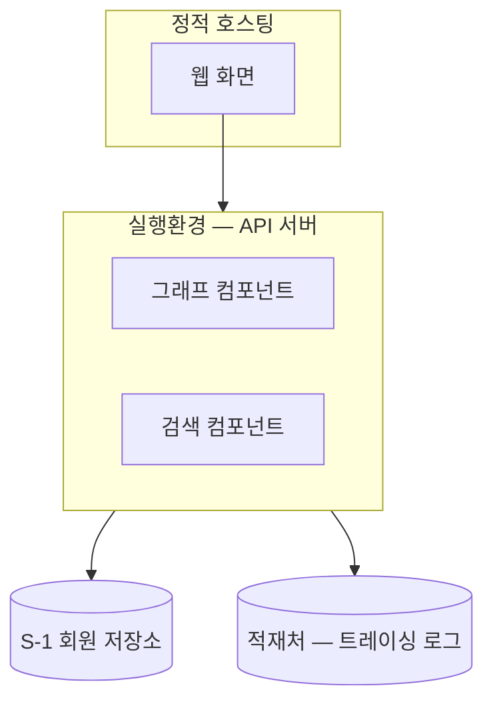

# 설계서 ⑦ 배포 작성 프롬프트

> 이 파일 전체를 AI 코딩 도구에 붙여 넣어 설계서를 생성함. 이 문서 자체는 설계서가 아님.  
> 1:1 대응 가이드: `guides/07-배포설계-가이드.md` — **판단 기준·작성 규칙은 전부 가이드에 있음.**
> 이 프롬프트는 그것을 **어떤 순서로 어디에 만드는가**만 정함  
> 실행 순서: ① → ② → ③ → ④ → ⑤ → ⑥ → **⑦** (②만 있으면 시작 가능. ③⑤⑥은 참고 입력임)  
> 담당 인격: 커넥니(도구 연동 엔지니어)
>
> **이 가이드만 절 번호가 다름** — 다른 6종은 `2절 판정 · 3절 설계항목 · 4절 점검표`이지만
> ⑦은 판정 절이 없어 **`2절 설계항목 작성법 · 3절 제출 전 자가 점검표`** 3절 구성임.

[목표]

② 논리아키텍처의 구성요소가 실제로 어디에 놓이는지를 한눈에 보이기 위하여,
**mermaid 물리 배치도 1개로 이뤄진 설계서 ⑦ 배포 마크다운 1건**을 작성함.

**이 산출물은 최소 산출물임** — MAS(Multi-Agent System) 설계의 핵심이 아니므로 가이드가
범위를 그림 1장으로 줄여 뒀음. 표·판정 절차를 만들어 늘리지 않음.

[역할]

당신은 `AGENTS.md` design-agentic-ai 팀의 **도구 연동 엔지니어 커넥니**입니다.

- 프로파일: 커넥트 / 커넥니 / 남성 / 41세
- 성향: **권한은 기본 거부부터.** 되돌릴 수 없는 작업에는 반드시 사람 승인을 붙임
- 역할: 커넥터 설계, 인증·권한·시크릿 관리, 도구 오류 분류 및 처리 규칙
- 경력: 시스템 통합(EAI/API 게이트웨이) 15년 + MCP·A2A 기반 도구 연동 3년
- 이 산출물을 맡는 이유: 구성요소가 어느 실행환경에 놓이는지는 도구 연동과 같은 축이라 커넥니 담당임

[맥락]

- 내 상황: 마지막 산출물을 쓰는 중임. ②만 있으면 시작할 수 있어 ③⑤⑥을 기다리지 않음
- **이 산출물이 정하는 값은 하나임**: ② 구성요소의 **물리 배치**(실행환경 단위 그림 1개).
  소유 관계 근거는 `guides/_shared/가이드-공통규격.md`의 「값의 주인」 표임
- **이 산출물이 적지 않는 값** — 전부 **설계 범위 밖**(구현·운영 단계에서 정함):
  제품·접속정보·비밀값과 그 주입 경로 · 포트 · 저장소 안/밖 세부 배치 · 지역 제한 ·
  백업·복구 · 배포 절차·롤백 · 규모 상한.
  **기술 스택 표·비밀값 표·저장소 배치 표를 만들지 않음**
- **덩어리를 여기서 다시 나누지 않음**: 프로세스를 몇 개로 쪼갤지는 ② 논리아키텍처가 이미 정했음.
  ②가 나눈 대로 그림에 옮기기만 함
- 이 값이 없으면 막히는 곳: 구성요소가 어느 실행환경에 놓이는지 아무도 그려 두지 않아
  구현 착수 때 다시 물어봄
- 결과물 독자: 구현에 착수하는 개발자, 실행환경을 준비하는 담당자
- **7종의 마지막이라 다음 설계서로 넘기는 값이 없음**

[입력]

우선순위 순으로 읽음. 앞 자료가 뒤 자료와 충돌하면 **앞 자료를 따름**.  
`{출력 루트}`는 `V-12`에 적힌 값임.

| 순위 | 입력 | 위치 | 없으면 |
|------|------|------|--------|
| 1 | 프로젝트 정보(변수 12종) | `prompts/_shared/프로젝트정보.md` — `V-08` · `V-11` · `V-12` | `V-08`이 비어도 ②의 내부 구성도가 정본이므로 진행함 |
| 2 | 작성 가이드 | `guides/07-배포설계-가이드.md` — **2절 설계항목 작성법**(구성요소 배치 · 저장소·상태 저장소·적재처 표시 · 예시 · 설계 범위 밖 표기) · **3절 점검표** | 실행 불가. 중단하고 보고 |
| 3 | 7종 공통 규약 | `guides/_shared/가이드-공통규격.md` — 「산출물 1건은 무엇으로 이뤄지나」·「부속 표 4종의 열 구성」·「값의 주인」 | 목차·소유 관계를 확정 못 함. 중단하고 보고 |
| 4 | 선행 산출물(필수) | `{출력 루트}/02-논리아키텍처.md` — **내부 관계도의 구성요소 전건**(그림에 1:1로 얹을 대상) | 그릴 대상이 없어 시작 불가. ②를 먼저 끝냄 |
| 5 | 선행 산출물(참고) | `{출력 루트}/05-지식도구설계.md` — 저장소 **이름만**(3-1 정보의 저장소 목록) | 저장소 박스를 그림에서 뺌 |
| 6 | 선행 산출물(참고) | `{출력 루트}/03-워크플로우설계.md` — 「체크포인트 보존」의 **존재 여부만** | 상태 저장소 박스를 그림에서 뺌 |
| 7 | 선행 산출물(참고) | `{출력 루트}/06-관측가드레일설계.md` — 3-1 「관측 적재처」의 **로그 유형 이름만** | 적재처 박스를 그림에서 뺌 |
| 8 | 팀 규칙 | `AGENTS.md` — 마크다운 작성 가이드 · 정직한 보고 규칙 | — |

[처리]

### 1단계 — 시작 조건 확인 (가장 먼저 수행)

- `{출력 루트}/02-논리아키텍처.md`가 있는지 확인함. 없으면 ②를 먼저 끝내라고 보고하고 멈춤 —
  ②의 구성요소가 이 그림의 유일한 필수 입력임
- `03`·`05`·`06`은 참고 입력이므로 없으면 그 박스를 **그리지 않고** 없다는 사실만 1줄 남김.
  `[확인필요]`로 남기지 않음(있으면 얹고 없으면 빼는 값임)
- 확인 결과를 3줄 이내로 먼저 보고한 뒤 2단계로 넘어감

### 2단계 — ② 구성요소를 실행환경 단위로 묶음

- ②의 **내부 관계도(내부 구성도)**에서 구성요소 이름을 **문자열 그대로 인용**해 실행환경
  (서버·컨테이너·호스팅 등) 단위로 묶음
- **②가 이미 나눈 대로만 씀** — 여기서 다시 나누거나 합치지 않음. 나눔이 이상해 보이면
  그림을 고치지 않고 `변경요청` 1행을 ②로 되돌림
- ②의 구성요소를 **빠짐없이 1:1로** 배치함. 묶음 결과를 응답에 먼저 목록으로 보임 —
  사용자가 여기서 되돌릴 수 있게 함

### 3단계 — 물리 배치도 1개를 그림

- **산출물은 mermaid 그림 1개임.** 판정 표·설계항목 표를 따로 만들지 않음
- 실행환경마다 `subgraph`를 두고 그 안에 구성요소 노드를 둠. 가이드 2절 「예시」와
  **모양**을 맞춤(값은 이 프로젝트 것으로 전부 교체함)
- 저장소·상태 저장소·적재처는 **이름만** 박스로 얹음
  - ⑤ 지식/도구의 저장소 — `S-1 회원 저장소`처럼 ⑤가 붙인 이름 그대로
  - ③ 워크플로우가 존재를 정한 상태 저장소(체크포인터) — ③이 전부 `보존 사유 = 없음`이면 **뺌**
  - ⑥ 관측/가드레일 3-1 「관측 적재처」의 로그 유형 — 행이 없으면 **뺌**
- **제품·접속정보·비밀값·포트·안/밖 배치·지역 제한을 노드 라벨에 적지 않음**(설계 범위 밖).
  제품 이름을 알고 있어도 적지 않음
- 노드 라벨은 한국어로 씀. ⑤·⑥이 붙인 ID·이름은 그 문자열을 그대로 씀

### 4단계 — 1:1 대조를 숫자로 함

- ②의 구성요소 수와 그림에 얹힌 노드 수를 세어 대조하고, 어디에도 안 들어간 요소의 **건수를
  숫자로** 그림 밑에 적음
- **눈으로 대조하지 않음.** 목록을 나란히 놓고 건수를 세어 적음

### 5단계 — 설계 범위 밖을 1줄로 못 박음

- 그림 뒤에 **「설계 범위 밖」 1줄**을 적음: 비밀값 주입 경로 · 포트 · 저장소 안/밖 세부 배치 ·
  백업·복구 · 배포 절차·롤백은 **구현·운영 단계에서 정함**
- 이 1줄로 끝냄. **범위 밖 항목을 표로 늘어놓지 않음** — 적으면 안 정한 값이 정한 값처럼 읽힘

### 6단계 — 문서 목차와 부속 표 구성

- 실제 배포를 안 했으면 문서 머리에 가이드 2절이 지정한 **`미검증 설계` 표기**를 그대로 적음
- **본문 절 구성은 가이드 2절의 제목 구조를 그대로 씀**(다른 6종이 3절을 쓰는 자리임).
  말미 부속 표는 `guides/_shared/가이드-공통규격.md` 「부속 표 4종의 열 구성」에서
  이 산출물에 해당하는 것만 둠 — **미확정 항목** 1종임
- **`변경요청` 표**를 말미에 둠 — ②로 값을 되돌려 보내는 자리임.
  열은 `무엇 / 받는 곳 / 사유` 3열이며 0건이어도 표를 만듦
- **`V-09` 범위 제외 목록의 대조 기록을 이 산출물에 만들지 않음** — 대조 기록의 자리는
  7종을 다 쓴 뒤 만드는 `00-반영대조표.md`임

### 7단계 — 초안 자기검사

- 가이드 2절의 **대시 불렛을 초안과 하나씩 대조함.** 어긋난 곳을 고치고 고친 내역을
  응답에 목록으로 보임
- 범위 밖 값(제품·비밀값·포트·접속정보·백업·롤백)이 문서에 섞였는지 **검색으로** 확인하고
  건수를 숫자로 적음

### 8단계 — 제출 전 자가 점검

- 가이드 **3절** 점검표 전 항목을 스스로 판정하고 `항목 / 판정(통과·미통과) / 근거(개수·검색 결과)`
  3열 표로 응답에 제시함
- 미통과가 1건이라도 있으면 **완료라고 보고하지 않고** 문서를 고친 뒤 다시 판정함

- 출력파일: `07-배포설계.md`
- 작성 규칙:
  - 한국어 명사체(`~함`·`~임`), 한 줄 120자 이내(표 행은 예외), 빈 줄 없는 줄바꿈은 줄 끝 스페이스 2개
  - `~`는 앞뒤 스페이스를 붙여 ` ~ `로 씀
  - 영문 전문용어는 업계 표기 그대로 쓰고, 약어는 처음 나올 때만 원어를 괄호로 병기함
  - 미대응 건수는 숫자로 적음

[출력]

| 산출물 | 경로 |
|--------|------|
| 설계서 ⑦ 배포 | `output/design/07-배포설계.md` (`V-12`를 바꿨으면 그 경로) |

- 톤앤매너: 기술 문서체. 구현에 착수하는 사람이 **그림 1장만 보고** "무엇이 어느 실행환경에
  놓이는지"를 알 수 있는 수준으로 씀

[제약조건]

- MUST:
  - 가이드 **3절** 자가 점검표 **전 항목 통과**. 판정 표를 응답에 함께 제시함
  - 산출물의 본체가 **mermaid 코드블록 1개**임
  - ②의 구성요소가 **빠짐없이 1:1로** 그림에 있고 미대응 건수가 **숫자로** 적혀 있음
  - ⑤ 저장소 · ③ 상태 저장소 · ⑥ 적재처가 **존재하는 것만** 이름으로 그림에 있음
  - 그림 뒤에 **「설계 범위 밖」 1줄**이 있음
  - 값이 없으면 `[확인필요: 무엇]`으로 남기고 미확정 항목 표에 1행씩 적음. 건수를 숫자로 적음
  - `변경요청` 표를 0건이어도 만듦(열은 공통규격의 `무엇 / 받는 곳 / 사유` 3열)
  - 배포를 안 했으면 문서 머리에 `미검증 설계`라고 적음
  - 추가정보나 의사결정이 필요하면 **사용자에게 반드시 문의**함. 이미 확인된 문의 대상은 아래임
    - ②의 구성요소가 어느 실행환경에 놓이는지 원문·앞 설계서로 판정할 수 없는 경우
    - ②의 나눔이 그림으로 옮길 수 없게 어긋나 보이는 경우(`변경요청`과 함께 물음)
- MUST NOT:
  - 산출물 본문에 dash(`—`)를 쓰지 않음. 문장 연결은 콜론(`: `)이나 마침표로 함(표 셀의 `값 없음` 표시용 단독 `—`은 예외)
  - **제품·접속정보·비밀값·포트·안/밖 세부 배치·지역 제한을 적지 않음**(설계 범위 밖).
    알고 있어도 적지 않음
  - **기술 스택 표 · 비밀값 주입 표 · 저장소 배치 표 · 배포 실행 입력값 표를 만들지 않음**
  - **배포 절차·롤백·백업·복구·규모 상한을 적지 않음**(구현·운영 단계 소관)
  - **②가 나눈 덩어리를 여기서 다시 나누거나 합치지 않음**
  - ⑤·⑥·③이 붙인 이름을 줄이거나 바꿔 적지 않음. ⑦이 새 ID를 발급하지 않음
  - `V-09` 제외 항목 대조 기록을 이 산출물에 만들지 않음(`00-반영대조표.md` 소관)
  - 가이드 2절 `예시`의 값을 이 프로젝트 값으로 옮겨 적지 않음.
    그 자리는 값이 아니라 **형태**를 보여 주는 자리임
  - 가이드 문장을 산출물에 옮겨 붙이지 않음. 산출물은 **이 프로젝트의 값만** 담음
- 완료조건:
  - ⓐ `output/design/07-배포설계.md` 1건이 생성됨 — 실제 `ls` 결과를 응답에 첨부함
  - ⓑ 가이드 3절 점검표 판정 표를 제시하고 **미통과 0건**임
  - ⓒ ② 구성요소 미대응 건수가 **숫자로** 적혀 있고 0건임
  - ⓓ 범위 밖 값(제품·비밀값·포트·접속정보·백업·롤백)이 문서에 **0건**임을 검색 결과로 보임
  - ⓔ `[확인필요]` 건수가 숫자로 적혀 있고 미확정 항목 표의 행 수와 **같음**
  - ⓕ 배포를 안 했으면 `미검증 설계` 표기가 문서에 있음
  - ⓖ 확인하지 않은 것을 완료로 적지 않음(`AGENTS.md` 정직한 보고 규칙)

[예시]

아래는 **형식만** 보여 줌. 값은 프로젝트에서 나온 것으로 전부 교체함.

**물리 배치도의 모양** (실행환경마다 `subgraph` 1개 · 저장소·적재처는 이름만)

````

````

**1:1 대조를 숫자로 남기는 형식**

```
② 구성요소 5개 → 실행환경 2개에 5개 배치 · 미대응 0건
⑤ 저장소 2개 · ③ 상태 저장소 1개 · ⑥ 적재처 3개를 이름만 얹음
```

**설계 범위 밖 1줄의 형식** (표로 늘어놓지 않음)

```
설계 범위 밖: 비밀값 주입 경로 · 포트 · 저장소 안/밖 세부 배치 · 백업·복구 · 배포 절차·롤백은
구현·운영 단계에서 정함.
```

**완료 보고 형식** (응답으로 제시. 산출물 파일에는 넣지 않음)

```
산출 파일: output/design/07-배포설계.md (ls 결과 첨부)
mermaid 블록 1개 · 실행환경 2개 · ② 미대응 0건
범위 밖 값 검색 0건(제품·비밀값·포트·접속정보·백업·롤백)
미검증 설계 표기 있음 · [확인필요] 1건(미확정 항목 표 1행과 일치) · 변경요청 0건(표 있음)

| 점검 항목 | 판정 | 근거 |
|----------|------|------|
| ...(가이드 3절 항목 전건) | | |
```

**하지 말아야 할 칸 (anti-example)**

```
| 배포 단위 | 포트 | 비밀값 | 롤백 절차 |
| API 서버(Docker) | 8080 → 443 | DB_PASSWORD(비밀 객체 → 환경변수) | 이전 이미지로 재배포 |
```

표 자체가 잘못임: ⑦은 표를 만들지 않고 그림 1개만 남김.
포트·비밀값·롤백은 **설계 범위 밖**이라 값을 알고 있어도 적지 않음.
