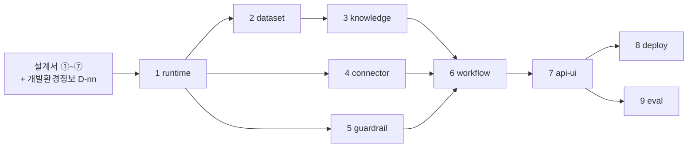

# 개발 프롬프트 9종 — 범용 세트

**설계서 7종을 입력으로 받아 코드를 만드는** 프롬프트 세트임.  
특정 서비스 전용이 아니라 **어느 프로젝트에나 씀**.

설계서는 `design-architecture` 스킬이 만듦. 이 세트는 그 산출물을 읽기만 함.

---

## 1. 이 프롬프트가 설계 프롬프트와 다른 점

| | 설계 프롬프트(`design-architecture/prompts/`) | **개발 프롬프트(이 폴더)** |
|---|---|---|
| 판단 기준 | `design-architecture/guides/` 가이드 7종 | **없음 — 설계서가 이미 판단을 끝냈음** |
| 구현할 값 | (판단으로 만들어 냄) | `{출력 루트}`의 설계서 7종 |
| 프로젝트 값 | `프로젝트정보.md` `V-01` ~ `V-12` | `_shared/개발환경정보.md` `D-01` ~ `D-12` |
| 본문이 가리키는 것 | 가이드의 **절 번호** | 설계서의 **절·표 이름** |
| 산출물 | 마크다운 설계서 1건 | 실행되는 코드 + 시험 + README |

**왜 절 번호가 아니라 표 이름으로 가리키나** — 설계서 7종은 목차 구성이 서로 다르고
길이도 프로젝트마다 달라짐. 절 번호로 가리키면 설계서가 조금만 길어져도 전부 어긋남.
반면 본문 절·표 이름은 **각 가이드 3절의 제목 구조**가 7종 전부 고정하고 있음
(`design-architecture/guides/_shared/가이드-공통규격.md`의 「산출물 1건은 무엇으로 이뤄지나」).

**프롬프트에는 값이 없음.** 프로젝트 값은 설계서와 `개발환경정보.md`에서만 옴.
그래서 설계서를 새로 만들면 같은 프롬프트로 다른 프로젝트 코드를 만들 수 있음.

---

## 2. 파일 목록

| # | 프롬프트 | 다루는 것 | 주 입력 설계서 | 담당 인격 |
|:-:|---------|----------|--------------|----------|
| 0 | [_shared/개발환경정보.md](_shared/개발환경정보.md) | 변수 12종 기입란 | — | — |
| 1 | [01-runtime.md](01-runtime.md) | 공통 런타임 — 상태 · 예산 · 설정 · 모델 클라이언트 | ③ ④ | 플로니 |
| 2 | [02-dataset.md](02-dataset.md) | 데이터 준비 — 원천 접속 또는 합성 시드 · 용어 매핑 | ⑤ ② | 지식니 |
| 3 | [03-knowledge.md](03-knowledge.md) | 지식 경로 — 설계서가 채택한 검색 방식만 구현 | ⑤ | 지식니 |
| 4 | [04-connector.md](04-connector.md) | 도구 · 커넥터 — 바깥 시스템 연결 · 인증 · 재시도 | ② ④ ⑤ | 커넥니 |
| 5 | [05-guardrail.md](05-guardrail.md) | 관측 · 가드레일 — ⑥ 14항목(3지점 검사 · 상한 · Circuit Breaker · 가리기 · 기록 · 알림 · 승인) | ⑥ ⑤ ② | 커넥니 |
| 6 | [06-workflow.md](06-workflow.md) | 담당자 · 워크플로우 — 모듈 · 흐름 조립 · 상한 · 착지 | ③ ④ | 플로니 |
| 7 | [07-api-ui.md](07-api-ui.md) | API · 화면 — 진입점 · 스트리밍 · 프론트 · **포트**(설계 범위 밖) | ③ ② ⑦ | 클로니 |
| 8 | [08-deploy.md](08-deploy.md) | 패키징 · 배포 — 이미지 · **비밀값 목록** · 되돌리기(대부분 설계 범위 밖) | ⑦ ② ⑤ | 커넥니 |
| 9 | [09-eval.md](09-eval.md) | 품질 평가 — 골든셋 · 지표 실측 · 리포트 | ① ③ | 지식니 |

**골든셋 문항·원천 오류율·통과율은 설계서에 없음** — 설계 단계에는 접속 정보와 실데이터가 없어
실측이 성립하지 않으므로 가이드가 **별도 품질 튜닝 소관**으로 넘겼음(가이드 ①⑤ 1절).
그 값을 실제로 정하고 재는 자리가 `02-dataset.md`(원천 품질)와 `09-eval.md`(문항·통과율)임.

---

## 3. 쓰는 순서

### 준비 (한 번만)

1. 설계서 7종을 먼저 끝냄(`design-architecture` 스킬). 개발 프롬프트는 그 값을 읽음
2. `_shared/개발환경정보.md`를 열어 변수 12종을 채움
3. 모르는 값은 빈칸이 아니라 `프로젝트 확정 필요`로 적음

**여기를 건너뛰면 프롬프트가 코드를 만들지 않고 멈춤**(각 프롬프트 `[처리]` 1단계 차단 규칙).

### 실행

프롬프트 파일 **전체를 복사해** AI 코딩 도구에 붙여 넣음. 1건씩 순서대로 함.

| 규칙 | 내용 |
|------|------|
| 1이 먼저 | 상태 타입과 설정 규격을 뒤 프롬프트가 전부 가져다 씀 |
| 2 · 4 · 5는 병렬 가능 | 1이 끝나면 동시에 돌려도 서로 안 부딪힘 |
| 6은 3 · 4 · 5가 다 끝나야 | 담당자 모듈이 검색 · 도구 · 검사를 전부 부름 |
| 8 · 9는 병렬 가능 | 배포와 평가는 서로를 안 기다림 |

---

## 4. 실행 전에 알아 둘 6가지

| # | 규칙 | 왜 |
|---|------|-----|
| 1 | **설계서에 값이 있으면 그 값을 씀.** 없으면 지어내지 않고 되물음 | 짐작한 값 위에 코드를 세우면 나중에 전부 다시 씀 |
| 2 | **값의 주인을 넘지 않음** — 아래 표를 그대로 따름 | 같은 값이 두 곳에 생기면 어느 쪽이 진짜인지 모르게 됨 |
| 3 | **설계 범위 밖 값은 되물어 확정함** — 아래 「설계 범위 밖」 표를 그대로 따름 | ⑦ 최소화로 주인이 없어진 값을 미루면 배포 당일에 정하게 됨 |
| 4 | **설계서 문장을 코드 주석에 옮겨 붙이지 않음** | 코드는 값만 받음. 문장이 들어가면 설계서를 고칠 때 코드가 어긋남 |
| 5 | **전문 용어는 업계 표기 그대로 씀.** 약어만 처음 1회 원어를 괄호로 병기함 | 쉬운 말로 옮기면 뜻이 좁아지고 구현 때 찾아볼 원어와 안 이어짐(가이드 공통규격 G1·G2) |
| 6 | **context7 MCP를 코드 작성 직전에 씀** | 프레임워크 API 변화가 커서 기억으로 쓰면 안 맞음 |

### 값의 주인 — 개발이 자주 헷갈리는 것만

소유 관계의 원본은 `design-architecture/guides/_shared/가이드-공통규격.md`의 「값의 주인」 표임.

| 값 | 주인 | 개발이 읽을 자리 |
|----|------|----------------|
| **상태 필드 이름** | ③ 워크플로우 | ③ 「State 구조」 |
| **프로세스 경계를 넘는 엔드포인트·요청/응답 키 이름** | ③ 워크플로우 | ③ 「프로세스별 API 설계」 |
| 단계ID · 타임아웃 · 재시도 **횟수** · 반복 상한(`max_iter`) · 모델 호출 횟수 | ③ 워크플로우 | ③ 「단계별 설계」 |
| 담당자 수·묶음 · 저장소·도구의 **논리 이름과 권한 등급** · 승인자 · 사용 모델 | ④ 역할계약서 | ④ 표A · 표B |
| 표·열 · 커넥터 ID · **커넥터 요청·응답 키** · 저장소 제품 · 민감 필드 ID(`F-n`)와 가리는 방법 | ⑤ 지식/도구 | ⑤ 3-1 · 3-2 · 3-3 |
| 비용 금액·상한 · 기록 항목 · **마스킹 거는 곳**(가리는 방법은 ⑤ 소유) · 차단 조건과 `위반 누적 상한` · 입력측 `검사 시점` · 위임·커넥터 호출 상한 · **재시도 간격** · 연속 실패 차단 · 알림 임계와 `재발송 억제` | ⑥ 관측/가드레일 | ⑥ 3-1(4항목) · 3-2(10항목) |
| 구성요소의 **물리 배치**(실행환경 묶음 그림 1장) | ⑦ 배포 | ⑦ 물리 배치도 |

**④ 역할계약서는 키 이름을 하나도 갖지 않음** — 저장소·도구의 이름과 등급까지만 정함.
개발이 키 이름을 찾을 곳은 ③(우리쪽 이름)과 ⑤(바깥 규격·필터)뿐임.

### 설계 범위 밖 — 어느 설계서도 갖지 않아 개발이 정하는 값

⑦ 배포가 **물리 배치도 1장으로 최소화**되면서 아래 값의 주인이 개발로 넘어왔음.
**설계서에 없다고 `[확인필요: 선행 미생성]`으로 미루지 않고, 그 프롬프트가 되물어 확정함.**

| 값 | 정하는 프롬프트 | 어디에 남기나 |
|----|---------------|-------------|
| 포트 번호(바깥·프로세스 간) | `07-api-ui.md` 3단계 | 환경변수 + README 포트 표 |
| 같은 프로세스 안 단계 사이 전달값의 **키 이름 규칙** | `01-runtime.md` 3단계 | README 되묻기 목록 |
| 상태 저장 등급 · 백엔드 제품 · 스키마 준비 주체·횟수 | `D-08` · `01-runtime.md` 3단계 | `개발환경정보.md` · README |
| 배포 형태 · 런타임 규모 상한 · 저장소 안/밖 배치 · 되돌리기 절차 · 배포 실행 입력값 | `08-deploy.md` 3단계 | README 「설계 범위 밖 값 목록」 |
| **비밀값 항목 목록**(커넥터 · 저장소 · 모델 · 관측·알림 4곳에서 추출) | `08-deploy.md` 4단계 | 비밀값 예시 파일 + README |
| 관측 백엔드 제품 · 알림 발신 수단 | `D-11` · `05-guardrail.md` 3단계 | `개발환경정보.md` · README |
| 바깥 시스템 접속정보 · 그래프DB role 접속 방식 · `베이스 URL` 환경별 값 | 구현·운영 단계 | 환경변수(코드에 박지 않음) |

---

## 5. 프롬프트 1건의 구성

8섹션 표준을 씀. `[예시]`까지 8개를 전부 채움.

| 섹션 | 무엇이 들어가나 |
|------|---------------|
| `[목표]` | 만들 코드 산출물 1문장. **프로젝트 이름을 쓰지 않음** |
| `[역할]` | `AGENTS.md` 팀원 인격 |
| `[맥락]` | 내 상황 · 담당 경계 · 값의 주인 · 결과물 독자 |
| `[입력]` | 우선순위 8행 표 + `없으면` 열 |
| `[처리]` | 1 시작 조건 확인 → 2 적용 판정 → 3 되묻기 → 4 이후 구현 → 시험 → README → 자가 점검 |
| `[출력]` | `D-05` 기준 경로 · 파일 목록 · 톤앤매너 |
| `[제약조건]` | MUST · MUST NOT · 완료조건(증거 기준) |
| `[예시]` | 형식만 보여 주는 표 + 해서는 안 되는 예 1건 |

**`[처리]` 앞 3단계는 9건이 똑같음.**

| 단계 | 하는 일 |
|:----:|--------|
| 1 | **시작 조건 확인** — `D-nn`과 주 입력 설계서가 있는지 봄. 없으면 **코드를 만들지 않고** 무엇이 비었는지 보고 |
| 2 | **적용 판정** — 설계서가 무엇을 채택했는지 읽음. 판정 결과를 먼저 보여 사용자가 되돌릴 수 있게 함 |
| 3 | **되묻기** — 설계서에 칸이 없는 항목을 기본값과 함께 물음. `기본값으로 진행`이라 하면 되묻지 않음 |

---

## 6. 자주 막히는 곳

| 증상 | 원인 | 할 일 |
|------|------|------|
| 프롬프트가 코드를 안 만들고 멈춤 | `개발환경정보.md`에 `프로젝트 확정 필요`가 남아 있음 | 그 변수를 채움. 비운 채 넘기지 않음 |
| 주 입력 설계서가 없다고 함 | 설계서를 아직 안 만들었음 | `design-architecture` 스킬로 먼저 그 설계서를 만듦 |
| 선행 설계서 인용 자리가 비어 있음 | 인용할 설계서가 아직 없음 | **정상임.** `[확인필요: 선행 미생성]`으로 두고 진행한 뒤 나중에 1회 갱신 |
| 키 이름이 설계서와 다름 | 개발이 새 이름을 지었음 | ③ 「State 구조」·「프로세스별 API 설계」의 이름을 그대로 베낌(커넥터 외부 규격은 ⑤ 「REST API」의 요청·응답 키). 새 이름 금지 |
| 설계서가 안 고른 검색 방식까지 만들어짐 | `[처리]` 2단계 적용 판정을 건너뛰었음 | ⑤ 「경로 채택·미채택」에서 `채택`인 방식만 만듦 |
| 시간 상한이 설계서와 다름 | 개발이 값을 새로 정했음 | ③이 값의 주인임. 안 맞으면 ③에 `변경요청`으로 되돌려 물음 |
| 설계서에서 표 이름을 못 찾음 | 옛 표 이름을 찾고 있음 | 해당 가이드 **3절 제목 구조**가 산출물 목차임. 그 이름으로 찾음 |

---

## 7. 이 세트가 다루지 않는 것

- **설계서 만들기** — `design-architecture` 스킬 소관임
- **제품·수치 고정값** — 특정 모델 벤더 · 벡터 DB · 청크 크기 · 검색 가중치 · 평가 도구를
  이 세트가 정하지 않음. 그 자리는 설계서와 `D-nn`이 채움
- **설계서에 칸이 없는 3건** — 상태 병합 함수 · 병렬 합류 규칙 · 사람 개입 구현 형태는
  가이드 ③ 3절에 칸이 없어 각 프롬프트 3단계 **되묻기**로 정하고,
  정한 값을 ③에 되돌려 적을 것을 함께 권고함
